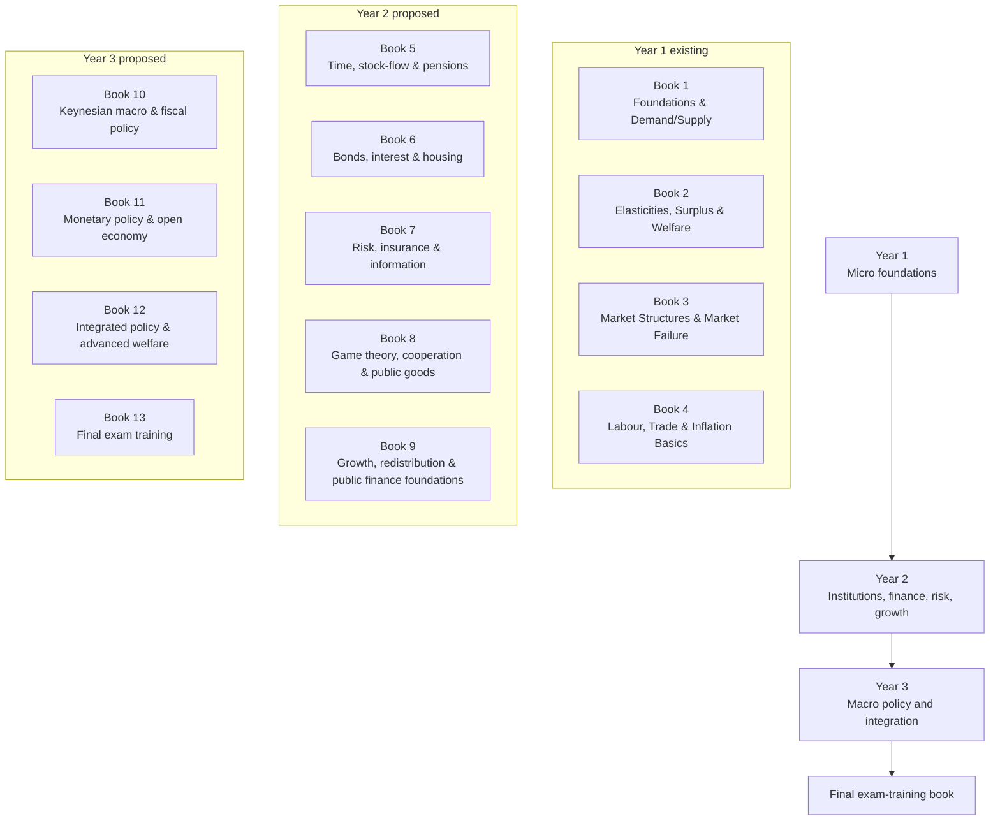
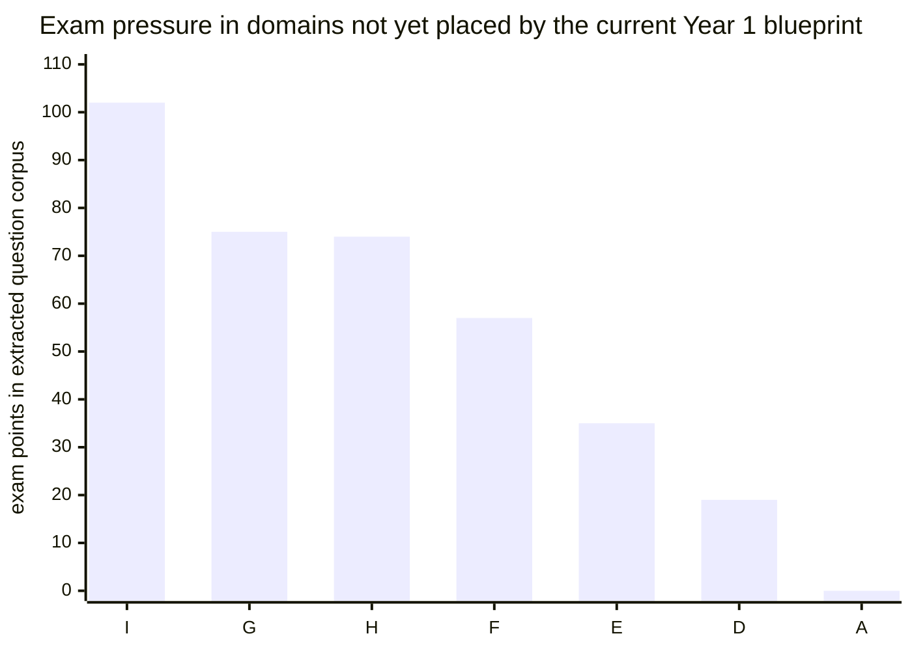
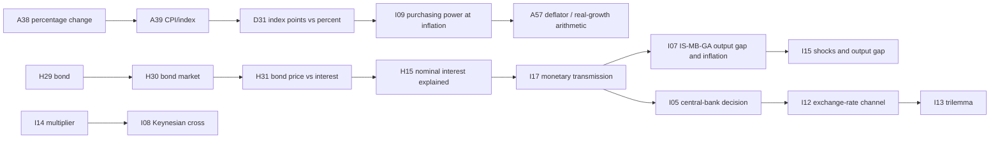

# Three-Year Blueprint Expansion for 4veco Platform

## Executive summary

The strongest next move is **not** to rewrite the current Year 1 blueprint, but to **stabilise it, backfill its missing foundations, and then extend outward into Years 2–3 using the existing machine-registry and CLI workflow**. The current repository already gives you a usable evidence stack: the research map defines `references/` as the core surface and sets the evidence order to exam questions and target exercises first, machine registries next, syllabus grouping after that, and reports last as diagnostics. The roadmap now says the reference CLI exists, the bounded mutation path has already been used once, and the active scope is reference/RAG quality rather than downstream student-facing AI. citeturn0view0turn15view1turn15view2turn22view0turn23view0

My main conclusion is that the current Year 1 blueprint is already a **credible first-year microeconomics-and-foundations year**: it is exercise-first, organised around one-lesson paragraphs, and already spans foundations, demand/supply, elasticity, surplus/welfare, market structures, externalities, labour, trade, and inflation basics. But it does **not** yet cover the whole live unit registry evenly. Based on my mapping of `course-target-exercises.json` to `required_skills`, the current Year 1 introduces about **110 of 190 live units**. It covers almost all A-domain and all L-domain units, most D-domain units, some F-domain units, but leaves **all E and G units** and most H and I units for later years. That pattern is exactly what a three-year expansion should exploit: keep Year 1 as the micro-foundation year, make Year 2 the institutional/financial/coordination year, and make Year 3 the macro-policy/integration year. citeturn16view0turn17view0turn17view1turn18view0turn6view6turn7view0

The most important warning is that some of the “remaining” units are **not really future-year content**. They are **Year 1 backfill or registry-cleanup problems**. The repository’s own triage found **84 raw missing-unit flags**, of which **68 are still needed**, with many high-priority gaps sitting precisely in Year 1 foundations: P–Q graph drawing, reading/interpolation, aggregate demand, GVK/GCK, shortage-versus-surplus reasoning, table-based marginals, and deflator/real-value arithmetic. The reports also still show **48 live units with no `needs`** and **44 live units with no `terms`**, which is manageable, but it confirms that the graph is not yet finished enough to drive three-year sequencing automatically. citeturn15view4turn15view8turn18view2turn18view3turn24view0turn24view1turn25view0turn25view2turn26view0

So the recommended path is:

1. **Freeze Year 1 architecture** rather than redesigning it wholesale.
2. **Backfill missing Year 1 foundations first**.
3. **Resolve a small number of overlapping or over-merged registry units**.
4. **Extend Year 2 from the uncovered E/G/F/H clusters**.
5. **Build Year 3 around the I-domain macro spine plus policy integration**.
6. **Implement all of that through the existing mutation-pipeline MVP**, not by hand-editing `references/machine/`. citeturn6view1turn15view2turn22view1turn23view0

## Evidence base and planning assumptions

The repository on entity["company","GitHub","software hosting platform"] explicitly treats `references/` as the core research surface, with `references/external/` as the highest-authority bucket for mirrored outside material and `references/machine/` as the canonical internal registry layer. The core external curriculum evidence comes from the mirrored exam and syllabus material from entity["organization","CvTE","dutch exam authority"]: the external README lists the syllabus PDF, the extracted `syllabus-eindtermen.{md,json}`, and the mirrored exam PDFs; the exams README says those PDFs are the primary ground-truth source for the exercise-first unit catalogue and explains the naming convention and current 2023–2025 VWO/HAVO exam holdings. citeturn0view0turn6view0turn10view0

The current owned blueprint is explicitly **exercise-first** and intentionally designs each theory paragraph as roughly one classroom lesson plus homework; it also separates lean skill lessons from consolidation paragraphs and test-preparation chapters. The current Year 1 plan is four books with four theory chapters plus one test-preparation chapter each, and `course-target-exercises.json` plus the blueprint-flag triage show **49 target exercises** across those theory chapters. Those design assumptions are stable enough to use as the template for Years 2–3. citeturn16view0turn24view0

The assumptions below are therefore planning assumptions, not repository facts:

| Assumption | Working value | Why I used it |
|---|---:|---|
| Lesson model | 1 lesson ≈ 60 minutes class + ~30 minutes homework | Matches the current blueprint’s paragraph model |
| Year 1 structure | Keep the current 4-book structure | It already covers the foundational microeconomics spine |
| Year 2 structure | 4 standard books + 1 lighter bridge book | Matches your brief and fits the uncovered E/G/F/H load |
| Year 3 structure | 3 standard books + 1 final exam-training book | Matches your brief and preserves exam-season capacity |
| New unit creation rule | No new unit from syllabus text alone | Must stay exercise-first, using exam and target-exercise evidence |
| Mutation rule | No hand edits in `references/machine/` | The machine registry is CLI-only by policy |

These assumptions follow the map, the owned blueprint, the external/source hierarchy, and the machine-registry policy. citeturn0view0turn6view1turn6view3turn16view0

I used four prioritisation criteria throughout this report. First, **exam coverage**: units that hit more extracted exam questions matter more. Second, **production citation / blueprint pressure**: units backed by target exercises or high-priority missing-unit flags move up. Third, **centrality**: units that unlock many later units matter more than isolated ones. Fourth, **teachability**: if a current paragraph clearly bundles two or three teachable steps, I prefer splitting it into smaller micro-units. That is consistent with the current blueprint’s “one lesson, one core skill/concept” logic and with the roadmap’s curated blueprint-flag backlog. citeturn16view0turn15view4turn24view0turn24view1turn25view0turn26view0

## What the current Year 1 blueprint already covers

The current owned Year 1 blueprint is already well-structured: **Book 1** covers foundations and demand/supply; **Book 2** covers elasticities, surplus, and government intervention; **Book 3** covers market structures and market failure; **Book 4** covers labour, trade, and inflation/purchasing-power basics. The blueprint itself shows this sequence clearly, including the test-preparation chapter pattern and the way later books depend on earlier ones. citeturn16view0turn16view1turn16view2turn16view3turn17view0turn17view1

The current Year 1 sequence, summarised from `course-target-exercises.json`, looks like this:

| Book | Chapter focus | Main unit clusters already introduced |
|---|---|---|
| Book 1 | Economic thinking, demand, supply/costs, equilibrium/marginals | A01–A08, A12–A14, A20–A22, A29, A40, A42–A44, B01–B02, D02, D13, D26, D27, D32–D37 |
| Book 2 | Elasticities, surplus/welfare, taxes/subsidies, price controls | A03–A04, A06, A10, A15–A17, A19, A23, A25–A27, A30, A32, A41, D03–D07, D11–D12, D20–D22, D25, D34 |
| Book 3 | Perfect competition, monopoly, price discrimination, externalities | A11, A13–A14, A20–A21, A28, A33–A37, A40, D09, D15, D18–D19, D24, F05–F11, F16–F18 |
| Book 4 | Labour, trade, inflation and purchasing power | A02, A04, A06, A10, A18, A19, A25, A32, A34, A38–A39, D16, D31, H09, H13–H15, I09, I18, L01–L21 |

This summary is based on my mapping of the 49 target exercises in `course-target-exercises.json` to `required_skills`, cross-checked against the book/chapter headings in the current blueprint. citeturn6view6turn16view1turn16view2turn16view3turn17view0turn17view1

The domain imbalance is the key design fact for three-year expansion. Based on the live machine registry, Year 1 already introduces roughly **40/44 A units**, **30/36 D units**, **21/21 L units**, and **9/18 F units**, but only **4/30 H units**, **4/20 I units**, and **0/7 E** plus **0/12 G**. In other words: the current blueprint is very good as a **micro-foundation year**, but it leaves almost the whole **time/finance/risk/information/macro-policy** block for later. That is not a defect; it is a usable three-year architecture. citeturn7view0turn18view0

```mermaid
xychart-beta
    title "Current Year 1 coverage of the live micro-unit registry"
    x-axis ["A","B","D","E","F","G","H","I","L"]
    y-axis "units" 0 --> 45
    bar "Introduced in current Year 1" [40,2,30,0,9,0,4,4,21]
    bar "Still to place or clean up" [4,0,6,7,9,12,26,16,0]
```

That chart reflects my analysis of the live machine registry against the current target-exercise map. It also matches the health report’s overall live/deprecated counts and the roadmap’s description of a continued backlog in term links, blueprint flags and exam-question extraction gaps. citeturn18view0turn15view8

## Missing-unit diagnosis

The registry does **not** mainly suffer from “big domain gaps”; it mainly suffers from **bottom-up teachability gaps**. The blueprint-flag triage reports **84 raw flags**, of which **68 are still needed**, including **30 high-priority** items. The highest-confidence missing items are not abstract syllabus ideas; they are very specific teachable steps that sit between existing target exercises and the current micro-unit graph. citeturn15view4turn24view0

The strongest bottom-up gaps fall into six recurring patterns.

First, **graph/data foundations**. The current Year 1 blueprint expects students to draw a P–Q graph from a table and read/interpolate values from it, but the triage report marks both as high-priority still-needed A-domain candidates with no strong existing match. The same applies to drawing an upward-sloping supply curve with the economist’s axis convention. These are genuine “start from the bottom” units. citeturn24view0

Second, **aggregation foundations**. The Year 1 demand sequence moves from individual demand to collective demand, but the triage packet identifies both the horizontal sum of individual demand **tables** and the algebraic horizontal sum of linear demand functions as high-priority still-needed units; it also identifies the “kink when one consumer exits” as a still-needed concept. This is exactly the kind of backward-reasoning omission you identified: the top-level exercise exists, but the lower teachable steps were not all minted. citeturn25view0

Third, **non-equilibrium and rationing mechanics**. The current Year 1 welfare/price-control sequence needs a unit for shortage-versus-surplus reasoning and, even more importantly, the **short-side rule**: transactions at a forced price are determined by `min(Qd, Qs)`. The triage report marks that short-side rule as a high-priority still-needed unit. Without it, students can calculate curves but still fail the actual policy mechanics. citeturn25view0

Fourth, **pre-calculus marginal reasoning**. The current blueprint explicitly wants a table-based margin before formal differentiation, and the triage report confirms that the missing unit “compute MK and MO from a table by taking differences” is high-priority. It also calls out the missing “approximate MK from `TK = a + bQ²` as `2bQ` without formal differentiation” bridge and the habit-building “check profit at Q−1, Q, Q+1” unit. This is a textbook example of a paragraph containing too much reasoning for one micro-unit. citeturn24view1

Fifth, **trade and world-price baselines**. The trade sequence currently covers comparative advantage, but the triage report still flags the missing calculation units for: computing pre-trade versus post-specialisation output, determining the mutually beneficial terms-of-trade interval, and calculating imports as `Qd − Qa` at a given world price. Those are all precise procedural steps that Year 1 or early Year 2 students need before policy evaluation. citeturn26view0turn24view1

Sixth, **real/nominal and indexation arithmetic**. The current Year 1 blueprint already teaches CPI and basic real-versus-nominal thinking, but the triage report still flags the missing unit for computing the new pension under `waardevast`, `welvaartsvast`, and `bevroren` regimes, and another missing unit for computing real GDP growth from nominal GDP growth and the GDP deflator. Those are exactly the sorts of lower-step macro numeracy units that become painful later if not taught early. citeturn25view2turn24view2

The registry reports reinforce this diagnosis. The current generated reports still show **48 live units with no `needs`** and **44 with no `terms`**. Not every root is a problem, but the pattern matters: several roots correspond to conceptual entry points that are fine as domain foundations, while others point to missing teachable steps or still-unresolved scope decisions. The current graph is structurally valid, but it still needs pedagogical densification before it can support a full three-year progression cleanly. citeturn18view1turn18view2turn18view3

### Priority missing and split-unit candidates

The table below is my recommended **first curation set**. These are not “mint automatically” instructions; they are the most evidence-backed additions or splits to send through the CLI review flow first.

| Proposed unit | Type | Why it should exist | Suggested placement |
|---|---|---|---|
| **A45 — P–Q-grafiek uit tabel tekenen** | new | Missing graph-construction foundation for demand/supply and later welfare work | Year 1, Book 1, Ch1 |
| **A46 — Waarden aflezen en interpoleren in een P–Q-grafiek** | new | Needed before movement/shift, elasticity, and world-price reading | Year 1, Book 1, Ch1 |
| **A47 — Individuele vraag horizontaal optellen uit tabellen** | new | Missing pre-algebra aggregation step | Year 1, Book 1, Ch2 |
| **A48 — Lineaire vraagfuncties horizontaal optellen** | new | Missing algebraic demand aggregation step | Year 1, Book 1, Ch2 |
| **D38 — Knik in collectieve vraag herkennen** | new | Conceptual checkpoint when consumers drop out | Year 1, Book 1, Ch2 |
| **A49 — Aanbodcurve tekenen met correcte assen** | new | Supply mirror of the demand-graph foundation | Year 1, Book 1, Ch3 |
| **A50 — GVK en GCK berekenen** | new | The blueprint needs more than GTK alone | Year 1, Book 1, Ch3 |
| **D39 — Spreiding vaste kosten verklaren** | new | Explains why GCK falls and supports later long-run equilibrium | Year 1, Book 1, Ch3 |
| **D40 — Tekort versus overschot bepalen bij gegeven prijs** | new | Needed before minimum/maximum price mechanics | Year 1, Book 1, Ch4 |
| **A51 — MK en MO uit tabel berekenen** | new | Explicit pre-calculus marginal unit | Year 1, Book 1, Ch4 |
| **A52 — Marginale verandering uit een kwadratische functie benaderen** | split/bridge | Bridges table reasoning to the derivative-based units | Year 1, Book 1, Ch4 |
| **A53 — Heffingsdruk per partij als percentage berekenen** | new | Missing burden-sharing arithmetic in the tax block | Year 1, Book 2, Ch3 |
| **D41 — Korte-zijde-regel toepassen** | new | Critical forced-price rationing mechanic | Year 1, Book 2, Ch4 |
| **A54 — Overheidsuitgaven bij subsidie berekenen** | new | Symmetry check in subsidy analysis | Year 1, Book 2, Ch3 |
| **A55 — Aanbodoverschot of werkloosheid bij minimumprijs berekenen** | new | Needed for both price floors and minimum wage | Year 1, Book 2, Ch4 and Book 4, Ch2 |
| **A56 — Importen bij wereldprijs en na invoerrecht berekenen** | new | Missing free-trade baseline step | Year 1, Book 4, Ch3 |
| **D42 — Mutueel gunstige ruilvoet-interval bepalen** | new | Turns comparative advantage into actual trade acceptance logic | Year 1, Book 4, Ch3 |
| **A57 — Reële groei of reële waarde met deflator berekenen** | new | Missing arithmetic bridge into later macro books | Year 1, Book 4, Ch4 |
| **D43 — Waardevast, welvaartsvast en bevroren onderscheiden** | new | Vocabulary/concept split before pension-indexation arithmetic | Year 2, Book 5 or Year 1 Book 4 extension |

This proposed set is grounded in the curated blueprint-flag backlog, especially the high-priority still-needed flags for graph foundations, aggregation, marginals, rationing, world-price baselines and real/nominal arithmetic. citeturn24view0turn24view1turn25view0turn25view1turn25view2turn26view0

There are also four **registry-cleanup** decisions that should be made before or alongside expansion. `A09`, `A24`, and `A31` overlap heavily around collective supply and should probably be merged or re-scoped before placement. `D04` looks like an umbrella concept (“elasticity and goods classification”) that is too broad relative to the lower-level units already present and the additional lower-level units the blueprint backlog now demands. The roadmap itself explicitly treats `D04` retirement/split/merge as blocked until a specific human design decision exists. citeturn23view0

## Proposed complete three-year blueprint

The simplest coherent three-year design is:

- **Year 1** = current micro-foundation year, with backfills.
- **Year 2** = time/finance, risk/information, cooperation/public goods, growth/distribution.
- **Year 3** = macro policy, open economy, integration, final exam training.

This structure follows directly from the current coverage imbalance: Year 1 already handles most A/D/L micro-foundations, so Year 2 should absorb the uncovered E/G/F/H clusters, while Year 3 should absorb the uncovered I-domain spine and mixed-policy evaluation. The current blueprint’s own dependency logic supports that staging: inflation basics lead naturally into real/nominal reasoning; labour and minimum-wage analysis can later connect to fiscal and macro channels; and trade basics can later connect to exchange-rate and open-economy policy. citeturn16view0turn17view0turn17view1turn18view0

### Year 1 keep-and-backfill plan

Year 1 should remain the current 4-book owned blueprint, but with four kinds of adjustment:

| Action | What to do |
|---|---|
| Backfill foundations | Add the missing graph, aggregation, marginal, rationing, and deflator units listed above |
| Fold in two existing but omitted units | Add `A05` and `D28` explicitly into the current Year 1 sequence |
| Reposition two existing advanced units | Keep `D01` in the Year 1 tax block and `D08` in the Year 1 externalities block |
| Resolve cleanup candidates | Decide the future of `A09`, `A24`, `A31`, and `D04` before long-run sequencing depends on them |

This is the most efficient way to reduce future backlog growth: fix the bottom of the ladder before building higher books on top of it. The roadmap’s current backlog and the blueprint-flag triage both support this “shrink before expand” logic. citeturn15view4turn15view8turn18view2turn24view0

### Year 2 proposed structure

**Book 5 — Time, stock-flow and pensions**

| Chapter | Core units | Main exam-code clusters |
|---|---|---|
| Stocks, flows and intertemporal exchange | E06, E02 | E1 |
| Intergenerational exchange and pension systems | E01, E04 | E1, E2 |
| Ageing, sustainability and pension politics | H01, H07, H12, E05 | E2, H1 |
| Consolidation/test chapter | mixed practice, no new registry units required at first pass | E/H |

**Book 6 — Bonds, interest and housing**

| Chapter | Core units | Main exam-code clusters |
|---|---|---|
| Bonds, prices and interest | H29, H30, H31 | H1, I3 |
| Nominal interest, funded pensions and own-or-rent choices | H15, E03, E07 | E1, H1 |
| Exchange rates and competitiveness basics | H24, H25 | H1 |
| Current account and saving balances | H28, H20 | H1 |

**Book 7 — Risk, insurance and information**

| Chapter | Core units | Main exam-code clusters |
|---|---|---|
| Risk, expected loss and insurance arithmetic | G10, G12 | G1, G2, G4 |
| Adverse selection, moral hazard and risk pooling | G02, G04, G03, G08, G09, G01 | G2, G3, G4 |
| Principal-agent problems and transaction costs | G06, G05, G07 | G2, G3 |
| Exchange-rate risk in international trade | G11 | G2 |

**Book 8 — Game theory, cooperation and public goods**

| Chapter | Core units | Main exam-code clusters |
|---|---|---|
| Dominant strategies and Nash equilibrium | F03, F04, F12 | F1 |
| Prisoner’s dilemma and hold-up/rent-seeking | F09, F01, F13 | F1, F2 |
| Collective goods and suboptimal outcomes | F02, F15 | F2 |
| External strategic effects and judging intervention | F14, D14 | F2, D3 |

**Book 9 — Growth, redistribution and public-finance foundations**

| Chapter | Core units | Main exam-code clusters |
|---|---|---|
| Green GDP, circular economy and external costs | H05, H06, H11 | H1, H3 |
| Inequality, taxation and redistribution | H10, H04, H18, H08, H22, H23 | H4, H5 |
| Debt sustainability and public capital | H21, H19 | H1, I2 |
| Productivity, incentives and trade competitiveness | H02, H16, H17, H27, H03 | H2, H5 |

This Year 2 design uses the fact that the current Year 1 leaves the E/G/H clusters almost untouched, while the extracted exam-question corpus still gives those clusters substantial exam presence. In the full extracted exam-question set, the uncovered domains with the most remaining exam pressure are **I, G, H, F, and E**, in that order, which is why Year 2 should not become an afterthought; it is where much of the non-micro exam programme still lives. citeturn6view7turn10view0

That chart is based on my analysis of the repository’s extracted `exam-questions.json` against the current Year 1 required-skills map. The repository stores both VWO and HAVO exam evidence; the purpose of the chart is not to drive exact weighting, but to show which uncovered domains still have the most evidence pressure behind them. citeturn6view7turn10view0

### Year 3 proposed structure

**Book 10 — Keynesian macro and fiscal policy**

| Chapter | Core units | Main exam-code clusters |
|---|---|---|
| Multiplier and Keynesian cross | I14, I08 | I4 |
| Anticyclical fiscal policy and automatic stabilisers | I01, I02, I16 | I2 |
| Demand and supply shocks, inflation and labour-market channels | I06, D10, H13, H14 | I1, I4, H5 |
| Output gaps and macro shock analysis | I15 | I4 |

**Book 11 — Monetary policy and open economy**

| Chapter | Core units | Main exam-code clusters |
|---|---|---|
| Central bank decisions and transmission mechanisms | I17, I05, I03 | I3 |
| IS-MB-GA and labour-market rigidity | I10, I07, I11 | I4 |
| Exchange-rate channel, trilemma and interest parity | I12, I13, I19, I20 | I1, I3 |
| Policy-mixing and open-economy cases | mixed authored/exam practice first; mint extra units only if target exercises demand them | I/H |

**Book 12 — Integrated policy, welfare and advanced market structures**

| Chapter | Core units | Main exam-code clusters |
|---|---|---|
| Welfare accounting as a reusable policy lens | revisit D28 plus tax/subsidy/welfare accounting | D3 |
| Monopoly edge cases and loss minimisation | D17 and advanced market-structure cases | D2 |
| Mixed labour-trade-macro evaluation | reuse H, I, L and trade units in combined contexts | H/I/L |
| Full-case policy comparison | chiefly integration and authored target exercises, not many new base units | mixed |

**Book 13 — Final exam training**

| Chapter | Main emphasis |
|---|---|
| Strategy and source-reading drills | exam packaging, models, command words, time management |
| Calculation sets by domain | A/D/E/F/G/H/I mixed |
| Multi-context policy and evaluation cases | open-response structure and justification |
| Full mock papers using mirrored exam evidence | timed, mixed, correction-model anchored |

The current roadmap already treats internal retrieval and teacher-facing lesson-authoring support as allowed, but keeps student-facing diagnostic uses blocked; that reinforces the idea that the final exam-training book should rely heavily on real exam material and human-reviewed authored sequencing rather than automated graph logic alone. citeturn15view5turn15view6turn18view0

### Two prerequisite spines that must stay intact

The most important prerequisite chain for Year 1 remains the minimum-price/minimum-wage chain:

The most important later-year macro chain is the inflation-to-interest-to-policy chain:

Both chains are supported by current registry dependencies and by the current blueprint’s sequencing logic. citeturn7view0turn16view0turn17view0turn17view1

## Mutation-pipeline implementation plan

The good news is that the repository no longer treats the reference CLI as hypothetical. The current `build-scripts/references/` README says the **core reference CLI exists**, lists implemented unit commands (`unit-add`, `unit-update`, `unit-rename`, `unit-add-dep`, `unit-remove-dep`, `unit-deprecate`, `unit-split`, `unit-merge`) and term commands, and states the shared invariants: atomic validation, JSON regeneration after writes, and full validator runs after every successful mutation. That is the right substrate for a multi-year blueprint rollout. citeturn22view0turn22view1turn23view0

The roadmap also clarifies the correct operating rule: where a correction cannot yet be expressed through CLI, the CLI should be built or specified first; no hand-edits to machine references should be used as a shortcut. It also says the blueprinted target-exercise flags have already been triaged into a curated backlog and that the empty-needs corrections already applied in R3.2 were bounded and human-reviewed. That means the repository is ready for **controlled expansion**, but only under the same review discipline. citeturn15view2turn15view4turn23view0

### Recommended implementation phases

**Phase A — Freeze the blueprint-expansion manifest**

Create a owned/authored manifest that records:

- current Year 1 placements;
- Year 1 backfills;
- registry-cleanup candidates;
- Year 2 root books;
- Year 3 macro spine;
- explicit “integration-only, no new registry unit yet” chapters.

This should remain outside `references/machine/` until reviewed, because owned prose may shape design but cannot by itself mint units. citeturn0view0turn6view3

**Phase B — Backfill Year 1 before extending Year 2**

Use the CLI to add the highest-confidence foundational units and edges first:

- `unit-add.js` for A45/A46/A47/A48/A49/A50/A51/A53/A54/A55/A56/A57;
- `unit-add-dep.js` for the new prerequisite edges into Year 1 chapters;
- `unit-update.js` to add term links and reviewed `zero_needs_*` fields where needed.

Then regenerate and review:

- `build-unit-index.js`;
- report validators;
- needs, term and dead-unit reports;
- chart/dashboard projections. citeturn22view0turn22view1turn23view0

**Phase C — Resolve overlap and split decisions**

Use the existing split/merge commands for the small set of overlapping or over-merged units:

- `unit-merge.js` or `unit-split.js` for `A09/A24/A31`;
- `unit-split.js` or deprecation path for `D04` once the lower-level replacement units are approved;
- `unit-deprecate.js` only when the replacement path is explicit and evidence-backed. citeturn23view0

**Phase D — Seed Year 2 root books**

After Year 1 backfill, seed the Year 2 roots in dependency order:

- Book 5 roots: `E06`, `E02`, `E01`, `E04`, `H01`, `H07`, `H12`, `E05`;
- Book 6 roots: `H29`, `H30`, `H31`, `H15`, `E03`, `E07`, `H24`, `H25`, `H28`, `H20`;
- Book 7 roots: `G10`, `G12`, `G02`, `G04`, `G03`, `G08`, `G09`, `G01`, `G06`, `G05`, `G07`, `G11`;
- Book 8 roots: `F03`, `F04`, `F12`, `F09`, `F01`, `F13`, `F02`, `F15`, `F14`, `D14`;
- Book 9 roots: the H-domain growth/distribution/tax/debt cluster.

This is the point to extend the owned blueprint and the target-exercise index in parallel, not after the fact. citeturn6view6turn7view0

**Phase E — Seed the Year 3 macro spine**

Only after the Year 2 finance and interest foundations are in place should the Year 3 macro chain be seeded:

- `I14` → `I08` → `I01`/`I02`/`I16`;
- `H29` → `H30` → `H31` → `H15` → `I17` → `I05`;
- `I10` + `I14` → `I07` → `I15`;
- `I17` + `I20` → `I12` → `I13`/`I19`. citeturn7view0

### Minimum QA checks after each mutation batch

Every batch should pass five checks before the next batch starts:

1. **Schema and DAG check** — the current DAG report must stay passing. citeturn18view1  
2. **Needs coverage review** — roots created intentionally should stay roots; accidental new roots should be investigated. citeturn18view2  
3. **Term coverage check** — don’t mint new units without anchoring canonical vocabulary. citeturn18view3  
4. **Blueprint coverage review** — the curated flag backlog should shrink rather than grow. citeturn15view4turn24view0  
5. **Exam-extraction consistency** — newly placed units should improve, not obscure, unit↔exam↔exercise mapping. The roadmap still records 27 extracted exam-question records needing skill review and 19 also needing exam-code review, so this surface is not yet done. citeturn15view8

## Triage priorities and practical advice

The fastest way to get unstuck is to split the work into **three lanes**.

The **first lane** is **Year 1 bottom-up repair**. If you do nothing else, do this. It has the best leverage: it improves the current product, reduces future misconceptions, and shrinks the blueprint-flag backlog. The first ten changes I would queue are: A45, A46, A47, A48, A49, A50, D40, A51, D41, and A57. Those ten address the graph/data, aggregation, non-equilibrium, marginal and real-value weaknesses that recur throughout the current blueprint. citeturn24view0turn24view1turn25view0turn24view2

The **second lane** is **Year 2 root seeding**. Once the Year 1 foundations stop leaking, seed the lowest-risk Year 2 roots that have good exam evidence and clean conceptual boundaries: `E02`, `E01`, `H29`, `H30`, `H31`, `G10`, `G12`, `F03`, `F12`, `F09`, `H04`, `H21`. These are teachable, exam-backed, and form coherent book starts. In the extracted exam-question corpus, the uncovered E/G/F/H blocks still carry substantial question pressure, especially G-domain insurance/information and F-domain game-theory/public-good reasoning. citeturn6view7turn10view0

The **third lane** is **Year 3 macro spine construction**. Only after the finance/interest bridge is stable should you seed `I14`, `I08`, `I01`, `I17`, and then the IS-MB-GA/open-economy branches. This avoids building macro lessons on top of missing pre-macro arithmetic and missing interest-rate intuition. The I-domain is the largest uncovered exam-weight cluster in the current catalogue, so it absolutely belongs in the complete three-year blueprint, but it should not be the first thing you mutate. citeturn6view7turn7view0

In roadmap terms, the roadmap itself is solid enough to support this sequence. The missing piece is not planning direction; it is **curation discipline**: shrink the high-confidence Year 1 backlog first, then build the Year 2 and Year 3 spines, and only then broaden authored book/chapter production. That approach is completely aligned with the repository’s current source hierarchy, CLI protections, and RAG-quality gate conditions. citeturn15view1turn15view2turn15view5turn15view6turn22view1turn23view0

## Open questions and limitations

This report is high-confidence on **structure and priority**, but not every placement is equally certain. The main open questions are short.

The first is the final treatment of `A09`, `A24`, `A31`, and `D04`. These look like true scope/merge decisions rather than straightforward placements, and I would not hard-wire them into book production until that review is done. citeturn23view0

The second is the exact Year 2/Year 3 lesson load. Your prompt specifies the broad book count, but not exact annual lesson counts or assessment windows, so the Year 2 fifth book is intentionally designed here as a **lighter bridge book** rather than a full extra load. That is a planning assumption, not a source fact. citeturn16view0

The third is that the exam-question extraction layer is useful but still incomplete at the margin: the roadmap explicitly says 27 records still need required-skill review and 19 also need exam-code review. That does not weaken the broad blueprint conclusions, but it does mean some final unit↔exam mappings should still be treated as reviewable rather than frozen. citeturn15view8

The fourth is that the graph authority remains **approved only with conditions**, not as a fully authoritative pedagogical graph. So this proposed three-year blueprint should be treated as a **human-reviewed design recommendation grounded in sources**, not as something to auto-sequence into student-facing flows. citeturn15view5turn18view0