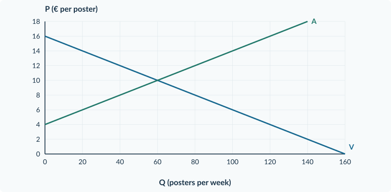

<!-- PAGE {"section": "3.1.1", "title": "Eén product, twee prijzen", "origin_chapter": "3.1", "origin_page": 2, "edition_page": 2} -->

3.1.1 · BELASTINGEN: WIG EN NIEUW EVENWICHT

# Eén product, twee prijzen

Op een kleine markt verkopen verschillende kramen fruitbekers. De overheid voert in deze oefensituatie een belasting van € 4 per verkochte beker in. De verkoper moet die € 4 afdragen.

Betekent dit dat de koper precies € 4 meer gaat betalen? Niet noodzakelijk. De marktprijs kan veranderen en de verkoper kan zelf een deel van de last dragen.

<b>Lesdoelen</b> Je kunt het vrije evenwicht berekenen. Je kunt bij een belasting de kopersprijs, verkopersontvangst en nieuwe hoeveelheid berekenen. Je kunt de belastingwig in een marktgrafiek markeren en uitleggen waarom afdragen niet hetzelfde is als de last dragen.

### Geef de prijzen een eigen naam

**Pc** is de prijs die de consument betaalt. **Pp** is het bedrag dat de producent per verkocht product overhoudt na afdracht van de belasting, maar **vóór aftrek van zijn productiekosten**. **t** is de belasting per product.

<figure><figcaption>Figuur 1. Van de € 10 die de koper betaalt, houdt de verkoper € 6 over. De overige € 4 gaat naar de overheid.</figcaption></figure>

Belastingwig: Pc − Pp = t Dus: Pc = Pp + t

De bedragen in de geldstroom zijn de nieuwe marktuitkomst die we hierna berekenen. Pp is dus géén winst per product.

<!-- PAGE {"section": "3.1.1", "title": "De markt rekent met beide prijzen", "origin_chapter": "3.1", "origin_page": 3, "edition_page": 3} -->

### Wat blijft hetzelfde?

Kopers reageren op **hun betaalde prijs Pc**. Verkopers reageren op **hun ontvangst Pp**. Bij het nieuwe evenwicht wordt nog steeds evenveel gevraagd als aangeboden. Alleen gebruik je niet meer voor iedereen dezelfde prijs.

Voor fruitbekers geldt:

Vraag: Pc = 14 − 0,10Q Aanbod: Pp = 2 + 0,10Q

Q is het aantal fruitbekers per dag. Pc en Pp zijn euro per beker. Zonder belasting is Pc = Pp. Met t = € 4 wordt de aanbodlijn, uitgedrukt in de **kopersprijs**:

Pc = Pp + 4 = 6 + 0,10Q

### Lees de grafiek in drie stappen

Eerst staan V en A er: het vertrouwde vrije evenwicht. Daarna schuift de aanbodlijn in kopersprijzen € 4 omhoog naar **A + t**. Het snijpunt met V geeft de nieuwe hoeveelheid en Pc. Lees bij **dezelfde Q** op de oorspronkelijke A af wat verkopers ontvangen.

<figure><figcaption>Figuur 2. Zonder belasting: 60 bekers voor € 8. Met belasting: 40 bekers, Pc = € 10 en Pp = € 6. De verticale afstand bij Q = 40 is € 4.</figcaption></figure>

<b>Ons marktmodel</b> We rekenen met veel kopers en verkopers die de marktprijs als gegeven nemen. Er is één product, er zijn geen andere gelijktijdige veranderingen en alle gevraagde en aangeboden eenheden bij het nieuwe evenwicht worden verhandeld. Kosten of baten voor buitenstaanders blijven in dit hoofdstuk buiten beeld.

<!-- PAGE {"section": "3.1.1", "title": "Waarom wordt de aanbodlijn hoger?", "origin_chapter": "3.1", "origin_page": 4, "edition_page": 4} -->

### Vergelijk twee prijzen bij dezelfde hoeveelheid

De fruitbekermarkt heeft vraag Pc = 14 − 0,10Q en aanbod Pp = 2 + 0,10Q. Een verkoper draagt **€ 4 per verkochte beker** af. De oorspronkelijke A vertelt nog steeds welk bedrag verkopers willen ontvangen, vóór aftrek van productiekosten.

| Q (bekers per dag) | Bedrag op V: Pc (€ per beker) | Bedrag op A: Pp (€ per beker) | Verschil Pc − Pp (€ per beker) |
|---|---:|---:|---:|
| 20 | 12 | 4 | 8 |
| **40** | **10** | **6** | **4** |
| 60 | 8 | 8 | 0 |

Bij **40 bekers** passen beide kanten én de belasting bij elkaar: kopers betalen € 10, verkopers ontvangen € 6 en de overheid krijgt € 4. Daarom horen beide prijzen bij hetzelfde aantal verkochte bekers.

### Van gewenste ontvangst naar benodigde kopersprijs

Voor 40 bekers geeft A een ontvangst van € 6. De verkoper kan daarvan niet ook nog € 4 afdragen. Hij moet dan € 10 van de koper ontvangen. Deze omzetting geldt bij iedere hoeveelheid:

Oorspronkelijk aanbod: Pp = 2 + 0,10Q Tel de belasting op: Pc = (2 + 0,10Q) + 4 Aanbod in kopersprijzen: Pc = 6 + 0,10Q

De productiekosten veranderen hier niet. A + t geeft dezelfde aanbodbeslissing weer, maar nu in de prijs die kopers moeten betalen. Het snijpunt van **V en A + t** bepaalt de nieuwe hoeveelheid.

<b>Niet: oude prijs + hele belasting</b> Pc = € 8 + € 4 = € 12 zou Pp = € 8 geven. Bij die twee prijzen worden 20 bekers gevraagd en 60 aangeboden. Dat is geen evenwicht. Laat vraag en aanbod dus eerst samen de nieuwe hoeveelheid bepalen.

<!-- PAGE {"section": "3.1.1", "title": "Van formule naar belastingwig", "origin_chapter": "3.1", "origin_page": 5, "edition_page": 5} -->

## Uitgewerkt voorbeeld

**Fruitbekers.** Pc = 14 − 0,10Q en Pp = 2 + 0,10Q. Verkopers dragen € 4 per beker af. Q is bekers per dag.

**1 · Vrij evenwicht.** Zonder belasting zijn beide prijzen gelijk.

14 − 0,10Q = 2 + 0,10Q → Q₀ = 60 P₀ = 14 − 0,10 × 60 = € 8

**2 · Nieuw aanbod in kopersprijzen.** De koper betaalt de gewenste ontvangst plus de belasting: Pc = Pp + 4 = 6 + 0,10Q.

**3 · Nieuwe hoeveelheid en beide prijzen.**

14 − 0,10Q = 6 + 0,10Q → Qt = 40 Pc = 14 − 0,10 × 40 = € 10 Pp = 2 + 0,10 × 40 = € 6

**4 · Controle en uitleg.** 10 − 6 = € 4: de wig klopt. Markeer bij Q = 40 beide prijzen in figuur 2. Kopers betalen € 2 meer dan eerst; verkopers houden € 2 minder over. Afdragen en de last dragen zijn dus verschillend.

<b>Onthouden</b> Gebruik V voor Pc en de oorspronkelijke A voor Pp, beide bij dezelfde nieuwe hoeveelheid. Controleer Pc − Pp = t.

## Startopgaven

<b>Korte route:</b> Startopgaven → Zelfstandige oefening → Doeloefening. Extra hulp nodig? Maak eerst Begeleide inoefening.

<b>Opgave 1 · Evenwicht terughalen</b>

Voor sleutelhangers geldt vraag P = 12 − 0,10Q en aanbod P = 4 + 0,10Q. Q is stuks per dag; P is euro per stuk.

<b>a.</b> Bereken de evenwichtshoeveelheid en de evenwichtsprijs.

<b>b.</b> Bereken met de aanbodfunctie welk bedrag bij Q = 30 hoort.

<b>Opgave 2 · Wie draagt af?</b>

Na een belasting betaalt een koper € 9. De verkoper houdt na afdracht € 6 over.

<b>a.</b> Hoe groot is de belasting per product?

<b>b.</b> Kun je zonder de oude prijs berekenen wie de grootste last draagt? Licht je antwoord toe.

<!-- PAGE {"section": "3.1.1", "title": "Oefenen met minder steun", "origin_chapter": "3.1", "origin_page": 6, "edition_page": 6} -->

## Begeleide inoefening

Heb je deze hulp niet nodig? Ga dan verder met Zelfstandige oefening.

<b>Opgave 3 · Lees de geldstroom</b>

Gebruik de volledig uitgewerkte fruitbekermarkt in figuur 2 op pagina 3.

<b>a.</b> Lees Q₀, P₀, Qt, Pc en Pp af. Welke twee prijzen horen bij dezelfde hoeveelheid?

<b>b.</b> Leg uit waarom je Pp niet afleest op A + t.

<b>c.</b> Een leerling telt € 4 op bij de oude prijs van € 8 en krijgt Pc = € 12. Wijs met de berekende hoeveelheid aan waarom die aanpak hier niet klopt.

<b>Opgave 4 · Posters</b>

Vraag Pc = 16 − 0,10Q; aanbod Pp = 4 + 0,10Q. Q is posters per week. De verkoper draagt € 4 per verkochte poster af.

<b>a.</b> Vul eerst in: Pc = Pp + … = … + 0,10Q.

<b>b.</b> Los 16 − 0,10Q = … + 0,10Q op. Bereken daarna Pc en Pp.

<b>c.</b> Teken in de basisgrafiek A + t. Markeer bij de nieuwe hoeveelheid beide prijzen en verbind ze met een verticale lijn.

<b>d.</b> Controleer de wig en leg in één zin uit waarom er minder posters worden verkocht.

<figure><figcaption>Figuur 3. Basisgrafiek bij opgave 4. V en A zijn gegeven; de belastinglijn en de nieuwe uitkomst teken je zelf.</figcaption></figure>

<!-- PAGE {"section": "3.1.1", "title": "Zelf de belasting verwerken", "origin_chapter": "3.1", "origin_page": 7, "edition_page": 7} -->

## Zelfstandige oefening

<b>Opgave 5 · Mokken</b>

Op de markt voor mokken geldt Pc = 18 − 0,20Q en Pp = 6 + 0,10Q. Q is mokken per dag. Verkopers dragen € 3 per verkochte mok af.

<b>a.</b> Bereken het vrije evenwicht.

<b>b.</b> Stel het aanbod in kopersprijzen na de belasting op. Bereken Qt, Pc en Pp.

<b>c.</b> Teken A + t in de basisgrafiek. Markeer de nieuwe hoeveelheid, beide prijzen en de belastingwig.

<b>d.</b> Leg uit waarom de verkopersontvangst lager kan zijn terwijl de kopersprijs hoger is.

<figure><figcaption>Figuur 4. Basisgrafiek bij opgave 5. De assen gebruiken aantallen per dag en euro per mok.</figcaption></figure>

<b>Opgave 6 · Twee bedragen veranderen</b>

Een marktonderzoek meldt na een belasting: de prijs voor kopers stijgt van € 7 naar € 9. De ontvangst van verkopers daalt van € 7 naar € 6.

<b>a.</b> Bereken afzonderlijk de prijsverandering voor kopers en voor verkopers. Bereken daarna de belasting per product.

<b>b.</b> Beoordeel: “De belasting is € 2, want dat is wat de koper extra betaalt.”

<!-- PAGE {"section": "3.1.1", "title": "Laat zien wat je kunt", "origin_chapter": "3.1", "origin_page": 8, "edition_page": 8} -->

## Doeloefening

<b>Opgave 7 · Bedrukte tassen</b>

Verschillende aanbieders verkopen dezelfde soort bedrukte tas. Vraag: Pc = 20 − 0,20Q. Aanbod: Pp = 2 + 0,10Q. Q is tassen per dag; prijzen zijn euro per tas. De overheid heft € 3 per verkochte tas. De verkopers dragen de belasting af. De andere marktomstandigheden blijven gelijk.

<b>a.</b> Bereken de vrije evenwichtsprijs en -hoeveelheid.

<b>b.</b> Stel na invoering van de belasting het aanbod in kopersprijzen op. Bereken de nieuwe hoeveelheid.

<b>c.</b> Bereken de prijs die kopers betalen en het bedrag dat verkopers na afdracht ontvangen.

<b>d.</b> Teken de nieuwe aanbodlijn in de basisgrafiek. Markeer de nieuwe hoeveelheid, beide prijzen en de belastingwig.

<b>e.</b> Een verkoper zegt: “Wij dragen alles af; dus wij dragen ook de hele economische last.” Beoordeel met de oude en nieuwe prijzen.

<figure><figcaption>Figuur 5. Basisgrafiek bij de doeloefening. Gebruik V voor de kopersprijs en de oorspronkelijke A voor de verkopersontvangst.</figcaption></figure>

<b>Controle vóór je inlevert</b> Staan beide prijzen bij dezelfde Q? Is hun verschil precies € 3? Heeft de hoeveelheid de juiste eenheid?

<!-- PAGE {"section": "3.1.1", "title": "Een andere betalingsroute", "origin_chapter": "3.1", "origin_page": 9, "edition_page": 9} -->

## Denkertje / Bonusopgave

<b>Opgave 8 · De koper draagt af</b>

Op een markt geldt Pc = 16 − 0,10Q en Pp = 4 + 0,10Q. De belasting is € 4 per verkocht product. Tot nu toe droeg de verkoper die af. Een nieuw voorstel laat de koper € 4 rechtstreeks aan de overheid betalen, boven op het bedrag voor de verkoper. Het product, de belasting per transactie en het gedrag van kopers en verkopers blijven verder gelijk.

<b>a.</b> Voorspel of de nieuwe hoeveelheid, Pc en Pp veranderen. Onderbouw zonder alleen te zeggen wie het geld overmaakt.

<b>b.</b> Teken een geldstroomschema met koper, verkoper en overheid. Laat zien dat dezelfde wig blijft bestaan.

<b>Denk aan het onderscheid</b> Een betalingsroute vertelt wie het geld overmaakt. Een economische last volgt uit de verandering ten opzichte van de situatie zonder belasting.

## Herhaling / Herhaling en interleaving

<b>Opgave 9 · Prijs en gevraagde hoeveelheid</b>

Een prijs stijgt van € 10 naar € 12. De gevraagde hoeveelheid daalt van 200 naar 180 producten per week. Gebruik de oude waarden als basis.

<b>a.</b> Bereken de procentuele prijsverandering en de procentuele hoeveelheidsverandering.

<b>b.</b> Bereken Ev en bepaal of de vraag prijsinelastisch of prijselastisch is.

### Maak je antwoord controleerbaar

Een berekening is pas af als duidelijk is **wat** je hebt berekend. Schrijf bijvoorbeeld “Pc = € 10 per tas” in plaats van alleen “10”. Bij een uitleg verbind je een feit aan een gevolg: “De verkoper ontvangt minder per tas en biedt daarom, bij dezelfde aanbodfunctie, minder tassen aan.”

<b>Verder in de volgende paragraaf</b> Je kunt nu de nieuwe marktuitkomst bepalen. In §3.1.2 onderzoek je wie welk deel van de last draagt, hoeveel de overheid ontvangt en welke voordelen van handel verdwijnen.

