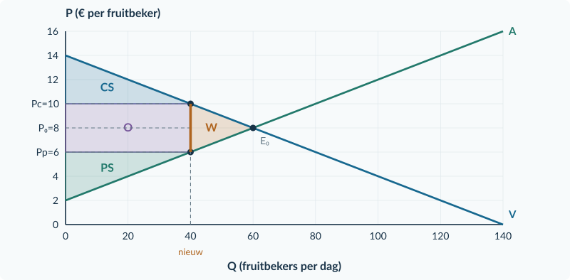
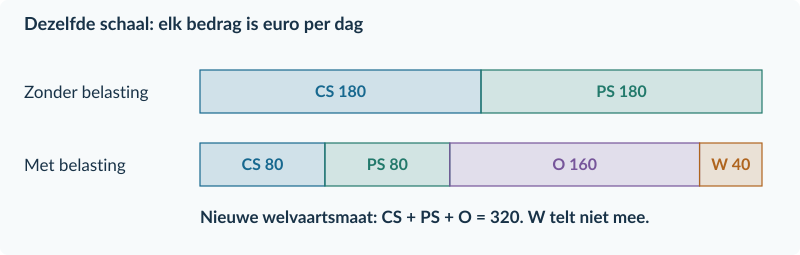
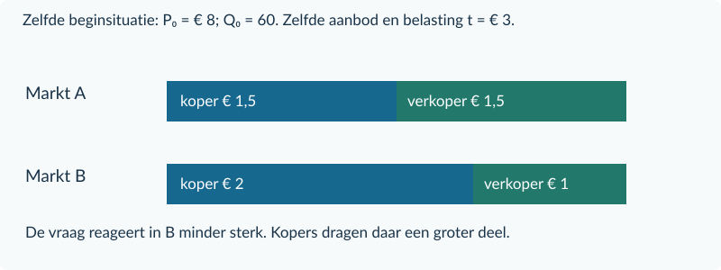
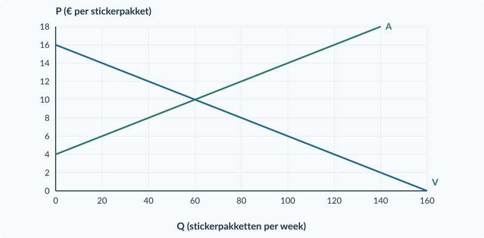

<!-- PAGE {"section": "3.1.2", "title": "Waar blijft de belasting?", "origin_chapter": "3.1", "origin_page": 10, "edition_page": 10} -->

3.1.2 · BELASTINGDRUK EN WELVAARTSVERLIES

# Waar blijft de belasting?

Bij de fruitbekers steeg de kopersprijs van € 8 naar € 10. Verkopers hielden nog € 6 over. Er werden 40 in plaats van 60 bekers verkocht. De overheid ontving € 4 per verkochte beker.

De kopers en verkopers verliezen voordeel. Maar verdwijnt al dat voordeel? Een deel komt bij de overheid terecht. Een ander deel ontstaat helemaal niet meer, doordat transacties wegvallen.

<b>Lesdoelen</b> Je kunt de belastingdruk per product over kopers en verkopers verdelen, ook in procenten. Je kunt belastingopbrengst, CS, PS en welvaartsverlies berekenen en markeren. Je kunt uitleggen waarom de minder prijsgevoelige kant relatief meer last draagt.

Last koper per stuk = Pc − P₀ Last verkoper per stuk = P₀ − Pp Aandeel koper = (Pc − P₀) / t × 100%

Het aandeel van de koper heet ook het **afwentelingspercentage**: welk deel van de belasting komt via een hogere prijs bij kopers terecht? In het fruitbekervoorbeeld is dat € 2 / € 4 × 100% = 50%.

<b>Belastingopbrengst O</b> De overheid ontvangt alleen belasting over werkelijk verkochte producten. <b>O = t × Qt</b>. Hier: € 4 per beker × 40 bekers per dag = € 160 per dag.

### Geen verdwenen geld

De € 160 is een overdracht aan de overheid. Het is geen € 160 aan verdwenen welvaart. Voor onze vergelijking tellen we overheidsontvangsten mee naast het consumenten- en producentensurplus.

<b>Onze welvaartsmaat</b> Zonder belasting: CS + PS. Met belasting: CS + PS + O. We rekenen zonder effecten voor buitenstaanders en zonder uitvoeringskosten. Wat de overheid later met het geld doet, is hier niet gegeven.

<!-- PAGE {"section": "3.1.2", "title": "Rechthoek, driehoek en prijsgevoeligheid", "origin_chapter": "3.1", "origin_page": 11, "edition_page": 11} -->

### De gebieden vertellen elk iets anders

De vraaglijn geeft de betalingsbereidheid. De oorspronkelijke aanbodlijn stelt in dit model de marginale kosten voor. CS ligt boven **Pc**; PS ligt onder **Pp**. De belastingopbrengst ligt tussen die twee prijzen, over de verkochte hoeveelheid.

<figure><figcaption>Figuur 1. O is de belastingrechthoek: 40 × € 4. W is de driehoek van gemiste transacties tussen Q = 40 en Q = 60.</figcaption></figure>

De extra transacties tussen 40 en 60 zouden meer opleveren aan betalingsbereidheid dan ze kosten. Door de wig komen ze niet tot stand. Hun gezamenlijke gemiste voordeel heet **welvaartsverlies W**.

W = oude welvaartsmaat − nieuwe welvaartsmaat Bij deze rechte lijnen ook: W = ½ × (Q₀ − Qt) × t

De breedte van O telt **verkochte producten**. De breedte van W telt juist **transacties die wegvallen**. Bekijk op de volgende pagina hoe dit verschil terugkomt in de bedragen.

<!-- PAGE {"section": "3.1.2", "title": "Wat verdwijnt en wat verhuist?", "origin_chapter": "3.1", "origin_page": 12, "edition_page": 12} -->

### Houd drie bedragen uit elkaar

In de fruitbekermarkt daalt CS van € 180 naar € 80 per dag. PS daalt evenveel. De overheid krijgt € 160. Het verschil tussen het oude en het nieuwe totaal is € 40.

<figure><figcaption>Figuur 2. Van € 360 aan oud surplus blijft € 320 in de nieuwe welvaartsmaat over. De € 160 belastingopbrengst telt mee; de € 40 verloren voordeel niet.</figcaption></figure>

De gezamenlijke afname van CS en PS is **€ 200**. Dat bedrag bestaat uit twee delen:

Verlies van CS en PS: 100 + 100 = € 200 Daarvan bij de overheid: € 160 Verdwenen voordeel van handel: 200 − 160 = € 40

### Waarom ontstaat dat verloren voordeel?

Bekijk een extra beker rond Q = 50. Op V staat € 9 betalingsbereidheid; op A staat € 7 marginale kosten. Zonder belasting kan die transactie voordeel opleveren. Maar de ruimte van € 2 is niet genoeg om ook de belasting van € 4 te overbruggen. De transactie valt weg.

Alle verdwenen voordelen tussen Qt = 40 en Q₀ = 60 vormen samen driehoek W. Daarom is de basis **20 bekers per dag**, niet 40 verkochte bekers. De hoogte bij Q = 40 is **€ 4 per beker**. De oppervlakte is ½ × 20 × 4 = € 40 per dag.

<b>Last per verkocht product is niet het hele surplusverlies</b> Kopers betalen € 2 extra op 40 verkochte bekers: € 80. Hun CS daalt echter € 100. De overige € 20 is het voordeel op aankopen die wegvallen. Hetzelfde onderscheid geldt voor verkopers.

<!-- PAGE {"section": "3.1.2", "title": "Wie kan makkelijker op de prijs reageren?", "origin_chapter": "3.1", "origin_page": 13, "edition_page": 13} -->

### Verander maar één kenmerk

Twee markten beginnen bij **P₀ = € 8 en Q₀ = 60 producten per dag**. Het aanbod is in beide Pp = 2 + 0,10Q. Ook de belasting van € 3 per product is gelijk. Alleen de reactie van de kopers verschilt.

| Vergelijking | Markt A | Markt B |
|---|---:|---:|
| Vraagfunctie | Pc = 14 − 0,10Q | Pc = 20 − 0,20Q |
| Qv bij Pc = € 8 | 60 | 60 |
| Qv bij Pc = € 9 | 50 | 55 |
| Daling door dezelfde prijsstijging | 10 producten | 5 producten |

**B reageert minder sterk.** Kopers blijven bij dezelfde prijsstijging relatief vaker kopen. Verkopers kunnen daardoor een groter deel van de belasting via de prijs doorberekenen. De nieuwe uitkomsten zijn A: Qt = 45, Pc = € 9,50, Pp = € 6,50; B: Qt = 50, Pc = € 10, Pp = € 7.

<figure><figcaption>Figuur 3. Van dezelfde € 3 belasting draagt de koper in A € 1,50 en in B € 2. De minder prijsgevoelige kopers in B dragen hier het grotere aandeel.</figcaption></figure>

In A is het kopersaandeel 1,50 / 3 × 100% = **50%**. In B is het 2 / 3 × 100% = **66,67%**. Wie het geld aan de overheid overmaakt, is voor deze vergelijking niet de verklaring.

<b>De redenering werkt aan beide kanten</b> De kant die minder makkelijk op een prijsverandering kan reageren, draagt relatief meer last. Zijn juist verkopers weinig prijsgevoelig ten opzichte van kopers, dan komt meer last bij verkopers terecht. Vergelijk wel dezelfde uitgangssituatie; een steiler getekende lijn alléén is geen bewijs.

<!-- PAGE {"section": "3.1.2", "title": "Reken de welvaartsverandering na", "origin_chapter": "3.1", "origin_page": 14, "edition_page": 14} -->

## Uitgewerkt voorbeeld

**Fruitbekers, vervolg.** Vraag Pc = 14 − 0,10Q; aanbod Pp = 2 + 0,10Q. Zonder belasting: Q₀ = 60 en P₀ = € 8. Bij t = € 4: Qt = 40, Pc = € 10 en Pp = € 6.

**1 · Verdeel de last.** Koper: 10 − 8 = € 2. Verkoper: 8 − 6 = € 2. De koper draagt 2 / 4 × 100% = **50%**.

**2 · Bereken de gebieden.** De basis van elke surplusdriehoek is de verkochte hoeveelheid; de hoogte is een prijsverschil.

| Grootheid | Zonder belasting (€ per dag) | Met belasting (€ per dag) |
|---|---|---|
| CS | ½ × 60 × (14 − 8) = 180 | ½ × 40 × (14 − 10) = 80 |
| PS | ½ × 60 × (8 − 2) = 180 | ½ × 40 × (6 − 2) = 80 |
| O | 0 | 4 × 40 = 160 |
| CS + PS + O | 360 | 320 |

**3 · Bereken en controleer W.** W = 360 − 320 = **€ 40 per dag**. Met de driehoek: ½ × (60 − 40) × 4 = € 40. Beide routes geven hetzelfde.

**4 · Trek een conclusie.** Kopers en verkopers verliezen samen € 200 surplus. Daarvan ontvangt de overheid € 160. Alleen de overige € 40 is in dit model welvaartsverlies. Bij een minder prijsgevoelige vraag en gelijk aanbod zou een groter deel van de belasting bij kopers terechtkomen.

<b>Onthouden</b> Last per stuk ≠ belastingopbrengst ≠ welvaartsverlies. O is een rechthoek over verkochte producten. W is de driehoek van gemiste voordelige transacties. De minder prijsgevoelige kant draagt relatief meer last.

## Startopgaven

<b>Korte route:</b> Startopgaven → Zelfstandige oefening → Doeloefening. Extra hulp nodig? Maak eerst Begeleide inoefening.

<b>Opgave 10 · Surplus terughalen</b>

Een markt heeft Q₀ = 40 en P₀ = € 10. De vraaglijn snijdt de prijsas bij € 18; de aanbodlijn bij € 6. Beide lijnen zijn recht.

<b>a.</b> Bereken CS en PS met basis, hoogte en eenheid.

<b>Opgave 11 · Geld of gemiste handel?</b>

Een belasting levert de overheid € 120 op. De welvaartsmaat daalt van € 500 naar € 470.

<b>a.</b> Hoe groot is het welvaartsverlies? Leg uit waarom dit niet € 120 is.

<!-- PAGE {"section": "3.1.2", "title": "Alle onderdelen zichtbaar", "origin_chapter": "3.1", "origin_page": 15, "edition_page": 15} -->

## Begeleide inoefening

Heb je deze hulp niet nodig? Ga dan verder met Zelfstandige oefening.

<b>Opgave 12 · Lees het belastingplaatje</b>

Gebruik de volledig ingekleurde fruitbekermarkt in figuur 1 op pagina 11.

<b>a.</b> Wijs CS, PS, O en W aan. Welke prijs vormt de ondergrens van CS? Welke prijs vormt de bovengrens van PS?

<b>b.</b> Bereken eerst alleen de oppervlakte O. Gebruik daarna Q₀ − Qt als basis van W.

<b>c.</b> Leg uit waarom de hele oppervlakte tussen Pc en Pp niet hetzelfde is als W.

<b>Opgave 13 · Kaartensets</b>

Voor kaartensets is het vrije evenwicht Q₀ = 60 en P₀ = € 10. Een belasting van € 4 geeft Qt = 40, Pc = € 12 en Pp = € 8. De rechte vraaglijn begint op de prijsas bij € 16 en de rechte aanbodlijn bij € 4. Q is sets per dag.

<b>a.</b> Vul eerst de tabel hieronder volledig in. Noteer eenheden en laat voor CS en PS telkens basis en hoogte zien.

<b>b.</b> Bereken O en W. Controleer W met de driehoek.

<b>c.</b> Beoordeel: “Omdat kopers en verkopers elk € 2 per set dragen, ontvangt de overheid maar € 2 per set.”

| Grootheid | Zonder belasting | Met belasting |
|---|---|---|
| CS (€ per dag) | … | … |
| PS (€ per dag) | … | … |
| O (€ per dag) | 0 | … |
| CS + PS + O (€ per dag) | … | … |

<b>Laat de hulp los</b> Schrijf bij de volgende opgaven zelf op welke prijs, hoeveelheid en oppervlakte je nodig hebt. Een uitkomst zonder economische betekenis is nog geen conclusie.

<!-- PAGE {"section": "3.1.2", "title": "Last en verlies zelf berekenen", "origin_chapter": "3.1", "origin_page": 16, "edition_page": 16} -->

## Zelfstandige oefening

<b>Opgave 14 · Stickerpakketten</b>

Vraag Pc = 16 − 0,10Q; aanbod Pp = 4 + 0,10Q. Zonder belasting: Q₀ = 60 en P₀ = € 10. Verkopers dragen € 4 per verkocht pakket af. Na invoering: Qt = 40, Pc = € 12 en Pp = € 8. Q is pakketten per week.

<b>a.</b> Bereken de last per pakket voor kopers en verkopers en het afwentelingspercentage.

<b>b.</b> Bereken CS en PS voor en na de belasting, O en W.

<b>c.</b> Markeer in de basisgrafiek Pc, Pp en Qt. Arceer O en W verschillend en benoem beide gebieden.

<figure><figcaption>Figuur 4. Basisgrafiek bij opgave 14. De oorspronkelijke A blijft de marginale-kostenlijn.</figcaption></figure>

<b>Opgave 15 · Niet even prijsgevoelig</b>

Twee markten hebben dezelfde beginprijs en beginhoeveelheid, hetzelfde aanbod en dezelfde belasting. In markt X kunnen kopers makkelijk een ander product kiezen; in markt Y veel minder.

<b>a.</b> In welke markt verwacht je een groter aandeel van de belasting bij de koper? Leg uit via de mogelijkheid om op de prijs te reageren.

<b>b.</b> Waarom is “de verkoper draagt af” geen bewijs voor jouw antwoord?

<!-- PAGE {"section": "3.1.2", "title": "De hele belastingrekening", "origin_chapter": "3.1", "origin_page": 17, "edition_page": 17} -->

## Doeloefening

<b>Opgave 16 · Bedrukte tassen: wie betaalt?</b>

Dit is de markt uit §3.1.1, met alle gegevens opnieuw gegeven. Vraag Pc = 20 − 0,20Q; aanbod Pp = 2 + 0,10Q. Q is tassen per dag. Eerst: Q₀ = 60 en P₀ = € 8. Met t = € 3: Qt = 50, Pc = € 10 en Pp = € 7. De belasting heeft geen effecten voor buitenstaanders en geen uitvoeringskosten.

<b>a.</b> Bereken de last per tas voor beide kanten en het afwentelingspercentage.

<b>b.</b> Bereken de belastingopbrengst per dag.

<b>c.</b> Bereken CS en PS zonder en met belasting. Bereken daarna de welvaartsmaat met overheid en het welvaartsverlies.

<b>d.</b> Markeer Qt, Pc en Pp in de basisgrafiek. Arceer de belastingopbrengst en het welvaartsverlies verschillend. Noteer basis en hoogte van W.

<b>e.</b> Een koper zegt: “Als de vraag nog minder prijsgevoelig was, zouden wij minder belasting dragen.” Beoordeel, bij gelijk aanbod en dezelfde belasting.

<figure><figcaption>Figuur 5. Basisgrafiek bij de doeloefening. Gebruik de twee werkelijk ontvangen en betaalde prijzen, niet één middenprijs.</figcaption></figure>

<!-- PAGE {"section": "3.1.2", "title": "Vergelijk eerlijk", "origin_chapter": "3.1", "origin_page": 18, "edition_page": 18} -->

## Denkertje / Bonusopgave

<b>Opgave 17 · Kan de schaal de belastingdruk veranderen?</b>

De twee grafieken hieronder tonen precies dezelfde vraagfunctie: P = 14 − 0,10Q. Q is producten per week; P is euro per product. Alleen de schaal van de verticale as verschilt. Het aanbod en de belasting blijven buiten deze twee afbeeldingen.

<b>a.</b> Een leerling noemt de vraag in de linker grafiek minder prijsgevoelig omdat de lijn daar steiler lijkt. Bereken in beide grafieken Q bij P = € 8 en bij P = € 9. Beoordeel de uitspraak.

<b>b.</b> Kun je uit alleen deze twee vraaggrafieken afleiden welk aandeel van een belasting kopers dragen? Leg uit welke aanvullende informatie je nodig hebt. Leg ook uit waarom het aanpassen van de asschaal op zichzelf geen andere economische uitkomst veroorzaakt.

<figure><figcaption>Figuur 6. Dezelfde vraag, twee asschalen. De punten geven in beide grafieken dezelfde combinaties van prijs en hoeveelheid.</figcaption></figure>

## Herhaling / Herhaling en interleaving

<b>Opgave 18 · Een bedrag per product</b>

Een producent verkoopt 100 producten voor € 9 per stuk. TK = 300 + 4Q, met kosten in euro per dag en Q in producten per dag.

<b>a.</b> Bereken TO, TK en de winst per dag.

<b>b.</b> Leg uit waarom een ontvangst van € 9 per product geen winst van € 9 per product is.

<b>Verder in de volgende paragraaf</b> Bij een subsidie legt de overheid geld bij. De wig draait om. Maar voor welvaart moet je de overheidsuitgaven juist aftrekken.

