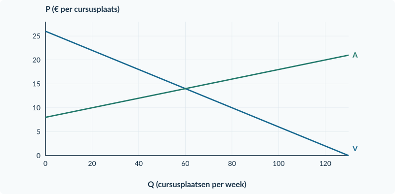

<!-- PAGE {"section": "3.1.3", "title": "De overheid legt geld bij", "origin_chapter": "3.1", "origin_page": 19, "edition_page": 19} -->

3.1.3 · SUBSIDIES

# De overheid legt geld bij

Een gemeente wil meer workshopbezoek. In deze oefensituatie krijgt de aanbieder € 4 subsidie voor iedere werkelijk verkochte workshopplaats. De koper betaalt aan de aanbieder; de gemeente betaalt het subsidiebedrag erbij.

De aanbieder ontvangt nu meer dan de koper betaalt. Je gebruikt dezelfde twee prijzen als bij belasting, maar **de wig wijst de andere kant op**.

<b>Lesdoelen</b> Je kunt bij een subsidie per verkocht product Pc, Pp en de hoeveelheid berekenen. Je kunt de overheidsuitgaven bepalen en de voordelen voor kopers en verkopers vergelijken. Je kunt een welvaartsclaim beoordelen door de uitgaven mee te rekenen.

<figure><figcaption>Figuur 1. De koper betaalt € 10. De gemeente legt € 4 bij. De aanbieder ontvangt samen € 14 per verkochte workshopplaats.</figcaption></figure>

Subsidiewig: Pp − Pc = s Dus: Pp = Pc + s en Pc = Pp − s

**s** is de subsidie per verkocht product. **Pp** is hier de totale ontvangst van de producent: het bedrag van de koper plus de subsidie. Daar moeten de productiekosten nog af.

<b>Vergelijk met belasting</b> Belasting: Pc is hoger dan Pp. Subsidie: Pp is hoger dan Pc. In beide gevallen lees je Pc op de vraaglijn en Pp op de oorspronkelijke aanbodlijn bij dezelfde nieuwe Q.

<!-- PAGE {"section": "3.1.3", "title": "Meer handel is niet gratis", "origin_chapter": "3.1", "origin_page": 20, "edition_page": 20} -->

### De aanbodlijn in kopersprijzen

Voor workshopplaatsen geldt Pc = 18 − 0,10Q en Pp = 6 + 0,10Q. Q is plaatsen per week; prijzen zijn euro per plaats. Door de subsidie van € 4 hoeft de koper € 4 minder te betalen dan de aanbieder totaal wil ontvangen.

Pc = Pp − 4 = 2 + 0,10Q

<figure><figcaption>Figuur 2. A − s ligt € 4 onder A. Bij Q = 80 zijn Pc = € 10 en Pp = € 14. U is de uitgavenrechthoek over alle 80 plaatsen.</figcaption></figure>

### Een rekening voor de overheid

De subsidie geldt hier voor **elke verkochte plaats**, niet alleen voor de extra plaatsen. De overheidsuitgaven zijn dus **U = s × Qsub**: de rechthoek U in de figuur. Qsub is het aantal verkochte plaatsen mét subsidie; Qa blijft de aangeboden hoeveelheid.

### Kijk verder dan CS en PS

Kopers betalen minder en aanbieders ontvangen meer. CS en PS kunnen dus allebei stijgen. Maar de overheid betaalt ervoor. De relevante welvaartsmaat is hier **CS + PS − U**.

De extra transacties voorbij het vrije evenwicht kosten in dit model meer dan de kopers ervoor overhebben. Zonder baten voor buitenstaanders kan de subsidie daardoor welvaartsverlies veroorzaken. We veronderstellen ook hier geen uitvoeringskosten.

<b>Geen dubbele telling</b> Tel U niet bij het voordeel van kopers en verkopers op. De subsidie zit al in de grotere gebieden CS en PS. Voor de welvaartsvergelijking trek je de overheidsuitgaven af.

<!-- PAGE {"section": "3.1.3", "title": "Waarom kan extra handel toch voordeel kosten?", "origin_chapter": "3.1", "origin_page": 21, "edition_page": 21} -->

### Volg de drie rekeningen

Bij de workshopplaatsen stijgt Q van 60 naar 80. Kopers betalen € 10 en aanbieders ontvangen in totaal € 14. De overheid legt op **alle 80 plaatsen** € 4 bij: U = € 320 per week.

| Rekening | Zonder subsidie (€ per week) | Met subsidie (€ per week) | Verandering |
|---|---:|---:|---:|
| Consumentensurplus | 180 | 320 | +140 |
| Producentensurplus | 180 | 320 | +140 |
| Overheidsuitgaven | 0 | 320 | +320 uitgaven |
| **CS + PS − U** | **360** | **320** | **−40** |

Kopers en aanbieders krijgen samen **€ 280 meer surplus**. Daar staat een overheidsbetaling van € 320 tegenover. Het verschil van € 40 is in dit model verloren voordeel. De subsidie-uitgaven zélf zijn niet het welvaartsverlies.

<figure><figcaption>Figuur 3. U betreft alle gesubsidieerde plaatsen. W betreft alleen de extra transacties voorbij Q₀ = 60: basis 20 plaatsen, hoogte € 4 per plaats.</figcaption></figure>

### Kijk naar één extra plaats

Rond Q = 70 is de betalingsbereidheid 18 − 0,10 × 70 = **€ 11**. De marginale kosten zijn 6 + 0,10 × 70 = **€ 13**. Zo’n extra plaats kost € 2 meer dan het voordeel dat de koper eraan toekent. De subsidie maakt verkoop wel aantrekkelijk voor koper en aanbieder, maar neemt dat verschil niet weg.

<b>Wat telt ons model mee?</b> We nemen geen extra baten voor buitenstaanders aan. Daarom maakt “meer activiteiten” de uitkomst niet automatisch beter. In Boek 4 onderzoeken we opnieuw subsidies, maar dan mét zulke extra baten.

<!-- PAGE {"section": "3.1.3", "title": "Dezelfde stappen, een andere wig", "origin_chapter": "3.1", "origin_page": 22, "edition_page": 22} -->

## Uitgewerkt voorbeeld

**Workshopplaatsen.** Pc = 18 − 0,10Q; Pp = 6 + 0,10Q; s = € 4 per verkochte plaats. Zonder subsidie: Q₀ = 60, P₀ = € 12, CS = € 180 en PS = € 180 per week.

**1 · Pas de kopersprijs van het aanbod aan.** Pc = Pp − 4 = 2 + 0,10Q.

**2 · Bereken de nieuwe hoeveelheid en prijzen.**

18 − 0,10Q = 2 + 0,10Q → Qsub = 80 Pc = 18 − 0,10 × 80 = € 10 Pp = 6 + 0,10 × 80 = € 14

Controle: 14 − 10 = € 4. Kopers betalen € 2 minder; aanbieders ontvangen € 2 meer per plaats. De aanbieder krijgt de subsidie uitbetaald, maar is niet de enige die profiteert.

**3 · Bereken uitgaven en surplus.**

| Grootheid | Berekening na subsidie | Uitkomst per week |
|---|---|---|
| U | 4 × 80 | € 320 |
| CS | ½ × 80 × (18 − 10) | € 320 |
| PS | ½ × 80 × (14 − 6) | € 320 |
| CS + PS − U | 320 + 320 − 320 | € 320 |

**4 · Vergelijk.** Eerst was de welvaartsmaat € 360. Nu is zij € 320: **€ 40 welvaartsverlies**. Controle met rechte lijnen: ½ × (80 − 60) × 4 = € 40.

<b>Onthouden</b> Subsidie: Pp − Pc = s. Bereken U over alle gesubsidieerde verkopen. Vergelijk niet alleen CS en PS, maar CS + PS − U. Zonder externe baten is méér productie niet automatisch beter.

## Startopgaven

<b>Korte route:</b> Startopgaven → Zelfstandige oefening → Doeloefening. Extra hulp nodig? Maak eerst Begeleide inoefening.

<b>Opgave 19 · De wig terughalen</b>

Bij een belasting van € 3 betaalt de koper € 11. Bij een andere markt met € 3 subsidie betaalt de koper ook € 11.

<b>a.</b> Bereken in beide gevallen Pp. Geef aan wanneer je € 3 aftrekt en wanneer je € 3 optelt.

<b>Opgave 20 · Voor alle verkochte plaatsen</b>

Een subsidie van € 2 vergroot de verkoop van 50 naar 60 plaatsen per week.

<b>a.</b> Bereken de uitgaven als iedere verkochte plaats recht op subsidie geeft. Waarom gebruik je niet alleen de 10 extra plaatsen?

<!-- PAGE {"section": "3.1.3", "title": "Herken de omgekeerde route", "origin_chapter": "3.1", "origin_page": 23, "edition_page": 23} -->

## Begeleide inoefening

Heb je deze hulp niet nodig? Ga dan verder met Zelfstandige oefening.

<b>Opgave 21 · Lees de subsidie-uitkomst</b>

Gebruik de workshopgrafiek op pagina 20. De vraag- en aanbodlijn zijn niet van betekenis veranderd.

<b>a.</b> Lees bij Q = 80 beide prijzen af. Welke partij ontvangt samen € 14?

<b>b.</b> Leg uit waarom de aanbodlijn in kopersprijzen naar beneden schuift en niet de vraaglijn.

<b>c.</b> Bereken het voordeel per plaats voor de koper én voor de aanbieder, vergeleken met € 12.

Extra steun voor de surplusrekening bij 22c vind je in opgave 22A. Die kun je zo nodig eerst maken.

<b>Opgave 22 · Muzieklesplaatsen</b>

Vraag Pc = 22 − 0,10Q; aanbod Pp = 10 + 0,10Q. Zonder subsidie: Q₀ = 60 en P₀ = € 16. De aanbieder krijgt € 4 per verkochte lesplaats. Q is lesplaatsen per week.

<b>a.</b> Vul eerst in: Pc = Pp − … = … + 0,10Q. Bereken vervolgens de nieuwe hoeveelheid en beide prijzen.

<b>b.</b> Teken A − s in de basisgrafiek en markeer Pc, Pp en Qsub.

<b>c.</b> Bereken U. Bereken daarna CS en PS met de nieuwe hoeveelheid; vergelijk CS + PS − U met de oude € 360.

<figure><figcaption>Figuur 4. Basisgrafiek bij opgave 22. A beschrijft de totale ontvangst die aanbieders bij elke hoeveelheid nodig hebben.</figcaption></figure>

<!-- PAGE {"section": "3.1.3", "title": "Oefenen met de welvaartsrekening", "origin_chapter": "3.1", "origin_page": 24, "edition_page": 24} -->

### Begeleide inoefening · vervolg

Deze oefening geeft extra steun bij het kiezen van prijzen, hoeveelheden en oppervlakten. Heb je die steun niet nodig? Ga dan door naar Zelfstandige oefening.

<b>Opgave 22A · Eerst de drie rekeningen</b>

Op een oefenmarkt voor keramieklesplaatsen krijgt de aanbieder € 4 subsidie per verkochte plaats. Er zijn geen baten voor buitenstaanders en geen uitvoeringskosten. De nieuwe hoeveelheid en prijzen zijn al berekend; oefen hier alleen de surplus- en begrotingsrekening. Q is plaatsen per week; prijzen zijn euro per plaats.

<b>a.</b> Vul eerst de tabel onder de bron volledig in. Gebruik voor iedere surplusdriehoek de juiste basis en hoogte. De rij zonder subsidie is als voorbeeld ingevuld.

<b>b.</b> Bereken hoeveel CS en PS ieder toenemen. Vergelijk hun gezamenlijke toename met de subsidie-uitgaven.

<b>c.</b> Bereken het welvaartsverlies op twee manieren: met de oude en nieuwe welvaartsmaat en met de driehoek van extra transacties.

<b>d.</b> Een leerling schrijft: “U = 4 × (70 − 60) = € 40.” Leg uit welke gesubsidieerde verkopen in deze berekening ontbreken.

<b>Brongegevens</b> Vraag: Pc = 30 − 0,20Q. Aanbod: Pp = 6 + 0,20Q. Zonder subsidie: Q₀ = 60; P₀ = € 18. Met subsidie: Qsub = 70; Pc = € 16; Pp = € 20.

| Rekening (€ per week) | Zonder subsidie: voorgedaan | Met subsidie: vul zelf in |
|---|---|---|
| CS | ½ × 60 × (30 − 18) = 360 | ½ × … × (… − …) = … |
| PS | ½ × 60 × (18 − 6) = 360 | ½ × … × (… − …) = … |
| U | 0 | … × … = … |
| CS + PS − U | 360 + 360 − 0 = 720 | … + … − … = … |

<b>Hulp die je straks weglaat</b> CS gebruikt de kopersprijs. PS gebruikt de totale verkopersontvangst. Beide gebruiken de werkelijk verkochte hoeveelheid. Stel bij U apart de vraag: voor welke verkopen betaalt de overheid?

<!-- PAGE {"section": "3.1.3", "title": "Reken mét de overheidsrekening", "origin_chapter": "3.1", "origin_page": 25, "edition_page": 25} -->

## Zelfstandige oefening

<b>Opgave 23 · Sportplaatsen</b>

Vraag Pc = 24 − 0,20Q; aanbod Pp = 6 + 0,10Q. Eerst zijn Q₀ = 60 en P₀ = € 12. Aanbieders krijgen € 3 per verkochte sportplaats. Q is plaatsen per week. De oude welvaartsmaat is € 540 per week.

<b>a.</b> Bereken de nieuwe hoeveelheid, Pc en Pp. Teken A − s en markeer de drie uitkomsten.

<b>b.</b> Bereken de subsidie-uitgaven, CS en PS.

<b>c.</b> Bereken CS + PS − U en het welvaartsverlies. Noem de veronderstelling over baten voor anderen.

<figure><figcaption>Figuur 5. Basisgrafiek bij opgave 23. Controleer na het rekenen de richting én de grootte van de wig.</figcaption></figure>

<b>Opgave 24 · Meer voordeel, toch een rekening</b>

Na een subsidie betalen kopers per product € 2 minder en ontvangen verkopers per product € 1 meer dan voorheen.

<b>a.</b> Hoe hoog is de subsidie per product?

<b>b.</b> Beoordeel: “Iedereen profiteert, want kopers én verkopers zijn beter af.” Noem welke partij en welk bedrag per transactie in deze uitspraak ontbreken.

<!-- PAGE {"section": "3.1.3", "title": "Wie krijgt het subsidievoordeel?", "origin_chapter": "3.1", "origin_page": 26, "edition_page": 26} -->

## Doeloefening

<b>Opgave 25 · Cursusplaatsen</b>

Vraag Pc = 26 − 0,20Q; aanbod Pp = 8 + 0,10Q. Q is cursusplaatsen per week. Eerst: Q₀ = 60, P₀ = € 14, CS = € 360 en PS = € 180 per week. Aanbieders ontvangen € 3 subsidie per werkelijk verkochte plaats. Er zijn geen baten voor buitenstaanders en geen uitvoeringskosten.

<b>a.</b> Stel het aanbod in kopersprijzen mét subsidie op. Bereken Qsub, Pc en Pp.

<b>b.</b> Bereken de overheidsuitgaven per week.

<b>c.</b> Bereken het voordeel per plaats voor kopers en aanbieders. Leg uit waarom uitbetaling aan aanbieders niet betekent dat zij het hele voordeel krijgen.

<b>d.</b> Bereken CS en PS na subsidie. Bepaal CS + PS − U en het welvaartsverlies ten opzichte van de oude situatie.

<b>e.</b> Markeer Qsub, Pc en Pp in de basisgrafiek. Arceer de rechthoek van de overheidsuitgaven. Beoordeel: “De subsidie verhoogt in dit model automatisch de welvaart.”

<figure><figcaption>Figuur 6. Basisgrafiek bij de doeloefening. De uitgavenrechthoek ligt tussen Pc en Pp, van Q = 0 tot de nieuwe hoeveelheid.</figcaption></figure>

<!-- PAGE {"section": "3.1.3", "title": "De vorm van steun doet ertoe", "origin_chapter": "3.1", "origin_page": 27, "edition_page": 27} -->

## Denkertje / Bonusopgave

<b>Opgave 26 · Per verkoop of een vast bedrag?</b>

Regeling A geeft aanbieders € 3 per verkochte cursusplaats. In de markt van opgave 25 ontstaan dan 70 verkopen. Regeling B vervangt A door samen € 210 vaste steun aan de bestaande aanbieders, ongeacht hoeveel zij verkopen. Volgens de bron veranderen bij B de vraag, de marginale kosten en de marktdeelname niet; het vrije evenwicht blijft dus 60 plaatsen voor € 14.

<b>a.</b> Vergelijk de uitgaven onder A en B. Welke regeling verandert in deze bron de prikkel om extra plaatsen aan te bieden?

<b>b.</b> Leg uit waarom je bij B niet automatisch A met € 3 omlaag mag verschuiven. Gebruik het verschil tussen een vast bedrag en een bedrag per verkoop.

### Twee vragen bij iedere subsidieregeling

**Waarvoor wordt betaald?** Een bedrag per verkoop verandert de opbrengst van een extra verkochte eenheid. Een vast bedrag doet dat in de beschreven situatie niet.

**Welke rekening hoort erbij?** Neem de overheidsuitgaven mee voordat je een welvaartsconclusie trekt. Hetzelfde totaalbedrag kan bij verschillende regelingen andere productieprikkels geven.

## Herhaling / Herhaling en interleaving

<b>Opgave 27 · Totaal en per eenheid</b>

Een zaal heeft € 600 constante kosten per week. De zaal verhuurt eerst 100 en later 150 stoelen per week, binnen dezelfde productiecapaciteit.

<b>a.</b> Bereken de gemiddelde constante kosten bij beide aantallen.

<b>b.</b> Leg uit waarom de totale constante kosten niet dalen als de gemiddelde constante kosten dalen.

Volgende stap: een maximumprijs begrenst de prijs, niet het bedrag per verkoop.

