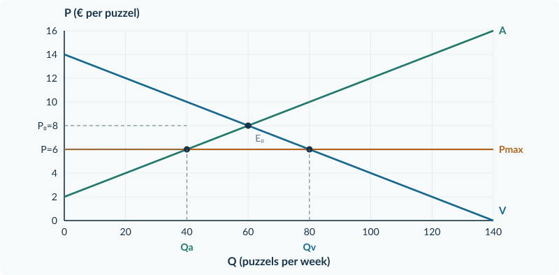
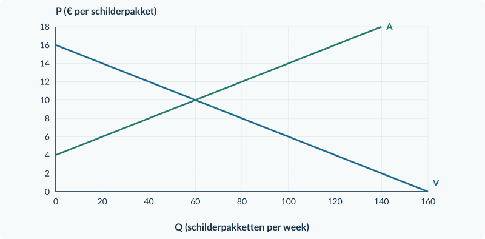
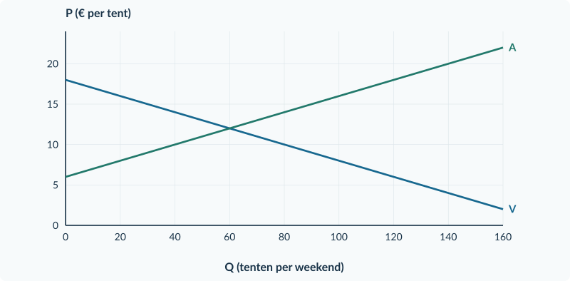

<!-- PAGE {"section": "3.1.4", "title": "Goedkoper, maar ook verkrijgbaar?", "origin_chapter": "3.1", "origin_page": 28, "edition_page": 28} -->

3.1.4 · MAXIMUMPRIJS

# Goedkoper, maar ook verkrijgbaar?

Op een markt voor puzzels is de vrije prijs € 8. Een regeling verbiedt prijzen boven € 6. Dat klinkt gunstig voor kopers. Toch kan niet iedereen die bij € 6 wil kopen een puzzel krijgen.

Een prijsregel verandert niet wat consumenten graag willen of wat productie kost. Hij kan wel verhinderen dat de prijs vraag en aanbod bij elkaar brengt.

<b>Lesdoelen</b> Je kunt bepalen of een maximumprijs bindt. Je kunt bij die prijs vraag, aanbod, werkelijke verkopen en het tekort berekenen. Je kunt de drie hoeveelheden in een grafiek onderscheiden en uitleggen welke kopers geen product krijgen.

<b>Maximumprijs</b> De hoogste toegestane verkoopprijs. Een maximumprijs <b>onder de vrije evenwichtsprijs</b> is in ons model bindend: hij verandert de marktuitkomst.

<figure><figcaption>Figuur 1. Bij Pmax = € 6 willen kopers 80 puzzels, maar verkopers bieden er 40 aan. Er worden 40 verkocht; het tekort is 40.</figcaption></figure>

Qv is wat kopers **willen kopen**. Qa is wat verkopers **willen verkopen**. Het werkelijke aantal transacties is weer iets anders. Zonder extra aanvoer kunnen niet meer producten worden verkocht dan er worden aangeboden.

<b>Geen wig</b> Hier is geen belasting of subsidie per verkoop. Bij een verkoop betaalt de koper hetzelfde bedrag als de verkoper ontvangt. Het probleem is een verschil tussen hoeveelheden, niet tussen twee prijzen.

<!-- PAGE {"section": "3.1.4", "title": "Eerst binding, dan hoeveelheden", "origin_chapter": "3.1", "origin_page": 29, "edition_page": 29} -->

### Een maximum is geen verplicht prijskaartje

Bij een vrije evenwichtsprijs van € 8 laat een maximum van € 10 de marktprijs van € 8 toe. Verkopers hoeven niet € 10 te vragen. De regeling is dan **niet bindend**.

| Maximumprijs | Bindend bij vrij evenwicht € 8? | Marktuitkomst in dit model |
|---|---|---|
| € 6 | Ja | Bereken Qv en Qa bij € 6. |
| € 10 | Nee | P blijft € 8; Q blijft 60. |

### De korte kant bepaalt wat er kan worden verkocht

In de puzzelmarkt zijn 40 producten beschikbaar en willen kopers er 80. Neem aan dat die 40 daadwerkelijk worden verkocht. Dan geldt:

Werkelijke verkopen = Qa = 40 Tekort = Qv − Qa = 80 − 40 = 40

Je kunt deze regel niet gebruiken zonder de context te lezen. Een bron kan bijvoorbeeld voorraden of extra aanvoer noemen. In onze oefeningen zijn die er niet, tenzij de tekst dat uitdrukkelijk zegt.

### Wie ontvangt het product?

Voor het totale aantal verkopen is “40 aangeboden” genoeg. Voor de verdeling van het voordeel is ook nodig **welke kopers** de 40 producten krijgen. Een wachtrij, loting en toewijzing op betalingsbereidheid kunnen andere kopers selecteren.

Krijgen de hoogste betalingsbereidheden voorrang, dan blijven andere geïnteresseerde kopers zonder product. Een lagere prijs is dus niet automatisch beter voor iedere koper.

<b>Surplus vraagt om een toewijzingsregel</b> Bij een tekort gebruik je niet zomaar de hele driehoek tot Qv. Alleen werkelijk verkochte producten leveren surplus op. Wie ze ontvangt, bepaalt het CS. In dit onderdeel staan binding, hoeveelheden en de verdeling van toegang centraal; het denkertje laat de toewijzing zien.

### Zelfde rekenen, andere interpretatie

In Boek 1 vulde je een prijs in om Qv en Qa te bepalen. Die techniek blijft gelijk. Nieuw is dat de opgelegde prijs niet vrij kan stijgen om het tekort op te lossen. Markeer daarom vraag, aanbod **en** werkelijke verkopen afzonderlijk.

<!-- PAGE {"section": "3.1.4", "title": "Een lage prijs analyseren", "origin_chapter": "3.1", "origin_page": 30, "edition_page": 30} -->

## Uitgewerkt voorbeeld

**Puzzels.** Vraag P = 14 − 0,10Q; aanbod P = 2 + 0,10Q. Q is puzzels per week. Er komen geen voorraden of extra producten bij. Alle aangeboden puzzels worden verkocht aan de kopers met de hoogste betalingsbereidheid.

**1 · Bereken het vrije evenwicht.**

14 − 0,10Q = 2 + 0,10Q → Q₀ = 60 P₀ = 14 − 0,10 × 60 = € 8

**2 · Controleer de maximumprijs.** € 6 is lager dan € 8, dus de regeling bindt.

**3 · Bereken beide gewenste hoeveelheden.** Gebruik nu dezelfde prijs van € 6 in beide oorspronkelijke functies.

Vraag: 6 = 14 − 0,10Qv → Qv = 80 Aanbod: 6 = 2 + 0,10Qa → Qa = 40 Verkopen = 40; tekort = 80 − 40 = 40

**4 · Markeer en verklaar.** Figuur 1 laat bij P = € 6 twee snijpunten zien. Markeer Qa = 40 als werkelijk verkocht. De 40 hoogste betalingsbereidheden krijgen een puzzel. Van de overige kopers die voor € 6 willen kopen, krijgen er 40 geen.

Bij een maximum van € 10 zou de oude prijs van € 8 toegestaan blijven. Dan blijven prijs en hoeveelheid € 8 en 60; je vult dus niet automatisch € 10 in.

<b>Onthouden</b> Vergelijk eerst Pmax met P₀. Alleen bij een bindende maximumprijs bereken je de nieuwe hoeveelheden bij Pmax. Zonder extra aanvoer: verkopen = Qa en tekort = Qv − Qa. Een lage prijs is geen aankoopgarantie.

## Startopgaven

<b>Korte route:</b> Startopgaven → Zelfstandige oefening → Doeloefening. Extra hulp nodig? Maak eerst Begeleide inoefening.

<b>Opgave 28 · Hoeveelheid bij een prijs</b>

Vraag P = 18 − 0,20Q; aanbod P = 6 + 0,10Q. Q is producten per dag.

<b>a.</b> Bereken het vrije evenwicht.

<b>b.</b> Bereken bij P = € 8 afzonderlijk Qv en Qa.

<b>Opgave 29 · Mag de oude prijs nog?</b>

De vrije marktprijs is € 12. Er komt een maximumprijs van € 15.

<b>a.</b> Verandert de marktprijs in ons model? Leg uit waarom wel of niet.

<!-- PAGE {"section": "3.1.4", "title": "Van aflezen naar invullen", "origin_chapter": "3.1", "origin_page": 31, "edition_page": 31} -->

## Begeleide inoefening

Heb je deze hulp niet nodig? Ga dan verder met Zelfstandige oefening.

<b>Opgave 30 · Bekijk eerst het tekort</b>

Gebruik de volledig gemarkeerde puzzelmarkt op pagina 28.

<b>a.</b> Lees Qv en Qa bij de maximumprijs af. Benoem welk aantal werkelijk wordt verkocht.

<b>b.</b> Wijs het tekort aan als een horizontaal verschil tussen hoeveelheden. Waarom is het geen verticale afstand tussen prijzen?

<b>c.</b> Beoordeel: “Alle 80 geïnteresseerde kopers betalen nu minder en zijn dus beter af.”

<b>Opgave 31 · Schilderpakketten</b>

Vraag P = 16 − 0,10Q; aanbod P = 4 + 0,10Q. Q is pakketten per week. Het vrije evenwicht is Q₀ = 60, P₀ = € 10. De maximumprijs wordt € 8. Er is geen extra aanvoer; alle aangeboden pakketten worden verkocht.

<b>a.</b> Leg uit waarom het maximum bindt.

<b>b.</b> Vul eerst in: 8 = 16 − 0,10Qv → Qv = …; 8 = 4 + 0,10Qa → Qa = … . Noteer vervolgens verkopen en tekort.

<b>c.</b> Teken Pmax en markeer Qv, Qa en het tekort in de basisgrafiek.

<b>d.</b> Welke uitkomst blijft gelden als het maximum niet € 8 maar € 12 wordt?

<figure><figcaption>Figuur 2. Basisgrafiek bij opgave 31. De kopers en verkopers reageren op dezelfde toegestane prijs.</figcaption></figure>

<!-- PAGE {"section": "3.1.4", "title": "De regel zelfstandig toepassen", "origin_chapter": "3.1", "origin_page": 32, "edition_page": 32} -->

## Zelfstandige oefening

<b>Opgave 32 · Bordspellen</b>

Vraag P = 20 − 0,20Q; aanbod P = 2 + 0,10Q. Q is spellen per week. De overheid zet de maximumprijs op € 6. Er zijn geen voorraden of andere aanvoer; alle aangeboden spellen worden verkocht.

<b>a.</b> Bereken het vrije evenwicht en bepaal of de maximumprijs bindt.

<b>b.</b> Bereken Qv, Qa, de verkopen en het tekort.

<b>c.</b> Teken Pmax in de basisgrafiek. Markeer de hoeveelheden en het tekort.

<b>d.</b> Leg uit waarom je zonder toewijzingsregel niet weet welke geïnteresseerde kopers een spel krijgen.

<figure><figcaption>Figuur 3. Basisgrafiek bij opgave 32. Noteer bij de hoeveelheden ook wat elk getal betekent.</figcaption></figure>

<b>Opgave 33 · De markt verandert</b>

Eerst is de vrije evenwichtsprijs € 8 en geldt een maximum van € 10. Later neemt de vraag toe: zonder prijsregel zou het nieuwe evenwicht € 12 zijn. Tegelijk verlaagt de overheid het maximum tot € 9.

<b>a.</b> Bepaal eerst alleen het effect van het lagere maximum bij de oude markt. Bindt € 9 dan?

<b>b.</b> Bepaal daarna of € 9 bij de nieuwe markt bindt. Beoordeel: “Of een maximum bindt, hangt alleen van het bedrag in de regeling af.”

<!-- PAGE {"section": "3.1.4", "title": "Een maximum bij tentverhuur", "origin_chapter": "3.1", "origin_page": 33, "edition_page": 33} -->

## Doeloefening

<b>Opgave 34 · Tenten voor een weekend</b>

Verschillende bedrijven verhuren dezelfde soort tent. Vraag P = 18 − 0,10Q; aanbod P = 6 + 0,10Q. P is de huur in euro per tent voor één weekend; Q is tenten per weekend. Er komt een maximumprijs van € 10. Er is geen extra aanvoer. Alle aangeboden tenten worden verhuurd, aan de vragers met de hoogste betalingsbereidheid.

<b>a.</b> Bereken de vrije evenwichtsprijs en -hoeveelheid. Leg uit of de maximumprijs bindt.

<b>b.</b> Bereken de gevraagde en aangeboden hoeveelheid, het werkelijke aantal verhuurde tenten en het tekort.

<b>c.</b> Teken de maximumprijs in de basisgrafiek. Markeer Qv, Qa en het werkelijke aantal verhuringen. Geef het tekort aan.

<b>d.</b> Een huurder zegt: “De lagere huur is goed voor iedereen die voor € 10 een tent wil huren.” Beoordeel met de uitkomsten en de toewijzingsregel.

<b>e.</b> Stel dat de maximumprijs € 14 is in plaats van € 10. Geef dan de werkelijke huur en het aantal verhuringen. Licht toe.

<figure><figcaption>Figuur 4. Basisgrafiek bij de doeloefening. Er is hier geen belasting- of subsidiewig.</figcaption></figure>

<!-- PAGE {"section": "3.1.4", "title": "Dezelfde prijs, andere kopers", "origin_chapter": "3.1", "origin_page": 34, "edition_page": 34} -->

## Denkertje / Bonusopgave

<b>Opgave 35 · Wie krijgt de twee producten?</b>

Vier kopers willen elk één product kopen. Er zijn twee producten beschikbaar. De maximumprijs én werkelijke verkoopprijs is € 6. In situatie A kopen Noor en Bo. In situatie B krijgen via loting Sam en Imre een product. De onderstaande tabel geeft alle betalingsbereidheden.

<b>a.</b> Bereken het gezamenlijke consumentensurplus in situatie A en in situatie B.

<b>b.</b> Leg uit waarom prijs en aantal verkopen alleen niet genoeg zijn om CS te bepalen.

<b>c.</b> Betekent het grootste berekende CS automatisch dat die toewijzing het eerlijkst is? Licht toe.

| Koper | Betalingsbereidheid per product | Koopt in A? | Koopt in B? |
|---|---:|---|---|
| Noor | € 12 | Ja | Nee |
| Bo | € 10 | Ja | Nee |
| Sam | € 8 | Nee | Ja |
| Imre | € 7 | Nee | Ja |

<b>Verwar een norm niet met een berekening</b> Surplus meet een voordeel volgens betalingsbereidheid. Het zegt niet vanzelf welke verdeling rechtvaardig is. Dat onderscheid ken je uit Boek 2.

## Herhaling / Herhaling en interleaving

<b>Opgave 36 · Een markt zonder beperking</b>

Vraag P = 30 − 0,50Q; aanbod P = 6 + 0,25Q. Q is kaartjes; P is euro per kaartje.

<b>a.</b> Bereken de vrije evenwichtsprijs en -hoeveelheid.

<b>b.</b> Bereken CS en PS in het vrije evenwicht.

<b>Verder</b> Een minimumprijs legt juist een ondergrens vast. Dan kunnen aanbieders meer willen verkopen dan kopers willen kopen. De bron moet zeggen wat er met het overschot gebeurt.

