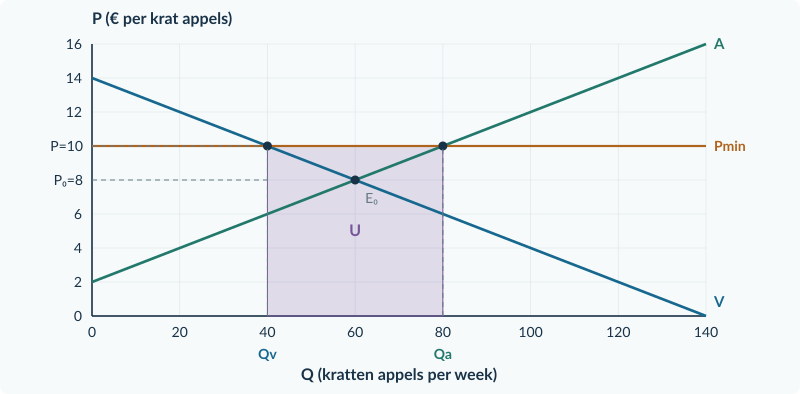
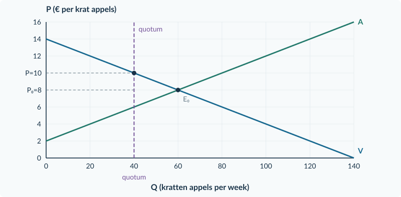
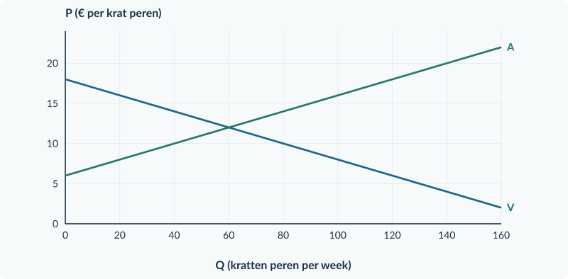
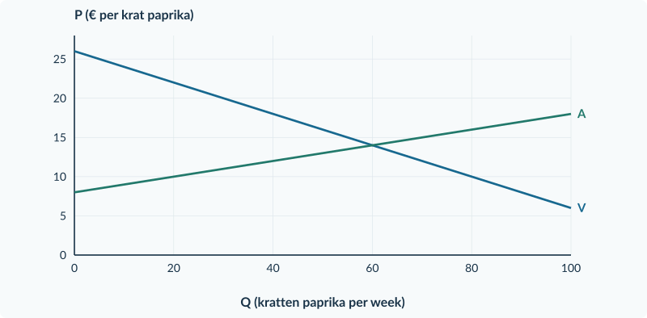
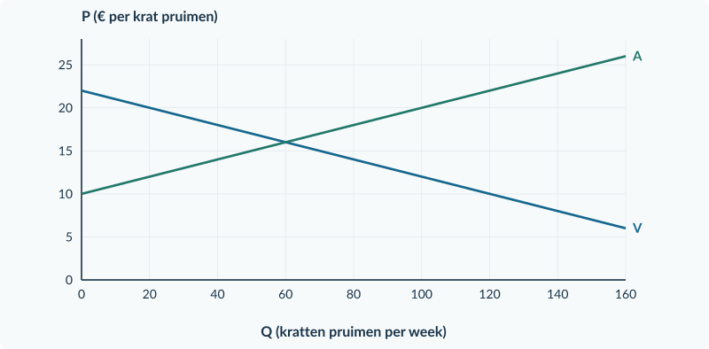
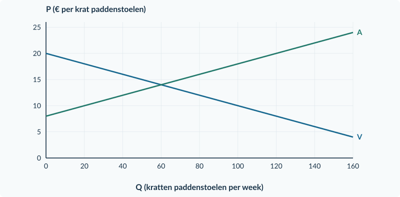

<!-- PAGE {"section": "3.1.5", "title": "Een prijs beschermen", "origin_chapter": "3.1", "origin_page": 35, "edition_page": 35} -->

3.1.5 · MINIMUMPRIJS EN QUOTA

# Een prijs beschermen

Appeltelers ontvangen in een oefenmarkt € 8 per krat. Een regeling verbiedt verkopen onder € 10. De hogere toegestane opbrengst lokt meer aanbod uit, terwijl kopers juist minder willen kopen.

Wie neemt het overschot af? Dat volgt niet uit het woord “minimumprijs”. De bron moet zeggen of de overheid producten opkoopt.

<b>Lesdoelen</b> Je kunt binding, vraag, aanbod en aanbodoverschot bij een minimumprijs bepalen. Je kunt bij een expliciete aankoopgarantie de overheidsaankopen en uitgaven berekenen. Je kunt deze regeling onderscheiden van een productiequotum.

<b>Minimumprijs</b> De laagste toegestane verkoopprijs. Een minimumprijs <b>boven de vrije evenwichtsprijs</b> is in ons model bindend. Een lagere minimumprijs laat het vrije evenwicht toe.

<figure><figcaption>Figuur 1. Bij Pmin = € 10 zijn Qv = 40 en Qa = 80. In de getekende aankoopregeling koopt de overheid 40 kratten; U = 40 × € 10.</figcaption></figure>

De oorspronkelijke vraaglijn beschrijft hier de **particuliere kopers**. Hun aankopen zijn dus niet hetzelfde als alle verkopen wanneer de overheid ook koopt.

<b>Aanbod is nog geen verkoop</b> Zonder aankoopgarantie zijn 80 aangeboden kratten niet automatisch 80 verkochte kratten. Met een garantie kan de overheid het verschil tussen Qa en Qv afnemen.

<!-- PAGE {"section": "3.1.5", "title": "Dezelfde minimumprijs, een andere aankoopregel", "origin_chapter": "3.1", "origin_page": 36, "edition_page": 36} -->

### Begin zonder aankoopgarantie

In de appelmarkt is Pmin = € 10. Er worden **40 kratten gevraagd** en **80 aangeboden**. Zonder andere afnemers worden alleen de 40 kratten verkocht die particuliere kopers willen hebben.

<figure><figcaption>Figuur 2. Zonder opkoop: Qv = 40 is de werkelijke verkoop; Qa = 80 is het gewenste aanbod bij € 10. Het aanbodoverschot is 40 kratten, geen overheidsaankoop.</figcaption></figure>

De aanbodlijn vertelt wat telers **willen aanbieden bij een prijs**. Ze bewijst niet dat alle 80 kratten daadwerkelijk worden gemaakt en verkocht. Neem ook niet aan dat de overheid de ontbrekende koper is.

### Voeg nu alleen de opkoopbelofte toe

De overheid belooft elk aangeboden krat dat particulieren niet kopen, tegen € 10 over te nemen. Nu vinden alle aangeboden kratten een afnemer: 40 bij particuliere kopers en 40 bij de overheid.

| Uitkomst per week | Zonder opkoop | Met volledige opkoop |
|---|---:|---:|
| Werkelijke particuliere aankopen | 40 kratten | 40 kratten |
| Overheidsaankopen | 0 kratten | 40 kratten |
| Totale verkopen | 40 kratten | 80 kratten |
| Overheidsuitgaven | € 0 | 40 × € 10 = € 400 |

<b>Lees het extra zinnetje in de bron</b> De prijs en functies blijven gelijk, maar de overheid wordt een extra koper. De uitgavenrechthoek hoort bij de opkoopbelofte, niet bij elke minimumprijs.

<!-- PAGE {"section": "3.1.5", "title": "Een prijsgrens is geen quotum", "origin_chapter": "3.1", "origin_page": 37, "edition_page": 37} -->

### Een quotum begrenst de hoeveelheid

Een **productiequotum** is een maximaal toegestane productie. Stel dat de prijsregeling vervalt en telers samen maximaal 40 kratten mogen produceren. Alle 40 worden geproduceerd en verkocht; de productierechten zijn gratis verdeeld. Er zijn geen overheidsaankopen.

<figure><figcaption>Figuur 3. Het quotum beperkt de productie tot 40. Lees de marktprijs bij deze hoeveelheid op V af: € 10. De overheid koopt hier niets.</figcaption></figure>

Bij deze hoeveelheid willen kopers € 10 betalen. Dat is hoger dan de oorspronkelijke vrije prijs. Een quotum zet dus niet rechtstreeks een minimumprijs vast, maar beperkt het aanbod. Het kan zo wél de marktprijs verhogen.

<b>Controleer ook het quotum</b> Een quotum van 80 kratten zou hier niet binden: het vrije evenwicht is maar 60. Je produceert dan niet automatisch 80 en leest de prijs dus niet klakkeloos bij 80 af.

### Waarom lees je de prijs op de vraaglijn?

De productiegrens bepaalt hier dat er 40 kratten worden verkocht. De vraaglijn vertelt welke prijs particuliere kopers voor dat aantal willen betalen. Bij € 10 vragen zij precies 40 kratten.

Op A staat bij Q = 40 juist € 6. Dat is de marginale kost van die hoeveelheid in dit model, niet de verkoopprijs. Het quotum voorkomt dat de productie door kan groeien tot het vrije evenwicht.

<b>Niet dezelfde regel</b> Een minimumprijs verbiedt lage prijzen. Een quotum verbiedt te veel productie. Dat beide in dit voorbeeld tot een prijs van € 10 leiden, maakt de mechanismen niet hetzelfde.

<!-- PAGE {"section": "3.1.5", "title": "Twee maatregelen vergelijken", "origin_chapter": "3.1", "origin_page": 38, "edition_page": 38} -->

## Uitgewerkt voorbeeld

**Appelkratten.** Vraag P = 14 − 0,10Q; aanbod P = 2 + 0,10Q. Q is kratten per week. Vrij evenwicht: 14 − 0,10Q = 2 + 0,10Q → Q₀ = 60 en P₀ = € 8.

**1 · Minimumprijs controleren.** Pmin = € 10 ligt boven € 8 en bindt.

**2 · Gewenste hoeveelheden berekenen.**

10 = 14 − 0,10Qv → Qv = 40 10 = 2 + 0,10Qa → Qa = 80 Aanbodoverschot = 80 − 40 = 40 kratten

**3 · De aankoopregel toepassen.** Zonder opkoop zijn er 40 particuliere verkopen. Bij volledige opkoop tegen € 10 koopt de overheid 40 kratten. U = 10 × 40 = **€ 400 per week**. Telers verkopen dan alle 80 kratten.

**4 · Vervang de prijsregeling door een quotum.** Een productiequotum van 40 ligt onder het vrije aantal 60 en bindt. Alle 40 toegestane kratten worden verkocht. De prijs volgt uit de vraag: P = 14 − 0,10 × 40 = **€ 10**. Er is geen aankoopgarantie en U = € 0.

| Uitkomst per week | Minimum + volledige opkoop | Alleen quotum 40 |
|---|---:|---:|
| Particuliere aankopen | 40 kratten | 40 kratten |
| Totale productie en verkoop | 80 kratten | 40 kratten |
| Overheidsaankopen | 40 kratten | 0 kratten |
| Overheidsuitgaven | € 400 | € 0 |

<b>Onthouden</b> Minimumprijs: eerst binding, dan Qv en Qa, dan de aankoopregel. Quotum: eerst binding, dan de toegestane verkochte hoeveelheid en de prijs op V. Veronderstel nooit automatisch opkoop of overheidsinkomsten.

## Startopgaven

<b>Korte route:</b> Startopgaven → Zelfstandige oefening → Doeloefening. Extra hulp nodig? Maak eerst Begeleide inoefening.

<b>Opgave 37 · Vraag en aanbod terughalen</b>

Qv = 100 − 5P en Qa = 5P − 20. Q is kratten per week; P is euro per krat.

<b>a.</b> Bereken het vrije evenwicht en bepaal bij P = € 14 het aanbodoverschot.

<b>Opgave 38 · Een toegestane prijs</b>

De vrije marktprijs is € 12. De minimumprijs wordt € 9.

<b>a.</b> Welke marktprijs blijft gelden? Leg uit waarom.

<!-- PAGE {"section": "3.1.5", "title": "Lees wat de overheid belooft", "origin_chapter": "3.1", "origin_page": 39, "edition_page": 39} -->

## Begeleide inoefening

Heb je deze hulp niet nodig? Ga dan verder met Zelfstandige oefening.

<b>Opgave 39 · Het overschot afnemen</b>

Gebruik de appelgrafiek op pagina 35. De overheid garandeert daar volledige opkoop van het aanbodoverschot.

<b>a.</b> Lees het aantal particuliere aankopen, de aangeboden hoeveelheid en het aantal overheidsaankopen af.

<b>b.</b> Bereken de oppervlakte U. Waarom is de basis niet de totale hoeveelheid 80?

<b>c.</b> Welke hoeveelheid blijft zeker niet automatisch verkocht als de opkoopgarantie vervalt?

Extra steun voor de quotumvraag 40c vind je in opgave 40A. Die kun je zo nodig eerst maken.

<b>Opgave 40 · Perenkratten</b>

Vraag P = 18 − 0,10Q; aanbod P = 6 + 0,10Q. Het vrije evenwicht is Q₀ = 60, P₀ = € 12. De minimumprijs is € 14. De overheid koopt elk aangeboden krat dat particulieren niet afnemen, tegen € 14. Q is kratten per week.

<b>a.</b> Vul eerst in: 14 = 18 − 0,10Qv → …; 14 = 6 + 0,10Qa → … . Bepaal het aanbodoverschot.

<b>b.</b> Teken Pmin en markeer Qv en Qa. Arceer de uitgavenrechthoek en bereken U.

<b>c.</b> Vervang de hele regeling door alleen een quotum van 40. Alle 40 kratten worden verkocht en er is geen opkoop. Bepaal prijs, particuliere verkopen en U.

<figure><figcaption>Figuur 4. Basisgrafiek bij opgave 40. Particuliere vraag en overheidsaankopen zijn verschillende dingen.</figcaption></figure>

<!-- PAGE {"section": "3.1.5", "title": "De quotumroute apart oefenen", "origin_chapter": "3.1", "origin_page": 40, "edition_page": 40} -->

### Begeleide inoefening · vervolg

Bij opgave 40 vergeleek je twee regelingen. Oefen hier desgewenst eerst de quotumroute afzonderlijk, voordat je de combinatie zelfstandig maakt.

<b>Opgave 40A · Eerst alleen een quotum</b>

Verschillende aanbieders verkopen paprikakratten. Vraag: P = 26 − 0,20Q. Aanbod: P = 8 + 0,10Q. P is euro per krat; Q is kratten per week. Het vrije evenwicht is Q₀ = 60 en P₀ = € 14. Er komt uitsluitend een productiequotum van 40 kratten. De rechten zijn gratis verdeeld. Alle 40 toegestane kratten worden geproduceerd en verkocht; er is geen overheidsopkoop.

<b>a.</b> Vergelijk het quotum met Q₀. Waarom bindt de maatregel? Welke hoeveelheid wordt werkelijk verkocht?

<b>b.</b> Vul in: P = 26 − 0,20 × … = … . Teken de quotumgrens in de basisgrafiek en markeer de verkoopprijs op de vraaglijn. Bereken ook het bedrag op A bij Q = 40. Waarom is dat niet de verkoopprijs?

<b>c.</b> Nu vervangt een quotum van 80 kratten de grens van 40. De rest blijft gelijk. Bepaal de werkelijke hoeveelheid, de marktprijs en de overheidsuitgaven. Beoordeel: “Een quotum van 80 betekent dat er 80 worden geproduceerd.”

<figure><figcaption>Figuur 5. Basisgrafiek bij opgave 40A. Teken zelf de productiegrens en zoek daarna de prijs waarbij kopers die hoeveelheid afnemen.</figcaption></figure>

<b>Drie controlevragen</b> Beperkt het quotum de vrije hoeveelheid? Wordt de toegestane hoeveelheid volgens de bron helemaal verkocht? Welke lijn vertelt wat kopers daarvoor betalen? Een quotum is een maximum, geen productieplicht.

<!-- PAGE {"section": "3.1.5", "title": "Aankopen en quota uit elkaar houden", "origin_chapter": "3.1", "origin_page": 41, "edition_page": 41} -->

## Zelfstandige oefening

<b>Opgave 41 · Pruimenkratten</b>

Vraag P = 22 − 0,10Q; aanbod P = 10 + 0,10Q. Q is kratten per week. De minimumprijs is € 18. De overheid koopt het volledige aanbodoverschot tegen deze prijs.

<b>a.</b> Bereken het vrije evenwicht. Bereken bij de minimumprijs Qv, Qa en het aanbodoverschot.

<b>b.</b> Bereken de totale verkoop door telers, de overheidsaankopen en U. Teken de uitgavenrechthoek in de basisgrafiek.

<b>c.</b> Vervang de minimumprijs én opkoop door alleen een bindend quotum van 40. Alle 40 kratten worden verkocht. Bereken de marktprijs en vergelijk de productie met de opkoopregeling.

<figure><figcaption>Figuur 6. Basisgrafiek bij opgave 41. Begin voor de quotumvergelijking opnieuw, zonder de minimumprijsregeling.</figcaption></figure>

<b>Opgave 42 · Geen opkoop afgesproken</b>

Een bron noemt een minimumprijs waarbij Qv = 30 en Qa = 70. Een tweede bron noemt gratis verdeelde productiequota. Geen van beide bronnen noemt betalingen door of aan de overheid.

<b>a.</b> Hoeveel producten worden in de eerste bron zonder opkoop of andere afnemers verkocht? Hoe groot is het aanbodoverschot?

<b>b.</b> Waarom mag je bij geen van beide bronnen automatisch een bedrag aan overheidsuitgaven of inkomsten berekenen?

<!-- PAGE {"section": "3.1.5", "title": "Een garantie voor paddenstoelentelers", "origin_chapter": "3.1", "origin_page": 42, "edition_page": 42} -->

## Doeloefening

<b>Opgave 43 · Paddenstoelen in kratten</b>

Vraag P = 20 − 0,10Q; aanbod P = 8 + 0,10Q. Q is kratten per week; P is euro per krat. Regeling A voert een minimumprijs van € 16 in. De overheid koopt elk aangeboden krat dat particulieren niet kopen, tegen € 16. De telers leveren samen de aangeboden hoeveelheid.

<b>a.</b> Bereken het vrije evenwicht en leg uit of de minimumprijs bindt.

<b>b.</b> Bereken bij € 16 de particuliere vraag, het aanbod, het aanbodoverschot en de totale verkoop door telers.

<b>c.</b> Bereken de overheidsaankopen en de overheidsuitgaven per week. Markeer in de grafiek Pmin, Qv, Qa en de uitgavenrechthoek.

<b>d.</b> Regeling B vervangt A volledig: een productiequotum van 40 kratten. Alle 40 worden verkocht; de rechten zijn gratis verdeeld en de overheid koopt niets. Bereken de marktprijs, totale productie en overheidsuitgaven.

<b>e.</b> Een teler zegt: “Omdat beide regelingen dezelfde prijs geven, zijn ze economisch hetzelfde.” Beoordeel met twee berekende verschillen.

<figure><figcaption>Figuur 7. Basisgrafiek bij de doeloefening. Scheid de berekeningen van regeling A en regeling B.</figcaption></figure>

<!-- PAGE {"section": "3.1.5", "title": "Een begrotingsbedrag is nog geen oordeel", "origin_chapter": "3.1", "origin_page": 43, "edition_page": 43} -->

## Denkertje / Bonusopgave

<b>Opgave 44 · Is de hele rekening verlies?</b>

Bij opgave 43 koopt de overheid 40 kratten voor € 16 per krat. Een bestuurder zegt: “Dat kost € 640; dus het welvaartsverlies is precies € 640.” Er staat niets over het gebruik van de kratten, de waarde daarvan voor ontvangers of eventuele opslagkosten.

<b>a.</b> Leg uit waarom een overheidsuitgave niet zonder verdere informatie hetzelfde is als welvaartsverlies.

<b>b.</b> Noem twee soorten informatie die je nodig hebt voor een zorgvuldig welvaartsoordeel over deze aankopen. Je hoeft geen nieuwe welvaartsformule te gebruiken.

<b>Bronnen begrenzen je conclusie</b> Je kunt de betaling van € 640 precies berekenen. Je kunt zonder extra gegevens niet precies bepalen wat er met de goederen gebeurt en wat de maatschappelijke waarde daarvan is. Houd die twee uitspraken uit elkaar.

## Herhaling / Herhaling en interleaving

<b>Opgave 45 · Een prijsreactie meten</b>

De prijs van een product stijgt van € 8 naar € 10. De gevraagde hoeveelheid daalt van 80 naar 70 per week. Andere vraagfactoren blijven gelijk.

<b>a.</b> Bereken Ev met de oude waarden als basis. Classificeer de vraag.

<b>b.</b> Bereken de omzet vóór en na de prijsstijging. Leg uit waarom een omzetstijging geen bewijs van een hogere winst is.

### Kies het juiste onderscheid

Bij een **prijsgrens** vergelijk je eerst met de vrije prijs. Bij een **quotum** vergelijk je eerst met de vrije hoeveelheid. Daarna pas onderzoek je de feitelijke transacties en de geldstromen.

<b>Klaar voor combineren</b> Je kent nu belasting, subsidie, maximumprijs, minimumprijs en quotum. In de gemengde opgaven staat niet bij elke berekening welk model je moet gebruiken. Lees daarom eerst wat de maatregel werkelijk doet.

