<!-- PAGE {"section": "3.1", "title": "Antwoorden"} -->

4VECO · ECONOMIE · 4 VWO · BOEK 3

# Antwoorden Overheidsingrijpen

Dit antwoordboek hoort bij het leerlinghoofdstuk van 48 pagina’s. Het bevat de uitwerkingen van alle 51 opgaven. De vijf uitgewerkte voorbeelden staan in het leerlinghoofdstuk zelf.

<b>Gebruik bij het nakijken</b> Vergelijk niet alleen het eindgetal. Controleer welke prijs en hoeveelheid zijn gebruikt, welke partij betaalt en waarom een oppervlakte iets over surplus of het overheidsbudget zegt.

| Paragraaf | Opgaven | Uitwerkingen vanaf |
|---|---|---:|
| 3.1.1 Belastingen | 1–9 | 2 |
| 3.1.2 Belastingdruk en welvaartsverlies | 10–18 | 7 |
| 3.1.3 Subsidies | 19–27, incl. 22A | 11 |
| 3.1.4 Maximumprijs | 28–36 | 17 |
| 3.1.5 Minimumprijs en quota | 37–45, incl. 40A | 22 |
| 3.1.6 Gemengde opgaven | 46–48, incl. 47A | 28 |

### Notatie en afronding

Pc = de kopersprijs. Pp = de verkopersontvangst na belasting of inclusief subsidie, maar vóór productiekosten. Qt en Qsub zijn de verkochte hoeveelheden mét belasting of subsidie; Qv en Qa zijn vraag en aanbod. O zijn overheidsontvangsten; U zijn overheidsuitgaven; W is welvaartsverlies.

Reken tussentijds ongerond. Rond eurobedragen en percentages zo nodig op twee decimalen af. Elasticiteiten hebben geen eenheid. Hoeveelheden hebben wel een product- en zo nodig tijdseenheid.

### Grafieken en verklaringen

Gelijkwaardige, correct gelabelde grafieken zijn goed. Een andere kleur of arcering is geen fout. Een verklaring is goed wanneer de gebruikte gegevens en het economische gevolg logisch aan elkaar verbonden zijn. De bonusantwoorden zijn voorbeelden; hun beoordelingscriteria geven de vereiste inhoud aan.

Dit zijn nieuw geschreven oefenopgaven op basis van de door de gebruiker aangeleverde outlines v2. Het zijn geen overgenomen officiële examenvragen en de uitwerkingen zijn geen officieel correctievoorschrift.

Herziene editie. Toegevoegde opgaven: 22A, 40A en 47A. Bonus 17 is herschreven. De zes doeloefeningen en hun antwoorden zijn ongewijzigd.

<!-- PAGE {"section": "3.1.1", "title": "Start en begeleide inoefening"} -->

<h3>Opgave 1 · Evenwicht terughalen</h3>
<b>a.</b> 12 − 0,10Q = 4 + 0,10Q → 8 = 0,20Q → Q₀ = <b>40 sleutelhangers per dag</b>. P₀ = 12 − 0,10 × 40 = <b>€ 8 per stuk</b>.

<b>Waarom:</b> Zonder maatregel ontvangen beide kanten dezelfde prijs; de gewenste hoeveelheden zijn gelijk.

<b>b.</b> P = 4 + 0,10 × 30 = <b>€ 7 per stuk</b>.

<b>Waarom:</b> Je vult het aantal in de aanbodfunctie in. Dit is nog geen nieuw evenwicht.

<h3>Opgave 2 · Wie draagt af?</h3>
<b>a.</b> t = Pc − Pp = 9 − 6 = <b>€ 3 per product</b>.

<b>Waarom:</b> De belasting is het verschil tussen wat de koper betaalt en wat de verkoper na afdracht overhoudt.

<b>b.</b> Nee. Voor de last van kopers heb je Pc − P₀ nodig; voor verkopers P₀ − Pp. <b>P₀ ontbreekt.</b>

<b>Waarom:</b> De wig geeft de totale belasting, niet de verdeling ten opzichte van de oude prijs.

<h3>Opgave 3 · Lees de geldstroom</h3>
<b>a.</b> Q₀ = 60 en Qt = 40 fruitbekers per dag; P₀ = € 8, Pc = € 10 en Pp = € 6 per beker. <b>Pc en Pp horen beide bij Qt = 40.</b>

<b>Waarom:</b> Elke verkochte beker heeft een betaald en een na belasting overgehouden bedrag.

<b>b.</b> A + t geeft de benodigde <b>kopersprijs inclusief belasting</b>. Pp lees je op de oorspronkelijke A af: € 6.

<b>Waarom:</b> Op A + t zit de af te dragen € 4 er al bij.

<b>c.</b> € 12 gebruiken als Pc geeft Qv = (14 − 12)/0,10 = 20, terwijl bij Pp = 12 − 4 = € 8 het aanbod Qa = (8 − 2)/0,10 = 60 is. Dat is geen evenwicht. De juiste Pc is € 10 bij Q = 40.

<b>Waarom:</b> De prijs past zich aan via vraag én aanbod; je telt niet zonder meer de belasting op bij P₀.

<!-- PAGE {"section": "3.1.1", "title": "Begeleide inoefening · uitwerking"} -->

<h3>Opgave 4 · Posters</h3>
<b>a.</b> Pc = Pp + <b>4</b> = <b>8</b> + 0,10Q.

<b>Waarom:</b> Verkopers moeten boven op hun gewenste ontvangst de belasting kunnen afdragen.

<b>b.</b> 16 − 0,10Q = 8 + 0,10Q → 8 = 0,20Q → Qt = <b>40 posters per week</b>. Pc = 16 − 0,10 × 40 = <b>€ 12</b>; Pp = 4 + 0,10 × 40 = <b>€ 8 per poster</b>.

<b>Waarom:</b> Gebruik de twee oorspronkelijke functies bij dezelfde nieuwe Q.

<b>c.</b> A + t begint bij € 8 en loopt evenwijdig aan A. Markeer Q = 40, Pc = € 12 en Pp = € 8; zie de oplossingsgrafiek.

<b>Waarom:</b> De verticale afstand is de belasting per poster.

<b>d.</b> Controle: 12 − 8 = <b>€ 4</b>. De hogere kopersprijs en lagere verkopersontvangst maken dat minder posters worden gevraagd en aangeboden.

<b>Waarom:</b> Een nieuw snijpunt vervangt het vrije evenwicht.

<figure>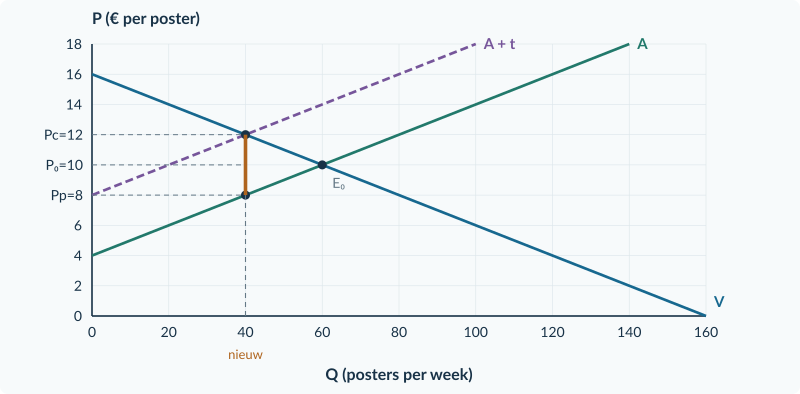<figcaption>Opgave 4: A + t, Qt = 40 en de prijzen € 12 en € 8.</figcaption></figure>

<!-- PAGE {"section": "3.1.1", "title": "Zelfstandige oefening"} -->

<h3>Opgave 5 · Mokken</h3>
<b>a.</b> 18 − 0,20Q = 6 + 0,10Q → 12 = 0,30Q → Q₀ = <b>40 mokken per dag</b>. P₀ = 18 − 0,20 × 40 = <b>€ 10 per mok</b>.

<b>Waarom:</b> Het vrije evenwicht gebruikt dezelfde prijs voor kopers en verkopers.

<b>b.</b> Nieuw aanbod: Pc = 9 + 0,10Q. 18 − 0,20Q = 9 + 0,10Q → Qt = <b>30 mokken per dag</b>. Pc = 18 − 0,20 × 30 = <b>€ 12</b>; Pp = 6 + 0,10 × 30 = <b>€ 9 per mok</b>.

<b>Waarom:</b> Pc − Pp = 12 − 9 = € 3; de belasting past precies tussen beide prijzen.

<b>c.</b> A + t start bij € 9. Markeer de twee punten (30; 12) en (30; 9) en de verticale wig. De grafiek hieronder toont de uitwerking.

<b>Waarom:</b> De belasting verschuift A in kopersprijzen, niet de betalingsbereidheid.

<b>d.</b> Van de € 12 betaling gaat € 3 naar de overheid; de verkoper houdt € 9 over. Eerst betaalde en ontving men € 10.

<b>Waarom:</b> Een grotere betaling hoeft geen grotere netto-ontvangst voor verkopers te zijn.

<figure>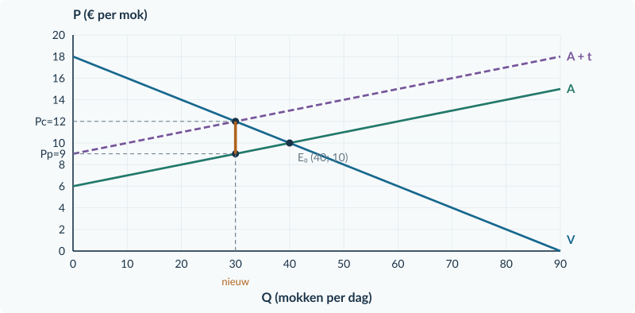<figcaption>Opgave 5: de belasting verlaagt Q van 40 naar 30. De twee prijzen liggen € 3 uit elkaar.</figcaption></figure>

<h3>Opgave 6 · Twee bedragen veranderen</h3>
<b>a.</b> Koper: 9 − 7 = <b>€ 2 meer</b>. Verkoper: 7 − 6 = <b>€ 1 minder</b>. t = 9 − 6 = <b>€ 3 per product</b>.

<b>Waarom:</b> Beide veranderingen tellen samen op tot de belastingwig.

<b>b.</b> Onjuist. De koper draagt € 2, maar de verkoper draagt nog € 1. De belasting is € 3 per product.

<b>Waarom:</b> Last voor één groep en totale belasting zijn verschillende grootheden.

<!-- PAGE {"section": "3.1.1", "title": "Doeloefening"} -->

<h3>Opgave 7 · Bedrukte tassen</h3>
<b>a.</b> 20 − 0,20Q = 2 + 0,10Q → 18 = 0,30Q → Q₀ = <b>60 tassen per dag</b>. P₀ = 20 − 0,20 × 60 = <b>€ 8 per tas</b>.

<b>Waarom:</b> Zonder belasting zijn vraag en aanbod gelijk bij één prijs.

<b>b.</b> Pc = Pp + 3 = <b>5 + 0,10Q</b>. 20 − 0,20Q = 5 + 0,10Q → 15 = 0,30Q → Qt = <b>50 tassen per dag</b>.

<b>Waarom:</b> De € 3 wordt aan de aanbodfunctie in kopersprijzen toegevoegd.

<b>c.</b> Pc = 20 − 0,20 × 50 = <b>€ 10</b>. Pp = 2 + 0,10 × 50 = <b>€ 7 per tas</b>. Controle: 10 − 7 = € 3.

<b>Waarom:</b> De prijzen horen bij dezelfde 50 verkochte tassen.

<b>d.</b> Teken A + t met prijsas-snijding € 5. Markeer (50; 10) op V en (50; 7) op A; verbind de punten verticaal.

<b>Waarom:</b> Op A + t lees je niet af wat na afdracht voor de verkoper overblijft.

<b>e.</b> Onjuist. De koper betaalt 10 − 8 = <b>€ 2 meer</b>; de verkoper houdt 8 − 7 = <b>€ 1 minder</b> over. De verkoper draagt € 3 af, maar draagt economisch € 1 per tas.

<b>Waarom:</b> Afdragen is een betalingshandeling; dragen vergelijkt met de oude prijs.

<figure>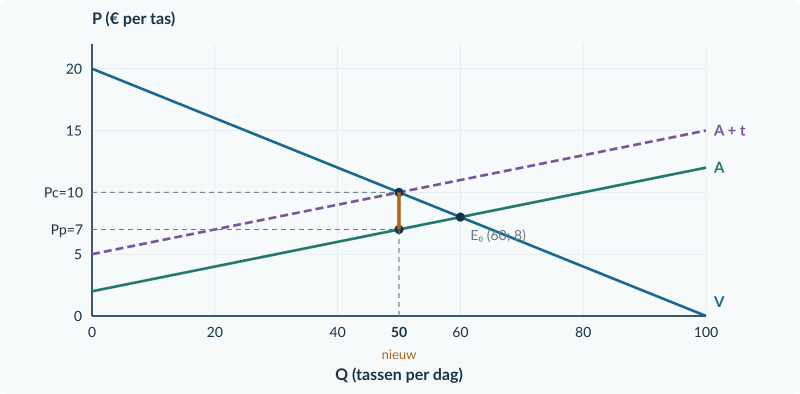<figcaption>Opgave 7: kopers betalen € 10, verkopers ontvangen € 7; er worden 50 tassen verkocht.</figcaption></figure>

<!-- PAGE {"section": "3.1.1", "title": "Bonus en herhaling"} -->

<h3>Opgave 8 · De koper draagt af</h3>
<b>a.</b> De uitkomst verandert onder de gegeven voorwaarden niet. Pc − Pp blijft € 4. 16 − 0,10Q = 4 + 0,10Q + 4 → Q = <b>40 producten</b>; Pc = <b>€ 12</b>; Pp = <b>€ 8 per product</b>.

<b>Waarom:</b> Kopers reageren op hun totale betaling; verkopers op hun ontvangst. De belastingwig is gelijk gebleven.

<b>b.</b> Geldstroom: <b>koper → verkoper: € 8</b>; <b>koper → overheid: € 4</b>. De koper betaalt samen € 12. Verkopers ontvangen € 8.

<b>Waarom:</b> Hetzelfde totale belastingbedrag kan langs een andere betalingsroute lopen.

<b>Beoordelingscriteria bonus</b> Een goed antwoord behoudt dezelfde wig, noemt dezelfde marktuitkomst en laat de nieuwe geldstromen optellen tot de totale kopersbetaling.

<h3>Opgave 9 · Prijs en gevraagde hoeveelheid</h3>
<b>a.</b> %ΔP = (12 − 10)/10 × 100% = <b>+20%</b>. %ΔQv = (180 − 200)/200 × 100% = <b>−10%</b>.

<b>Waarom:</b> De oude waarden zijn de basis; een daling krijgt een minteken.

<b>b.</b> Ev = −10% / +20% = <b>−0,5</b>. |Ev| = 0,5 &lt; 1: <b>prijsinelastisch</b>.

<b>Waarom:</b> De hoeveelheid verandert procentueel minder sterk dan de prijs.

<b>Hulp bij herstel</b> Loopt opgave 9 vast? Herhaal de procentberekening en de indeling van prijselasticiteit uit §2.2.1 van Boek 2.

<!-- PAGE {"section": "3.1.2", "title": "Start en begeleide inoefening"} -->

<h3>Opgave 10 · Surplus terughalen</h3>
<b>a.</b> CS = ½ × 40 × (18 − 10) = <b>€ 160</b>. PS = ½ × 40 × (10 − 6) = <b>€ 80</b>. Basis: 40 producten; hoogten: € 8 en € 4 per product.

<b>Waarom:</b> Het product van aantal en euro per product geeft euro, niet euro per product.

<h3>Opgave 11 · Geld of gemiste handel?</h3>
<b>a.</b> W = 500 − 470 = <b>€ 30</b>. De € 120 is een overheidsontvangst, geen volledig verdwenen voordeel.

<b>Waarom:</b> Een geldstroom is niet hetzelfde als het verlies aan gezamenlijke voordelen van handel.

<h3>Opgave 12 · Lees het belastingplaatje</h3>
<b>a.</b> CS ligt boven Pc = € 10 en onder V; PS onder Pp = € 6 en boven A. O is de rechthoek tussen € 6 en € 10 tot Q = 40; W ligt tussen Q = 40 en Q = 60.

<b>Waarom:</b> Elke oppervlakte heeft een eigen economische betekenis.

<b>b.</b> O = 40 × 4 = <b>€ 160 per dag</b>. W = ½ × (60 − 40) × 4 = <b>€ 40 per dag</b>.

<b>Waarom:</b> O gebruikt verkochte eenheden; W gebruikt de gemiste eenheden.

<b>c.</b> Tussen Pc en Pp zit boven de verkochte hoeveelheid de belastingopbrengst. Alleen de driehoek van weggevallen voordelige transacties is W.

<b>Waarom:</b> De overheid ontvangt geld over handel die nog wel plaatsvindt.

<h3>Opgave 13 · Kaartensets</h3>
<b>a.</b> <table><tr><th>Grootheid (€ per dag)</th><th>Zonder</th><th>Met</th></tr><tr><td>CS</td><td>½ × 60 × (16 − 10) = 180</td><td>½ × 40 × (16 − 12) = 80</td></tr><tr><td>PS</td><td>½ × 60 × (10 − 4) = 180</td><td>½ × 40 × (8 − 4) = 80</td></tr><tr><td>O</td><td>0</td><td>4 × 40 = 160</td></tr><tr><td>CS + PS + O</td><td>360</td><td>320</td></tr></table>

<b>Waarom:</b> De verkochte hoeveelheid is de basis van de driehoeken; de relevante prijs bepaalt de hoogte.

<b>b.</b> O = <b>€ 160 per dag</b>. W = 360 − 320 = <b>€ 40 per dag</b>. Controle: ½ × (60 − 40) × 4 = € 40.

<b>Waarom:</b> Het verlies aan CS en PS is € 200, maar daarvan ontvangt de overheid € 160.

<b>c.</b> Onjuist. € 2 koperslast + € 2 verkoperslast = <b>€ 4 belasting per set</b>. De overheid ontvangt de hele € 4 bij iedere verkoop.

<b>Waarom:</b> De verdeling van de last verandert niet het bedrag dat wordt afgedragen.

<!-- PAGE {"section": "3.1.2", "title": "Zelfstandige oefening"} -->

<h3>Opgave 14 · Stickerpakketten</h3>
<b>a.</b> Koperslast = 12 − 10 = <b>€ 2</b>; verkoperslast = 10 − 8 = <b>€ 2 per pakket</b>. Afwenteling = 2/4 × 100% = <b>50%</b>.

<b>Waarom:</b> Beide lasten worden met de oude prijs vergeleken.

<b>b.</b> Oud: CS = ½ × 60 × 6 = € 180 en PS = ½ × 60 × 6 = € 180. Nieuw: CS = ½ × 40 × 4 = € 80 en PS = ½ × 40 × 4 = € 80. O = 4 × 40 = € 160. W = 360 − (80 + 80 + 160) = <b>€ 40 per week</b>.

<b>Waarom:</b> De belastingopbrengst blijft onderdeel van de welvaartsmaat.

<b>c.</b> Markeer Qt = 40, Pc = € 12 en Pp = € 8. O is een rechthoek met breedte 40 en hoogte € 4. W heeft basis 20 en hoogte € 4.

<b>Waarom:</b> Je arceert de budgetoverdracht en de gemiste transacties verschillend.

<figure>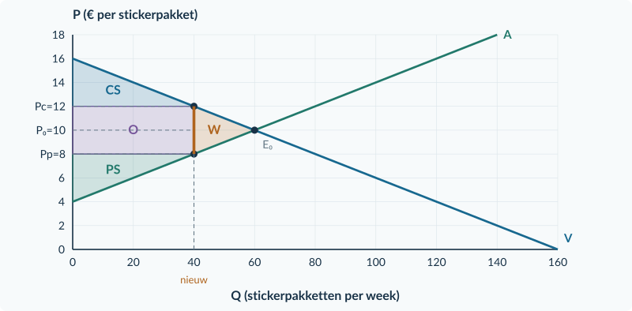<figcaption>Opgave 14: O = € 160; W = € 40 per week.</figcaption></figure>

<h3>Opgave 15 · Niet even prijsgevoelig</h3>
<b>a.</b> In <b>markt Y</b>. Kopers kunnen daar minder makkelijk op een hogere prijs reageren. Bij gelijk aanbod kan een groter deel via de prijs bij hen terechtkomen.

<b>Waarom:</b> De minder prijsgevoelige kant draagt relatief meer last.

<b>b.</b> De afdrachtregel is in beide markten dezelfde en zegt niet hoe prijzen veranderen.

<b>Waarom:</b> Economische belastingdruk volgt uit de aanpassing van beide kanten van de markt.

<!-- PAGE {"section": "3.1.2", "title": "Doeloefening"} -->

<h3>Opgave 16 · Bedrukte tassen: wie betaalt?</h3>
<b>a.</b> Koper: 10 − 8 = <b>€ 2 per tas</b>. Verkoper: 8 − 7 = <b>€ 1 per tas</b>. Afwenteling = 2/3 × 100% = <b>66,67%</b>.

<b>Waarom:</b> Samen dragen beide kanten € 3 per verkochte tas.

<b>b.</b> O = t × Qt = 3 × 50 = <b>€ 150 per dag</b>.

<b>Waarom:</b> De belasting wordt over de 50 daadwerkelijke verkopen geheven.

<b>c.</b> Oud: CS = ½ × 60 × (20 − 8) = € 360; PS = ½ × 60 × (8 − 2) = € 180. Nieuw: CS = ½ × 50 × (20 − 10) = € 250; PS = ½ × 50 × (7 − 2) = € 125. Nieuwe maat = 250 + 125 + 150 = <b>€ 525</b>. W = (360 + 180) − 525 = <b>€ 15 per dag</b>.

<b>Waarom:</b> Verlies aan privaat surplus is deels een overdracht naar de overheid.

<b>d.</b> Zie de grafiek. O ligt tussen € 7 en € 10 tot Q = 50. W ligt tussen Q = 50 en Q = 60: basis 10 tassen, hoogte € 3 per tas. ½ × 10 × 3 = € 15.

<b>Waarom:</b> De basis van W is niet Qt maar de afname van de hoeveelheid.

<b>e.</b> Onjuist. Bij gelijk aanbod en dezelfde belasting leidt minder prijsgevoelige vraag juist tot een groter aandeel voor kopers.

<b>Waarom:</b> Wie minder makkelijk kan afzien van aankoop, kan de last minder makkelijk ontwijken.

<figure>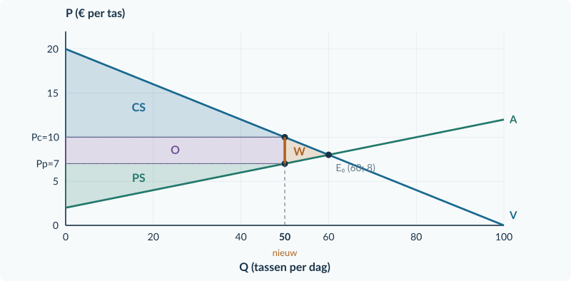<figcaption>Opgave 16: O is de rechthoek van € 150; de kleine driehoek W is € 15.</figcaption></figure>

<!-- PAGE {"section": "3.1.2", "title": "Bonus en herhaling"} -->

<h3>Opgave 17 · Kan de schaal de belastingdruk veranderen?</h3>
<b>a.</b> In beide grafieken is Qv bij € 8: (14 − 8) / 0,10 = <b>60 producten per week</b>. Bij € 9: (14 − 9) / 0,10 = <b>50 producten per week</b>. De prijsstijging is steeds 12,5%; de gevraagde hoeveelheid daalt steeds met 16,67%. De vraag is dus niet in één grafiek minder prijsgevoelig.

<b>Waarom:</b> De formule en economische getallen zijn gelijk. Alleen de hoeveelheid papier per euro op de verticale as verandert.

<b>b.</b> Nee. Voor de lastverdeling moet je de reactie van de vraag <b>ten opzichte van het aanbod</b> kennen. Om bedragen uit te rekenen heb je ook de belasting en de oorspronkelijke marktuitkomst nodig. Een andere asschaal verandert de vraagfunctie, het aanbod of de belasting niet.

<b>Waarom:</b> Een visueel steilere lijn door een andere schaal is geen verandering in gedrag. In de gecontroleerde vergelijking in de uitleg waren uitgangswaarden, aanbod en belasting wel gelijk gehouden.

<b>Beoordelingscriteria bonus</b> Het antwoord herkent identieke economische getallen bij andere asschalen, gebruikt procenten of aantallen consistent en benoemt de ontbrekende aanbodinformatie voor de lastverdeling.

<h3>Opgave 18 · Een bedrag per product</h3>
<b>a.</b> TO = 9 × 100 = <b>€ 900 per dag</b>. TK = 300 + 4 × 100 = <b>€ 700 per dag</b>. Winst = 900 − 700 = <b>€ 200 per dag</b>.

<b>Waarom:</b> Van de opbrengst moeten nog de totale kosten af.

<b>b.</b> € 9 is de ontvangst per verkocht product, niet wat er na alle kosten overblijft. Hier zijn de gemiddelde totale kosten 700/100 = € 7; de gemiddelde winst is € 2.

<b>Waarom:</b> Opbrengst en winst zijn niet uitwisselbaar.

<!-- PAGE {"section": "3.1.3", "title": "Start en begeleide inoefening"} -->

<h3>Opgave 19 · De wig terughalen</h3>
<b>a.</b> Belasting: Pp = Pc − t = 11 − 3 = <b>€ 8</b>. Subsidie: Pp = Pc + s = 11 + 3 = <b>€ 14 per product</b>.

<b>Waarom:</b> Belasting wordt afgedragen uit de betaling; subsidie komt erbovenop.

<h3>Opgave 20 · Voor alle verkochte plaatsen</h3>
<b>a.</b> U = s × Qsub = 2 × 60 = <b>€ 120 per week</b>. Niet 2 × 10 = € 20.

<b>Waarom:</b> Volgens de regeling krijgt elke verkochte plaats subsidie, ook een plaats die zonder subsidie zou zijn verkocht.

<h3>Opgave 21 · Lees de subsidie-uitkomst</h3>
<b>a.</b> Pc = <b>€ 10</b> en Pp = <b>€ 14 per plaats</b>. De aanbieder ontvangt € 10 van de koper plus € 4 van de gemeente.

<b>Waarom:</b> Pp is de totale ontvangst vóór productiekosten.

<b>b.</b> Voor dezelfde gewenste totale ontvangst van de aanbieder hoeft de koper € 4 minder te betalen. Daarom verschuift A in kopersprijzen omlaag.

<b>Waarom:</b> Er is geen verandering in wat kopers voor het product willen betalen.

<b>c.</b> Koper: 12 − 10 = <b>€ 2 voordeel</b>. Aanbieder: 14 − 12 = <b>€ 2 voordeel per plaats</b>.

<b>Waarom:</b> De subsidie wordt uitbetaald aan aanbieders, maar beide kanten profiteren via de prijzen.

<!-- PAGE {"section": "3.1.3", "title": "Begeleide inoefening · uitwerking"} -->

<h3>Opgave 22 · Muzieklesplaatsen</h3>
<b>a.</b> Pc = Pp − <b>4</b> = <b>6</b> + 0,10Q. 22 − 0,10Q = 6 + 0,10Q → Qsub = <b>80 lesplaatsen per week</b>. Pc = 22 − 0,10 × 80 = <b>€ 14</b>; Pp = 10 + 0,10 × 80 = <b>€ 18 per plaats</b>.

<b>Waarom:</b> Pp − Pc = 4; het aanbod in kopersprijzen is verlaagd.

<b>b.</b> A − s begint bij € 6. Markeer Q = 80 met de punten (80; 14) en (80; 18); zie de grafiek.

<b>Waarom:</b> De lagere lijn hoort bij de kopersprijs, de oorspronkelijke A bij de totale ontvangst.

<b>c.</b> U = 4 × 80 = € 320. CS = ½ × 80 × (22 − 14) = € 320. PS = ½ × 80 × (18 − 10) = € 320. Netto: 320 + 320 − 320 = <b>€ 320 per week</b>. Daling ten opzichte van € 360: <b>€ 40</b>.

<b>Waarom:</b> De subsidie-uitgaven moeten worden afgetrokken.

<figure>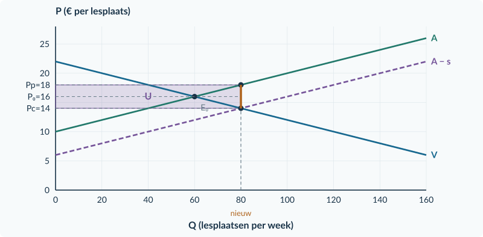<figcaption>Opgave 22: Qsub = 80, Pc = € 14 en Pp = € 18.</figcaption></figure>

<!-- PAGE {"section": "3.1.3", "title": "Extra steun bij de subsidieboekhouding"} -->

<h3>Opgave 22A · Eerst de drie rekeningen</h3>
<b>a.</b> CS = ½ × Qsub × (30 − Pc) = ½ × 70 × (30 − 16) = <b>€ 490</b>. PS = ½ × Qsub × (Pp − 6) = ½ × 70 × (20 − 6) = <b>€ 490</b>. U = s × Qsub = 4 × 70 = <b>€ 280</b>. CS + PS − U = 490 + 490 − 280 = <b>€ 700 per week</b>.

<b>Waarom:</b> Beide driehoeken hebben als basis de 70 werkelijk verkochte plaatsen. CS gebruikt Pc, PS de totale ontvangst Pp. De overheid betaalt voor alle 70 plaatsen.

<b>b.</b> CS stijgt met 490 − 360 = <b>€ 130</b>; PS ook met <b>€ 130</b>. Samen is dat € 260. De overheid betaalt € 280, dus <b>€ 20 meer</b> dan de gezamenlijke surpluswinst.

<b>Waarom:</b> De stijging van het particuliere surplus moet worden vergeleken met het bedrag dat daarvoor wordt betaald.

<b>c.</b> Via de welvaartsmaat: W = 720 − 700 = <b>€ 20 per week</b>. Via de driehoek: basis = 70 − 60 = 10 plaatsen per week; hoogte = s = € 4 per plaats. W = ½ × 10 × 4 = <b>€ 20 per week</b>.

<b>Waarom:</b> Bij deze rechte vraag- en aanbodlijnen vormt het nadeel van de extra transacties een driehoek. Beide routes beschrijven hetzelfde verlies.

<b>d.</b> De leerling telt de <b>60 plaatsen die ook zonder subsidie zouden zijn verkocht</b> niet mee. Ook die komen in aanmerking: 60 × 4 = € 240. Samen met 10 × 4 = € 40 is U = <b>€ 280 per week</b>.

<b>Waarom:</b> De bron noemt subsidie per verkochte plaats, niet alleen voor de extra verkopen.

<!-- PAGE {"section": "3.1.3", "title": "Zelfstandige oefening"} -->

<h3>Opgave 23 · Sportplaatsen</h3>
<b>a.</b> Nieuw aanbod: Pc = 3 + 0,10Q. 24 − 0,20Q = 3 + 0,10Q → Qsub = <b>70 plaatsen per week</b>. Pc = 24 − 0,20 × 70 = <b>€ 10</b>. Pp = 6 + 0,10 × 70 = <b>€ 13</b>. Markeer deze punten in de grafiek.

<b>Waarom:</b> De wig van € 3 vergroot de hoeveelheid ten opzichte van 60.

<b>b.</b> U = 3 × 70 = <b>€ 210</b>. CS = ½ × 70 × (24 − 10) = <b>€ 490</b>. PS = ½ × 70 × (13 − 6) = <b>€ 245 per week</b>.

<b>Waarom:</b> De nieuwe verkochte hoeveelheid is de basis; beide kanten gebruiken hun eigen prijs.

<b>c.</b> CS + PS − U = 490 + 245 − 210 = <b>€ 525 per week</b>. W = 540 − 525 = <b>€ 15 per week</b>. Er zijn geen baten voor buitenstaanders meegeteld.

<b>Waarom:</b> Zonder zulke baten kosten de extra transacties voorbij het vrije evenwicht meer dan hun betalingsbereidheid.

<figure>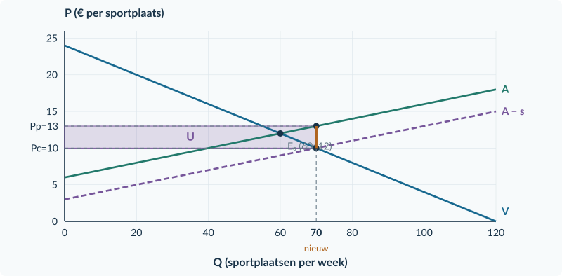<figcaption>Opgave 23: de subsidie maakt Pc lager en Pp hoger bij dezelfde hoeveelheid van 70.</figcaption></figure>

<h3>Opgave 24 · Meer voordeel, toch een rekening</h3>
<b>a.</b> s = <b>€ 2 + € 1 = € 3 per product</b>.

<b>Waarom:</b> De daling van Pc en de stijging van Pp tellen samen op tot de subsidie.

<b>b.</b> De overheid ontbreekt: zij betaalt <b>€ 3 per verkochte eenheid</b>. Je kunt daarom niet uit alleen de voordelen voor kopers en verkopers concluderen dat iedereen profiteert.

<b>Waarom:</b> Het subsidievoordeel wordt met publieke middelen betaald.

<!-- PAGE {"section": "3.1.3", "title": "Doeloefening"} -->

<h3>Opgave 25 · Cursusplaatsen</h3>
<b>a.</b> Pc = Pp − 3 = <b>5 + 0,10Q</b>. 26 − 0,20Q = 5 + 0,10Q → 21 = 0,30Q → Qsub = <b>70 plaatsen per week</b>. Pc = 26 − 0,20 × 70 = <b>€ 12</b>; Pp = 8 + 0,10 × 70 = <b>€ 15 per plaats</b>.

<b>Waarom:</b> Controle: 15 − 12 = € 3.

<b>b.</b> U = 3 × 70 = <b>€ 210 per week</b>.

<b>Waarom:</b> De subsidie geldt voor alle verkochte cursusplaatsen.

<b>c.</b> Kopersvoordeel: 14 − 12 = <b>€ 2</b>. Aanbiedersvoordeel: 15 − 14 = <b>€ 1 per plaats</b>.

<b>Waarom:</b> Via de lagere kopersprijs ontvangen ook kopers een deel van het voordeel.

<b>d.</b> CS = ½ × 70 × (26 − 12) = <b>€ 490</b>. PS = ½ × 70 × (15 − 8) = <b>€ 245</b>. Netto = 490 + 245 − 210 = <b>€ 525</b>. W = 540 − 525 = <b>€ 15 per week</b>.

<b>Waarom:</b> CS en PS groeien samen met € 195, maar de overheid betaalt € 210.

<b>e.</b> Markeer Q = 70, Pc = € 12 en Pp = € 15. De uitgavenrechthoek heeft breedte 70 en hoogte € 3. De claim is onjuist: de welvaartsmaat daalt hier € 15.

<b>Waarom:</b> De oefening veronderstelt geen baten voor buitenstaanders die dit verlies zouden compenseren.

<figure>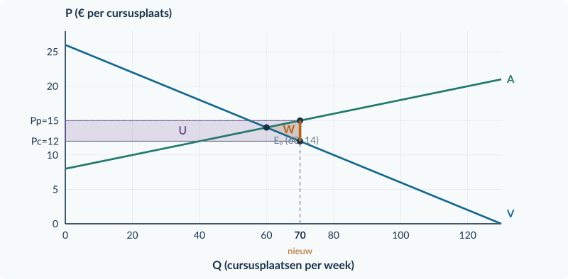<figcaption>Opgave 25: U = € 210. W = € 15 markeert de extra transacties voorbij het vrije evenwicht.</figcaption></figure>

<!-- PAGE {"section": "3.1.3", "title": "Bonus en herhaling"} -->

<h3>Opgave 26 · Per verkoop of een vast bedrag?</h3>
<b>a.</b> A: U = 3 × 70 = <b>€ 210</b>. B: gegeven vaste steun = <b>€ 210</b>. Alleen A geeft bij een extra verkoop opnieuw € 3. Bij B blijven volgens de bron de marginale voorwaarden en het vrije evenwicht gelijk.

<b>Waarom:</b> Gelijke totale uitgaven betekenen niet gelijke prikkels per extra product.

<b>b.</b> Onder B volgt geen extra vergoeding uit een extra verkochte plaats. Je kunt daarom het aanbod in kopersprijzen niet met € 3 verlagen.

<b>Waarom:</b> Een vast totaalbedrag is geen subsidie per verkochte eenheid; de bron sluit veranderingen in marginale kosten en deelname bovendien expliciet uit.

<b>Beoordelingscriteria bonus</b> Vergelijk de gelijke uitgaven, leg het verschil per extra verkoop uit en respecteer de gegeven onveranderde marginale kosten en marktdeelname bij de vaste steun.

<h3>Opgave 27 · Totaal en per eenheid</h3>
<b>a.</b> GCK bij Q = 100: 600/100 = <b>€ 6 per stoel</b>. Bij Q = 150: 600/150 = <b>€ 4 per stoel</b>.

<b>Waarom:</b> Dezelfde vaste kosten worden over meer verhuurde stoelen verdeeld.

<b>b.</b> TCK blijft € 600 per week. Alleen het bedrag per verhuurde stoel daalt.

<b>Waarom:</b> De productiecapaciteit en het totale vaste kostenbedrag veranderen niet.

<!-- PAGE {"section": "3.1.4", "title": "Start en begeleide inoefening"} -->

<h3>Opgave 28 · Hoeveelheid bij een prijs</h3>
<b>a.</b> 18 − 0,20Q = 6 + 0,10Q → Q₀ = <b>40 producten per dag</b>. P₀ = 18 − 0,20 × 40 = <b>€ 10 per product</b>.

<b>Waarom:</b> In het vrije evenwicht zijn gewenste aankopen en verkopen gelijk.

<b>b.</b> Vraag: 8 = 18 − 0,20Qv → Qv = <b>50</b>. Aanbod: 8 = 6 + 0,10Qa → Qa = <b>20 producten per dag</b>.

<b>Waarom:</b> Bij een gegeven prijs hoeven vraag en aanbod niet gelijk te zijn.

<h3>Opgave 29 · Mag de oude prijs nog?</h3>
<b>a.</b> Nee. P = <b>€ 12</b> blijft toegestaan, want € 12 ligt onder het maximum van € 15.

<b>Waarom:</b> Een maximumprijs is een bovengrens, geen verplicht te vragen prijs.

<h3>Opgave 30 · Bekijk eerst het tekort</h3>
<b>a.</b> Qv = <b>80</b>; Qa = <b>40 puzzels per week</b>. Werkelijk verkocht: <b>40</b>.

<b>Waarom:</b> Er is geen extra aanvoer en alle aangeboden puzzels worden verkocht.

<b>b.</b> Het tekort loopt horizontaal van Q = 40 tot Q = 80 en is 40 puzzels. Het is geen bedrag per puzzel.

<b>Waarom:</b> Een tekort meet een verschil tussen aantallen, niet tussen prijzen.

<b>c.</b> Onjuist. Er worden 40 puzzels verkocht; 40 van de 80 vragers krijgen geen product.

<b>Waarom:</b> Een lagere toegestane prijs helpt niet iedere geïnteresseerde koper als het product ontbreekt.

<!-- PAGE {"section": "3.1.4", "title": "Begeleide inoefening · uitwerking"} -->

<h3>Opgave 31 · Schilderpakketten</h3>
<b>a.</b> Pmax = € 8 ligt onder P₀ = € 10: <b>bindend</b>.

<b>Waarom:</b> De vrije evenwichtsprijs is niet toegestaan.

<b>b.</b> 8 = 16 − 0,10Qv → Qv = <b>80</b>. 8 = 4 + 0,10Qa → Qa = <b>40</b>. Verkoop = <b>40 pakketten per week</b>; tekort = 80 − 40 = <b>40 pakketten per week</b>.

<b>Waarom:</b> Alle aangeboden pakketten worden verkocht, maar niet alle gewenste aankopen kunnen doorgaan.

<b>c.</b> Teken Pmax = € 8. De snijpunten zijn (40; 8) op A en (80; 8) op V. Markeer het horizontale tekort.

<b>Waarom:</b> Beide hoeveelheden horen bij één en dezelfde verkoopprijs.

<b>d.</b> Bij een maximum van € 12 blijft <b>P = € 10 en Q = 60</b>.

<b>Waarom:</b> Het vrije evenwicht ligt onder de bovengrens en blijft dus toegestaan.

<figure>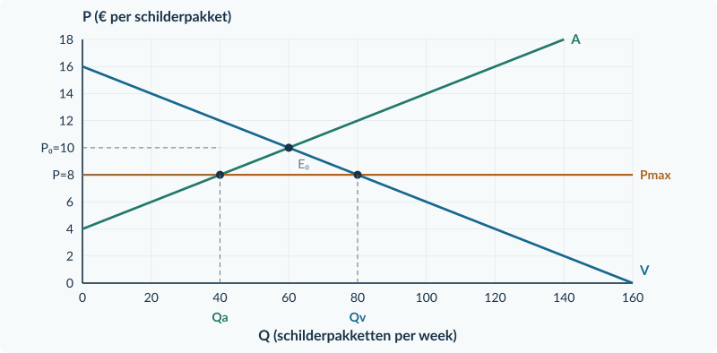<figcaption>Opgave 31: 80 gewenst, 40 aangeboden en verkocht; 40 tekort.</figcaption></figure>

<!-- PAGE {"section": "3.1.4", "title": "Zelfstandige oefening"} -->

<h3>Opgave 32 · Bordspellen</h3>
<b>a.</b> 20 − 0,20Q = 2 + 0,10Q → Q₀ = <b>60</b>. P₀ = 20 − 0,20 × 60 = <b>€ 8</b>. Het maximum € 6 bindt.

<b>Waarom:</b> € 6 is lager dan de vrije evenwichtsprijs.

<b>b.</b> 6 = 20 − 0,20Qv → Qv = <b>70</b>. 6 = 2 + 0,10Qa → Qa = <b>40</b>. Verkoop = <b>40 spellen per week</b>; tekort = <b>30 spellen per week</b>.

<b>Waarom:</b> Zonder extra aanvoer kunnen niet alle 70 vragers kopen.

<b>c.</b> Markeer Pmax = € 6, Qa = 40 als verkoop, Qv = 70 als gewenste aankoop en het tekort van 30.

<b>Waarom:</b> De aangeboden hoeveelheid bepaalt hier de werkelijke verkopen.

<b>d.</b> Je weet dat 40 spellen worden verkocht, maar niet <b>aan welke 40 vragers</b>. Daarvoor is een toewijzingsregel nodig.

<b>Waarom:</b> Een loting of andere selectie kan andere kopers een product geven.

<figure>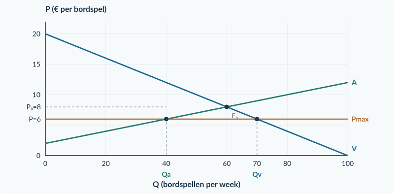<figcaption>Opgave 32: de gewenste aankoop is 70, maar er worden 40 spellen verkocht.</figcaption></figure>

<h3>Opgave 33 · De markt verandert</h3>
<b>a.</b> Alleen de lagere grens bij de oude markt: € 9 &gt; € 8, dus <b>niet bindend</b>.

<b>Waarom:</b> De oude vrije prijs blijft toegestaan.

<b>b.</b> Bij de nieuwe markt: € 9 &lt; € 12, dus <b>wel bindend</b>. De uitspraak is onjuist: je moet de grens met het toepasselijke vrije evenwicht vergelijken.

<b>Waarom:</b> Niet alleen de regeling, maar ook de marktomstandigheden bepalen of zij effect heeft.

<!-- PAGE {"section": "3.1.4", "title": "Doeloefening"} -->

<h3>Opgave 34 · Tenten voor een weekend</h3>
<b>a.</b> 18 − 0,10Q = 6 + 0,10Q → 12 = 0,20Q → Q₀ = <b>60 tenten per weekend</b>. P₀ = 18 − 0,10 × 60 = <b>€ 12 per tent</b>. Pmax = € 10 bindt.

<b>Waarom:</b> De vrije huur van € 12 wordt verboden.

<b>b.</b> 10 = 18 − 0,10Qv → Qv = <b>80</b>. 10 = 6 + 0,10Qa → Qa = <b>40</b>. Werkelijk verhuurd: <b>40 tenten</b>. Tekort: 80 − 40 = <b>40 tenten per weekend</b>.

<b>Waarom:</b> Er is geen extra aanvoer; alle 40 aangeboden tenten worden verhuurd.

<b>c.</b> Markeer de horizontale lijn Pmax = € 10, Qa = 40 en Qv = 80. Label 40 als werkelijke verhuringen en 40–80 als tekort.

<b>Waarom:</b> Vraag, aanbod en werkelijk verhuurde aantallen hebben verschillende betekenissen.

<b>d.</b> Onjuist. Van de 80 vragers krijgen alleen de 40 hoogste betalingsbereidheden een tent. De overige 40 vragers die € 10 willen betalen, krijgen er geen.

<b>Waarom:</b> Een lagere huur maakt toegang niet voor iedereen mogelijk.

<b>e.</b> Bij Pmax = € 14 blijft de werkelijke huur <b>€ 12</b> en worden <b>60 tenten per weekend</b> verhuurd.

<b>Waarom:</b> Het maximum is hoger dan de vrije huur en bindt niet.

<figure>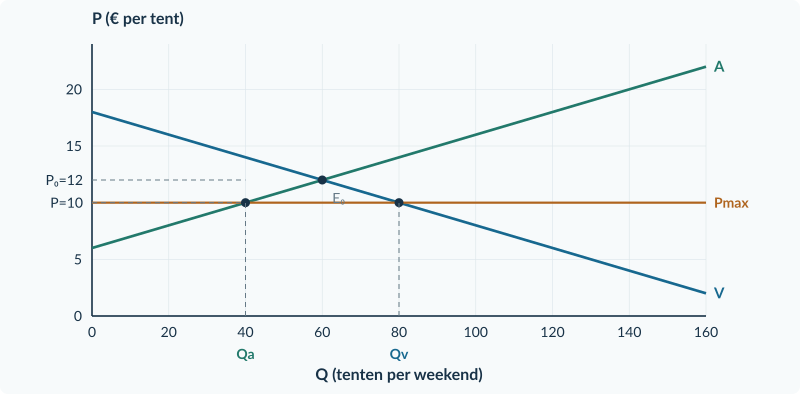<figcaption>Opgave 34: 40 tenten worden verhuurd en 40 vragers blijven zonder tent.</figcaption></figure>

<!-- PAGE {"section": "3.1.4", "title": "Bonus en herhaling"} -->

<h3>Opgave 35 · Wie krijgt de twee producten?</h3>
<b>a.</b> A: (12 − 6) + (10 − 6) = <b>€ 10 CS</b>. B: (8 − 6) + (7 − 6) = <b>€ 3 CS</b>. Niet-kopers leveren in deze berekening geen CS.

<b>Waarom:</b> Alleen bij een daadwerkelijke aankoop tel je betalingsbereidheid minus prijs mee.

<b>b.</b> In beide situaties zijn prijs (€ 6) en aantal (2) gelijk, maar kopen andere mensen met andere betalingsbereidheden.

<b>Waarom:</b> De toewijzing bepaalt welke individuele voordelen worden opgeteld.

<b>c.</b> Nee. A heeft in deze berekening meer CS, maar “eerlijk” vraagt een afzonderlijk criterium, bijvoorbeeld gelijke kansen.

<b>Waarom:</b> Een efficiëntiemaat is niet hetzelfde als een verdelingsnorm.

<b>Beoordelingscriteria bonus</b> Bereken alleen het surplus van kopers die daadwerkelijk kopen. Benoem de verschillende toewijzing en houd het eerlijkheidsoordeel apart.

<h3>Opgave 36 · Een markt zonder beperking</h3>
<b>a.</b> 30 − 0,50Q = 6 + 0,25Q → 24 = 0,75Q → Q₀ = <b>32 kaartjes</b>. P₀ = 30 − 0,50 × 32 = <b>€ 14 per kaartje</b>.

<b>Waarom:</b> Er is geen prijsregel en de oorspronkelijke lijnen bepalen het evenwicht.

<b>b.</b> CS = ½ × 32 × (30 − 14) = <b>€ 256</b>. PS = ½ × 32 × (14 − 6) = <b>€ 128</b>.

<b>Waarom:</b> De oppervlakten meten de voordelen bij de 32 verhandelde kaartjes.

<!-- PAGE {"section": "3.1.5", "title": "Start en begeleide inoefening"} -->

<h3>Opgave 37 · Vraag en aanbod terughalen</h3>
<b>a.</b> 100 − 5P = 5P − 20 → 120 = 10P → P₀ = <b>€ 12</b>. Q₀ = 100 − 5 × 12 = <b>40 kratten per week</b>. Bij P = € 14: Qv = 100 − 70 = 30; Qa = 70 − 20 = 50. Aanbodoverschot = 50 − 30 = <b>20 kratten per week</b>.

<b>Waarom:</b> Het overschot is aangeboden hoeveelheid minus particuliere vraag.

<h3>Opgave 38 · Een toegestane prijs</h3>
<b>a.</b> <b>€ 12</b>. Deze prijs is hoger dan de ondergrens van € 9 en blijft toegestaan.

<b>Waarom:</b> Een minimumprijs verplicht de markt niet om naar die ondergrens te dalen.

<h3>Opgave 39 · Het overschot afnemen</h3>
<b>a.</b> Particulieren kopen <b>40 kratten</b>. Er worden <b>80 kratten</b> aangeboden. De overheid koopt het verschil: <b>40 kratten per week</b>.

<b>Waarom:</b> De bron garandeert volledige opkoop van het overschot.

<b>b.</b> U = 10 × (80 − 40) = <b>€ 400 per week</b>. De overheid koopt niet de 40 kratten die particulieren al afnemen.

<b>Waarom:</b> Het budget wordt over de publieke aankopen berekend, niet over alle productie.

<b>c.</b> De <b>40 kratten aanbodoverschot</b> zijn dan niet automatisch verkocht; er blijven alleen 40 particuliere aankopen.

<b>Waarom:</b> Een minimumprijs zonder opkoopgarantie creëert geen extra afnemer.

<!-- PAGE {"section": "3.1.5", "title": "Begeleide inoefening · uitwerking"} -->

<h3>Opgave 40 · Perenkratten</h3>
<b>a.</b> 14 = 18 − 0,10Qv → Qv = <b>40</b>. 14 = 6 + 0,10Qa → Qa = <b>80</b>. Overschot = 80 − 40 = <b>40 kratten per week</b>.

<b>Waarom:</b> Kopers reageren op de hogere prijs door minder te vragen; verkopers door meer aan te bieden.

<b>b.</b> Teken Pmin = € 14; de snijpunten geven Qv = 40 en Qa = 80. U = 14 × 40 = <b>€ 560 per week</b>. De rechthoek loopt van Q = 40 tot 80 en van P = 0 tot 14.

<b>Waarom:</b> Alleen de overheid koopt dit aanbodoverschot.

<b>c.</b> Bij alleen quotum 40: P = 18 − 0,10 × 40 = <b>€ 14</b>; particulieren kopen <b>40 kratten</b>; U = <b>€ 0</b>.

<b>Waarom:</b> Het quotum vervangt de hele prijs- en opkoopregeling; de overheid koopt niet langer mee.

<figure>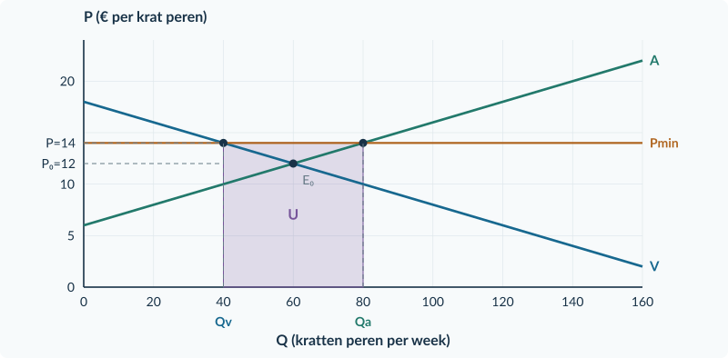<figcaption>Opgave 40: de overheid koopt 40 perenkratten voor € 14; U = € 560.</figcaption></figure>

<!-- PAGE {"section": "3.1.5", "title": "De quotumroute afzonderlijk"} -->

<h3>Opgave 40A · Eerst alleen een quotum</h3>
<b>a.</b> Het quotum van 40 ligt onder Q₀ = 60. Het bindt. Volgens de bron worden alle toegestane kratten verkocht: <b>40 kratten per week</b>.

<b>Waarom:</b> Het maximum sluit de vrije evenwichtshoeveelheid uit; de bron legt de werkelijke productie en verkoop vast.

<b>b.</b> P = 26 − 0,20 × <b>40</b> = <b>€ 18 per krat</b>. Teken Q = 40 verticaal en markeer (40; 18) op V. Op A staat 8 + 0,10 × 40 = <b>€ 12 per krat</b>. Dat is het marginale-kostenbedrag bij deze hoeveelheid, niet de prijs waartegen kopers de 40 kratten afnemen.

<b>Waarom:</b> De vraaglijn geeft de prijs bij de beperkt beschikbare verkochte hoeveelheid. Het quotum verhindert uitbreiding tot het vrije evenwicht.

<b>c.</b> 80 is meer dan Q₀ = 60; de nieuwe grens bindt niet. Dus <b>Q = 60 kratten per week</b> en <b>P = € 14 per krat</b>. Overheidsuitgaven: <b>€ 0</b>. De uitspraak is onjuist: 80 is toegestaan als maximum, maar productie van 80 is niet verplicht.

<b>Waarom:</b> Een niet-bindend quotum laat het vrije evenwicht toe. De gratis rechten en afwezigheid van opkoop leveren geen overheidsbetaling op.

<figure>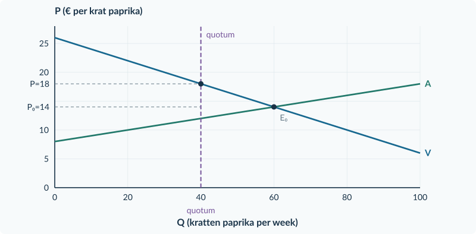<figcaption>Opgave 40A: het bindende quotum geeft 40 kratten voor € 18. Bij het niet-bindende quotum van 80 blijft het vrije evenwicht 60 kratten voor € 14.</figcaption></figure>

<!-- PAGE {"section": "3.1.5", "title": "Zelfstandige oefening"} -->

<h3>Opgave 41 · Pruimenkratten</h3>
<b>a.</b> 22 − 0,10Q = 10 + 0,10Q → Q₀ = <b>60</b>, P₀ = <b>€ 16</b>. Bij Pmin = € 18: Qv = (22 − 18)/0,10 = <b>40</b>; Qa = (18 − 10)/0,10 = <b>80</b>; aanbodoverschot = <b>40 kratten per week</b>.

<b>Waarom:</b> De minimumprijs ligt boven het vrije evenwicht.

<b>b.</b> Telers verkopen samen <b>80 kratten</b>: 40 aan particulieren en 40 aan de overheid. U = 18 × 40 = <b>€ 720 per week</b>. Zie de rechthoek in de grafiek.

<b>Waarom:</b> De garantie maakt alle aangeboden productie verkoopbaar.

<b>c.</b> Quotum 40: P = 22 − 0,10 × 40 = <b>€ 18</b>. Productie is <b>40 in plaats van 80 kratten per week</b>.

<b>Waarom:</b> Eenzelfde prijs kan samengaan met een andere hoeveelheid productie en andere publieke uitgaven.

<figure>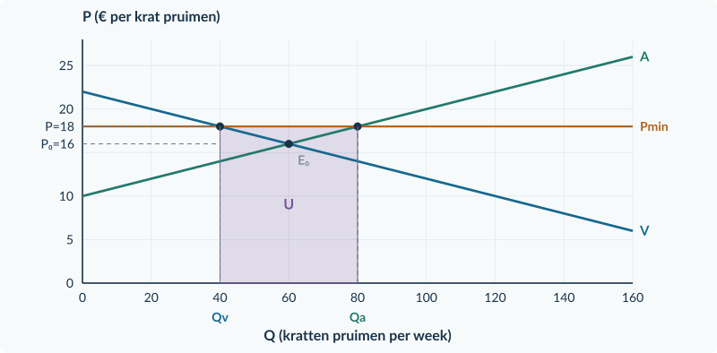<figcaption>Opgave 41: volledige opkoop geeft U = € 720; niet alle 80 kratten zijn overheidsaankopen.</figcaption></figure>

<h3>Opgave 42 · Geen opkoop afgesproken</h3>
<b>a.</b> Zonder opkoop of andere afnemers wordt <b>30</b> verkocht. Aanbodoverschot = 70 − 30 = <b>40 producten</b>.

<b>Waarom:</b> Aangeboden producten zijn niet automatisch verkochte producten.

<b>b.</b> Een minimumprijs noemt nog geen overheidsaankopen. Gratis quota leveren geen veilingopbrengst op. Je mag dus geen positieve budgetbetaling uit deze gegevens verzinnen.

<b>Waarom:</b> Voor een budgetberekening is een expliciete betaling, aankoop of ontvangstenregel nodig.

<!-- PAGE {"section": "3.1.5", "title": "Doeloefening"} -->

<h3>Opgave 43 · Paddenstoelen in kratten</h3>
<b>a.</b> 20 − 0,10Q = 8 + 0,10Q → 12 = 0,20Q → Q₀ = <b>60 kratten per week</b>. P₀ = 20 − 0,10 × 60 = <b>€ 14</b>. De minimumprijs van € 16 bindt.

<b>Waarom:</b> De vrije prijs is lager dan de nieuwe ondergrens.

<b>b.</b> 16 = 20 − 0,10Qv → Qv = <b>40</b>. 16 = 8 + 0,10Qa → Qa = <b>80</b>. Overschot = <b>40 kratten</b>. Dankzij opkoop verkopen telers samen <b>80 kratten per week</b>.

<b>Waarom:</b> De overheid neemt de 40 kratten af die particulieren niet kopen.

<b>c.</b> Overheidsaankopen = 80 − 40 = <b>40 kratten</b>. U = 16 × 40 = <b>€ 640 per week</b>. De rechthoek is 40 kratten breed en € 16 per krat hoog.

<b>Waarom:</b> Je gebruikt het overheidsgedeelte van de afzet, niet de hele productie.

<b>d.</b> Quotum 40 bindt, want het ligt onder 60. P = 20 − 0,10 × 40 = <b>€ 16 per krat</b>. Productie = <b>40 kratten</b>; U = <b>€ 0 per week</b>.

<b>Waarom:</b> Regeling B vervangt A; gratis rechten en geen opkoop geven hier geen budgetbetaling.

<b>e.</b> Onjuist. De prijs is wel in beide gevallen € 16, maar de productie is <b>80 tegenover 40 kratten</b> en U is <b>€ 640 tegenover € 0</b>.

<b>Waarom:</b> Een overeenkomst in prijs bewijst niet dat de mechanismen en gevolgen gelijk zijn.

<figure>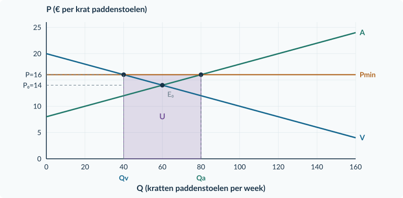<figcaption>Opgave 43, regeling A: 80 kratten productie, 40 particuliere aankopen en 40 overheidsaankopen.</figcaption></figure>

<!-- PAGE {"section": "3.1.5", "title": "Doeloefening (vervolg), bonus en herhaling"} -->

<figure>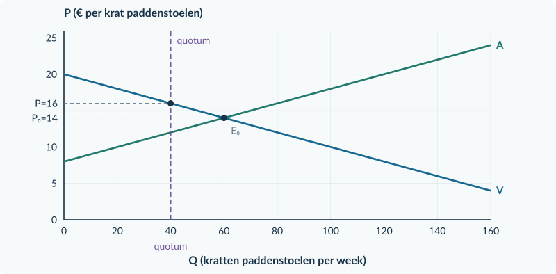<figcaption>Opgave 43, regeling B: bij alleen een quotum van 40 bedraagt de prijs ook € 16, maar de totale productie is 40.</figcaption></figure>

<h3>Opgave 44 · Is de hele rekening verlies?</h3>
<b>a.</b> De € 640 is een betaling voor goederen. Dat is niet automatisch € 640 aan verloren welvaart. Voor een oordeel zijn ook de reële kosten en de waarde van het gebruik van de goederen van belang; die zijn hier niet voldoende gegeven.

<b>Waarom:</b> Een budgetbedrag alleen meet geen nettoverlies aan gezamenlijke voordelen.

<b>b.</b> Bijvoorbeeld: <b>wat gebeurt er met de kratten en welke waarde heeft dat gebruik?</b> En: <b>welke opslag-, vervoer- of vernietigingskosten ontstaan?</b> Andere relevante, duidelijk uitgelegde informatie is ook goed.

<b>Waarom:</b> De bron geeft de betaling, niet de volledige maatschappelijke baten en kosten.

<b>Beoordelingscriteria bonus</b> Verwerp de gelijkstelling van budget en verlies; noem relevante ontbrekende informatie over gebruikswaarde en reële bijkomende kosten zonder een uitkomst te verzinnen.

<h3>Opgave 45 · Een prijsreactie meten</h3>
<b>a.</b> %ΔP = (10 − 8)/8 × 100% = <b>+25%</b>. %ΔQv = (70 − 80)/80 × 100% = <b>−12,5%</b>. Ev = −12,5%/25% = <b>−0,5</b>: prijsinelastisch.

<b>Waarom:</b> Gebruik het minteken voor de richting en |Ev| voor de sterkte.

<b>b.</b> TO oud = 8 × 80 = <b>€ 640 per week</b>. TO nieuw = 10 × 70 = <b>€ 700 per week</b>. De omzet stijgt € 60, maar kostengegevens ontbreken voor een winstvergelijking.

<b>Waarom:</b> Winst hangt van TO én TK af.

<!-- PAGE {"section": "3.1.6", "title": "Methodekeuze"} -->

<h3>Opgave 46 · Vier korte berichten</h3>
<b>a.</b> <b>Belasting per verkocht product</b>. Pc is hoger dan Pp.

<b>Waarom:</b> Een deel van de kopersbetaling gaat naar de overheid.

<b>b.</b> <b>Subsidie per verkochte plaats</b>. Bereken U over alle daadwerkelijk verkochte, subsidiabele plaatsen.

<b>Waarom:</b> Een vergoeding per verkoop is niet beperkt tot de extra verkoop.

<b>c.</b> <b>Maximumprijs</b>. € 7 &lt; € 9, dus bindend. Bereken Qv, Qa, verkopen en tekort bij € 7.

<b>Waarom:</b> De prijsregel verplaatst geen oorspronkelijke vraag- of aanbodlijn.

<b>d.</b> <b>Bindend productiequotum</b>. De 50 toegestane producten worden geprijsd via de vraaglijn V.

<b>Waarom:</b> De hoeveelheid is begrensd, niet rechtstreeks de prijs.

<h3>Opgave 47 · De ontbrekende aankoopbelofte</h3>
<b>a.</b> Verkoop = <b>30</b>; aanbodoverschot = 70 − 30 = <b>40 producten</b>; U = <b>€ 0</b>.

<b>Waarom:</b> Zonder andere afnemer blijven alleen de particuliere aankopen over.

<b>b.</b> De overheid koopt <b>40 producten</b>. U = 12 × 40 = <b>€ 480</b>.

<b>Waarom:</b> De nieuwe aankoopgarantie maakt het aanbodoverschot afzetbaar.

<b>c.</b> De prijsregel is hetzelfde, maar nu is er een extra afnemer met een expliciete betalingsbelofte.

<b>Waarom:</b> Het gevolg van een minimumprijs hangt ook van de aankoopregel af.

<!-- PAGE {"section": "3.1.6", "title": "Een overtuigende berekening controleren"} -->

<h3>Opgave 47A · Drie berekeningen die overtuigend lijken</h3>
<b>a.</b> O = t × Qt = 3 × 45 = <b>€ 135 per week</b>. Gebruik de 45 verkochte producten, niet de 15 verdwenen verkopen.

<b>Waarom:</b> Over een product dat niet meer wordt verkocht, ontvangt de overheid deze belasting niet.

<b>b.</b> U = s × Qsub = 2 × 70 = <b>€ 140 per week</b>. Verandering welvaartsmaat = toename CS + toename PS − U = 65 + 65 − 140 = <b>−€ 10 per week</b>. Er is dus € 10 welvaartsverlies, geen € 130 welvaartswinst.

<b>Waarom:</b> De overheidsuitgaven ontbreken in de redenering van de leerling. In deze bron zijn geen extra baten voor buitenstaanders die dat veranderen.

<b>c.</b> Zonder extra kopers worden <b>30 producten per week</b> verkocht. Het aanbodoverschot is 70 − 30 = <b>40 producten</b>, maar U = <b>€ 0</b>. Bij een expliciete garantie dat de overheid alle 40 overtollige aangeboden producten tegen € 12 koopt, zou U = 12 × 40 = <b>€ 480 per week</b> gelden.

<b>Waarom:</b> Een minimumprijs op zichzelf is geen aankoopgarantie. Gewenst aanbod is niet automatisch gerealiseerde afzet.

<!-- PAGE {"section": "3.1.6", "title": "Doeloefening · plan A"} -->

<h3>Opgave 48 · Twee plannen voor festivalbandjes</h3>
<b>a.</b> A is een belasting per product; B een maximumprijs. Vrij evenwicht: 24 − 0,20Q = 6 + 0,10Q → 18 = 0,30Q → Q₀ = <b>60 bandjes per dag</b>. P₀ = 24 − 0,20 × 60 = <b>€ 12 per bandje</b>.

<b>Waarom:</b> Eerst identificeer je het mechanisme; daarna kies je de rekenroute.

<b>b.</b> Bij A: Pc = 9 + 0,10Q. 24 − 0,20Q = 9 + 0,10Q → Qt = <b>50</b>. Pc = 24 − 0,20 × 50 = <b>€ 14</b>; Pp = 6 + 0,10 × 50 = <b>€ 11</b>. Koperslast = 14 − 12 = <b>€ 2</b>; verkoperslast = 12 − 11 = <b>€ 1 per bandje</b>.

<b>Waarom:</b> Pc − Pp is precies de belasting van € 3.

<b>c.</b> O = 3 × 50 = <b>€ 150 per dag</b>. CS = ½ × 50 × (24 − 14) = <b>€ 250</b>. PS = ½ × 50 × (11 − 6) = <b>€ 125</b>. Nieuwe welvaartsmaat = 250 + 125 + 150 = <b>€ 525</b>. Oud = 360 + 180 = € 540. W = 540 − 525 = <b>€ 15 per dag</b>.

<b>Waarom:</b> Overheidsontvangsten tellen mee in de maat; ze zijn geen verdwenen geld.

<b>d.</b> Qt = 50; Pc = € 14; Pp = € 11. O is de rechthoek van Q = 0 tot 50 tussen P = 11 en 14. W ligt tussen Q = 50 en Q = 60: ½ × 10 × 3 = € 15.

<b>Waarom:</b> O gebruikt de overblijvende verkopen; W de gemiste voordelige transacties.

<figure><figcaption>Opgave 48, plan A: O = € 150 en W = € 15 per dag.</figcaption></figure>

<!-- PAGE {"section": "3.1.6", "title": "Doeloefening · plan B en conclusie"} -->

<h3>Opgave 48 · Twee plannen voor festivalbandjes (vervolg)</h3>
<b>e.</b> Bij B bindt € 10, want het ligt onder € 12. 10 = 24 − 0,20Qv → Qv = <b>70</b>. 10 = 6 + 0,10Qa → Qa = <b>40</b>. Verkopen = <b>40</b>; tekort = 70 − 40 = <b>30 bandjes per dag</b>.

<b>Waarom:</b> Geen extra aanvoer betekent dat niet alle vragers kunnen kopen.

<b>f.</b> Beide delen zijn onjuist. Bij B willen 70 mensen een bandje, maar er worden 40 verkocht: 30 vragers krijgen er geen. Bij A ontvangt de overheid € 150, terwijl W € 15 is. Een onderbouwd verschil: kopers die onder B kunnen kopen betalen € 10 in plaats van € 14 onder A, maar er worden ook 40 in plaats van 50 bandjes verkocht. Er volgt hier geen volledige welvaartsrangschikking van beide plannen.

<b>Waarom:</b> Een conclusie benoemt zowel prijs als toegang en onderscheidt een overdracht van een verlies.

<figure><figcaption>Opgave 48, plan B: Qv = 70, Qa = 40, verkoop 40 en tekort 30. Deze tweede grafiek was niet verplicht.</figcaption></figure>

<b>Herstelgericht nakijken</b> Fout met de twee prijzen: herhaal §3.1.1. Budget verward met W: herhaal §3.1.2. Tekort of verkopen verkeerd: herhaal §3.1.4. Niet de hele berekening opnieuw memoriseren, maar het verkeerde onderscheid herstellen.

