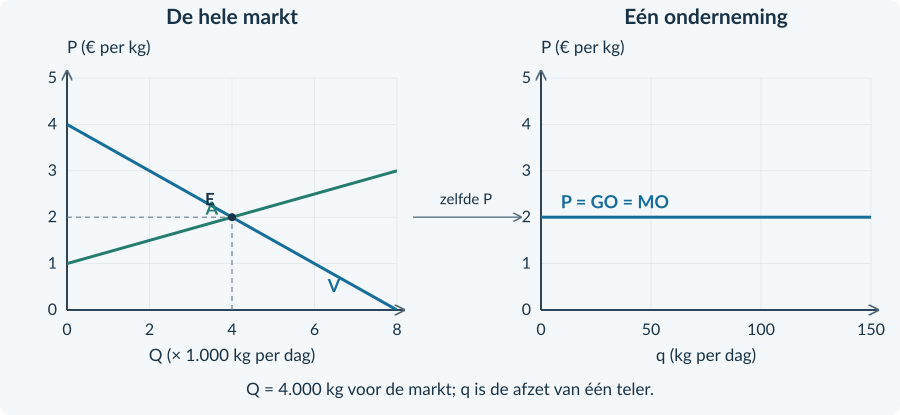

<!-- PAGE {"section": "3.2.1", "title": "Een prijs voor iedereen", "origin_chapter": "3.2", "origin_page": 2, "edition_page": 2} -->

3.2.1 · VOLKOMEN CONCURRENTIE: KENMERKEN

# Een prijs voor iedereen
Een aardappelteler levert dezelfde kwaliteit als veel andere telers. Kopers kunnen de prijzen direct vergelijken. Vraagt hij meer, dan kopen zij elders. Wat heeft de teler dan nog zelf te kiezen?

<b>Lesdoelen</b> Je kunt de kenmerken van volkomen concurrentie uitleggen. Je kunt een marktprijs aflezen en overnemen in een ondernemingsgrafiek. Je kunt TO, GO en MO bij die prijs berekenen en een prijskeuze beoordelen.

### Vier kenmerken vormen samen het model
| Kenmerk | Betekenis voor de onderneming |
|---|---|
| Veel kleine aanbieders en vragers | Eén deelnemer heeft nauwelijks invloed op de marktprijs. |
| Homogeen product | Kopers zien de producten als gelijkwaardig. |
| Doorzichtige markt | Kopers en verkopers kennen de relevante prijzen en kwaliteit. |
| Vrije toetreding en uittreding | Ondernemingen kunnen beginnen of stoppen zonder bijzondere toetredingsbarrières. |
<figure><figcaption>Figuur 1. Door deze combinatie van aannames is één onderneming prijsnemer.</figcaption></figure>

<b>Prijsnemer</b> Een onderneming die de marktprijs als gegeven neemt. Zij kiest haar productie, niet zelfstandig een hogere marktprijs.

<!-- PAGE {"section": "3.2.1", "title": "Twee grafieken, één prijs", "origin_chapter": "3.2", "origin_page": 3, "edition_page": 3} -->

### Eerst de markt, dan de onderneming
Links snijden de vraaglijn V en aanbodlijn A elkaar. Bij deze prijs willen alle kopers samen evenveel kopen als alle verkopers samen aanbieden. Je kent deze evenwichtsmethode uit Boek 1.

Rechts bekijken we **maar één teler**. Zijn aanbod is klein ten opzichte van de markt. In dit model kan hij bij de marktprijs zijn productie verkopen, tot zijn eigen productiecapaciteit.
<figure><figcaption>Figuur 2. De marktprijs is € 2 per kg. Neem alleen deze prijs over naar rechts, niet de markthoeveelheid van 4.000 kg.</figcaption></figure>

### Lees de assen voordat je rekent
**Q** is de totale hoeveelheid op de markt. Links betekent 4 dus **4.000 kg per dag**. **q** is de afzet van één onderneming, hier maximaal 150 kg per dag.

De horizontale lijn rechts zegt: elke kg brengt bij deze marktprijs € 2 op. Als één teler wat meer verkoopt, blijft zijn prijs in het model gelijk.

<b>Niet verwisselen</b> De horizontale lijn hoort bij één prijsnemende onderneming. De vraaglijn van de <b>hele markt</b> blijft dalend.

<!-- PAGE {"section": "3.2.1", "title": "De prijs bepaalt de opbrengst", "origin_chapter": "3.2", "origin_page": 4, "edition_page": 4} -->

## Uitgewerkt voorbeeld
**Aardappelteler Noor.** Gebruik figuur 2 op pagina 3. Alle telers leveren dezelfde kwaliteit; kopers kennen de prijzen. Noor kan maximaal 150 kg per dag leveren.

**1 · Lees de markt.** V en A snijden bij Q = 4.000 kg en P = € 2 per kg. Noor neemt P = € 2 over in haar eigen grafiek.

**2 · Totale opbrengst.** Bij q = 100 kg verkoopt zij 100 keer een kg voor € 2.

TO = P × q = 2 × 100 = € 200 per dag

**3 · Gemiddelde en marginale opbrengst.** Gemiddeld ontvangt zij € 2 per kg. Nog 20 kg verkopen geeft € 40 extra opbrengst.

GO = TO / q = 200 / 100 = € 2 per kg MO = ΔTO / Δq = (240 − 200) / (120 − 100) MO = 40 / 20 = € 2 per kg

**4 · Teken en leg uit.** De horizontale lijn in haar grafiek heet **P = GO = MO**. Een prijs van € 2,10 verliest kopers aan dezelfde aardappelen van anderen. Een prijs van € 1,90 is niet nodig om haar 100 kg te verkopen: die kan zij al voor € 2 afzetten.

Bij q = 100 geeft € 1,90 maar € 190 opbrengst. Haar kosten veranderen bij dezelfde productie niet. Deze prijsverlaging verlaagt daarom ook haar winst.

<b>Onthouden</b> Bij één vaste marktprijs: TO = P × q en P = GO = MO. TO is een totaalbedrag per periode; GO en MO zijn bedragen per product. GO bereken je alleen bij q &gt; 0.

<!-- PAGE {"section": "3.2.1", "title": "Ophalen en herkennen", "origin_chapter": "3.2", "origin_page": 5, "edition_page": 5} -->

## Startopgaven

<b>Korte route:</b> Startopgaven → Zelfstandige oefening → Doeloefening. Extra hulp nodig? Maak eerst Begeleide inoefening.

<b>Opgave 1 · Opbrengst terughalen</b>

Een producent verkoopt 80 kg meel per dag voor € 4 per kg.

<b>a.</b> Bereken TO en GO. Noteer bij beide de juiste eenheid.

<b>b.</b> De afzet stijgt naar 100 kg bij dezelfde prijs. Bereken de extra opbrengst en MO over deze toename.

<b>Opgave 2 · Welke lijn is horizontaal?</b>

Een leerling ziet figuur 2 en zegt: “Bij volkomen concurrentie verandert de totale vraag niet als de prijs verandert.”

<b>a.</b> Welk verschil tussen de marktgrafiek en de ondernemingsgrafiek ziet de leerling over het hoofd?

<b>b.</b> Noem twee modelkenmerken die verklaren waarom één teler de prijs als gegeven neemt.

## Begeleide inoefening

Heb je deze hulp niet nodig? Ga dan verder met Zelfstandige oefening.

<b>Opgave 3 · Volg de prijs</b>

Gebruik het uitgewerkte voorbeeld en figuur 2.

<b>a.</b> Wijs eerst het marktevenwicht aan. Welk getal neem je naar de ondernemingsgrafiek over?

<b>b.</b> Leg met q = 100 en q = 120 uit waarom MO niet gelijk is aan de extra totale opbrengst van € 40.

<b>c.</b> Een teler verdubbelt zijn eigen kleine productie. Waarom betekent dit niet dat de totale markthoeveelheid verdubbelt?

<!-- PAGE {"section": "3.2.1", "title": "Zelf de prijs overnemen", "origin_chapter": "3.2", "origin_page": 6, "edition_page": 6} -->

Begeleide inoefening · vervolg

<b>Opgave 4 · De rijstmarkt</b>

Op deze oefenmarkt leveren veel kleine ondernemingen dezelfde kwaliteit rijst. Prijzen zijn bekend. Toetreding is vrij. Eén onderneming kan maximaal 120 kg per dag leveren.

<b>a.</b> Lees links de evenwichtsprijs en de markthoeveelheid af. Let op × 1.000 op de horizontale as.

<b>b.</b> Neem rechts alleen de prijs over. Teken één horizontale lijn en zet erbij: P = GO = MO.

<b>c.</b> Bereken TO bij q = 80. Bereken vervolgens de extra opbrengst bij 20 kg extra afzet en MO.

<b>d.</b> Leg uit waarom deze onderneming bij dezelfde afzet geen hogere winst behaalt door € 0,20 onder de marktprijs te verkopen.

<figure><figcaption>Figuur 3. De markt is al getekend. Vul de ondernemingsgrafiek aan.</figcaption></figure>

<b>Van lezen naar uitleggen</b> Zeg niet alleen “de onderneming is prijsnemer”. Leg uit wat een koper kan doen en waarom een lagere prijs bij dezelfde afzet niet helpt.

<!-- PAGE {"section": "3.2.1", "title": "Dezelfde methode, andere bronnen", "origin_chapter": "3.2", "origin_page": 7, "edition_page": 7} -->

## Zelfstandige oefening

<b>Opgave 5 · Standaard potgrond</b>

Veel kleine aanbieders leveren in dit model dezelfde potgrond. Eén aanbieder verkoopt maximaal 120 kg per dag.

<b>a.</b> Lees het marktevenwicht af en vul rechts de lijn P = GO = MO in.

<b>b.</b> Bereken TO en GO bij q = 90. Bereken MO als de afzet daarna naar 110 kg stijgt.

<b>c.</b> Een aanbieder vraagt € 0,50 boven de marktprijs. Leg met de modelaannames uit waarom dit geen bruikbare manier is om zijn winst te vergroten.

<figure><figcaption>Figuur 4. Eén marktprijs, maar twee verschillende hoeveelheidsassen.</figcaption></figure>

<b>Opgave 6 · Een eigen merk</b>

Een andere aanbieder verkoopt potgrond met een eigen merk. Een groep klanten wil juist dit merk en betaalt er extra voor.

<b>a.</b> Welk kenmerk van volkomen concurrentie gaat in deze beschrijving niet meer op?

<b>b.</b> Waarom mag je voor deze aanbieder niet zonder meer dezelfde horizontale opbrengstlijn gebruiken?

<!-- PAGE {"section": "3.2.1", "title": "Laat zien wat je kunt", "origin_chapter": "3.2", "origin_page": 8, "edition_page": 8} -->

## Doeloefening

<b>Opgave 7 · Wortelveiling</b>

Veel kleine telers bieden wortelen van dezelfde kwaliteit aan. Kopers kennen alle prijzen. Beginnen of stoppen is vrij. Teler Mila kan tot 160 kg per dag leveren en bij de marktprijs verkopen.

<b>a.</b> (2p) Lees de marktprijs en de markthoeveelheid af. Noem één kenmerk uit de bron dat prijsnemerschap ondersteunt.

<b>b.</b> (2p) Teken rechts de opbrengstlijn van Mila. Label die als P = GO = MO.

<b>c.</b> (3p) Bereken bij q = 120 kg de TO en GO. Bereken MO wanneer Mila van 120 naar 140 kg gaat.

<b>d.</b> (2p) Mila overweegt € 3,20 te vragen. Leg uit waarom zij in dit model daardoor haar kopers verliest.

<b>e.</b> (2p) Een klasgenoot zegt: “De markt verkoopt 4.000 kg, dus de lijn van Mila moet bij q = 4.000 eindigen.” Leg de fout uit.

<figure><figcaption>Figuur 5. Vul alleen de ontbrekende lijn en labels in de ondernemingsgrafiek aan.</figcaption></figure>

<!-- PAGE {"section": "3.2.1", "title": "Een model herkennen", "origin_chapter": "3.2", "origin_page": 9, "edition_page": 9} -->

## Denkertje / Bonusopgave

<b>Opgave 8 · Onbeperkt verkopen?</b>

“Een horizontale opbrengstlijn betekent dat één bedrijf oneindig veel kan verkopen zonder dat de prijs verandert.”

<b>a.</b> Beoordeel de uitspraak. Gebruik de begrippen productiecapaciteit en klein marktaandeel.

<b>b.</b> Leg uit wat er aan het model zou veranderen als dit ene bedrijf een groot deel van de markt gaat bedienen.

## Herhaling / Herhaling en interleaving

<b>Opgave 9 · Evenwicht uit formules</b>

Vraag: P = 18 − 0,20Q. Aanbod: P = 6 + 0,10Q. P is euro per product; Q is producten per week.

<b>a.</b> Bereken de evenwichtsprijs en -hoeveelheid.

<b>b.</b> Er komen meer aanbieders bij, bij ongewijzigde vraag. Welke kant verschuift de aanbodlijn? Wat verwacht je van de prijs?

<b>Opgave 10 · Totaal en gemiddeld</b>

Voor een onderneming geldt TK = 150 + 3q. q is kg per week; TK is euro per week.

<b>a.</b> Bereken TK en GTK bij q = 50.

<b>b.</b> Bereken GTK bij q = 100. Leg uit waarom GTK daalt, terwijl TK stijgt.

<b>Neem mee naar de volgende paragraaf</b> De onderneming kan de prijs niet bepalen. Zij kan wél beslissen hoeveel zij bij die prijs produceert. Daarvoor heeft zij ook haar kosten nodig.

