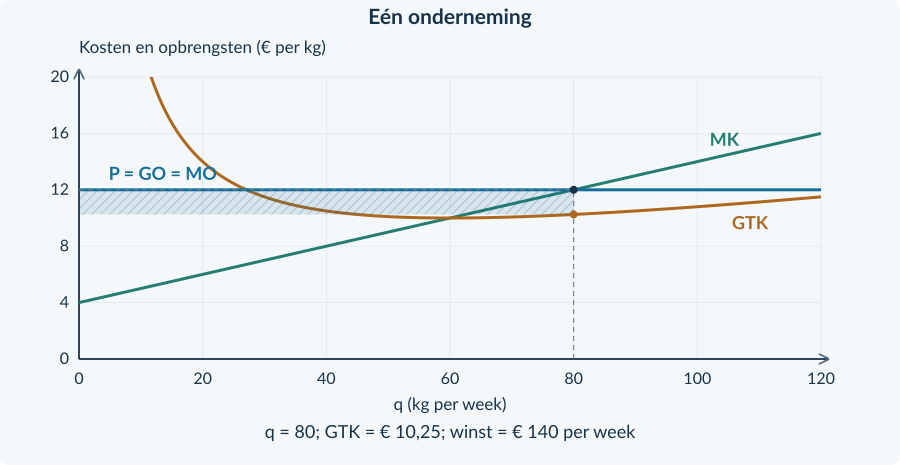

<!-- PAGE {"section": "3.2.1", "title": "Antwoorden bij prijsnemerschap"} -->

4VECO · BOEK 3 · HOOFDSTUK 3.2

# Antwoorden Productie en winst

<b>Gebruik</b> Rond geldbedragen per product af op twee decimalen als dat nodig is. Reken met ongeronde tussenwaarden. Totale bedragen zijn per genoemde periode. Een denkertje heeft een modelantwoord: een anders verwoord, goed onderbouwd antwoord kan ook juist zijn.

<h3>Opgave 1 · Opbrengst terughalen</h3>

<b>a.</b> TO = P × q = 4 × 80 = <b>€ 320 per dag</b>. GO = TO / q = 320 / 80 = <b>€ 4 per kg</b>.

<b>Waarom:</b> TO telt alle verkochte kg; GO is de opbrengst van gemiddeld één kg.

<b>b.</b> TO nieuw = 4 × 100 = € 400 per dag. ΔTO = 400 − 320 = <b>€ 80 per dag</b>. MO = 80 / (100 − 80) = <b>€ 4 per kg</b>.

<b>Waarom:</b> De extra opbrengst wordt verdeeld over 20 extra kg, niet over de totale productie.

<h3>Opgave 2 · Welke lijn is horizontaal?</h3>

<b>a.</b> De markt heeft een dalende vraaglijn. Alleen de opbrengstlijn van <b>één kleine onderneming</b> is bij een gegeven marktprijs horizontaal.

<b>Waarom:</b> Een verandering van de hele marktprijs is iets anders dan een kleine afzetverandering van één teler.

<b>b.</b> Bijvoorbeeld: veel kleine aanbieders én een homogeen product. Ook doorzichtige prijzen ondersteunen de redenering: kopers kunnen dezelfde kwaliteit elders kopen.

<b>Waarom:</b> Eén aanbieder kan niet zelfstandig een hogere prijs afdwingen.

<!-- PAGE {"section": "3.2.1", "title": "Opgaven 3 en 4"} -->

<h3>Opgave 3 · Volg de prijs</h3>

<b>a.</b> Links: Q = <b>4.000 kg per dag</b> en P = <b>€ 2 per kg</b>. Je neemt alleen P = 2 over naar rechts.

<b>Waarom:</b> q is de productie van één teler, niet de som van de productie van alle telers.

<b>b.</b> ΔTO = € 240 − € 200 = € 40. MO = 40 / (120 − 100) = <b>€ 2 per kg</b>.

<b>Waarom:</b> € 40 is de extra totale opbrengst; MO is die extra opbrengst per extra kg.

<b>c.</b> Als één kleine teler meer produceert, verandert alleen zijn bijdrage aan de totale productie. Alle andere bedrijven verdubbelen hun productie niet automatisch.

<b>Waarom:</b> Q is de som van de productie van alle ondernemingen.

<h3>Opgave 4 · De rijstmarkt</h3>

<b>a.</b> Afgelezen: P = <b>€ 5 per kg</b> en Q = <b>3.000 kg per dag</b>.

<b>Waarom:</b> De horizontale schaal is × 1.000 kg; het snijpunt ligt halverwege 2 en 4.

<b>b.</b> Teken rechts een horizontale lijn op P = 5, tot q = 120. Label <b>P = GO = MO</b>. Zie de oplossing hieronder.

<b>Waarom:</b> Elke verkochte kg levert binnen de capaciteit dezelfde prijs op.

<b>c.</b> TO bij q = 80: 5 × 80 = <b>€ 400 per dag</b>. Bij q = 100: TO = € 500. ΔTO = € 100; MO = 100 / 20 = <b>€ 5 per kg</b>.

<b>Waarom:</b> De prijs blijft gelijk wanneer één kleine onderneming 20 kg meer verkoopt.

<b>d.</b> Bij q = 80 wordt TO = 4,80 × 80 = € 384 in plaats van € 400. De kosten bij dezelfde q blijven gelijk. De winst is <b>€ 16 lager per dag</b>.

<b>Waarom:</b> De producent kon de 80 kg al voor € 5 verkopen; de prijsverlaging geeft hier geen voordeel.

<figure><figcaption>Oplossing opgave 4. Neem P = € 5 per kg over naar de onderneming.</figcaption></figure>

<!-- PAGE {"section": "3.2.1", "title": "Opgaven 5 en 6"} -->

<h3>Opgave 5 · Standaard potgrond</h3>

<b>a.</b> Marktevenwicht: P = <b>€ 4 per kg</b>, Q = <b>4.000 kg per dag</b>. Rechts komt de horizontale lijn P = GO = MO = 4.

<b>Waarom:</b> De evenwichtsprijs wordt overgenomen, de totale hoeveelheid niet.

<b>b.</b> TO = 4 × 90 = <b>€ 360 per dag</b>. GO = 360 / 90 = <b>€ 4 per kg</b>. Nieuw TO = 4 × 110 = € 440. MO = (440 − 360) / (110 − 90) = <b>€ 4 per kg</b>.

<b>Waarom:</b> Bij een vaste prijs zijn gemiddelde en marginale opbrengst gelijk aan die prijs.

<b>c.</b> Bij € 4,50 wijken kopers uit naar dezelfde potgrond van andere aanbieders voor € 4. De kleine aanbieder verliest in het model zijn afzet.

<b>Waarom:</b> Veel aanbieders, gelijke kwaliteit en bekende prijzen voorkomen een eigen hogere prijs.

<figure><figcaption>Oplossing opgave 5. P = GO = MO = € 4 per kg.</figcaption></figure><h3>Opgave 6 · Een eigen merk</h3>

<b>a.</b> Het product is voor deze klanten niet langer <b>homogeen</b>: zij zien het merk als anders en willen er extra voor betalen.

<b>Waarom:</b> De bron geeft een verschil in ervaren waarde, niet alleen een andere verpakking.

<b>b.</b> Het bedrijf kan voor een groep klanten mogelijk een eigen prijs vragen. De aanname dat iedere afwijking boven de marktprijs alle afzet wegneemt, gaat dan niet zomaar op.

<b>Waarom:</b> De horizontale lijn volgt uit de prijsnemersaannames; die zijn hier niet volledig aanwezig. Een nieuw marktmodel hoef je nog niet te tekenen.

<!-- PAGE {"section": "3.2.1", "title": "Doeloefening 7"} -->

<h3>Opgave 7 · Wortelveiling</h3>

<b>a.</b> P = <b>€ 3 per kg</b> en Q = <b>4.000 kg per dag</b>. Bijvoorbeeld: veel kleine telers, gelijke kwaliteit of bekende prijzen ondersteunt prijsnemerschap.

<b>Waarom:</b> Het snijpunt hoort bij de hele markt. De kenmerken maken een eigen hogere prijs voor Mila onaantrekkelijk.

<b>b.</b> Teken rechts een horizontale lijn op 3, over de getekende q-schaal tot 160. Zet <b>P = GO = MO</b> erbij.

<b>Waarom:</b> De lijn geeft opbrengst per kg, niet totale opbrengst.

<b>c.</b> TO = 3 × 120 = <b>€ 360 per dag</b>. GO = 360 / 120 = <b>€ 3 per kg</b>. Nieuw TO = 3 × 140 = 420. MO = (420 − 360) / (140 − 120) = <b>€ 3 per kg</b>.

<b>Waarom:</b> De extra € 60 ontstaat door 20 extra kg; iedere kg geeft € 3 opbrengst.

<b>d.</b> Voor € 3,20 kopen klanten elders dezelfde wortelen voor € 3. Mila kan als kleine aanbieder de marktprijs niet verhogen.

<b>Waarom:</b> Kopers kennen de prijzen en kunnen uitwijken naar andere telers.

<b>e.</b> 4.000 kg is Q van alle telers samen. Mila heeft een eigen q en capaciteit van 160 kg per dag. Haar grafiek mag dus niet op q = 4.000 eindigen.

<b>Waarom:</b> Twee hoeveelheidsassen beschrijven verschillende economische objecten.

<figure><figcaption>Oplossing doeloefening 7. Links Q = 4.000; rechts een prijslijn tot q = 160.</figcaption></figure>

<!-- PAGE {"section": "3.2.1", "title": "Opgaven 8 tot en met 10"} -->

<h3>Opgave 8 · Onbeperkt verkopen?</h3>

<b>a.</b> Onjuist. De horizontale lijn is een model voor een kleine aanbieder, binnen zijn productiecapaciteit. Een machine, grond of tijd begrenst zijn afzet.

<b>Waarom:</b> De modeluitspraak geldt niet voor een onbeperkte vergroting van hetzelfde bedrijf.

<b>b.</b> Een grote aanbieder kan de totale markthoeveelheid merkbaar veranderen. Dan moet je opnieuw onderzoeken of hij de prijs als gegeven kan nemen.

<b>Waarom:</b> De aanname van een verwaarloosbaar klein marktaandeel kan verdwijnen.

<b>Beoordelingscriteria bij het denkertje</b> Het antwoord noemt zowel capaciteit als marktaandeel, onderscheidt q van Q en claimt niet dat een horizontale lijn letterlijk oneindige verkoop bewijst.
<h3>Opgave 9 · Evenwicht uit formules</h3>

<b>a.</b> 18 − 0,20Q = 6 + 0,10Q → 12 = 0,30Q → <b>Q = 40 producten per week</b>. P = 6 + 0,10 × 40 = <b>€ 10 per product</b>.

<b>Waarom:</b> In evenwicht hoort bij dezelfde hoeveelheid dezelfde kopers- en verkopersprijs.

<b>b.</b> Het aanbod verschuift <b>naar rechts</b>. Bij ongewijzigde vraag daalt de evenwichtsprijs.

<b>Waarom:</b> Bij iedere prijs zijn er meer producten beschikbaar. Herhaal §1.3.3 als dit lastig is.

<h3>Opgave 10 · Totaal en gemiddeld</h3>

<b>a.</b> TK = 150 + 3 × 50 = <b>€ 300 per week</b>. GTK = 300 / 50 = <b>€ 6 per kg</b>.

<b>Waarom:</b> GTK verdeelt de totale kosten over de productie.

<b>b.</b> Bij q = 100: TK = 150 + 300 = € 450; GTK = 450 / 100 = <b>€ 4,50 per kg</b>. Dezelfde € 150 constante kosten worden over meer kg verdeeld.

<b>Waarom:</b> Totale kosten stijgen, maar de constante kosten per kg dalen. Herhaal §2.1.1 voor totaal versus gemiddeld.

<!-- PAGE {"section": "3.2.2", "title": "Tabelstap en afgeleide"} -->

<h3>Opgave 11 · De tabelstap</h3>

<b>a.</b> ΔTK = 190 − 120 = <b>€ 70 per week</b>. Δq = 10 kg per week. Gemiddelde extra kosten = 70 / 10 = <b>€ 7 per extra kg</b>.

<b>b.</b> ΔTK is een totaalbedrag per week; het quotiënt ΔTK / Δq is een bedrag per kg.

<h3>Opgave 12 · Een totaal of een puntwaarde?</h3>

<b>a.</b> TK(20) = 40 + 40 + 40 = <b>€ 120 per week</b>. MK(20) = 4 + 2 = <b>€ 6 per kg</b>. TK telt de kosten van de gehele productie; MK beschrijft een zeer kleine uitbreiding rond 20 kg.

<h3>Opgave 13 · Term voor term</h3>

<b>a.</b> 0,05q² → 0,10q; 3q → 3; 60 → 0. Dus <b>MK = 0,10q + 3</b>.

<b>b.</b> MK(40) = 4 + 3 = <b>€ 7 per kg</b>.

<b>c.</b> TK wordt bij elke q € 40 hoger. MK blijft 0,10q + 3: de hogere constante kosten veranderen niet als q stijgt.

<!-- PAGE {"section": "3.2.2", "title": "Twee veranderingen en zelfstandige oefening"} -->

<h3>Opgave 14 · Twee soorten verandering</h3>

<b>a.</b> De afgeleide van 3q is 3 in plaats van 2. MK wordt bij elke q <b>€ 1 per kg hoger</b>.

<b>b.</b> Hogere constante kosten hebben geen effect op MK. Voor beide veranderingen samen geldt <b>MK = 0,20q + 3</b>.

<b>c.</b> Bij q = 20: variabele kosten nemen € 20 toe; constante kosten € 30. ΔTK = <b>€ 50 per week</b>. MK stijgt slechts met <b>€ 1 per kg</b>. Een totaalverschil is niet hetzelfde als een verschil in marginale kosten.

<h3>Opgave 15 · Verpakkingsmateriaal</h3>

<b>a.</b> MK = 0,40q + 4. MK(10) = <b>€ 8 per kg</b>.

<b>b.</b> TK(10) = 20 + 40 + 90 = € 150; TK(20) = 80 + 80 + 90 = € 250. (250 − 150) / 10 = <b>€ 10 per extra kg</b>. Deze € 10 is een gemiddelde over de stap; € 8 is de puntwaarde bij het begin.

<h3>Opgave 16 · Welke kosten verdwijnen?</h3>

<b>a.</b> Beide hebben <b>MK = 0,10q + 3</b>. B heeft bij elke q € 40 meer totale kosten. Gelijke marginale kosten betekenen niet dat de constante of totale kosten gelijk zijn.

<!-- PAGE {"section": "3.2.2", "title": "Doeloefening 17"} -->

<h3>Opgave 17 · Zadenverpakker</h3>

<b>a.</b> 0,04q² → 0,08q; 4q → 4; 400 → 0. <b>MK = 0,08q + 4</b>.

<b>b.</b> MK(100) = 8 + 4 = <b>€ 12 per kg</b>. Dit is de extra kostenwaarde per kg bij een zeer kleine uitbreiding rond 100 kg in het doorlopende model; niet het totale kostenbedrag.

<b>c.</b> TK(100) = 400 + 400 + 400 = <b>€ 1.200 per week</b>. TK(150) = 900 + 600 + 400 = <b>€ 1.900 per week</b>. Gemiddelde extra kosten = (1.900 − 1.200) / (150 − 100) = <b>€ 14 per extra kg</b>.

<b>d.</b> De € 14 is gemiddeld over 50 extra kg. De € 12 hoort bij het punt q = 100. De marginale kosten nemen binnen die stap toe; daarom zijn de twee bedragen niet gelijk.

<b>e.</b> TK wordt 0,04q² + 4q + 500. Bij q = 100 is TK = <b>€ 1.300 per week</b>. MK blijft <b>0,08q + 4</b>, want de afgeleide van een constant getal is nul.

<b>Beoordeling</b> Rekenuitkomst én economische interpretatie zijn nodig. Accepteer gelijkwaardige correcte formuleringen. Verwar euro per week niet met euro per kg; een uitsluitend numeriek antwoord op b of d geeft niet alle gevraagde uitleg.

<!-- PAGE {"section": "3.2.2", "title": "Denkertje en herhaling"} -->

<h3>Opgave 18 · Twee manieren om goedkoper te worden</h3>

<b>a.</b> Nee. A verlaagt TK overal € 60 maar verandert MK niet. B verlaagt TK met 3q, bij q = 20 dus eveneens € 60, en verlaagt MK met <b>€ 3 per kg</b>. Gelijke totale besparing bij één hoeveelheid betekent niet gelijke marginale kosten.

<h3>Opgave 19 · De prijsnemer</h3>

<b>a.</b> TO = 5 × 80 = <b>€ 400 per dag</b>. GTK = 320 / 80 = <b>€ 4 per kg</b>. Winst = <b>€ 80 per dag</b>.

<b>b.</b> Bij € 4,80: TO = 384 en winst = 64. De winst is <b>€ 16 lager per dag</b>. De teler verkoopt niet méér en kon dezelfde hoeveelheid tegen de marktprijs verkopen.

<!-- PAGE {"section": "3.2.3", "title": "Startopgaven 20 en 21"} -->

<h3>Opgave 20 · De bekende bouwstenen</h3>

<b>a.</b> TO = 9 × 40 = <b>€ 360 per week</b>. GTK = 280 / 40 = <b>€ 7 per kg</b>. Winst = 360 − 280 = <b>€ 80 per week</b>.

<b>Waarom:</b> Opbrengst en kosten moeten bij dezelfde q horen.

<b>b.</b> MK over 40–50 = (350 − 280) / (50 − 40) = <b>€ 7 per kg</b>. MO = <b>€ 9 per kg</b>, dus MO is € 2 hoger dan de gemiddelde MK over deze stap.

<b>Waarom:</b> De uitbreiding geeft over 10 kg € 20 extra winst.

<h3>Opgave 21 · Een maximum herkennen</h3>

<b>a.</b> Rond q = 60 is MO − MK = 12 − 10 = <b>€ 2 per kg</b>: een kleine uitbreiding is gunstig. Rond q = 100 is het verschil −€ 2 per kg: uitbreiding is ongunstig.

<b>Waarom:</b> Vergelijk de extra opbrengst en de extra kosten, niet de totale winst.

<b>b.</b> Bij stijgende MK verandert het verschil MO − MK van positief naar negatief. Het snijpunt ligt tussen de twee genoemde hoeveelheden.

<b>Waarom:</b> Vóór dat punt stijgt de winst; erna daalt zij, mits het punt haalbaar is.

<b>Van deze antwoorden naar de nieuwe procedure</b> Met de tabel bereken je een intervalwaarde. Bij een doorlopende kostenfunctie gebruik je daarna de afgeleide. Geef een verschil in die uitkomsten niet automatisch als fout aan: controleer eerst welke verandering wordt gemeten.

<!-- PAGE {"section": "3.2.3", "title": "Opgaven 22 en 23"} -->

<h3>Opgave 22 · Term voor term</h3>

<b>a.</b> 0,05q² → 0,10q; 3q → 3; 60 → 0. Dus <b>MK = 0,10q + 3</b>.

<b>Waarom:</b> De constante € 60 verandert niet bij een kleine productietoename.

<b>b.</b> 9 = 0,10q + 3 → 6 = 0,10q → <b>q = 60 kg per week</b>.

<b>Waarom:</b> Bij een prijsnemer is MO gelijk aan P = 9.

<b>c.</b> 60 ≤ 80, dus de q is haalbaar. Bij q &lt; 60 is MK &lt; 9; bij q &gt; 60 is MK &gt; 9.

<b>Waarom:</b> MK stijgt door MO heen: de winst gaat van stijgen naar dalen. Bij q = 0 is het resultaat −€ 60; bij q = 60 is de winst € 120.

<h3>Opgave 23 · Gedroogde kruiden</h3>

<b>a.</b> MK = <b>0,10q + 4</b>. 12 = 0,10q + 4 → q = <b>80 kg per week</b>. 80 past binnen de capaciteit van 120. MK is onder 80 lager dan MO en boven 80 hoger.

<b>Waarom:</b> De stijgende MK-lijn bevestigt het maximum.

<b>b.</b> TO = 12 × 80 = <b>€ 960</b>. TK = 0,05 × 80² + 4 × 80 + 180 = 320 + 320 + 180 = <b>€ 820</b>. Winst = 960 − 820 = <b>€ 140 per week</b>.

<b>Waarom:</b> Ook de constante kosten blijven onderdeel van TK.

<b>c.</b> GTK = 820 / 80 = <b>€ 10,25 per kg</b>. De rechthoek loopt van q = 0 tot 80 en van 10,25 tot 12. Breedte = 80 kg/week, hoogte = € 1,75/kg. Oppervlakte = <b>€ 140/week</b>.

<b>Waarom:</b> De GTK wordt bij q = 80 afgelezen; het minimum van GTK is niet de gevraagde hoogte.

<figure><figcaption>Oplossing opgave 23. q = 80; winst = 80 × (12 − 10,25) = € 140 per week.</figcaption></figure>

<!-- PAGE {"section": "3.2.3", "title": "Opgave 24: twee veranderingen"} -->

<h3>Opgave 24 · Twee veranderingen tegelijk</h3>

<b>a.</b> Met alleen de prijsstijging: 14 = 0,10q + 4 → <b>q = 100 kg per week</b>.

<b>Waarom:</b> Een hogere MO maakt extra productie langer gunstig.

<b>b.</b> MK blijft <b>0,10q + 4</b>. Bij dezelfde q daalt de winst met 260 − 180 = <b>€ 80 per week</b>.

<b>Waarom:</b> Constante kosten veranderen het totale winstbedrag, niet de marginale kosten.

<b>c.</b> Beide veranderingen samen: <b>q = 100 kg per week</b>. Dat past binnen 120. De nieuwe constante kosten veranderen de vergelijking 14 = 0,10q + 4 niet.

<b>Waarom:</b> De prijsverandering verschuift MO; de vaste-kostenverandering niet.

<b>d.</b> De leerling verwart totale kosten met marginale kosten. Alleen de constante kosten nemen hier toe; de variabele kosten en MK blijven gelijk.

<b>Waarom:</b> Een hoger totaal kostenniveau betekent niet automatisch dat elke extra kg duurder wordt.

<b>Didactische controle</b> Een leerling die de productie verlaagt omdat TCK stijgt, moet het onderscheid TK–MK opnieuw maken. Een leerling die TCK uit de winstberekening weglaat, gebruikt de afgeleide alsof deze de totale kosten vervangt.

<!-- PAGE {"section": "3.2.3", "title": "Opgave 25"} -->

<h3>Opgave 25 · Meel van één kwaliteitsklasse</h3>

<b>a.</b> MK = <b>0,04q + 4</b>. 12 = 0,04q + 4 → q = <b>200 kg per week</b>. Bij q = 150 is MK = 10; bij q = 250 is MK = 14. Dus MO &gt; MK vóór 200 en MO &lt; MK erna. 200 ≤ 250.

<b>Waarom:</b> Het marginale verloop en de capaciteit ondersteunen dezelfde keuze.

<b>b.</b> TO = 12 × 200 = <b>€ 2.400</b>. TK = 0,02 × 200² + 4 × 200 + 100 = 800 + 800 + 100 = <b>€ 1.700</b>. Winst = <b>€ 700 per week</b>. GTK = 1.700 / 200 = <b>€ 8,50 per kg</b>.

<b>Waarom:</b> Totalen en gemiddelde worden bij q = 200 berekend.

<b>c.</b> Rechthoek: breedte <b>200 kg/week</b>, hoogte <b>€ 3,50/kg</b> (12 − 8,50). De oppervlakte is <b>€ 700/week</b>. Zie de grafiek.

<b>Waarom:</b> Bedrag per kg maal kg per week geeft het totale weekbedrag.

<b>d.</b> Het snijpunt geeft q = 200 en een marginale opbrengst/kost van € 12 per kg. Voor totale winst heb je daarnaast de totale kosten of GTK nodig.

<b>Waarom:</b> MO = MK zegt iets over de beste hoeveelheid, niet rechtstreeks over de grootte van de winst.

<figure><figcaption>Oplossing opgave 25. De winst is een rechthoek met hoogte € 3,50 per kg.</figcaption></figure>

<!-- PAGE {"section": "3.2.3", "title": "Opgave 26: de capaciteitsgrens"} -->

<h3>Opgave 26 · Een machine met beperkte capaciteit</h3>

<b>a.</b> MK = 0,20q + 2. 18 = 0,20q + 2 → <b>q = 80 kg per week</b>. Dit is groter dan de capaciteit van 60.

<b>Waarom:</b> Een wiskundig snijpunt kan buiten de haalbare productie liggen.

<b>b.</b> Kies <b>q = 60 kg per week</b>. Daar is MK = 0,20 × 60 + 2 = <b>€ 14 per kg</b>, lager dan MO = 18. Tot de capaciteit blijft extra productie gunstig.

<b>Waarom:</b> Binnen het haalbare gebied stijgt de winst nog steeds.

<b>c.</b> TO = 18 × 60 = € 1.080. TK = 0,10 × 60² + 2 × 60 + 40 = 360 + 120 + 40 = € 520. Winst = <b>€ 560 per week</b>. Bij q = 0: 0 − 40 = <b>−€ 40 per week</b>.

<b>Waarom:</b> De capaciteit benutten is hier gunstiger dan niet produceren.

<b>d.</b> Onjuist. Het maximum ligt hier op de capaciteitsgrens. Binnen de toegestane hoeveelheden bestaat geen betere keuze.

<b>Waarom:</b> Een maximum kan op een grens liggen; MO = MK is niet altijd noodzakelijk voor een grensmaximum.

<b>Controle van de logica</b> Een onhaalbaar snijpunt is geen reden om de opgave zonder advies af te sluiten. De grens q = 60 is juist de best haalbare keuze, omdat de winst op alle lagere hoeveelheden nog stijgt.

<!-- PAGE {"section": "3.2.3", "title": "Doeloefening 27"} -->

<h3>Opgave 27 · Korrels voor kwekerijen</h3>

<b>a.</b> 0,04q² → 0,08q; 4q → 4; 400 → 0. Dus <b>MK = 0,08q + 4</b>.

<b>Waarom:</b> De afgeleide beschrijft de kostenstijging per extra kg in het doorlopende model.

<b>b.</b> MO = 16. 16 = 0,08q + 4 → 12 = 0,08q → <b>q = 150 kg per week</b>. Bij q = 125 is MK = 14; bij 175 is MK = 18. MK stijgt van onder naar boven MO. 150 ≤ 200.

<b>Waarom:</b> De winst stijgt vóór 150 en daalt erna; de kandidaat is haalbaar.

<b>c.</b> TO = 16 × 150 = <b>€ 2.400</b>. TK = 0,04 × 150² + 4 × 150 + 400 = 900 + 600 + 400 = <b>€ 1.900</b>. Winst = <b>€ 500 per week</b>.

<b>Waarom:</b> Trek alle kosten af van de opbrengst, inclusief de € 400 constante kosten.

<b>d.</b> GTK = 1.900 / 150 = <b>€ 12,666… per kg</b>, afgerond € 12,67. Breedte = 150 kg/week; hoogte = 16 − 12,666… = € 3,333…/kg. Winstoppervlakte = <b>€ 500/week</b>.

<b>Waarom:</b> Rond GTK niet af vóór de oppervlakteberekening. Gebruik anders rechtstreeks TO − TK.

<figure><figcaption>Oplossing doeloefening 27d. De hoogte is € 3,333… per kg, niet € 16 per kg.</figcaption></figure>

<!-- PAGE {"section": "3.2.3", "title": "Doeloefening 27 vervolg en opgave 28"} -->

<h3>Opgave 27 · Korrels voor kwekerijen · vervolg</h3>

<b>e.</b> Bij q = 0: TO = 0, TK = 400 en winst = <b>−€ 400 per week</b>. € 500 is hoger dan −€ 400.

<b>Waarom:</b> De constante kosten zijn deze week ook bij niet produceren onvermijdbaar.

<b>f.</b> Kies <b>q = 120 kg per week</b>. Het snijpunt bij 150 is onhaalbaar. Bij 120 is MK = 0,08 × 120 + 4 = € 13,60 per kg, nog steeds lager dan MO = 16.

<b>Waarom:</b> De winst stijgt tot de nieuwe grens; daarom wordt de capaciteit benut.

<h3>Opgave 28 · Dezelfde MK, andere winst</h3>

<b>a.</b> Beide hebben MK = 0,20q + 2. Bij P = 8 ligt het snijpunt op q = 30 kg/week, binnen de capaciteit van 50. Beide kiezen in dit model <b>dezelfde q</b>.

<b>Waarom:</b> De hogere constante kosten van B veranderen MK niet.

<b>b.</b> TO is voor beide 8 × 30 = € 240. TK van A = 90 + 60 + 40 = € 190: winst <b>€ 50/week</b>. TK van B = 90 + 60 + 160 = € 310: winst <b>−€ 70/week</b>. Bij q = 0 verliest B € 160, dus q = 30 blijft deze week beter.

<b>Waarom:</b> Dezelfde marginale keuze kan samengaan met een ander totaal resultaat. Het oordeel gaat niet automatisch over blijven op langere termijn.

<b>Beoordelingscriteria bij het denkertje</b> Het antwoord gebruikt gelijke MK, vergelijkt dezelfde q en laat verschillende winstbedragen zien. Het maakt van een kortetermijnverlies geen ongefundeerd onmiddellijk stopadvies.

<!-- PAGE {"section": "3.2.3", "title": "Herhaling 20 en 21"} -->

<h3>Opgave 29 · Procenten en prijsgevoeligheid</h3>

<b>a.</b> %ΔP = (10 − 8) / 8 × 100% = <b>25%</b>. Ev = −10% / 25% = <b>−0,4</b>.

<b>Waarom:</b> De oude prijs is de basis; de hoeveelheid daalt, dus het teken is negatief.

<b>b.</b> |Ev| = 0,4 &lt; 1, dus de vraag is <b>prijsinelastisch</b>.

<b>Waarom:</b> De hoeveelheid reageert procentueel minder sterk dan de prijs. Herhaal §2.2.1 als teken en classificatie door elkaar lopen.

<h3>Opgave 30 · Belastingwig</h3>

<b>a.</b> t = Pc − Pp = 11 − 8 = <b>€ 3 per product</b>. Belastingopbrengst = 3 × 200 = <b>€ 600 per week</b>.

<b>Waarom:</b> De overheid ontvangt de belasting over de werkelijk verhandelde producten.

<b>b.</b> De belastingopbrengst gaat naar de overheid: het is een overdracht. Welvaartsverlies betreft verloren voordelen van transacties die door de belasting niet meer plaatsvinden, onder het eerder gebruikte model zonder externe effecten.

<b>Waarom:</b> Een budgetbedrag is niet automatisch verloren surplus. Zie §3.1.2.

<b>Waarom deze herhaling?</b> De omvang en de eenheid van een verandering keren telkens terug. Bij elasticiteit vergelijk je percentages; bij marginale bedragen deel je een totaalverschil door extra hoeveelheid; bij de belastingopbrengst vermenigvuldig je belasting per product met werkelijk verhandelde producten.

<!-- PAGE {"section": "3.2.4", "title": "Opgaven 31 en 32"} -->

<h3>Opgave 31 · Twee bronnen over meel</h3>

<b>a.</b> 12.000 − 1.000P = 2.000P → 12.000 = 3.000P → <b>P = € 4 per kg</b>. Q = 2.000 × 4 = <b>8.000 kg per week</b>.

<b>Waarom:</b> Bij de evenwichtsprijs is Qv = Qa.

<b>b.</b> TO = 4 × 100 = <b>€ 400 per week</b>. GO = MO = <b>€ 4 per kg</b>. Q omvat alle molens, q alleen deze molen.

<b>Waarom:</b> De prijs wordt gedeeld door het marktmodel, niet de hoeveelheid van één bedrijf.

<b>c.</b> Kopers kunnen bij andere molens dezelfde kwaliteit voor € 4 krijgen. De eigen prijs van € 4,50 verliest daardoor afzet.

<b>Waarom:</b> Het bedrijf is een kleine prijsnemer; de bron ondersteunt geen marktmacht.

<h3>Opgave 32 · Vezels voor verpakkingen</h3>

<b>a.</b> MK = 0,10q + 4. 14 = 0,10q + 4 → <b>q = 100 kg/week</b>. Dit past binnen 140. Bij q = 80 is MK = 12 &lt; MO; bij q = 120 is MK = 16 &gt; MO.

<b>Waarom:</b> De winst stijgt vóór de gekozen q en daalt erna.

<b>b.</b> TO = 14 × 100 = <b>€ 1.400</b>. TK = 0,05 × 100² + 4 × 100 + 200 = 500 + 400 + 200 = <b>€ 1.100</b>. Winst = <b>€ 300/week</b>. GTK = 1.100 / 100 = <b>€ 11/kg</b>.

<b>Waarom:</b> Alle bedragen horen bij q = 100.

<b>c.</b> Van q = 0 tot 100 en van € 11 tot € 14 per kg. Breedte = 100 kg/week; hoogte = € 3/kg; oppervlakte = € 300/week.

<b>Waarom:</b> Gebruik GTK bij de winstmaximale q, niet een minimum bij een andere q.

<b>d.</b> De laagste gemiddelde kosten zijn niet hetzelfde als de hoogste totale winst. Zolang MO &gt; MK levert extra productie nog extra winst, ook als GTK alweer stijgt.

<b>Waarom:</b> De marginale vergelijking bepaalt de beste hoeveelheid; GTK helpt het winstbedrag berekenen.

<!-- PAGE {"section": "3.2.4", "title": "Opgave 33 · De ruimte is de grens"} -->

<h3>Opgave 33 · De ruimte is de grens</h3>

<b>a.</b> 20 = 0,20q + 4 → q = 80 kg per week. Dat is meer dan de capaciteit. De beste haalbare productie is <b>60 kg per week</b>.

<b>b.</b> Bij q = 60 is MK = 0,20 × 60 + 4 = <b>€ 16 per kg</b>, terwijl MO = € 20 per kg. Uitbreiden blijft tot de capaciteitsgrens winstgevend; daarboven is productie niet haalbaar.

<b>c.</b> Nodig is het totale kostenbedrag bij q = 60, bijvoorbeeld via een volledige TK-functie of een tabel. De MK-functie alleen bevat het constante-kostenbedrag niet. Met TK(60) kun je 20 × 60 − TK(60) uitrekenen.

<!-- PAGE {"section": "3.2.4", "title": "Opgave 34"} -->

<h3>Opgave 34 · Meer vraag, ander productieadvies</h3>

<b>a.</b> MK = 0,20q + 2. Bij P = 8 volgt <b>q = 30</b>; bij P = 10 volgt <b>q = 40 kg per week</b>. Beide zijn haalbaar; MK stijgt door MO.

<b>b.</b> Bij q = 30: TO = 240; TK = 90 + 60 + 40 = 190; winst = <b>€ 50 per week</b>. Bij q = 40: TO = 400; TK = 160 + 80 + 40 = 280; winst = <b>€ 120 per week</b>.

<b>c.</b> Nee. De kostenfunctie blijft gelijk, dus MK verschuift niet. De horizontale P = GO = MO-lijn ligt hoger en de gekozen productie neemt toe.

<!-- PAGE {"section": "3.2.4", "title": "Doeloefening 35: korte termijn"} -->

<h3>Opgave 35 · Kweekkorrels: van markt naar bedrijf</h3>

<b>a.</b> 30.000 − 2.500P = 2.500P − 10.000 → 40.000 = 5.000P → <b>P₀ = € 8/kg</b>. Q₀ = 2.500 × 8 − 10.000 = <b>10.000 kg/week</b>. Bij q = 100: TO = 8 × 100 = € 800; TK = 0,02 × 100² + 4 × 100 + 200 = € 800. Winst = <b>€ 0/week</b>.

<b>Waarom:</b> De beginsituatie is voor de onderneming kostendekkend.

<b>b.</b> 50.000 − 2.500P = 2.500P − 10.000 → 60.000 = 5.000P → <b>P₁ = € 12/kg</b>. Q₁ = 2.500 × 12 − 10.000 = <b>20.000 kg/week</b>. E₁ ligt op (20.000; 12).

<b>Waarom:</b> Direct na de vraagstijging geldt nog hetzelfde aanbod: het aantal bedrijven is gelijk gebleven.

<b>c.</b> MK = <b>0,04q + 4</b>. 12 = 0,04q + 4 → <b>q = 200 kg/week</b>. 200 ≤ 250. Bij q = 150 is MK = 10; bij q = 250 is MK = 14.

<b>Waarom:</b> De winst stijgt vóór 200 en daalt erna; de gekozen q is haalbaar.

<b>d.</b> TO = 12 × 200 = € 2.400. TK = 0,02 × 200² + 4 × 200 + 200 = 800 + 800 + 200 = € 1.800. Winst = <b>€ 600/week</b>. GTK = 1.800 / 200 = <b>€ 9/kg</b>. Rechthoek: breedte 200, hoogte 12 − 9 = 3.

<b>Waarom:</b> De opbrengstlijn in de ondernemingsgrafiek ligt op P = 12; de winst is een oppervlak, geen snijpunt.

<figure><figcaption>Doeloefening 35b–d. De nieuwe vraag verhoogt eerst P en de productie van de bestaande ondernemingen.</figcaption></figure>

<!-- PAGE {"section": "3.2.4", "title": "Doeloefening 35 en afsluiting"} -->

<h3>Opgave 35 · vervolg</h3>

<b>e.</b> Q stijgt van 10.000 naar 20.000: <b>100%</b>. q stijgt van 100 naar 200: eveneens <b>100%</b>. Q beschrijft alle ondernemingen samen en q één bedrijf. Gelijke procentuele verandering maakt de niveaus of economische objecten niet gelijk.

<h3>Opgave 36 · Dezelfde uitkomst, een andere vraag</h3>

<b>a.</b> Je moet MO en MK rond q = 100 kennen en controleren of q binnen de capaciteit ligt. TO = TK geeft alleen kostendekking, geen bewijs dat meer of minder produceren de winst niet kan verbeteren.

<b>b.</b> Ja. De winst op de gehele productie kan positief zijn terwijl een extra stap meer kost dan zij oplevert. Vergelijk voor de stap ΔTO en ΔTK of MO en MK; die beantwoorden een andere vraag dan TO − TK.

<h3>Opgave 37 · Een laatste vergelijking</h3>

<b>a.</b> GTK = 1.000 / 100 = <b>€ 10 per kg</b>; winst = 1.200 − 1.000 = <b>€ 200 per week</b>.

<b>b.</b> MO = 120 / 10 = <b>€ 12 per kg</b>; MK = 150 / 10 = <b>€ 15 per kg</b>. De winst neemt over de stap met <b>€ 30 per week af</b>.

<b>c.</b> Positieve totale winst gaat over eerdere opbrengsten en kosten samen. Een volgende uitbreiding is gunstig wanneer de extra opbrengst groter is dan de extra kosten.

