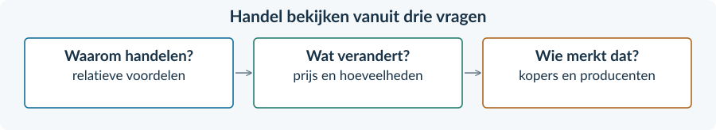

<!-- PAGE {"section": "3.3", "title": "Internationale handel", "origin_chapter": "3.3", "origin_page": 1, "edition_page": 1} -->

BOEK 3 · HOOFDSTUK 3 · ECONOMIE · 4 VWO

Internationale handel

Waarom handelen landen? En wie merkt daar de gevolgen van?

Een shirt, een fiets en een zak rijst kunnen een grens passeren voordat jij ze koopt. Handel verbindt de keuzes van kopers, producenten en overheden. Een voordeel voor de ene groep is niet automatisch een voordeel voor iedereen.
<figure><figcaption>Drie vragen verbinden dit hoofdstuk: waarom handelen, wat gebeurt er op de markt en wat verandert bescherming?</figcaption></figure>

<a href="#s331"><b>3.3.1 · Waarom landen handelen 2</b>Specialisatie, comparatief voordeel en concurrentiepositie</a>
<a href="#s332"><b>3.3.2 · Wereldmarktprijs, import, export en welvaart 11</b>Productie en verbruik uit elkaar houden</a>
<a href="#s333"><b>3.3.3 · Protectionisme: invoerheffingen en importquota 21</b>Een maatregel beoordelen vanuit verschillende belangen</a>
<a href="#s334"><b>3.3.4 · Gemengde opgaven: internationale handel 31</b>Bronnen, grafieken en berekeningen verbinden</a>
<a href="#overzicht"><b>Hoofdstukoverzicht en begrippen 38</b></a>

Werk in je schrift, tenzij een vraag om een markering in de gegeven figuur vraagt. Alle landen, ondernemingen, beleidsbronnen en cijfers zijn fictieve lesvoorbeelden. De grafieken zijn vereenvoudigde marktmodellen, geen actuele marktgegevens.

