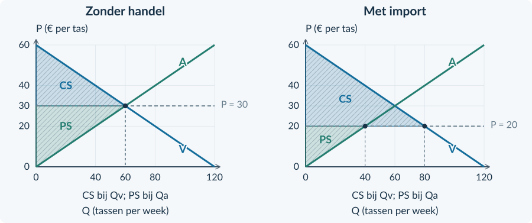
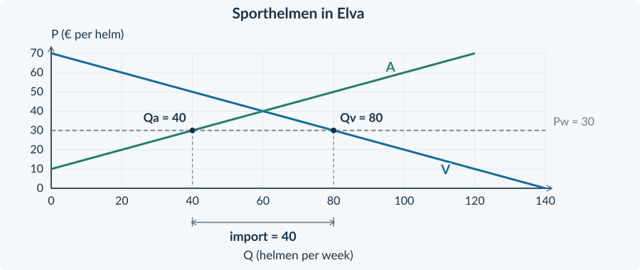
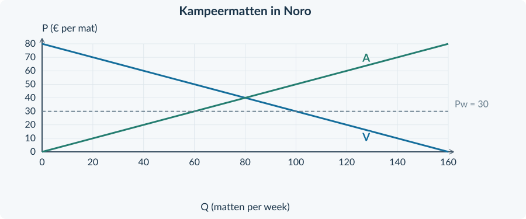

<!-- PAGE {"section": "3.3.2", "title": "Eén prijs, twee hoeveelheden", "origin_chapter": "3.3", "origin_page": 11, "edition_page": 11} -->

3.3.2 · WERELDMARKTPRIJS, IMPORT, EXPORT EN WELVAART

# Eén prijs, twee hoeveelheden
Zonder buitenlandse handel kosten tassen in een oefenland € 30. Buitenlandse aanbieders willen dezelfde tassen leveren voor € 20. Waarom zouden binnenlandse kopers dan nog € 30 betalen?

<b>Lesdoelen</b> Je kunt een wereldmarktprijs vergelijken met de prijs zonder handel. Je kunt binnenlandse productie, binnenlands verbruik en import of export bepalen. Je kunt met prijs en hoeveelheid uitleggen wat binnenlandse kopers en producenten merken.

<b>Wereldmarktprijs</b> De gegeven prijs waartegen het land op de wereldmarkt kan kopen of verkopen. We noteren die prijs als Pw.

### Het model dat we gebruiken
Het land is **klein en prijsnemend**: zijn handel verandert de wereldmarktprijs niet. Er zijn veel concurrerende kopers en verkopers. Binnenlandse en buitenlandse producten zijn gelijkwaardig. Er is voldoende buitenlands aanbod én voldoende buitenlandse vraag tegen Pw.

We rekenen in euro’s, zonder veranderende wisselkoers. Er zijn geen transportkosten, heffingen of andere handelsbelemmeringen. We laten effecten op derden buiten de welvaartsvergelijking.
<figure><figcaption>Figuur 1. Dezelfde marktvaardigheid krijgt drie betekenissen: Qa is binnenlandse productie, Qv is binnenlands verbruik en het verschil gaat over de grens.</figcaption></figure>
### Niet opnieuw oplossen, maar anders lezen
Zonder handel vind je de prijs bij Qv = Qa. Met handel is de prijs gegeven. Lees bij die prijs **twee** hoeveelheden af. Die hoeven niet gelijk te zijn: het buitenland kan het verschil kopen of leveren.

<!-- PAGE {"section": "3.3.2", "title": "Een lage wereldprijs: import", "origin_chapter": "3.3", "origin_page": 12, "edition_page": 12} -->

### Volg de prijslijn van links naar rechts
De tassenmarkt heeft Qv = 120 − 2P en Qa = 2P. P is euro per tas; Q is tassen per week. Zonder handel ligt het evenwicht bij P = € 30 en Q = 60.

Bij Pw = € 20 willen binnenlandse producenten 40 tassen leveren. Binnenlandse kopers willen er 80 gebruiken. De resterende 40 tassen komen uit het buitenland.
<figure><figcaption>Figuur 2. Import is het horizontale verschil tussen binnenlands verbruik en binnenlandse productie bij dezelfde wereldmarktprijs.</figcaption></figure>
<b>Bij import</b> Import = Qv − Qa 80 − 40 = 40 tassen per week

### Wat verandert er ten opzichte van geen handel?
De prijs daalt van € 30 naar € 20. Binnenlandse producenten produceren minder: van 60 naar 40. Kopers nemen juist meer af: van 60 naar 80. Zij kopen zowel binnenlandse als ingevoerde tassen.

<b>Veelgemaakte fout</b> “Het land verbruikt 80 tassen, dus het produceert 80 tassen.” Nee: het produceert er 40 en importeert er 40. Tel productie en import op om het binnenlandse verbruik te controleren.

<!-- PAGE {"section": "3.3.2", "title": "Een hoge wereldprijs: export", "origin_chapter": "3.3", "origin_page": 13, "edition_page": 13} -->

### De richting keert om
Neem dezelfde tassenmarkt, maar nu is de wereldmarktprijs € 40. Buitenlandse kopers kunnen voldoende tassen afnemen. Binnenlandse producenten hoeven daarom niet voor € 30 aan binnenlandse kopers te verkopen.

Bij € 40 willen producenten 80 tassen leveren. Binnenlandse kopers willen er 40 gebruiken. De overige 40 tassen worden uitgevoerd.
<figure><figcaption>Figuur 3. Bij export ligt binnenlandse productie rechts van binnenlands verbruik. Het verschil wordt verkocht aan buitenlandse kopers.</figcaption></figure>
<b>Bij export</b> Export = Qa − Qv 80 − 40 = 40 tassen per week

| Vergeleken met geen handel | Import bij lage Pw | Export bij hoge Pw |
|---|---|---|
| Binnenlandse prijs | Daalt | Stijgt |
| Binnenlandse productie | Daalt | Stijgt |
| Binnenlands verbruik | Stijgt | Daalt |
| Handel vult aan bij… | Het binnenlandse aanbod | De binnenlandse vraag |

De aanbodlijn en vraaglijn zijn niet verschoven. Een **andere gegeven prijs** leidt tot andere hoeveelheden langs dezelfde lijnen.

<!-- PAGE {"section": "3.3.2", "title": "Wie profiteert van de nieuwe prijs?", "origin_chapter": "3.3", "origin_page": 14, "edition_page": 14} -->

### Een bekend surplus, een nieuwe verdeling
Uit Boek 2 ken je consumentensurplus: het verschil tussen betalingsbereidheid en betaalde prijs. Producentensurplus ligt boven de aanbodlijn en onder de prijs, voor de eenheden die binnenlandse producenten leveren.
<figure><figcaption>Figuur 4. Bij import groeit CS en krimpt PS. Let op de verschillende rechtergrenzen: CS hoort bij binnenlands verbruik; PS bij binnenlandse productie. Beide panelen hebben dezelfde asschalen.</figcaption></figure>
### Het gezamenlijke resultaat en de afzonderlijke groepen
In dit model is het voordeel voor kopers bij import groter dan het nadeel voor binnenlandse producenten. Het binnenlandse totale surplus, CS + PS, stijgt. Maar het nadeel voor producenten verdwijnt niet door deze optelling.

Bij export draait de verdeling om. Binnenlandse producenten ontvangen een hogere prijs en leveren meer. Binnenlandse kopers betalen meer en kopen minder. Onder dezelfde modelaannames stijgt ook hier het binnenlandse totale surplus.

<b>Wél concluderen, niet overdrijven</b> <b>Wél:</b> de markt biedt in dit model een gezamenlijk handelsvoordeel. <b>Niet:</b> alle inwoners winnen, alle banen blijven bestaan of iedere verdeling is eerlijk.

We bekijken het surplus van <b>binnenlandse</b> kopers en producenten. We rekenen niet het hele welzijn van de samenleving uit. De figuren helpen hier de richting uit te leggen; een volledige oppervlakterekening is niet nodig.

<!-- PAGE {"section": "3.3.2", "title": "Van grafiek naar handelsstroom", "origin_chapter": "3.3", "origin_page": 15, "edition_page": 15} -->

## Uitgewerkt voorbeeld

<b>Lesbron · Sporthelmen in Elva</b> Elva is een klein prijsnemend land met concurrerende aanbieders. Het model op pagina 11 geldt. Zonder handel is de prijs € 40. De wereldmarktprijs is € 30. De gegeven lijnen zijn Qv = 140 − 2P en Qa = 2P − 20. Q is sporthelmen per week; P is euro per helm.
<figure><figcaption>Figuur 5. Lees bij € 30 eerst het aanbod en daarna de vraag. Het verschil is de import van sporthelmen.</figcaption></figure>
<b>1 · Vergelijk de prijzen.</b> € 30 is lager dan € 40. Elva importeert.

**2 · Bepaal productie en verbruik.**

Qa = 2 × 30 − 20 = 40 helmen per week Qv = 140 − 2 × 30 = 80 helmen per week

**3 · Bereken het verschil.** Import = 80 − 40 = **40 helmen per week**. Controle: 40 binnenlandse helmen + 40 import = 80 verbruik.

**4 · Leg het gevolg uit.** Kopers betalen minder en gebruiken meer helmen; hun CS stijgt. Binnenlandse producenten ontvangen minder en leveren minder; hun PS daalt. Een hoger totaal surplus betekent niet dat deze producenten ook winnen.

<b>Onthouden</b> Lees bij één prijs twee hoeveelheden. Import = Qv − Qa; export = Qa − Qv. Benoem productie, verbruik en handelsstroom met de juiste eenheid. In §3.3.3 veranderen we de toegang tot buitenlandse producten.

<!-- PAGE {"section": "3.3.2", "title": "De bekende techniek terughalen", "origin_chapter": "3.3", "origin_page": 16, "edition_page": 16} -->

## Startopgaven

<b>Korte route:</b> Startopgaven → Zelfstandige oefening → Doeloefening. Extra hulp nodig? Maak eerst Begeleide inoefening.

<b>Opgave 11 · Invullen bij een prijs</b>

Op een markt geldt Qv = 100 − 2P en Qa = 2P − 20. P is euro per product; Q is producten per week.

<b>a.</b> Bereken Qv en Qa bij P = € 20.

<b>b.</b> Welke hoeveelheid hoort bij kopers en welke bij binnenlandse producenten?

<b>Opgave 12 · Welk getal is import?</b>

Een klein land produceert 30 kratten en verbruikt 70 kratten per week. De wereldmarkt levert het verschil.

<b>a.</b> Hoeveel kratten worden geïmporteerd?

<b>b.</b> Een leerling noemt 70 kratten “de import”. Leg de verwarring uit.

## Begeleide inoefening

Heb je deze hulp niet nodig? Ga dan verder met Zelfstandige oefening.

<b>Opgave 13 · Lees de drie labels</b>

Gebruik de volledig ingevulde importgrafiek van tassen in figuur 2 op pagina 12.

<b>a.</b> Wijs de wereldprijslijn aan. Welk punt op de aanbodlijn bepaalt de binnenlandse productie?

<b>b.</b> Welk punt op de vraaglijn bepaalt het binnenlandse verbruik? Leg daarna de importpijl in woorden uit.

<b>c.</b> Leg met de prijsverandering uit waarom kopers en binnenlandse producenten hier niet hetzelfde belang hebben.

<!-- PAGE {"section": "3.3.2", "title": "Minder labels, dezelfde werkwijze", "origin_chapter": "3.3", "origin_page": 17, "edition_page": 17} -->

Begeleide inoefening · vervolg

<b>Lesbron · Handschoenen in Ista</b> Ista is klein en prijsnemend. Het model op pagina 11 geldt. De prijs zonder handel is € 15 per paar. De wereldmarktprijs is € 10. Onderstaande grafiek is gegeven; Q is paren handschoenen per week.
<figure><figcaption>Figuur 6. Vraag, aanbod en de wereldprijslijn zijn gegeven. Benoem zelf de twee binnenlandse hoeveelheden en de handelsstroom.</figcaption></figure>

<b>Opgave 14 · Waar komt het verschil vandaan?</b>

Gebruik figuur 6. Je hoeft de lijnen niet opnieuw te tekenen.

<b>a.</b> Lees bij € 10 de binnenlandse productie en het binnenlandse verbruik af. Schrijf “productie” en “verbruik” bij de juiste hoeveelheden.

<b>b.</b> Markeer het horizontale verschil, benoem import of export en bereken de hoeveelheid.

<b>c.</b> Beschrijf het effect op binnenlandse kopers en producenten ten opzichte van de prijs zonder handel. Gebruik CS en PS.

<b>Eenheid eerst</b> De horizontale as meet paren per week. Een uitkomst van 40 is dus geen geldbedrag en ook niet het aantal producenten.

<!-- PAGE {"section": "3.3.2", "title": "Zelfstandig lezen en uitleggen", "origin_chapter": "3.3", "origin_page": 18, "edition_page": 18} -->

## Zelfstandige oefening

<b>Lesbron · Opbergboxen in Kora</b> Kora is klein en prijsnemend. Het model op pagina 11 geldt. Zonder handel is de prijs € 20 per box. De wereldmarktprijs is € 15. De tabel geeft hoeveelheden per week.

| Prijs per box | Binnenlandse vraag Qv | Binnenlands aanbod Qa |
|---|---:|---:|
| € 15 | 90 | 30 |
| € 20 | 60 | 60 |
| € 25 | 30 | 90 |

<b>Opgave 15 · Drie hoeveelheden</b>

Gebruik de lesbron en tabel.

<b>a.</b> Bepaal productie en verbruik met handel en bereken import of export.

<b>b.</b> Leg met een prijsgegeven én een hoeveelheidsgegeven uit welk gevolg binnenlandse producenten ondervinden.

<b>c.</b> Wat gebeurt er met het consumentensurplus? Betekent een hoger totaal surplus dat niemand verliest?

<b>Lesbron · Kaas in Vela</b> Op een andere oefenmarkt geldt dezelfde prijsnemende aanname. De prijs zonder handel is € 6 per kg. Door vrije handel wordt de prijs € 8. Bij € 8 produceren binnenlandse producenten 90 kg en verbruiken binnenlandse kopers 50 kg per week.

<b>Opgave 16 · De andere handelsrichting</b>

Gebruik alleen de lesbron over Vela.

<b>a.</b> Bereken de export per week.

<b>b.</b> Leg uit waarom export hier binnenlandse producenten helpt, maar binnenlandse kopers benadeelt.

<b>c.</b> Waarom bepaalt Vela met deze export niet zelf de wereldmarktprijs?

<!-- PAGE {"section": "3.3.2", "title": "Laat zien wat je kunt", "origin_chapter": "3.3", "origin_page": 19, "edition_page": 19} -->

## Doeloefening

<b>Lesbron · Kampeermatten in Noro</b> Noro is een klein land met concurrerende aanbieders. Binnenlandse en buitenlandse matten zijn gelijkwaardig. Buitenlandse aanbieders leveren voldoende tegen € 30 per mat; Noro beïnvloedt die prijs niet. Er zijn geen transportkosten, handelsbelemmeringen of effecten op derden. Alle prijzen zijn in euro. Zonder handel kosten de matten € 40.
<figure><figcaption>Figuur 7. De binnenlandse markt voor kampeermatten. Q is matten per week. Gebruik de gegeven prijslijn en asschalen.</figcaption></figure>

<b>Opgave 17 · Import en binnenlandse belangen</b>

Gebruik de lesbron en figuur 7.

<b>a.</b> (3p) Lees bij de wereldmarktprijs de binnenlandse productie en het binnenlandse verbruik af. Bereken de import per week.

<b>b.</b> (2p) Leg uit wat binnenlandse producenten merken ten opzichte van de situatie zonder handel. Gebruik prijs én productie.

<b>c.</b> (2p) Leg uit wat er met het consumentensurplus van binnenlandse kopers gebeurt.

<b>d.</b> (2p) Een leerling zegt: “Het totale surplus stijgt, dus alle groepen gaan erop vooruit.” Beoordeel met een concrete groep.

<b>e.</b> (1p) Waarom verandert de wereldmarktprijs in dit model niet als Noro meer importeert?

<!-- PAGE {"section": "3.3.2", "title": "Een prijs is niet altijd voor iedereen bereikbaar", "origin_chapter": "3.3", "origin_page": 20, "edition_page": 20} -->

## Denkertje / Bonusopgave

<b>Opgave 18 · Een verborgen transportprobleem</b>

Een land kan graan voor een lage wereldmarktprijs kopen. Een afgelegen dorp heeft echter geen bruikbare vervoersverbinding met de haven.

<b>a.</b> Welke aanname uit het marktmodel gaat voor dit dorp niet op?

<b>b.</b> Beoordeel: “Omdat de wereldprijs laag is, betalen alle inwoners automatisch die lage prijs.” Leg uit welke informatie nodig is om de dorpsprijs te beoordelen.

## Herhaling / Herhaling en interleaving

<b>Opgave 19 · Relatief minder opofferen</b>

Pavo heeft een groot absoluut voordeel bij meetapparatuur en een klein absoluut voordeel bij schoenen. Voor extra schoenen offert het relatief veel meetapparatuur op. Runo offert voor schoenen minder meetapparatuur op.

<b>a.</b> Welk comparatief voordeel heeft Runo? Leg uit zonder een verhouding uit te rekenen.

<b>b.</b> Waarom verhindert Pavo’s absolute voordeel niet dat Runo kan exporteren?

<b>Opgave 20 · Een prijsnemende onderneming</b>

Een kleine onderneming verkoopt 80 producten per week voor een gegeven prijs van € 5. Zij kan haar hele productie bij die prijs verkopen.

<b>a.</b> Bereken TO en GO.

<b>b.</b> Wat is MO wanneer zij bij dezelfde prijs nog 10 producten verkoopt? Laat de extra opbrengst en de extra hoeveelheid zien.

<b>Neem mee</b> Bij vrije handel komt de binnenlandse prijs overeen met de wereldprijs onder de genoemde aannames. Een invoerheffing kan een verschil maken tussen die twee prijzen.

