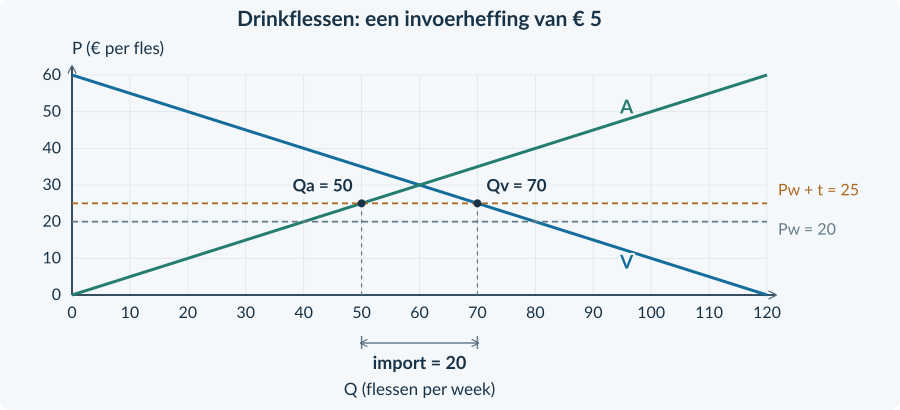
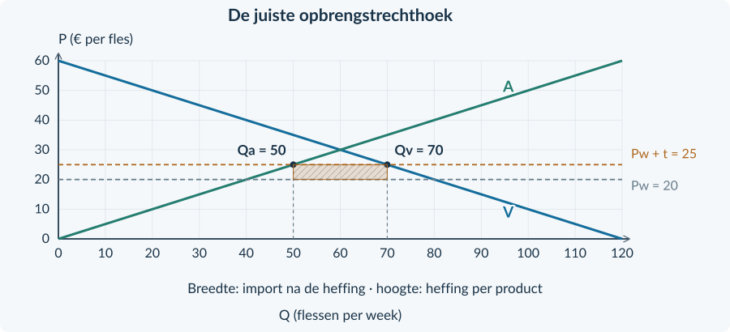
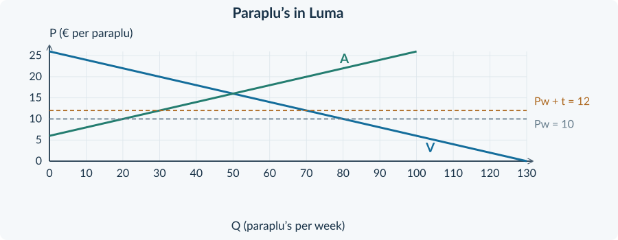
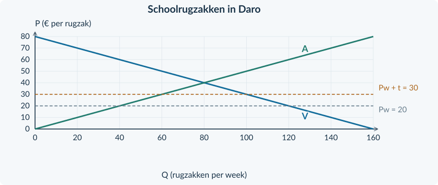

<!-- PAGE {"section": "3.3.3", "title": "Beschermen: voor wie?", "origin_chapter": "3.3", "origin_page": 21, "edition_page": 21} -->

3.3.3 · PROTECTIONISME: INVOERHEFFINGEN EN IMPORTQUOTA

# Beschermen: voor wie?
Een producent verliest klanten aan goedkopere import. Hij vraagt de regering om bescherming. Een winkelier protesteert: zijn klanten willen juist goedkoop kunnen kopen. Beiden kijken naar dezelfde markt, maar niet vanuit hetzelfde belang.

<b>Lesdoelen</b> Je kunt het doel en de gevolgen van protectionisme onderscheiden. Je kunt resterende import en heffingsopbrengst berekenen. Je kunt een invoerheffing vergelijken met een importquotum en herkennen wanneer import verdwijnt.

<b>Protectionisme</b> Maatregelen die binnenlandse producenten beschermen tegen buitenlandse concurrentie door handel te beperken.

### Een doel is nog geen uitkomst
Een overheid kan minder afhankelijk willen zijn van buitenlandse levering of binnenlandse productie willen behouden. Een bron moet duidelijk maken welk doel hier speelt. Daarna onderzoek je of de maatregel bij dat doel past en wie de gevolgen ondervindt.

| Mogelijk doel uit een bron | Vraag bij de beoordeling |
|---|---|
| Binnenlandse productie behouden | Stijgt de binnenlandse productie? Wie betaalt meer? |
| Minder afhankelijk worden | Blijft voldoende binnenlandse levering mogelijk? |
| Tijdelijk ruimte geven voor aanpassing | Is duidelijk hoe en wanneer de bescherming eindigt? |

### Twee instrumenten
Een **invoerheffing** maakt ingevoerde producten duurder. Een **importquotum** begrenst hoeveel er mogen worden ingevoerd. Beide kunnen import verminderen, maar ze werken niet op dezelfde manier.
<figure><figcaption>Figuur 1. Vraag steeds naar het doel, het mechanisme en de gevolgen voor afzonderlijke groepen. De bron bepaalt welke afweging je kunt maken.</figcaption></figure>
<b>We veranderen één aanname</b> Het kleine prijsnemende land en de concurrerende markt blijven. Nu vervalt de aanname van vrije invoer. We voegen niet tegelijk veranderende wisselkoersen of effecten op derden toe.

<!-- PAGE {"section": "3.3.3", "title": "Een heffing op ingevoerde producten", "origin_chapter": "3.3", "origin_page": 22, "edition_page": 22} -->

### Eerst de prijs, dan de hoeveelheden
Op de markt voor drinkflessen is de wereldprijs € 20 per fles. De overheid heft € 5 per ingevoerde fles. De importeur draagt de heffing af. Zolang import blijft plaatsvinden, komt een buitenlandse fles daarmee voor € 25 beschikbaar.

<b>Invoerheffing per eenheid</b> Een bedrag dat bij invoer per product aan de overheid moet worden betaald. De heffing geldt hier alleen voor ingevoerde producten.
<figure><figcaption>Figuur 2. De binnenlandse prijs stijgt van € 20 naar € 25. De binnenlandse productie neemt toe van 40 naar 50; het verbruik daalt van 80 naar 70. De import wordt kleiner.</figcaption></figure>
In het model concurreren identieke binnenlandse en ingevoerde flessen met elkaar. Binnenlandse producenten kunnen daardoor ook € 25 ontvangen. Zij dragen deze <b>invoer</b>heffing niet af over hun eigen binnenlandse productie.

<b>Zolang er import is</b> Binnenlandse prijs = wereldmarktprijs + heffing € 20 + € 5 = € 25 per fles

De binnenlandse aanbodlijn blijft staan; producenten bewegen langs die lijn. De wereldprijs blijft € 20: dit kleine land verandert die niet. De stijging van de binnenlandse prijs is dus niet hetzelfde als een hogere ontvangst voor de buitenlandse producent.

<b>Het is geen belasting op alle verkoop</b> Bij een algemene productbelasting kan elke verkochte eenheid belast zijn. Hier gaat het uitsluitend om de eenheden die de grens binnenkomen.

<!-- PAGE {"section": "3.3.3", "title": "De overheid ontvangt over de import", "origin_chapter": "3.3", "origin_page": 23, "edition_page": 23} -->

### De juiste breedte van de rechthoek
Na de heffing gebruiken binnenlandse kopers 70 flessen. Binnenlandse producenten leveren er 50. Er worden dus nog maar 20 flessen ingevoerd.
<figure><figcaption>Figuur 3. De hoogte is € 5 per geïmporteerde fles. De breedte is 20 geïmporteerde flessen per week, niet 70 verkochte flessen.</figcaption></figure>
<b>Heffingsopbrengst</b> Import na de heffing = Qv − Qa = 70 − 50 = 20 Opbrengst = heffing per eenheid × import Opbrengst = 5 × 20 = € 100 per week

### Drie groepen, drie gevolgen
**Binnenlandse kopers** betalen meer en kopen minder. Hun consumentensurplus daalt. **Binnenlandse producenten** krijgen een hogere prijs en produceren meer. Hun producentensurplus stijgt. **De overheid** ontvangt de heffing over de resterende import.

Belastingontvangsten zijn niet hetzelfde als verloren welvaart. In dit model van een klein land zonder externe effecten weegt de winst van producenten en overheid niet volledig op tegen het verlies van kopers. Het binnenlandse totale surplus, inclusief de heffingsopbrengst, daalt ten opzichte van vrije handel.

Dat oordeel volgt uit de genoemde aannames. Een beleidsdoel zoals leveringszekerheid is niet automatisch in deze surplusmaat verwerkt. Een hogere opbrengst voor één groep bewijst dus geen voordeel voor iedereen.

<!-- PAGE {"section": "3.3.3", "title": "Een grens aan de hoeveelheid en aan de prijsregel", "origin_chapter": "3.3", "origin_page": 24, "edition_page": 24} -->

### Een importquotum is geen geldbedrag

<b>Importquotum</b> Een maximum aan de hoeveelheid van een product die in een bepaalde periode mag worden ingevoerd.

Een quotum van 20 flessen per week kan in de drinkflessenmarkt tot dezelfde hoeveelheid import leiden als de heffing. Toch volgt daar niet dezelfde overheidsopbrengst uit. Bij gratis vergunningen zonder invoerheffing ontvangt de overheid niets per ingevoerde fles. Verkoop van vergunningen is een andere regeling; je moet die apart in de bron terugvinden.

Een **productiequotum** begrenst binnenlandse productie. Een **importquotum** begrenst de invoer. Verwissel deze hoeveelheden niet.
### Wat als er helemaal geen import overblijft?
Zonder handel ontstaat op de flessenmarkt een prijs van € 30. De wereldprijs is € 20. Bij een heffing van € 15 zou een importfles € 35 kosten. Binnenlandse producenten en kopers kunnen echter al bij € 30 een evenwicht bereiken.
<figure><figcaption>Figuur 4. De mogelijke invoerprijs van € 35 is niet de binnenlandse marktprijs. Bij € 30 voorziet de binnenlandse markt zelf in 60 flessen; import en heffingsopbrengst zijn nul.</figcaption></figure>
<b>Controle vóór gebruik</b> Gebruik Pw + heffing niet mechanisch als import verdwijnt. Kijk dan naar de binnenlandse markt zonder import.

<!-- PAGE {"section": "3.3.3", "title": "Van een beleidsbron naar een begrensde conclusie", "origin_chapter": "3.3", "origin_page": 25, "edition_page": 25} -->

## Uitgewerkt voorbeeld

<b>Lesbron · Sportballen in Orel</b> Orel is een klein prijsnemend land met concurrerende aanbieders en gelijkwaardige producten. Er zijn geen transportkosten of effecten op derden. De wereldprijs is € 12. Een heffing van € 4 per ingevoerde bal moet binnenlandse productie behouden. Importeurs dragen de heffing af. Er blijft import. Een alternatief is een importquotum met gratis vergunningen, zonder invoerheffing.

| Situatie | Binnenlandse prijs | Verbruik Qv | Productie Qa |
|---|---:|---:|---:|
| Vrije invoer | € 12 | 120 | 40 |
| Met heffing | € 16 | 100 | 60 |

Hoeveelheden in sportballen per week.

**1 · Lees de maatregel.** De heffing geldt per ingevoerde bal, niet voor alle 100 binnenlands verkochte ballen.

**2 · Bereken de import na de heffing.** 100 − 60 = **40 ballen per week**.

**3 · Bereken de overheidsopbrengst.** € 4 × 40 = **€ 160 per week**. In een grafiek loopt de rechthoek van Qa = 60 tot Qv = 100 en van P = € 12 tot P = € 16.

**4 · Leg uit per groep.** Binnenlandse producenten leveren 60 in plaats van 40 ballen en ontvangen meer per bal. Kopers betalen € 16 in plaats van € 12 en gebruiken minder. Het productiedoel wordt in dit model ondersteund; “iedereen wint” niet.

**5 · Vergelijk het quotum.** Gratis vergunningen zonder heffing leveren niet automatisch overheidsinkomsten op. Minder import en belastingopbrengst zijn verschillende uitkomsten.

<b>Onthouden</b> Controleer of import blijft. Bereken Qv − Qa na de heffing. Vermenigvuldig alleen die import met het bedrag per eenheid. Geef een conclusie per groep. Een quotum levert niet vanzelf dezelfde ontvangsten op.

<!-- PAGE {"section": "3.3.3", "title": "Het juiste aantal belasten", "origin_chapter": "3.3", "origin_page": 26, "edition_page": 26} -->

## Startopgaven

<b>Korte route:</b> Startopgaven → Zelfstandige oefening → Doeloefening. Extra hulp nodig? Maak eerst Begeleide inoefening.

<b>Opgave 21 · Van aantal naar overheidsbedrag</b>

Bij een al eerder geleerde productbelasting wordt € 3 per belaste eenheid afgedragen. Er zijn 40 belaste eenheden per week.

<b>a.</b> Bereken de belastingopbrengst per week.

<b>b.</b> Waarom moet je weten welke eenheden belast zijn voordat je deze vermenigvuldiging uitvoert?

<b>Opgave 22 · Niet alle verkoop is import</b>

Een land verbruikt 90 houten borden en produceert er zelf 60 per week. De invoerheffing bedraagt € 2 per ingevoerd bord.

<b>a.</b> Over hoeveel borden ontvangt de overheid de heffing?

<b>b.</b> Een leerling gebruikt 90 als breedte van de opbrengstrechthoek. Leg de fout uit.

## Begeleide inoefening

Heb je deze hulp niet nodig? Ga dan verder met Zelfstandige oefening.

<b>Opgave 23 · Lees de ingevulde rechthoek</b>

Gebruik figuur 3 op pagina 23.

<b>a.</b> Noem eerst de twee grenzen van de rechthoek op de hoeveelheidsas. Welk verschil geven zij aan?

<b>b.</b> Noem de twee grenzen op de prijsas. Waarom is het verschil de heffing per fles?

<b>c.</b> Bereken de oppervlakte. Leg uit waarom dit geld geen ontvangst voor de binnenlandse flessenproducenten is.

<!-- PAGE {"section": "3.3.3", "title": "Twee veranderingen apart bekijken", "origin_chapter": "3.3", "origin_page": 27, "edition_page": 27} -->

Begeleide inoefening · vervolg

<b>Lesbron · De markt voor notitieboeken</b> Een klein prijsnemend land importeert notitieboeken. De wereldprijs is € 10 en de heffing € 2 per ingevoerd boek. Er vinden twee veranderingen plaats: de wereldprijs daalt naar € 8 en de heffing stijgt naar € 4. De binnenlandse vraag- en aanbodlijn blijven gelijk. Bij elk van de hieronder onderzochte situaties blijft import bestaan.

<b>Opgave 24 · Een hogere heffing, toch geen hogere winkelprijs?</b>

Behandel de twee veranderingen eerst afzonderlijk. Gebruik de tabel om je uitkomsten te ordenen.

<b>a.</b> Vul alle lege cellen in de tabel. Bereken steeds de binnenlandse prijs.

<b>b.</b> Leg uit wat met de import gebeurt als alleen de wereldprijs daalt.

<b>c.</b> Leg uit wat met de import gebeurt als beide veranderingen plaatsvinden.

<b>d.</b> Een leerling zegt: “De heffing stijgt, dus de binnenlandse prijs stijgt zeker.” Waarom klopt dat niet in de uiteindelijke situatie?

| Situatie | Wereldprijs | Heffing per boek | Binnenlandse prijs |
|---|---:|---:|---:|
| Begin | € 10 | € 2 | … |
| Alleen wereldprijs omlaag | € 8 | € 2 | … |
| Alleen heffing omhoog | € 10 | € 4 | … |
| Beide veranderingen | € 8 | € 4 | … |

### Verklaar met de juiste vergelijking
Vergelijk elke afzonderlijke verandering met het begin. Bij de laatste rij vergelijk je het eindresultaat met het begin. De heffing en de wereldprijs kunnen in tegengestelde richtingen werken.

<b>Zelf verder</b> Bij de volgende opgaven ontbreekt deze invultabel. Kies dan zelf eerst de relevante prijs en de belaste hoeveelheid.

<!-- PAGE {"section": "3.3.3", "title": "Zelfstandig een maatregel beoordelen", "origin_chapter": "3.3", "origin_page": 28, "edition_page": 28} -->

## Zelfstandige oefening

<b>Lesbron · Paraplu’s in Luma</b> Luma is klein en prijsnemend; de aannames van pagina 11 gelden, behalve vrije invoer. De wereldprijs is € 10. Luma voert een heffing van € 2 per geïmporteerde paraplu in. Importeurs dragen af. Er blijft import. De maatregel moet binnenlandse producenten meer afzet geven.
<figure><figcaption>Figuur 5. Vul bij deze gegeven paraplumarkt de opbrengstrechthoek aan.</figcaption></figure>

<b>Opgave 25 · Wie wordt beschermd?</b>

Gebruik de lesbron en figuur 5.

<b>a.</b> Bereken de import na de heffing en de heffingsopbrengst per week.

<b>b.</b> Arceer de heffingsopbrengst in figuur 5 en benoem de breedte en hoogte.

<b>c.</b> Leg uit of het genoemde productiedoel door de grafiek wordt ondersteund. Benoem ook een nadeel voor binnenlandse kopers.

<b>d.</b> Een alternatief quotum krijgt gratis vergunningen, zonder invoerheffing. Mag je dan dezelfde overheidsopbrengst invullen? Leg uit.

<b>Lesbron · Geen invoer meer</b> Een andere kleine, concurrerende markt bereikt zonder import evenwicht bij € 18. De wereldprijs is € 12. Een invoerheffing van € 9 per product verandert deze wereldprijs niet.

<b>Opgave 26 · Welke prijs geldt?</b>

Gebruik de tweede lesbron.

<b>a.</b> Waarom wordt de binnenlandse prijs in dit model niet automatisch € 21?

<b>b.</b> Wat betekent de uitkomst voor import en heffingsopbrengst?

<!-- PAGE {"section": "3.3.3", "title": "Laat zien wat je kunt", "origin_chapter": "3.3", "origin_page": 29, "edition_page": 29} -->

## Doeloefening

<b>Lesbron · Schoolrugzakken in Daro</b> Daro is klein en prijsnemend. Er zijn veel concurrerende aanbieders van gelijkwaardige rugzakken. Transportkosten en effecten op derden ontbreken. De wereldprijs is € 20. Daro heft € 10 per ingevoerde rugzak, afgedragen door importeurs. Er blijft import. De minister wil meer binnenlandse productie. Winkeliers vrezen hogere prijzen voor scholieren. Een alternatief is een quotum met gratis vergunningen, zonder heffing.

| Situatie | Prijs | Verbruik per week | Productie per week |
|---|---:|---:|---:|
| Vrije invoer | € 20 | 120 | 40 |
| Met heffing | € 30 | 100 | 60 |
<figure><figcaption>Figuur 6. De lijnen en prijzen zijn gegeven. Teken alleen de gevraagde opbrengstrechthoek; niet opnieuw de markt.</figcaption></figure>

<b>Opgave 27 · Doel, berekening en verdeling</b>

Gebruik de lesbron, tabel en figuur 6.

<b>a.</b> (3p) Bereken de import na de heffing en de heffingsopbrengst per week.

<b>b.</b> (2p) Arceer in figuur 6 de heffingsopbrengst. Benoem de breedte en hoogte met eenheid.

<b>c.</b> (2p) Leg met gegevens uit waarom binnenlandse producenten en kopers verschillend worden geraakt.

<b>d.</b> (2p) Beoordeel: “Het productiedoel wordt bereikt, dus de maatregel is voor iedereen gunstig.”

<b>e.</b> (2p) Waarom levert het beschreven alternatieve quotum niet dezelfde overheidsopbrengst op?

<!-- PAGE {"section": "3.3.3", "title": "Wat bewijst een beleidsargument?", "origin_chapter": "3.3", "origin_page": 30, "edition_page": 30} -->

## Denkertje / Bonusopgave

<b>Opgave 28 · Banen behouden is niet hetzelfde als iedereen helpen</b>

Een beleidsbrief zegt: “De heffing beschermt onze producenten. Daarom worden in het hele land meer banen gecreëerd.” De brief bevat alleen de binnenlandse prijs en de productie in deze ene bedrijfstak.

<b>a.</b> Leg uit welk deel van de redenering door zulke cijfers ondersteund kan worden en welke sprong niet bewezen is.

<b>b.</b> Noem twee soorten aanvullende informatie die je zou vragen om de bredere werkgelegenheidsclaim te beoordelen. Je hoeft geen arbeidsmarktformules te gebruiken.

## Herhaling / Herhaling en interleaving

<b>Opgave 29 · Verschillende belastinggrondslagen</b>

In een eerder geleerde algemene productbelasting zijn alle 100 verkochte producten belast met € 2. In een andere situatie belast een invoerheffing alleen 30 ingevoerde producten met € 2.

<b>a.</b> Bereken in beide situaties de overheidsopbrengst.

<b>b.</b> Leg uit waarom dezelfde heffing per eenheid niet automatisch dezelfde totale opbrengst geeft.

<b>Opgave 30 · Een prijsstijging en de reactie</b>

Een prijs stijgt van € 10 naar € 12. De gevraagde hoeveelheid daalt van 100 naar 90.

<b>a.</b> Bereken de prijselasticiteit van de vraag met de oude waarden als basis.

<b>b.</b> Is de vraag prijselastisch of prijsinelastisch? Gebruik de absolute waarde van Ev.

<b>Neem mee</b> Een bron kan een doel ondersteunen zonder alle voordelen en nadelen te bewijzen. In de gemengde opgaven combineer je de berekening met een begrensde conclusie.

