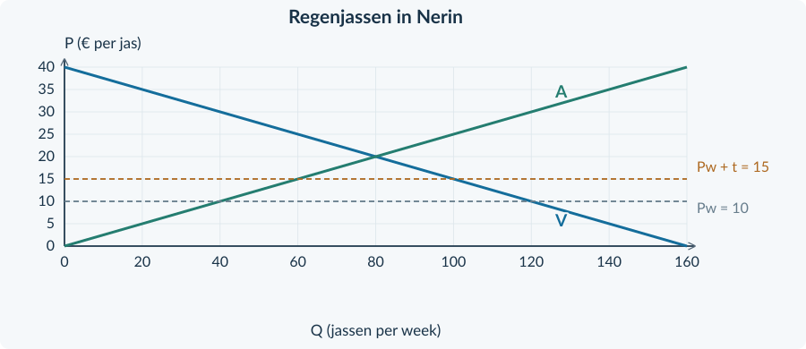

<!-- PAGE {"section": "3.3.4", "title": "Het hele verhaal verbinden", "origin_chapter": "3.3", "origin_page": 31, "edition_page": 31} -->

3.3.4 · GEMENGDE OPGAVEN: INTERNATIONALE HANDEL

# Het hele verhaal verbinden
Je kiest nu zelf de passende begrippen en berekeningen. Een grafiek vertelt hoeveel wordt gekocht en gemaakt. Een bron helpt je verklaren waarom een groep voor of tegen een maatregel is.

<b>Lesdoelen</b> Je kunt relevante brongegevens kiezen, comparatief voordeel in woorden uitleggen en import of heffingsopbrengst berekenen. Je kunt een conclusie onderbouwen die onderscheid maakt tussen een gezamenlijk resultaat en de gevolgen voor groepen.
<figure><figcaption>Figuur 1. Bekende onderdelen, één antwoord: lees de situatie, gebruik de passende methode en begrens je conclusie.</figcaption></figure>
### Gemengde opgaven

<b>Opgave 31 · Kies het passende begrip</b>

Koppel elke vraag aan het passende begrip. Licht één keuze toe.

<b>a.</b> “Wie geeft voor extra textiel relatief minder machineproductie op?” Kies: absoluut voordeel, comparatief voordeel of totale opbrengst.

<b>b.</b> “Hoeveel koopt het land bij van het buitenland?” Kies: binnenlands verbruik, binnenlandse productie of import.

<b>Opgave 32 · Een hogere wereldprijs</b>

Een klein prijsnemend land kan appels uitvoeren. Zonder handel was de prijs € 2 per kg. Met handel is die € 3. Bij € 3 is het binnenlandse aanbod 100 kg en de binnenlandse vraag 60 kg per week. Overige modelaannames blijven gelijk.

<b>a.</b> Bereken de export per week.

<b>b.</b> Leg uit waarom een appelteler en een binnenlandse appelkoper verschillend kunnen oordelen over deze handelsmogelijkheid.

<!-- PAGE {"section": "3.3.4", "title": "Waarom een land inkoopt wat het zelf kan maken", "origin_chapter": "3.3", "origin_page": 32, "edition_page": 32} -->

<b>Lesbron · Havens en werkplaatsen</b> Toren en Vale maken scheepsonderdelen en verpakkingen van dezelfde kwaliteit. Toren heeft voor beide producten minder productiemiddelen nodig. De voorsprong bij scheepsonderdelen is groot; bij verpakkingen is zij klein. Voor extra verpakkingen geeft Toren relatief veel scheepsonderdelen op. Vale geeft daarvoor minder scheepsonderdelen op.  Een bedrijf in Toren koopt verpakkingen uit Vale. Die komen op tijd aan. Een lokale verpakkingsproducent in Toren verliest daardoor een klant.

<b>Opgave 33 · Een verstandig besluit?</b>

Beoordeel de situatie uitsluitend met de lesbron.

<b>a.</b> Leg uit waarom import van verpakkingen door Toren kan passen bij comparatief voordeel, hoewel Toren beide producten met minder middelen kan maken.

<b>b.</b> Beschrijf de levering van verpakkingen vanuit het gezichtspunt van beide landen.

<b>c.</b> Welke broninformatie ondersteunt een concurrentievoordeel van Vale’s leverancier naast de productiemiddelenvergelijking?

<b>d.</b> Een woordvoerder zegt: “Alle bedrijven in Toren profiteren van de import.” Beoordeel deze uitspraak.

### Een bruikbaar antwoord blijft precies
In deze bron zijn drie verschillende vergelijkingen mogelijk. Je kunt benodigde middelen vergelijken, opgegeven andere productie vergelijken of de kwaliteit van de levering bekijken. Dat zijn niet drie namen voor hetzelfde begrip.

<b>Controle na het schrijven</b> Lees je antwoord terug. Is bij elke conclusie duidelijk welk bronfeit haar ondersteunt? Heb je geen cijfers of gevolgen verzonnen die niet in de bron staan?

<!-- PAGE {"section": "3.3.4", "title": "Eén tabel, tegengestelde belangen", "origin_chapter": "3.3", "origin_page": 33, "edition_page": 33} -->

<b>Lesbron · Keukendoeken in Ferra</b> Ferra is een klein prijsnemend land met gelijkwaardige producten en concurrentie. Er zijn geen transportkosten of effecten op derden. Een invoerheffing van € 3 per doek moet lokale productie behouden. De wereldprijs blijft € 9 en import blijft bestaan.

| Situatie | Prijs per doek | Verbruik per week | Productie per week |
|---|---:|---:|---:|
| Vrije invoer | € 9 | 110 | 50 |
| Met heffing | € 12 | 90 | 70 |

<b>Opgave 34 · Een heffing verdedigen of afwijzen</b>

Gebruik de lesbron en tabel.

<b>a.</b> Bereken de resterende import en de heffingsopbrengst per week.

<b>b.</b> Geef met de tabel een argument vóór de maatregel vanuit een binnenlandse producent.

<b>c.</b> Geef met de tabel een argument tegen de maatregel vanuit een binnenlandse koper.

<b>d.</b> Formuleer een conclusie waarin je het productiedoel beoordeelt, maar niet beweert dat alle inwoners erop vooruitgaan.

<figure><figcaption>Figuur 2. Dezelfde maatregel kan voor verschillende groepen tegengestelde gevolgen hebben. Een beleidsconclusie benoemt het gekozen doel en het nadeel voor een andere groep.</figcaption></figure>
<b>Klaar voor de doeloefening</b> Op de volgende twee pagina’s staan de bronnen en vragen bij elkaar. Gebruik de gegeven grafiek; volledige nieuwe grafiekconstructie is niet nodig.

<!-- PAGE {"section": "3.3.4", "title": "Bronnen bij de doeloefening", "origin_chapter": "3.3", "origin_page": 34, "edition_page": 34} -->

## Doeloefening

OPGAVE 35 · REGENJASSEN IN NERIN · BRONNEN

<b>Bron A · Productie en specialisatie</b> Nerin en Pelta maken machines en regenjassen van dezelfde kwaliteit. Nerin gebruikt voor beide minder middelen. Het voordeel bij machines is groot; bij jassen klein. Voor extra jassen geeft Nerin relatief veel machineproductie op. Pelta geeft daarvoor minder machines op. Beide landen kunnen hun productiemiddelen voor beide activiteiten gebruiken.

<b>Bron B · Markt en maatregel</b> Nerin is klein en prijsnemend. De markt kent concurrentie, voldoende buitenlandse levering, geen transportkosten en geen effecten op derden. Alle prijzen zijn in euro. De wereldprijs is € 10. Nerin heft € 5 per ingevoerde jas, afgedragen door importeurs. Er blijft import. De minister wil binnenlandse productie behouden. Een winkelier wijst op duurdere regenkleding voor gezinnen.

| Situatie | Prijs per jas | Binnenlands verbruik | Binnenlandse productie |
|---|---:|---:|---:|
| Vrije invoer | € 10 | 120 | 40 |
| Met heffing | € 15 | 100 | 60 |

Alle hoeveelheden zijn regenjassen per week.

<figure><figcaption>Figuur 3. De binnenlandse regenjassenmarkt. De twee prijslijnen zijn gegeven; de heffingsopbrengst is nog niet aangegeven.</figcaption></figure>
<b>Bron C · Een alternatief</b> Een voorstel wil de invoer begrenzen met een importquotum. De overheid geeft de invoervergunningen gratis weg en heft geen invoerheffing.

De vragen staan op de tegenoverliggende pagina.

<!-- PAGE {"section": "3.3.4", "title": "Vragen bij de doeloefening", "origin_chapter": "3.3", "origin_page": 35, "edition_page": 35} -->

Doeloefening · vervolg

<b>Opgave 35 · Regenjassen in Nerin</b>

Gebruik de drie bronnen, de tabel en figuur 3 op pagina 34. Noteer bij berekeningen de eenheden en bij uitleg het gebruikte brongegeven.

<b>a.</b> (3p) Leg met bron A uit waarom Pelta een comparatief voordeel kan hebben bij regenjassen, terwijl Nerin bij beide activiteiten een absoluut voordeel heeft.

<b>b.</b> (3p) Bereken met bron B de import na de heffing en de heffingsopbrengst per week.

<b>c.</b> (3p) Leg met prijs én hoeveelheid uit wat de maatregel betekent voor binnenlandse jassenmakers en binnenlandse kopers.

<b>d.</b> (2p) Arceer de heffingsopbrengst in figuur 3. Benoem de breedte en hoogte met hun eenheden.

<b>e.</b> (2p) Waarom mag de overheid bij het quotum uit bron C niet zonder meer dezelfde ontvangsten verwachten?

<b>f.</b> (3p) De minister zegt: “De binnenlandse productie stijgt, dus de heffing is voor alle inwoners gunstig.” Geef een oordeel met twee concrete gegevens uit de bronnen of tabel. Maak duidelijk welke conclusie wél wordt ondersteund.

### Controle vóór het inleveren
Je hebt niet opnieuw alle surplusgebieden hoeven uitrekenen. Je moet wel uitleggen welke groepen een hogere prijs ontvangen of juist betalen.

Controleer je eigen werk: heb je alleen de <b>ingevoerde</b> jassen belast? En heb je bij het comparatieve voordeel uitgelegd wat Pelta relatief minder opgeeft?

<b>Een goede eindzin</b> Een sterke conclusie kan een beleidseffect erkennen én een te brede uitspraak afwijzen. Dat is geen tegenspraak.

<!-- PAGE {"section": "3.3.4", "title": "Het model gebruiken zonder het te overdrijven", "origin_chapter": "3.3", "origin_page": 36, "edition_page": 36} -->

### Denkertje / Bonusopgave

<b>Lesbron · Hetzelfde prijskaartje, ander product</b> Twee winkels verkopen jassen voor dezelfde prijs. De ene jas gaat volgens de bron langer mee; de andere kan sneller worden geleverd. Een onderzoeker gebruikt toch één marktmodel waarin alle jassen volledig gelijkwaardig zijn. Hij schrijft: “Het prijskaartje is gelijk, dus voor de koper maakt de keuze niet uit.”

<b>Opgave 36 · Past deze aanname?</b>

Je hoeft geen nieuwe grafiek of prijsberekening te maken.

<b>a.</b> Welke aanname botst met de informatie in de bron?

<b>b.</b> Leg uit waarom kopers met verschillende wensen toch verschillende keuzes kunnen maken.

<b>c.</b> Formuleer een betere conclusie die onderscheid maakt tussen de uitkomst van het vereenvoudigde model en de beschreven praktijk.

### Drie grenzen aan een economische conclusie
**De bron bepaalt wat bekend is.** Een naam of een product zegt niet vanzelf iets over alle kosten, alle banen of alle consumenten.

**Het model bepaalt wat je gelijk houdt.** In dit hoofdstuk werkt één kleine markt tegen een gegeven wereldprijs. Gebruik die aanname bewust, niet als uitspraak over elk land in de werkelijkheid.

**Het criterium bepaalt wat je beoordeelt.** “Meer binnenlandse productie” en “gunstig voor alle kopers” zijn verschillende doelen. Zeg welke vraag je beantwoordt.

<b>Zelfcontrole</b> Kun je een bronfeit, een modelaanname en een waardeoordeel van elkaar onderscheiden in je antwoord op opgave 35?

<!-- PAGE {"section": "3.3.4", "title": "Wat blijft er hangen?", "origin_chapter": "3.3", "origin_page": 37, "edition_page": 37} -->

### Herhaling / Herhaling en interleaving

<b>Opgave 37 · Een bekende heffing, geen invoerheffing</b>

Op een binnenlandse markt betaalt de koper na een algemene productbelasting € 12. De verkoper houdt € 9 per product over. Er worden 40 belaste producten per week verkocht.

<b>a.</b> Bereken de belasting per product en de belastingopbrengst per week.

<b>b.</b> Leg uit waarom je hier wél alle 40 verkochte producten gebruikt en bij een invoerheffing niet automatisch alle binnenlandse verkoop.

<b>Opgave 38 · Een producent onder concurrentie</b>

Een prijsnemende producent verkoopt 100 producten per week voor € 8. Zijn totale kosten zijn € 650 per week.

<b>a.</b> Bereken zijn totale opbrengst en winst per week.

<b>b.</b> Een andere prijsnemer heeft P = € 8 per kg en MK = 0,10q + 2. De capaciteit is 100 kg per week. Bereken de winstmaximale haalbare q en controleer of uitbreiden vóór en na die q gunstig is.

### Hoofdstukcheck
Beschrijf zonder formulekaart hoe je deze drie situaties aanpakt:

**Een land is bij beide activiteiten absoluut sterker.** Welke vergelijking heb je nog nodig voordat je een richting van specialisatie noemt?

**Een wereldprijs is gegeven.** Welke twee binnenlandse hoeveelheden lees je af en welke derde hoeveelheid leid je daaruit af?

**Een overheid heft bij invoer.** Welke hoeveelheid bepaalt de opbrengst en wanneer kun je de regel Pw + heffing niet meer mechanisch gebruiken?

<b>Verder in Boek 4</b> Het volgende boek begint met toetreding en langetermijnevenwicht. Daarna volgt monopolie: één onderneming heeft invloed op haar eigen verkoopprijs. De betekenis van kosten, opbrengst en vraag neem je mee, maar je controleert telkens welk marktmodel geldt.

