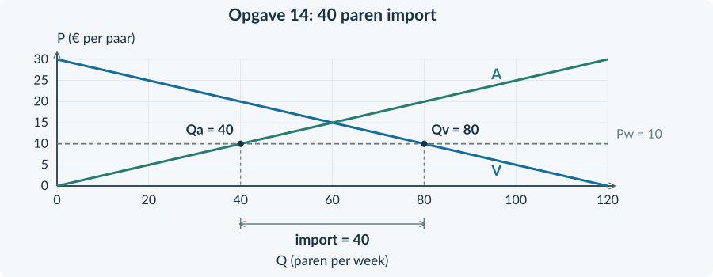
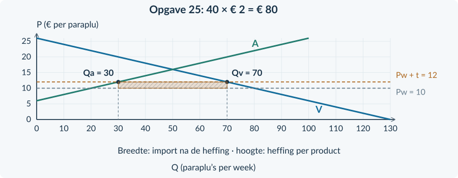

<!-- PAGE {"section": "3.3.1", "title": "Import, export en alternatieve kosten"} -->

BOEK 3 · HOOFDSTUK 3 · ANTWOORDEN

# Internationale handel
Controleer niet alleen het eindantwoord. Let ook op het gekozen brongegeven, de economische uitleg en de eenheid. Bij open vragen zijn gelijkwaardige formuleringen mogelijk.

<b>Afronding</b> Bewaar tussenuitkomsten. Rond geld zo nodig af op centen en procenten op twee decimalen. Geef de periode bij hoeveelheden en totale bedragen. De cijfers hier leveren meestal gehele uitkomsten op.

<h3>Opgave 1 · Wat geef je op?</h3>
<b>a.</b> De opgegeven mogelijkheid is het gebruik van het lokaal door de tekenclub. <i>Waarom:</i> Alternatieve kosten zijn het voordeel van de beste niet-gekozen mogelijkheid; er is geen geldbedrag gegeven.

<b>b.</b> Productiemiddelen voor tassen kunnen niet tegelijk voor andere producten worden gebruikt. Het land geeft andere productie op. <i>Waarom:</i> Hetzelfde schaarsteprobleem keert terug, maar de actoren zijn nu producenten in landen.

<h3>Opgave 2 · Richting en betekenis</h3>
<b>a.</b> Hout uit Osta is import van Nera. Meubels naar Osta zijn export van Nera. <i>Waarom:</i> De richting van de levering wordt bekeken vanuit Nera.

<b>b.</b> Er ontbreekt een vergelijking van de alternatieve kosten: hoeveel andere productie wordt opgegeven, vergeleken met een ander land? <i>Waarom:</i> Een winkelprijs is niet hetzelfde als opgegeven andere productie.

<h3>Opgave 3 · Lees eerst de vergelijking</h3>
<b>a.</b> “Sol heeft voor beide producten minder middelen nodig dan Terra.” Dat toont een absoluut voordeel van Sol. <i>Waarom:</i> Dit vergelijkt de benodigde middelen voor hetzelfde product.

<b>b.</b> “Terra offert daarvoor minder instrumenten op.” Terra heeft een comparatief voordeel bij kleding. <i>Waarom:</i> De vergelijking gaat nu over alternatieve kosten.

<b>c.</b> “Terra kan zich meer richten op <b>kleding</b>, omdat het daarvoor relatief minder <b>instrumenten</b> opgeeft.” <i>Waarom:</i> Het gekozen product volgt uit de lagere alternatieve kosten, niet uit de hoogste absolute productie.

<!-- PAGE {"section": "3.3.1", "title": "Bronfeit, gevolg en grens"} -->

<h3>Opgave 4 · Goedkoper én minder betrouwbaar</h3>
<b>a.</b> Minder materiaal voor dezelfde kwaliteit kan de kosten verlagen. Daardoor kan de producent bijvoorbeeld goedkoper aanbieden en aantrekkelijker worden voor de inkoper. <i>Waarom:</i> De verbetering vereist dat het kostenvoordeel relevant is voor de verkoop; een prijsdaling is niet gegeven.

<b>b.</b> Minder betrouwbare levering kan klanten kosten als zij de rugzakken op een bepaald tijdstip nodig hebben. <i>Waarom:</i> Een lage prijs is niet het enige koopcriterium in de bron.

<b>c.</b> Niet zeker. Nodig is informatie over hoeveel waarde de inkoper hecht aan op tijd leveren vergeleken met de mogelijke besparing. <i>Waarom:</i> De twee veranderingen werken in tegengestelde richting; de bron geeft hun onderlinge gewicht niet.

<b>d.</b> De bron vergelijkt niet de opgegeven andere productie in Canto met die in een ander land. Er is dus geen bewijs voor een comparatief voordeel. <i>Waarom:</i> Lager materiaalgebruik bij één product is nog geen vergelijking van alternatieve kosten.

<h3>Opgave 5 · Ook de minder sterke producent kan meedoen</h3>
<b>a.</b> Riva. Het maakt beide producten met minder productiemiddelen, bij verwaarloosbare kwaliteitsverschillen. <i>Waarom:</i> Dat is de absolute vergelijking uit de bron.

<b>b.</b> Riva richt zich meer op gereedschap; Sora meer op servies. Sora geeft voor extra servies minder gereedschap op. <i>Waarom:</i> Sora heeft lagere alternatieve kosten van servies; Riva’s relatieve kracht ligt bij gereedschap.

<b>c.</b> Bijvoorbeeld servies van Sora naar Riva: export voor Sora en import voor Riva. <i>Waarom:</i> Eén levering heeft twee benamingen door het verschillende gezichtspunt.

<b>d.</b> Sora kan ondanks zijn absolute nadeel een comparatief voordeel bij servies hebben en daaruit handelsmogelijkheden halen. De ruilafspraken moeten voor beide partijen aantrekkelijk zijn. <i>Waarom:</i> Absoluut minder productief zijn sluit een lagere alternatieve kost niet uit.

<!-- PAGE {"section": "3.3.1", "title": "Doeloefening · Aster en Brin"} -->

<h3>Opgave 6 · Concurrentie is meer dan prijs</h3>
<b>a.</b> De tentdoekproducent levert minder defecten bij dezelfde prijs. Die hogere kwaliteit maakt zijn aanbod aantrekkelijker. <i>Waarom:</i> De bron ondersteunt een kwaliteitsverklaring, niet een lagere-prijsverklaring.

<b>b.</b> De uitspraak is te breed. De bron noemt binnenlandse producenten die de order verliezen en bevat geen gegevens over werknemers in andere bedrijfstakken. <i>Waarom:</i> Het voordeel voor de winnaar van de order geldt niet automatisch voor alle anderen.

<h3>Opgave 7 · Handelen ondanks twee absolute voordelen</h3>
<b>a.</b> Aster heeft bij beide producten een absoluut voordeel: het heeft voor pompen én jassen minder productiemiddelen nodig, bij dezelfde kwaliteit. <i>Waarom:</i> Dit brongegeven vergelijkt middelen per product.

<b>b.</b> Brin heeft een comparatief voordeel bij jassen: het offert daarvoor relatief minder pompen op. Aster heeft een comparatief voordeel bij pompen. <i>Waarom:</i> De alternatieve kosten bepalen de relatieve specialisatie, ook als Aster absoluut sterker is in beide activiteiten.

<b>c.</b> Aster specialiseert zich meer in pompen; Brin meer in jassen. Jassen van Brin naar Aster zijn export van Brin en import van Aster. Omgekeerd kunnen pompen naar Brin gaan. <i>Waarom:</i> De handelsstromen passen bij de relatieve voordelen.

<b>d.</b> De ruilafspraken moeten voor beide partijen aantrekkelijk zijn ten opzichte van zelf produceren. Het op tijd leveren maakt Asters pompen bovendien aantrekkelijk voor buitenlandse kopers. <i>Waarom:</i> De eerste uitspraak gaat over wederzijds voordeel; de tweede over een concreet concurrentiekenmerk.

<b>e.</b> Onjuist als algemene conclusie. Jassenmakers in Aster kunnen klanten verliezen aan import uit Brin. De bron vermeldt dat nadeel uitdrukkelijk. <i>Waarom:</i> Minder middelen per product en mogelijk gezamenlijk handelsvoordeel bewijzen niet dat alle inwoners winnen.

<!-- PAGE {"section": "3.3.1", "title": "Bonus en herhaling"} -->

<h3>Opgave 8 · Twee woorden, twee vragen</h3>
<b>a.</b> De advertentie zegt iets over de verkoopprijs. Zij bewijst niet dat het land voor extra koekjes relatief minder andere productie opgeeft dan een ander land. <i>Waarom:</i> Een prijsvergelijking en een vergelijking van alternatieve kosten beantwoorden verschillende vragen.

<b>b.</b> Bijvoorbeeld: “Land A en land B maken koekjes en brood met dezelfde productiemiddelen. Voor extra koekjes geeft land A minder brood op dan land B.” Dan heeft A bij koekjes een comparatief voordeel. <i>Waarom:</i> De toegevoegde bron beschrijft de benodigde vergelijking rechtstreeks, zonder getallen.

<b>Beoordelingscriteria:</b> prijs en alternatieve kosten onderscheiden; twee landen en twee activiteiten benoemen; een heldere vergelijking van opgegeven andere productie. Andere correct onderbouwde antwoorden zijn mogelijk.

<h3>Opgave 9 · De oude basis telt</h3>
<b>a.</b> Procentuele stijging = (25 − 20) / 20 × 100% = <b>25%</b>. <i>Waarom:</i> De oude prijs van € 20 is de basis.

<b>b.</b> Daling = (20 − 25) / 25 × 100% = <b>−20%</b>. De procentuele daling is dus niet even groot als de stijging. <i>Waarom:</i> Bij de terugkeer is € 25 de oude prijs; de basis is veranderd.

<h3>Opgave 10 · Het verschil tussen opbrengst en voordeel</h3>
<b>a.</b> CS van deze koper = betalingsbereidheid − prijs = 35 − 25 = <b>€ 10</b>. <i>Waarom:</i> Deze koper betaalt € 10 minder dan hij maximaal wilde betalen.

<b>b.</b> TO = P × Q = 25 × 40 = <b>€ 1.000</b>. Dit is het geld dat de winkel ontvangt. Voor gezamenlijk CS zijn de betalingsbereidheden van alle kopers nodig. <i>Waarom:</i> Ontvangsten en kopersvoordeel zijn verschillende economische grootheden.

<b>Herhaal bij een fout</b> Voor procentuele veranderingen: §1.1.2. Voor consumentensurplus: §2.3.1. Voor TO: §2.1.2.

<!-- PAGE {"section": "3.3.2", "title": "Bij één prijs twee hoeveelheden"} -->

## Wereldmarktprijs, import en export

<h3>Opgave 11 · Invullen bij een prijs</h3>
<b>a.</b> Qv = 100 − 2 × 20 = <b>60 producten per week</b>. Qa = 2 × 20 − 20 = <b>20 producten per week</b>. <i>Waarom:</i> Je vult dezelfde gegeven prijs in twee verschillende functies in.

<b>b.</b> Qv = 60 hoort bij binnenlandse kopers. Qa = 20 hoort bij binnenlandse producenten. <i>Waarom:</i> Vraag meet verbruik bij deze prijs; aanbod meet binnenlandse productie.

<h3>Opgave 12 · Welk getal is import?</h3>
<b>a.</b> Import = Qv − Qa = 70 − 30 = <b>40 kratten per week</b>. <i>Waarom:</i> De buitenlandse levering vult het verschil aan.

<b>b.</b> 70 is het totale binnenlandse verbruik. Daarvan worden 30 kratten binnenlands geproduceerd; alleen 40 komen van buiten. <i>Waarom:</i> Binnenlands verbruik bestaat hier uit binnenlandse productie plus import.

<h3>Opgave 13 · Lees de drie labels</h3>
<b>a.</b> De wereldprijslijn is P = € 20. Het punt op A bij Qa = 40 bepaalt de binnenlandse productie. <i>Waarom:</i> Producenten kiezen hun aanbod bij die prijs.

<b>b.</b> Het punt op V bij Qv = 80 bepaalt het verbruik. De pijl toont de 40 tassen die het buitenland levert. <i>Waarom:</i> 80 gevraagde tassen minus 40 binnenlandse tassen geeft de import.

<b>c.</b> De prijs daalt van € 30 naar € 20. Kopers betalen minder, terwijl binnenlandse producenten minder per tas ontvangen. <i>Waarom:</i> Eén prijsverandering werkt verschillend voor betalen en ontvangen.

<!-- PAGE {"section": "3.3.2", "title": "Een gegeven grafiek aanvullen"} -->

<h3>Opgave 14 · Waar komt het verschil vandaan?</h3>
<b>a.</b> Binnenlandse productie is <b>40 paren per week</b>; verbruik is <b>80 paren per week</b>. “Productie” hoort bij Qa = 40; “verbruik” bij Qv = 80. <i>Waarom:</i> De twee punten liggen op verschillende lijnen bij dezelfde prijs.

<b>b.</b> Import = 80 − 40 = <b>40 paren per week</b>. Markeer het horizontale verschil tussen Q = 40 en Q = 80. <i>Waarom:</i> Er wordt meer binnenlands verbruikt dan geproduceerd.

<b>c.</b> Kopers betalen € 10 in plaats van € 15; hun CS stijgt. Binnenlandse producenten ontvangen minder en leveren minder; hun PS daalt. <i>Waarom:</i> De prijsdaling vergroot het kopersvoordeel en verkleint het producentenvoordeel.

<figure><figcaption>Antwoordfiguur bij opgave 14. Productie 40, verbruik 80 en import 40 paren per week.</figcaption></figure>
<h3>Opgave 15 · Drie hoeveelheden</h3>
<b>a.</b> Bij € 15: productie 30, verbruik 90. Import = 90 − 30 = <b>60 boxen per week</b>. <i>Waarom:</i> De wereldprijs ligt beneden de prijs zonder handel.

<b>b.</b> De prijs voor producenten daalt van € 20 naar € 15. Hun productie daalt van 60 naar 30 boxen per week. <i>Waarom:</i> Bij een lagere prijs willen binnenlandse producenten minder leveren.

<b>c.</b> CS stijgt. Niet iedereen wint: binnenlandse producenten verliezen surplus door de lagere prijs. <i>Waarom:</i> Een stijgend totaal is verenigbaar met een daling bij één groep.

<!-- PAGE {"section": "3.3.2", "title": "Doeloefening · Kampeermatten"} -->

<h3>Opgave 16 · De andere handelsrichting</h3>
<b>a.</b> Export = Qa − Qv = 90 − 50 = <b>40 kg kaas per week</b>. <i>Waarom:</i> Buitenlandse kopers nemen het binnenlandse productieoverschot af.

<b>b.</b> Producenten ontvangen € 8 in plaats van € 6 per kg. Binnenlandse kopers moeten die hogere prijs ook betalen. PS stijgt en CS daalt. <i>Waarom:</i> De uitvoermogelijkheid is gunstig voor verkopers, niet automatisch voor binnenlandse kopers.

<b>c.</b> Vela is klein en prijsnemend: zijn export verandert de gegeven wereldmarktprijs niet. <i>Waarom:</i> Dat is de expliciete modelaanname uit de bron.

<h3>Opgave 17 · Import en binnenlandse belangen</h3>
<b>a.</b> Bij P = € 30: Qa = <b>60 matten</b> en Qv = <b>100 matten per week</b>. Import = 100 − 60 = <b>40 matten per week</b>. <i>Waarom:</i> De wereldmarkt vult het verschil tussen verbruik en productie.

<b>b.</b> Zonder handel: P = € 40 en Q = 80. Met import: P = € 30 en Qa = 60. Binnenlandse producenten ontvangen minder en produceren minder. <i>Waarom:</i> De lagere gegeven prijs leidt tot beweging langs de aanbodlijn.

<b>c.</b> Het binnenlandse CS stijgt: kopers betalen minder en het verbruik neemt toe van 80 naar 100 matten. <i>Waarom:</i> Een lagere prijs vergroot het verschil met de betalingsbereidheid voor kopers.

<b>d.</b> De conclusie is onjuist. Binnenlandse producenten verliezen surplus, ook als CS + PS samen stijgt. <i>Waarom:</i> Het totaal zegt niet dat ieder onderdeel toeneemt.

<b>e.</b> Noro is volgens de bron klein en prijsnemend. Zijn handelsomvang heeft geen invloed op de wereldprijs. <i>Waarom:</i> Dit is een expliciete modelaanname, geen algemeen bewijs voor elk land.

<figure><figcaption>Antwoordfiguur bij opgave 17. Het horizontale verschil bij € 30 is de import.</figcaption></figure>

<!-- PAGE {"section": "3.3.2", "title": "Modelgrenzen en herhaling"} -->

<h3>Opgave 18 · Een verborgen transportprobleem</h3>
<b>a.</b> De aanname van beschikbare handel zonder transportproblemen gaat voor het dorp niet op. <i>Waarom:</i> Een lage prijs in de haven betekent niet dat het product ook in het dorp beschikbaar is.

<b>b.</b> De uitspraak is te sterk. Je moet onder meer weten of en tegen welke vervoerskosten graan het dorp kan bereiken. <i>Waarom:</i> Zonder bereikbaarheid kun je de wereldprijs niet rechtstreeks als dorpsprijs gebruiken.

<b>Beoordelingscriteria:</b> de geschonden aanname noemen; havenprijs en bereikbare lokale prijs onderscheiden; aanvullende vervoersinformatie benoemen. Andere correct onderbouwde antwoorden zijn mogelijk.

<h3>Opgave 19 · Relatief minder opofferen</h3>
<b>a.</b> Runo heeft een comparatief voordeel bij schoenen: het offert daarvoor minder meetapparatuur op. <i>Waarom:</i> De relevante vergelijking is de opgegeven andere productie.

<b>b.</b> Ook een land met een absoluut nadeel in beide activiteiten kan een comparatief voordeel in één activiteit hebben. Runo kan zich meer op schoenen richten en die uitvoeren. <i>Waarom:</i> Het absolute voordeel bepaalt niet alleen de zin van handel.

<h3>Opgave 20 · Een prijsnemende onderneming</h3>
<b>a.</b> TO = 5 × 80 = <b>€ 400 per week</b>. GO = 400 / 80 = <b>€ 5 per product</b>. <i>Waarom:</i> Totaal gaat over de hele verkoop; gemiddeld over één product.

<b>b.</b> Extra TO = 5 × 10 = <b>€ 50 per week</b>. MO = ΔTO / ΔQ = 50 / 10 = <b>€ 5 per product</b>. <i>Waarom:</i> Elk extra verkocht product levert bij de vaste prijs hetzelfde bedrag op.

<b>Herhaal bij een fout</b> Import en export: figuren 2 en 3 van §3.3.2. Marginale opbrengst: §§2.1.3 en 3.2.1.

<!-- PAGE {"section": "3.3.3", "title": "De belaste hoeveelheid kiezen"} -->

## Protectionisme

<h3>Opgave 21 · Van aantal naar overheidsbedrag</h3>
<b>a.</b> Opbrengst = belasting per eenheid × belaste hoeveelheid = 3 × 40 = <b>€ 120 per week</b>. <i>Waarom:</i> Alleen de eenheden waarop de belasting werkelijk geldt, tellen mee.

<b>b.</b> De vermenigvuldiging gebruikt de belaste hoeveelheid. Bij een invoerheffing zijn dat alleen ingevoerde producten; bij de beschreven algemene belasting zijn alle genoemde eenheden belast. <i>Waarom:</i> Het instrument bepaalt de juiste grondslag.

<h3>Opgave 22 · Niet alle verkoop is import</h3>
<b>a.</b> Import = 90 − 60 = <b>30 borden per week</b>. Alleen over deze 30 ontvangt de overheid € 2 per bord. <i>Waarom:</i> 60 borden zijn binnenlands geproduceerd en vallen niet onder deze invoerheffing.

<b>b.</b> 90 is het totale verbruik, niet de import. De breedte moet 90 − 60 = 30 zijn. <i>Waarom:</i> De rechthoek stelt alleen ontvangsten over geïmporteerde eenheden voor.

<h3>Opgave 23 · Lees de ingevulde rechthoek</h3>
<b>a.</b> De grenzen zijn Qa = 50 en Qv = 70. Het verschil is 70 − 50 = <b>20 geïmporteerde flessen per week</b>. <i>Waarom:</i> De import vult aan wat binnenlandse producenten niet leveren.

<b>b.</b> De grenzen zijn € 20 en € 25 per fles. Het verschil van <b>€ 5 per fles</b> is de invoerheffing. <i>Waarom:</i> De wereldprijs blijft gelijk; de heffing verklaart het verschil met de binnenlandse prijs.

<b>c.</b> Oppervlakte = 20 × 5 = <b>€ 100 per week</b>. Importeurs dragen dit bedrag af aan de overheid. Het is geen ontvangst voor binnenlandse producenten. <i>Waarom:</i> Die producenten profiteren van de hogere verkoopprijs, maar ontvangen de belasting niet.

<!-- PAGE {"section": "3.3.3", "title": "Twee veranderingen en een beleidsdoel"} -->

<h3>Opgave 24 · Een hogere heffing, toch geen hogere winkelprijs?</h3>
<b>a.</b> Binnenlandse prijs = wereldprijs + heffing. Begin: 10 + 2 = <b>€ 12</b>. Alleen wereldprijs omlaag: 8 + 2 = <b>€ 10</b>. Alleen heffing omhoog: 10 + 4 = <b>€ 14</b>. Beide: 8 + 4 = <b>€ 12 per boek</b>. <i>Waarom:</i> Volgens de bron blijft in elk van deze situaties import bestaan; daarom mag de prijsregel worden gebruikt.

<b>b.</b> Bij alleen een lagere wereldprijs daalt de binnenlandse prijs van € 12 naar € 10. Verbruik stijgt en binnenlandse productie daalt, zodat import toeneemt. <i>Waarom:</i> De vraag- en aanbodlijn blijven gelijk; alleen de gekozen prijs verandert.

<b>c.</b> Bij beide veranderingen blijft de binnenlandse prijs € 12. Door de onveranderde lijnen blijven productie, verbruik en import gelijk aan het begin. <i>Waarom:</i> De twee prijseffecten heffen elkaar precies op.

<b>d.</b> De leerling bekijkt alleen de heffing. De wereldprijs daalt tegelijk met hetzelfde bedrag als de heffing stijgt. <i>Waarom:</i> Een verandering van één component bepaalt niet alleen de som.

| Situatie | Wereldprijs | Heffing | Binnenlandse prijs |
|---|---:|---:|---:|
| Begin | € 10 | € 2 | € 12 |
| Alleen wereldprijs daalt | € 8 | € 2 | € 10 |
| Alleen heffing stijgt | € 10 | € 4 | € 14 |
| Beide | € 8 | € 4 | € 12 |

<b>De beslissende vergelijking</b> De heffing is een onderdeel van de binnenlandse prijs. De wereldprijs kan tegelijk veranderen. Beoordeel daarom niet alleen één onderdeel.

<!-- PAGE {"section": "3.3.3", "title": "Van tarief naar opbrengst"} -->

<h3>Opgave 25 · Wie wordt beschermd?</h3>
<b>a.</b> Import na heffing = 70 − 30 = <b>40 paraplu’s per week</b>. Opbrengst = 2 × 40 = <b>€ 80 per week</b>. <i>Waarom:</i> De import na de maatregel, niet het oude of totale verbruik, is belast.

<b>b.</b> Rechthoek van Q = 30 tot Q = 70 en van P = € 10 tot P = € 12. Breedte 40 paraplu’s per week; hoogte € 2 per paraplu. <i>Waarom:</i> Breedte maal hoogte is de eerder berekende € 80 per week.

<b>c.</b> Ja, het model toont meer binnenlandse productie: 20 → 30 paraplu’s per week. Kopers betalen echter € 12 in plaats van € 10 en gebruiken minder. <i>Waarom:</i> Een bereikt productiedoel kan samengaan met een nadeel voor kopers.

<b>d.</b> Nee. Bij gratis vergunningen zonder invoerheffing ontvangt de overheid niet automatisch geld per geïmporteerde paraplu. <i>Waarom:</i> Een hoeveelheidsgrens is geen belastingbetaling.

<h3>Opgave 26 · Welke prijs geldt?</h3>
<b>a.</b> De mogelijke importprijs is 12 + 9 = € 21. Maar de binnenlandse markt bereikt al bij <b>€ 18</b> evenwicht zonder import. € 21 wordt dus niet de binnenlandse prijs. <i>Waarom:</i> De prijsregel voor voortgaande import geldt hier niet meer.

<b>b.</b> Import = <b>0 producten</b> en opbrengst = 9 × 0 = <b>€ 0</b>. <i>Waarom:</i> Zonder import zijn er geen ingevoerde eenheden waarover de heffing wordt ontvangen.

<figure><figcaption>Antwoordfiguur bij opgave 25. Alleen de 40 ingevoerde paraplu’s bepalen de breedte.</figcaption></figure>

<!-- PAGE {"section": "3.3.3", "title": "Doeloefening · Schoolrugzakken"} -->

<h3>Opgave 27 · Doel, berekening en verdeling</h3>
<b>a.</b> Import = 100 − 60 = <b>40 rugzakken per week</b>. Heffingsopbrengst = 10 × 40 = <b>€ 400 per week</b>. <i>Waarom:</i> De heffing wordt alleen over de resterende import ontvangen.

<b>b.</b> Arceer de rechthoek tussen Q = 60 en Q = 100, en P = € 20 en P = € 30. Breedte: <b>40 rugzakken per week</b>; hoogte: <b>€ 10 per rugzak</b>. <i>Waarom:</i> Hoeveelheid per week maal euro per rugzak geeft euro per week.

<b>c.</b> Binnenlandse producenten ontvangen € 30 in plaats van € 20 en leveren 60 in plaats van 40 rugzakken. Kopers betalen meer en gebruiken 100 in plaats van 120 rugzakken. <i>Waarom:</i> De hogere binnenlandse prijs werkt in tegengestelde richting op aanbod en vraag.

<b>d.</b> Het productiedoel wordt ondersteund door de stijging van 40 naar 60. Maar scholieren betalen meer, zodat “voor iedereen gunstig” niet volgt. <i>Waarom:</i> Een doel over productie is niet hetzelfde als een oordeel over alle groepen.

<b>e.</b> Het alternatief geeft vergunningen gratis en heft geen invoerheffing. Er is dus geen vergelijkbare betaling per ingevoerde rugzak aan de overheid. <i>Waarom:</i> Zelfs bij dezelfde importhoeveelheid hoeft de opbrengst niet dezelfde te zijn.

<figure><figcaption>Antwoordfiguur bij opgave 27. De rechthoek heeft een oppervlakte van € 400 per week.</figcaption></figure>

<!-- PAGE {"section": "3.3.3", "title": "Grenzen, bonus en herhaling"} -->

<h3>Opgave 28 · Banen behouden is niet hetzelfde als iedereen helpen</h3>
<b>a.</b> Een hogere prijs en productie kunnen ondersteunen dat de beschermde producenten meer kunnen afzetten. Ze bewijzen niet dat in het hele land meer banen ontstaan. Zelfs het aantal banen in deze bedrijfstak is niet rechtstreeks gegeven. <i>Waarom:</i> Het verband tussen productie, werkgelegenheid en andere bedrijfstakken ontbreekt.

<b>b.</b> Bijvoorbeeld gegevens over personeelsinzet bij de beschermde producenten en over werkgelegenheid in andere bedrijfstakken die met hogere inkoopprijzen of minder verkoop te maken krijgen. <i>Waarom:</i> Voor een landelijke conclusie zijn gegevens buiten deze ene productie-uitkomst nodig.

<b>Beoordelingscriteria:</b> productie niet gelijkstellen aan banen; sector en heel land onderscheiden; twee relevante informatiebehoeften noemen. Andere correct onderbouwde antwoorden zijn mogelijk.

<h3>Opgave 29 · Verschillende belastinggrondslagen</h3>
<b>a.</b> Algemene belasting: 2 × 100 = <b>€ 200</b>. Invoerheffing: 2 × 30 = <b>€ 60</b>. <i>Waarom:</i> De belaste hoeveelheid verschilt.

<b>b.</b> Een gelijk bedrag per product wordt met verschillende hoeveelheden vermenigvuldigd. <i>Waarom:</i> Het tarief alleen bepaalt de totale ontvangsten niet.

<h3>Opgave 30 · Een prijsstijging en de reactie</h3>
<b>a.</b> %ΔP = (12 − 10) / 10 × 100% = 20%. %ΔQv = (90 − 100) / 100 × 100% = −10%. Ev = −10% / 20% = <b>−0,5</b>. <i>Waarom:</i> Beide percentages gebruiken de oude waarde.

<b>b.</b> |Ev| = 0,5 &lt; 1, dus <b>prijsinelastisch</b>. <i>Waarom:</i> De hoeveelheid reageert procentueel minder sterk dan de prijs.

<b>Let op de grens</b> Een hogere heffing geeft niet automatisch hogere ontvangsten. Als er geen invoer meer plaatsvindt, is de grondslag nul.

<!-- PAGE {"section": "3.3.4", "title": "Gemengde bronkeuze"} -->

## Gemengde opgaven

<h3>Opgave 31 · Kies het passende begrip</h3>
<b>a.</b> <b>Comparatief voordeel.</b> De vraag gaat over hoeveel andere productie wordt opgegeven. <i>Waarom:</i> Dat zijn alternatieve kosten, niet de absolute hoeveelheid benodigde middelen.

<b>b.</b> <b>Import.</b> Het gaat om wat uit het buitenland wordt gekocht. <i>Waarom:</i> Binnenlands verbruik kan deels met binnenlandse productie worden geleverd.

<h3>Opgave 32 · Een hogere wereldprijs</h3>
<b>a.</b> Export = Qa − Qv = 100 − 60 = <b>40 kg appels per week</b>. <i>Waarom:</i> Het buitenland koopt het verschil tussen productie en binnenlands verbruik.

<b>b.</b> De teler ontvangt € 3 in plaats van € 2 per kg; de koper betaalt juist die hogere prijs. <i>Waarom:</i> Dezelfde prijsstijging is een voordeel voor de verkoper en een nadeel voor de koper.

<h3>Opgave 33 · Een verstandig besluit?</h3>
<b>a.</b> Toren geeft voor extra verpakkingen relatief veel scheepsonderdelen op. Vale geeft daarvoor minder op. Verpakkingen uit Vale kopen kan dus passen bij specialisatie op basis van comparatief voordeel. <i>Waarom:</i> Toren kan absoluut sterker zijn en toch een hogere alternatieve kost van verpakkingen hebben.

<b>b.</b> De levering is export vanuit Vale en import vanuit Toren. <i>Waarom:</i> De grens wordt vanuit twee kanten bekeken.

<b>c.</b> De verpakkingen komen op tijd aan. Dat ondersteunt een voordeel in betrouwbare levering. <i>Waarom:</i> Concurrentiepositie gaat ook over leveringskenmerken, niet alleen over productie-efficiëntie.

<b>d.</b> De bron spreekt de uitspraak tegen: een lokale verpakkingsproducent in Toren verliest een klant. <i>Waarom:</i> Voordeel voor één inkopend bedrijf betekent geen voordeel voor alle bedrijven.

<!-- PAGE {"section": "3.3.4", "title": "Een beleidseffect erkennen en begrenzen"} -->

<h3>Opgave 34 · Een heffing verdedigen of afwijzen</h3>
<b>a.</b> Import = 90 − 70 = <b>20 doeken per week</b>. Opbrengst = 3 × 20 = <b>€ 60 per week</b>. <i>Waarom:</i> Alleen de resterende import wordt belast.

<b>b.</b> De binnenlandse producent ontvangt € 12 in plaats van € 9 en kan 70 in plaats van 50 doeken leveren. <i>Waarom:</i> De heffing beperkt de concurrentiedruk van de goedkope import.

<b>c.</b> De koper moet € 12 in plaats van € 9 betalen; het verbruik daalt van 110 naar 90. <i>Waarom:</i> De bescherming heeft een prijs voor gebruikers.

<b>d.</b> Bijvoorbeeld: “Het productiedoel wordt ondersteund: binnenlandse productie stijgt van 50 naar 70. Dat maakt de heffing niet gunstig voor iedereen, omdat kopers meer betalen.” <i>Waarom:</i> De conclusie gebruikt het gekozen criterium en benoemt een tegengesteld belang.

<figure><figcaption>Bij opgave 34: benoem niet alleen de richting, maar verbind elke groep aan een concreet prijs- of hoeveelheidsgegeven.</figcaption></figure>
<b>Onderbouwde conclusie</b> “De productie neemt toe” erkent het genoemde doel. “Daarom wint iedereen” gaat verder dan de gegevens. Deze twee uitspraken zijn niet gelijkwaardig.

<!-- PAGE {"section": "3.3.4", "title": "Doeloefening · Regenjassen"} -->

<h3>Opgave 35 · Regenjassen in Nerin</h3>
<b>a.</b> Pelta offert voor extra jassen minder machineproductie op. Het heeft dus lagere alternatieve kosten van jassen, ook al gebruikt Nerin absoluut minder middelen voor beide producten. <i>Waarom:</i> De bron maakt het verschil tussen absoluut en comparatief voordeel expliciet.

<b>b.</b> Import = 100 − 60 = <b>40 jassen per week</b>. Opbrengst = 5 × 40 = <b>€ 200 per week</b>. <i>Waarom:</i> De import na de heffing bepaalt de ontvangsten.

<b>c.</b> Jassenmakers ontvangen € 15 in plaats van € 10 en produceren 60 in plaats van 40 jassen. Kopers betalen € 5 meer en gebruiken 100 in plaats van 120. <i>Waarom:</i> De stijgende binnenlandse prijs helpt aanbieders en benadeelt gebruikers.

<b>d.</b> Rechthoek van Q = 60 tot 100 en van P = € 10 tot 15. Breedte = <b>40 jassen per week</b>; hoogte = <b>€ 5 per jas</b>. <i>Waarom:</i> Deze oppervlakte is heffing maal ingevoerde hoeveelheid.

<b>e.</b> Volgens bron C zijn de vergunningen gratis en is er geen invoerheffing. De overheid ontvangt dus niet hetzelfde bedrag per ingevoerde jas. <i>Waarom:</i> Een importgrens creëert niet automatisch belastingontvangsten.

<b>f.</b> Het productiedoel wordt ondersteund: productie stijgt van 40 naar 60. Maar gezinnen betalen € 15 in plaats van € 10 per jas. De conclusie “voor alle inwoners gunstig” is daarom te breed. <i>Waarom:</i> De twee concrete gegevens laten zien dat doelbereik en gevolgen voor alle groepen niet samenvallen.

<figure><figcaption>Antwoordfiguur bij opgave 35. Alleen de 40 ingevoerde jassen bepalen de breedte.</figcaption></figure>

<!-- PAGE {"section": "3.3.4", "title": "Afsluitende herhaling"} -->

<h3>Opgave 36 · Past deze aanname?</h3>
<b>a.</b> De aanname dat de producten volledig gelijkwaardig zijn. De bron noemt verschillen in levensduur en levertijd. <i>Waarom:</i> Dan is één prijs niet het enige relevante onderscheid.

<b>b.</b> Een koper die snel een jas nodig heeft, kan de snelle levering belangrijk vinden. Een andere koper kan meer waarde hechten aan lange levensduur. <i>Waarom:</i> Verschillende voorkeuren kunnen bij gelijke prijzen toch verschillende keuzes geven.

<b>c.</b> Bijvoorbeeld: “In het model met gelijkwaardige jassen is een gelijk prijskaartje voldoende voor die vergelijking. In de bron zijn de jassen niet gelijkwaardig; de voorkeur van de koper bepaalt mede de keuze.” <i>Waarom:</i> Je trekt een modelconclusie niet zonder controle door naar een andere situatie.

<b>Beoordelingscriteria:</b> de gelijkwaardigheidsaanname herkennen; beide bronkenmerken gebruiken; de conclusie beperken tot wat model en bron ondersteunen. Andere correct onderbouwde antwoorden zijn mogelijk.

<h3>Opgave 37 · Een bekende heffing, geen invoerheffing</h3>
<b>a.</b> Belasting per product = 12 − 9 = <b>€ 3</b>. Opbrengst = 3 × 40 = <b>€ 120 per week</b>. <i>Waarom:</i> Het verschil tussen kopersprijs en verkopersontvangst is de belastingwig.

<b>b.</b> De bron zegt dat alle 40 producten belast zijn. Een invoerheffing betreft alleen ingevoerde producten; een deel van de binnenlandse verkoop kan binnenlands geproduceerd zijn. <i>Waarom:</i> De bron en de regeling bepalen welke hoeveelheid belast is.

<h3>Opgave 38 · Een producent onder concurrentie</h3>
<b>a.</b> TO = 8 × 100 = <b>€ 800 per week</b>. Winst = TO − TK = 800 − 650 = <b>€ 150 per week</b>. <i>Waarom:</i> Winst is wat van de opbrengst overblijft na alle opgegeven kosten.

<b>b.</b> MO = P = 8. 8 = 0,10q + 2 → <b>q = 60 kg per week</b>. Dit is haalbaar bij capaciteit 100. Bij q = 40 is MK = 6 &lt; MO: uitbreiden verhoogt de winst. Bij q = 80 is MK = 10 &gt; MO: minder produceren verhoogt de winst. MK stijgt door MO; 60 is hier het maximum.

<b>Hoofdstukcheck</b> Specialisatie: vergelijk alternatieve kosten. Handel: bepaal Qa en Qv bij één prijs. Bescherming: belast alleen de ingevoerde hoeveelheid en benoem de afzonderlijke gevolgen.

