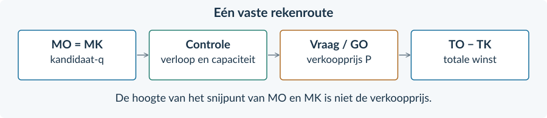

<!-- PAGE {"section": "4.1", "title": "Het hoofdstuk in één route", "origin_chapter": "4.1", "origin_page": 37, "edition_page": 47} -->

# Overzicht
### Kies eerst: gegeven prijs of dalende vraag?
| Eén prijsnemer | Eén monopolist met uniforme prijs |
|---|---|
| P wordt door de markt gegeven. | P hangt via de vraagfunctie af van q. |
| GO = MO = P | GO = P; bij een dalende vraag is MO lager voor q > 0. |
| TO = P × q met constante P | TO = (a − bq) × q = aq − bq² |
| MO is horizontaal. | MO = a − 2bq is dalend. |

De winstkeuze gebruikt bij beide ondernemingen marginale opbrengsten en kosten. **De stap naar de verkoopprijs verschilt.**
<figure><figcaption>Figuur 22. Bij een monopolist volgt de verkoopprijs pas nadat de afzet is gekozen.</figcaption></figure>

### Formules met hun betekenis

GO = TO / q = P (bij q > 0 en één prijs) Winst = TO − TK GTK = TK / q (bij q > 0) Winst = (P − GTK) × q

**Op een tabelinterval:** gemiddelde extra opbrengst = ΔTO / Δq. **Op een punt:** MO is de afgeleide van TO. Een puntwaarde hoeft niet gelijk te zijn aan het gemiddelde over een grote tabelstap.

**Controleer grenzen.** q moet uitvoerbaar zijn. Bij een bindende capaciteit kan het optimum vóór het snijpunt liggen. Bij onvermijdbare constante kosten vergelijk je zo nodig ook met q = 0.

**Verwar de doelen niet.** MO = 0 kan bij deze opbrengstfuncties het omzetmaximum geven. Voor het winstmaximum heb je ook MK nodig. Positieve omzet of marktmacht bewijst geen positieve winst.

<b>Vrije toetreding · §4.1.1</b> Onder de gegeven kosten- en toetredingsaannames: overwinst → toetreding → meer aanbod → lagere prijs. Bij het eindpunt is P = minimum GTK en TO = TK. De normale beloning zit in TK.

<!-- PAGE {"section": "4.1", "title": "Begrippen om precies te gebruiken", "origin_chapter": "4.1", "origin_page": 38, "edition_page": 48} -->

# Begrippen
| Begrip | Betekenis in dit hoofdstuk |
|---|---|
| Afzet | De verkochte hoeveelheid in een aangegeven periode. Bij één onderneming schrijven we q. |
| Break-even | TO en TK zijn gelijk; de winst is nul. |
| Economische winst | TO − TK wanneer TK ook de normale ondernemersbeloning bevat. |
| Langetermijnevenwicht | Onder vrije toe-/uittreding en de genoemde kostenvoorwaarden: P = minimum GTK, zonder overwinst. |
| Normale beloning | De vergoeding voor de inzet van de ondernemer die in dit langetermijnmodel al in TK zit. |
| Constante kosten | Totale kosten die in de aangegeven periode gelijk blijven bij verandering van de productie, tot de productiecapaciteit. |
| Gemiddelde opbrengst (GO) | TO per verkochte eenheid. Bij een uniforme prijs is GO = P voor q > 0. |
| Gemiddelde totale kosten (GTK) | TK gedeeld door de productiehoeveelheid, voor q > 0. |
| Marginale kosten (MK) | De extra kosten per extra eenheid; in het doorlopende model de afgeleide van TK. |
| Marginale opbrengst (MO) | De extra opbrengst per extra eenheid; in het doorlopende model de afgeleide van TO. |
| Marktmacht | Invloed kunnen uitoefenen op de verkoopprijs. |
| Monopolie | Eén aanbieder op de afgebakende markt. |
| Prijsnemer | Een onderneming die de marktprijs als gegeven neemt. |
| Productiecapaciteit | De maximaal uitvoerbare productie in de aangegeven periode. |
| Toetredingsbarrière | Een belemmering waardoor nieuwe aanbieders moeilijk of niet kunnen beginnen. |
| Totale opbrengst (TO) | De opbrengst van alle verkochte eenheden: P × q. Ook omzet genoemd. |
| Uniforme verkoopprijs | Binnen één verkoopplan betalen kopers dezelfde prijs per eenheid. |
| Vraaglijn van de monopolist | Geeft de prijs-afzetcombinaties voor de hele afgebakende markt. Bij één prijs is dit ook de GO-lijn. |
| Winst | TO min TK. Een maximum van de winst hoeft niet positief te zijn. |

<b>De kernzin</b> <b>MO en MK bepalen de hoeveelheid; de vraaglijn bepaalt de verkoopprijs; TO en TK bepalen de winst.</b>

Je hebt in dit hoofdstuk geen prijsdiscriminatie of formele welvaartsvergelijking toegepast. Die onderwerpen krijgen hun eigen uitleg en opgaven in hoofdstuk 4.2.

