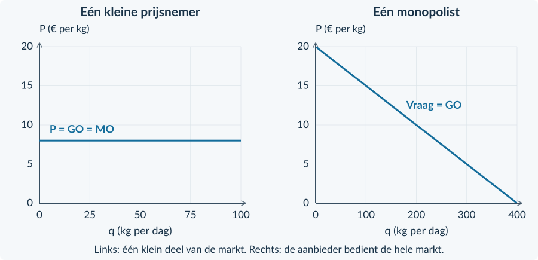
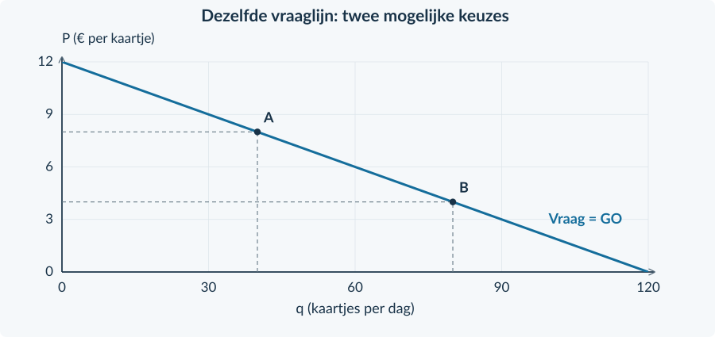
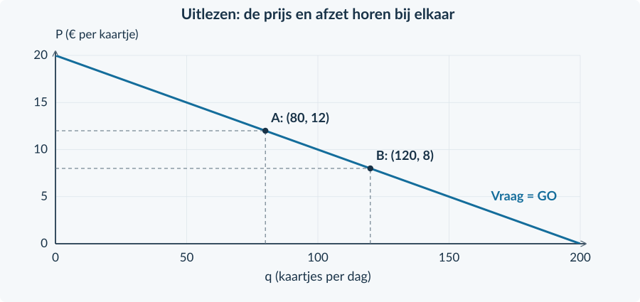

<!-- PAGE {"section": "4.1.2", "title": "Alleen op de markt", "origin_chapter": "4.1", "origin_page": 2, "edition_page": 12} -->

4.1.2 · MONOPOLIE: KENMERKEN

# Geen concurrent. Geen grenzen?
Op een eiland verzorgt één bedrijf de enige directe veerverbinding. Een tweede bedrijf krijgt voorlopig geen vergunning. Toch kan de eigenaar niet zomaar € 100 per kaartje vragen en verwachten dat iedereen blijft varen.

<b>Lesdoelen</b> Je kunt een monopolie herkennen met gegevens uit een bron. Je kunt een toetredingsbarrière uitleggen. Je kunt de vraag voor een monopolist vergelijken met die voor een prijsnemer. Je kunt een prijs-afzetcombinatie berekenen en beoordelen.

<b>Monopolie</b> Een marktvorm met één aanbieder op de afgebakende markt. Deze aanbieder noemen we de monopolist.

### Kijk eerst welke markt bedoeld wordt
De veerverbinding is één markt in deze oefencase. De markt voor álle uitstapjes is veel breder. Eén merk of één winkel is dus niet vanzelf een monopolie: kopers kunnen soms kiezen uit vergelijkbare producten.

<b>Marktmacht</b> De mogelijkheid van een onderneming om invloed uit te oefenen op haar verkoopprijs. De reactie van kopers begrenst die invloed.

### Waarom verschijnt niet meteen een tweede aanbieder?
Een **toetredingsbarrière** maakt beginnen op deze markt moeilijk of onmogelijk.

| Mogelijke barrière | Wat houdt een nieuwe aanbieder tegen? |
|---|---|
| Een exclusieve vergunning | Alleen de aangewezen onderneming mag in de beschreven periode aanbieden. |
| Een octrooi (patent) | De beschreven beschermde uitvinding kan niet zomaar door een ander worden gebruikt. |
| Een onmisbare voorziening | Een andere onderneming kan niet over het noodzakelijke netwerk of middel beschikken. |

Gebruik steeds de bron. Een patent is niet automatisch bewijs voor een monopolie op een brede markt met goede alternatieven.

<!-- PAGE {"section": "4.1.2", "title": "Van de kleine onderneming naar de hele markt", "origin_chapter": "4.1", "origin_page": 3, "edition_page": 13} -->

### De vraaglijn hoort bij een bepaalde aanbieder
Bij volkomen concurrentie neemt één kleine onderneming de marktprijs als gegeven. Binnen het model verkoopt zij tegen die prijs tot haar productiecapaciteit. Haar opbrengstlijn is horizontaal.

De monopolist bedient de **hele afgebakende markt**. Wil hij meer afzetten, dan moet hij in het getekende model een lagere prijs vragen. Zijn vraaglijn daalt.
<figure><figcaption>Figuur 1. Twee ondernemingsgrafieken. De linker onderneming is klein; de rechter onderneming is de enige aanbieder. Let op de verschillende hoeveelheidsassen.</figcaption></figure>

### Dezelfde afkorting, een andere lijn
**q** is de afzet van één onderneming. **Q** is de afzet van de hele markt. Bij de monopolist geldt q = Q. In dit hoofdstuk gebruiken we voor zijn berekeningen q.

De **gemiddelde opbrengst GO** is TO / q. Als alle verkochte eenheden dezelfde prijs hebben, is GO gelijk aan die prijs. Dat blijft bij monopolie waar: de vraaglijn is ook de GO-lijn.

<b>Wat verandert niet? Wat wel?</b> GO = P blijft gelden bij één uniforme prijs. Maar P is bij de monopolist niet bij elke q hetzelfde. De gelijkheid <b>P = GO = MO</b> van een prijsnemer mag je daarom niet zomaar overnemen. MO bouwen we op in §4.1.3.

De dalende vraaglijn houdt overige vraagfactoren gelijk, zoals inkomen, voorkeuren en het aantal vragers. Veranderen die, dan kan de vraaglijn zelf verschuiven.

<!-- PAGE {"section": "4.1.2", "title": "Een bron gebruiken", "origin_chapter": "4.1", "origin_page": 4, "edition_page": 14} -->

## Uitgewerkt voorbeeld
**Parkveer** heeft voor deze oefencase het alleenrecht op de directe overtocht naar een park. Er is geen vergelijkbare directe overtocht. Mensen kunnen ook besluiten het park niet te bezoeken. De vraag is **P = 12 − 0,10q**. P is euro per kaartje; q is kaartjes per dag, van 0 tot 120.

**1 · Gebruik het bronbewijs.** Parkveer is hier de enige aanbieder. Het alleenrecht vormt een toetredingsbarrière. Bij volkomen concurrentie zouden er juist veel kleine aanbieders zijn, met vrije toetreding.

**2 · Bereken twee combinaties.** Bij q = 40 hoort P = 12 − 0,10 × 40 = € 8. Bij q = 80 hoort P = € 4.
<figure><figcaption>Figuur 2. Punt A geeft 40 kaartjes tegen € 8; punt B geeft 80 kaartjes tegen € 4.</figcaption></figure>

**3 · Leg de afruil uit.** Parkveer kan in deze vraagfunctie niet tegelijk 80 kaartjes verkopen én € 8 per kaartje vragen. Bij € 8 is de gevraagde hoeveelheid 40. Voor 80 kaartjes is een prijs van € 4 nodig.

**4 · Begrens je conclusie.** Er is invloed op de prijs, maar geen onbeperkte afzet. De vraaglijn vertelt welke combinaties mogelijk zijn. Zonder kosten weten we nog niet welke combinatie de meeste winst geeft.

<b>Onthouden</b> Bronbewijs → afgebakende markt → toetredingsbarrière → prijs en afzet uit dezelfde vraaglijn. De monopolist kiest een combinatie, niet twee losstaande getallen. In §4.1.3 bekijken we de bijbehorende opbrengst.

<!-- PAGE {"section": "4.1.2", "title": "De bekende methode terughalen", "origin_chapter": "4.1", "origin_page": 5, "edition_page": 15} -->

## Startopgaven

<b>Korte route:</b> Startopgaven → Zelfstandige oefening → Doeloefening. Extra hulp nodig? Maak eerst Begeleide inoefening.

<b>Opgave 11 · Terug naar de prijsnemer</b>

Eén kleine producent ontvangt € 10 per kg. TK = 0,10q² + 2q + 40 en MK = 0,20q + 2. q is kg per week. De productiecapaciteit is 60 kg. De € 40 blijft deze week ook bij q = 0 bestaan.

<b>a.</b> Geef GO en MO. Bereken met MO = MK de winstmaximale q en controleer of die haalbaar is.

<b>b.</b> Bereken bij die q de totale opbrengst, totale kosten en winst. Waarom hoort de horizontale opbrengstlijn bij deze onderneming en niet bij de hele markt?

<b>Opgave 12 · Eén merk in de winkel</b>

Een winkel verkoopt als enige in het dorp het merk Pico. Twee andere winkels verkopen vergelijkbare producten. Klanten vinden die producten goede alternatieven.

<b>a.</b> Is dit genoeg bewijs voor een monopolie op de markt voor dit soort producten? Leg uit met de bron.

<b>b.</b> Wat kunnen klanten volgens de bron doen als de winkel zijn prijs sterk verhoogt?

<b>Terugblik uit Boek 3</b> Een prijsnemer kiest q bij een gegeven P. Bij een monopolist moeten P en q samen op de vraaglijn passen. De kostengegevens uit opgave 11 zijn alleen bedoeld om de bekende procedure op te halen.

### Zo onderbouw je een bronantwoord
Noem niet alleen een begrip. Verbind het aan een gegeven: **“Alleen dit bedrijf krijgt een vergunning. Daardoor kunnen andere bedrijven deze dienst niet aanbieden. Dat vormt een toetredingsbarrière.”**

De aanwezigheid van één winkel in een foto bewijst dit niet. Je moet weten welke andere aanbieders of vergelijkbare producten binnen de beschreven markt bestaan.

<!-- PAGE {"section": "4.1.2", "title": "Van aflezen naar zelf rekenen", "origin_chapter": "4.1", "origin_page": 6, "edition_page": 16} -->

## Begeleide inoefening

Heb je deze hulp niet nodig? Ga dan verder met Zelfstandige oefening.

<b>Opgave 13 · De gelabelde vraaglijn</b>

Gebruik figuur 3. Deze oefenonderneming is de enige aanbieder van de beschreven toegangsdienst.

<b>a.</b> Lees voor A en B de prijs en de afzet af. Wat gebeurt er met de prijs wanneer de afzet van A naar B gaat?

<b>b.</b> Een manager wil de afzet van B en de prijs van A combineren. Leg uit waarom die combinatie niet bij deze vraaglijn past.

<figure><figcaption>Figuur 3. Lees bij ieder punt beide coördinaten: hoeveelheid én prijs.</figcaption></figure>

<b>Opgave 14 · Een besloten tuin</b>

Alleen Tuinpoort verkoopt toegang tot een historische tuin. Gebruik P = 18 − 0,10q. P is euro per kaartje; q is kaartjes per dag, van 0 tot 180.

<b>a.</b> Bereken de prijzen bij q = 40 en q = 80. Gebruik: P = 18 − 0,10 × … .

<b>b.</b> Los nu 12 = 18 − 0,10q op. Leg uit wat de uitkomst betekent voor Tuinpoort.

<!-- PAGE {"section": "4.1.2", "title": "Bronnen vergelijken", "origin_chapter": "4.1", "origin_page": 7, "edition_page": 17} -->

Begeleide inoefening · vervolg

<b>Opgave 15 · Twee veranderingen tegelijk</b>

De enige aanbieder van grotbezoeken verlaagt zijn eigen toegangsprijs. Tegelijk komen meer toeristen naar de regio. Zij willen bij elke mogelijke prijs samen meer bezoeken boeken. De capaciteit is groot genoeg.

<b>a.</b> Bekijk alleen de prijsverlaging. Is dit een beweging langs de vraaglijn of een verschuiving van de lijn? Wat gebeurt er met de afzet?

<b>b.</b> Bekijk alleen de extra toeristen. Welke verandering van de vraaglijn hoort daarbij?

<b>c.</b> Versterken de twee veranderingen de stijging van de afzet of werken ze elkaar tegen?

<b>d.</b> Een leerling zegt: “De prijsverlaging verschuift de vraaglijn naar rechts.” Leg uit welke twee oorzaken hij verwart.

## Zelfstandige oefening

<b>Opgave 16 · Een beschermd filter</b>

Alleen Filtera mag in deze oefencase een bepaald beschermd filter maken. Er zijn binnen de afgebakende markt geen goede vervangers. Voor de verkoop geldt P = 40 − 0,50q, met q van 0 tot 80 filters per maand en P in euro per filter.

<b>a.</b> Noem de toetredingsbarrière en leg met de bron uit waarom we hier een monopolie onderzoeken.

<b>b.</b> Bereken P bij q = 20 en q = 40. Kan Filtera 40 filters verkopen voor de prijs die bij q = 20 hoort? Verklaar.

<b>Opgave 17 · Twee leverancierssituaties</b>

A: veel kleine bedrijven leveren dezelfde schroeven; kopers kennen de prijzen en nieuwe bedrijven kunnen vrij beginnen. B: één bedrijf bezit de enige toegang tot een noodzakelijke voorziening; andere bedrijven kunnen die niet gebruiken.

<b>a.</b> Koppel elke situatie aan volkomen concurrentie of monopolie. Geef per situatie één brongegeven als bewijs.

<b>b.</b> Welke onderneming krijgt in dit model een horizontale vraaglijn en welke een dalende? Licht het verschil toe.

<!-- PAGE {"section": "4.1.2", "title": "Een prijskeuze beoordelen", "origin_chapter": "4.1", "origin_page": 8, "edition_page": 18} -->

## Doeloefening

<b>Bron A · Eilandveer</b> Voor de directe verbinding tussen Haven en Eiland heeft Eilandveer als enige een vergunning. In de onderzochte periode krijgt geen ander bedrijf toegang. Reizigers kunnen hun reis wel uitstellen of afzien van de overtocht. Alle kaartjes in een gekozen situatie hebben dezelfde prijs. De capaciteit is 240 kaartjes per dag.

<b>Bron B · Vraag</b> P = 24 − 0,10q. P is euro per kaartje; q is kaartjes per dag, van 0 tot 240. Overige vraagfactoren blijven gelijk.

<b>Opgave 18 · Eilandveer</b>

Gebruik beide bronnen en figuur 4.

<b>a.</b> (2p) Welk gegeven vormt hier een toetredingsbarrière? Leg uit waarom dit een monopolie op de beschreven verbinding ondersteunt.

<b>b.</b> (2p) Noem twee verschillen met volkomen concurrentie: één over toetreding en één over de vraaglijn van de onderneming.

<b>c.</b> (2p) Bereken de prijs bij punt A met q = 60 en bij punt B met q = 120.

<b>d.</b> (2p) De eigenaar wil 120 kaartjes verkopen voor € 18. Is dat volgens de bron haalbaar? Onderbouw met de vraagfunctie.

<b>e.</b> (2p) Beoordeel: “Zonder concurrenten kan ik elke prijs vragen én dezelfde afzet houden.” Gebruik de bron om je antwoord te begrenzen.

<figure><figcaption>Figuur 4. Gebruik de lijn om de berekende combinaties te controleren.</figcaption></figure>

<!-- PAGE {"section": "4.1.2", "title": "Waar eindigt de marktmacht?", "origin_chapter": "4.1", "origin_page": 9, "edition_page": 19} -->

## Denkertje / Bonusopgave

<b>Opgave 19 · Welke markt teken je?</b>

Een onderneming is als enige eigenaar van een uitkijktoren. In de omgeving liggen ook een uitzichtheuvel en een panoramacafé. Twee leerlingen tekenen de markt anders: de eerste bekijkt “toegang tot deze toren”, de tweede “uitstapjes met uitzicht”.

<b>a.</b> Leg uit waarom de keuze van de marktgrens invloed heeft op de conclusie “dit is een monopolie”.

<b>b.</b> Noem één extra gegeven over het gedrag van bezoekers dat je zou willen weten. Leg uit hoe dat helpt.

<b>c.</b> Kan alleenrecht op de toren samengaan met een sterke reactie op een prijsverhoging? Licht toe zonder een elasticiteitsformule te gebruiken.

## Herhaling / Herhaling en interleaving

<b>Opgave 20 · Kosten en omzet blijven verschillend</b>

Een onderneming verkoopt 60 kg per week voor € 9 per kg. TK = 100 + 4q; q is kg per week en TK euro per week.

<b>a.</b> Bereken TO, TK, GTK en winst bij q = 60. Reken met ongeronde GTK.

<b>b.</b> In een andere waarneming stijgt de prijs met 10% en daalt de afzet met 15%. Bereken Ev en bepaal of de vraag prijselastisch is.

<b>Controleer je taal</b> Zeg “één aanbieder op deze markt” en niet alleen “één bedrijf”. Zeg “de prijs beïnvloedt de afzet” en niet “de monopolist kiest alles zelf”.

<b>Vooruitblik</b> Een lagere prijs kan meer kopers opleveren. Maar dezelfde lagere prijs geldt ook voor de eenheden die je bij de hogere prijs al zou verkopen. Die twee effecten bepalen de extra opbrengst.

