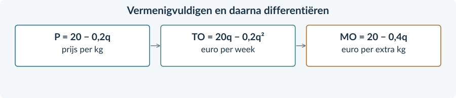
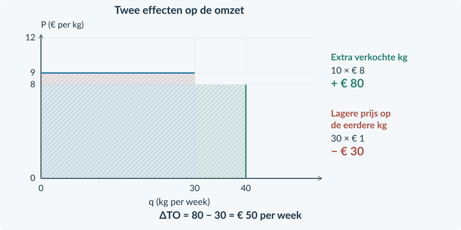

<!-- PAGE {"section": "4.1.3", "title": "Meer verkopen, maar voor minder", "origin_chapter": "4.1", "origin_page": 10, "edition_page": 20} -->

4.1.3 · MARGINALE OPBRENGST BIJ MONOPOLIE

# Wat levert extra afzet op?
Een monopolist verkoopt een eigen reinigingsmiddel. Bij 20 kg per week past een prijs van € 16 per kg. Voor 30 kg moet de prijs naar € 14. De 10 extra kg geven opbrengst. Maar wat gebeurt er met de opbrengst op de eerste 20 kg?

<b>Lesdoelen</b> Je kunt uit een lineaire vraagfunctie TO en MO afleiden. Je kunt een korte opbrengsttabel invullen en controleren. Je kunt het verschil tussen een tabelstap en MO op één punt uitleggen. Je kunt verklaren waarom MO onder de verkoopprijs ligt bij uniforme prijzen.

Voor dit voorbeeld geldt **P = 20 − 0,20q**. q is kg per week, van 0 tot 100; P is euro per kg. Vergelijk twee verkoopplannen voor dezelfde week. Binnen ieder plan betaalt iedereen dezelfde prijs.
<figure><figcaption>Figuur 5. De extra kg leveren € 140 op. Op de eerste 20 kg ontvang je € 40 minder. Netto stijgt TO met € 100.</figcaption></figure>

<b>Geen terugbetaling</b> De eerste 20 kg zijn hier geen verkopen uit een vorige week. We vergelijken twee mogelijke plannen: álles voor € 16 of álles voor € 14. In het tweede plan is ook de prijs op de eerste 20 kg lager.

<!-- PAGE {"section": "4.1.3", "title": "Van vraag naar totale opbrengst", "origin_chapter": "4.1", "origin_page": 11, "edition_page": 21} -->

### Eerst de totale opbrengst
Je kent **TO = P × q**. Nu is P zelf afhankelijk van q. Vul daarom de hele prijsformule in, tussen haakjes.

P = 20 − 0,20q TO = (20 − 0,20q) × q TO = 20q − 0,20q²

De laatste regel betekent: 20 × q minus 0,20 × q × q. De tweede term is kwadratisch omdat q twee keer wordt vermenigvuldigd.
<figure><figcaption>Figuur 6. Dezelfde omzetformule als eerder, maar nu met een prijs die afhangt van q.</figcaption></figure>

### Daarna de marginale opbrengst
Bij een **heel kleine uitbreiding rond één hoeveelheid** geeft MO aan hoe snel TO verandert. Voor deze doorlopende rekenmodellen vinden we MO met de afgeleide van TO.

Je gebruikt dezelfde beperkte differentieerregel als in §3.2.2:

| Term in TO | Bewerking | Bijdrage aan MO |
|---|---|---:|
| 20q | q valt weg. | 20 |
| −0,20q² | Vermenigvuldig −0,20 met 2; q² wordt q. | −0,40q |

MO = 20 − 0,40q

TO is euro per week. P, GO en MO zijn euro per kg. Neem het minteken mee: een term −0,20q² wordt niet +0,40q.

<b>Controleer de hele keten</b> Bij q = 20 is P = 16 en TO = 16 × 20 = 320. De TO-formule geeft ook 20 × 20 − 0,20 × 20² = 320. De MO-formule geeft bij q = 20 een ander soort bedrag: € 12 per kg.

<!-- PAGE {"section": "4.1.3", "title": "Twee lijnen met verschillende betekenissen", "origin_chapter": "4.1", "origin_page": 12, "edition_page": 22} -->

### Eerst alleen de prijs per kg
De vraagfunctie blijft **P = 20 − 0,20q**. Omdat alle kg binnen een verkoopplan dezelfde prijs hebben, is **GO = P** voor q > 0.
<figure><figcaption>Figuur 7. Bij q = 20 is de prijs € 16 per kg. Bij q = 50 is de prijs € 10 per kg.</figcaption></figure>

### Voeg nu MO toe
Uit TO = 20q − 0,20q² volgt **MO = 20 − 0,40q**. Bij eenzelfde q is dit lager dan P, behalve bij het beginpunt q = 0. De prijsverlaging raakt immers ook de kg die je bij de hogere prijs al zou afzetten.

Voor een rechte vraaglijn heeft de MO-lijn hetzelfde beginpunt op de verticale as, maar een tweemaal zo grote daling per extra kg.

Bij q = 20: P = 16 en MO = 12 Bij q = 50: P = 10 en MO = 0

<b>Prijs is niet marginale opbrengst</b> De koper betaalt P voor een kg. MO gaat over de verandering van de <b>totale</b> opbrengst bij iets meer afzet. Dat zijn bij uniforme monopolieprijzen verschillende bedragen.

Bij q = 0 is TO = 0, maar GO = TO / q kun je niet berekenen. Het punt P = 20 op de vraaglijn is de prijsgrens uit het model, geen gemiddelde van feitelijke verkopen.

<!-- PAGE {"section": "4.1.3", "title": "Wanneer neemt de omzet niet meer toe?", "origin_chapter": "4.1", "origin_page": 13, "edition_page": 23} -->

### MO kan nul of negatief zijn
Tot q = 50 is MO positief: een kleine extra afzet verhoogt TO. Bij q = 50 is MO nul. Boven 50 kg is MO negatief: de lagere prijs op alle kg kost meer dan de extra afzet oplevert.
<figure><figcaption>Figuur 8. Boven 50 kg wordt MO negatief. De verkoopprijs blijft hier positief tot q = 100.</figcaption></figure>

Een positieve verkoopprijs garandeert dus niet dat méér verkopen de omzet verhoogt. Bij q = 50 is TO = 10 × 50 = € 500. Bij q = 70 is TO = 6 × 70 = € 420.

<b>Opbrengstmaximum is nog geen winstmaximum</b> Voor deze dalende rechte MO-lijn ligt de hoogste TO waar MO van positief naar negatief gaat. Maar kosten zijn nog niet vergeleken. Een maximale TO hoeft geen maximale winst te geven.

### Een tabelstap is groter dan één punt
Van q = 20 naar q = 30 stijgt TO van € 320 naar € 420. Over die hele stap is de gemiddelde extra opbrengst:

ΔTO / Δq = (420 − 320) / (30 − 20) ΔTO / Δq = € 10 per kg

Op het beginpunt geeft de afgeleide MO(20) = 12; op het eindpunt MO(30) = 8. De marginale opbrengst daalt onderweg. De € 10 over de hele stap hoeft daarom niet gelijk te zijn aan één van die twee puntwaarden.

<!-- PAGE {"section": "4.1.3", "title": "De hele opbrengstroute", "origin_chapter": "4.1", "origin_page": 14, "edition_page": 24} -->

## Uitgewerkt voorbeeld
**Verf Luma.** Voor een uniek verfmengsel geldt P = 12 − 0,10q. q is kg per week, van 0 tot 120; P is euro per kg. Alle kg in een verkoopplan hebben dezelfde prijs.

**1 · Maak TO en MO.**

TO = (12 − 0,10q) × q = 12q − 0,10q² MO = 12 − 0,20q

**2 · Vul een tabel in.** Gebruik voor iedere rij eerst P en daarna TO = P × q.

| q (kg per week) | P (€ per kg) | TO (€ per week) |
|---:|---:|---:|
| 20 | 10 | 200 |
| 30 | 9 | 270 |
| 40 | 8 | 320 |

**3 · Controleer de stap van 30 naar 40.** ΔTO / Δq = (320 − 270) / 10 = € 5 per kg. Op het beginpunt is MO(30) = € 6; op het eindpunt MO(40) = € 4. Dat verschilt, omdat de afgeleide één punt beschrijft en de tabelstap een hele toename.
<figure><figcaption>Figuur 9. Extra afzet: 10 × € 8 = € 80. Lagere prijs op de eerste 30 kg: 30 × € 1 = € 30.</figcaption></figure>

**4 · Leg uit.** De netto omzettoename is 80 − 30 = € 50. Daarom is de extra opbrengst per extra kg niet gelijk aan de verkoopprijs van € 8.

<b>Onthouden</b> P × q → TO → afgeleide MO. Een tabelstap bereken je met ΔTO / Δq. Bij één uniforme prijs verlaagt meer afzet ook de opbrengst op de eerdere hoeveelheid. In §4.1.4 vergelijken we MO met MK.

<!-- PAGE {"section": "4.1.3", "title": "De rekenregels weer paraat", "origin_chapter": "4.1", "origin_page": 15, "edition_page": 25} -->

## Startopgaven

<b>Korte route:</b> Startopgaven → Zelfstandige oefening → Doeloefening. Extra hulp nodig? Maak eerst Begeleide inoefening.

<b>Opgave 21 · Vermenigvuldigen en differentiëren</b>

Gebruik de beperkte regel uit Boek 3: de afgeleide van aq² + bq + c is 2aq + b.

<b>a.</b> Werk uit: (18 − 0,10q) × q. Schrijf daarna de afgeleide van de uitkomst op.

<b>b.</b> Een andere onderneming heeft TK = 0,05q² + 3q + 90. Stel MK op. Wat gebeurt er met de constante term 90?

<b>Opgave 22 · Een extra kg brengt toch de prijs op?</b>

Een leerling bekijkt Luma uit het uitgewerkte voorbeeld en zegt: “De prijs bij 40 kg is € 8. Dus 10 kg extra verkopen geeft € 80 extra totale opbrengst.”

<b>a.</b> Welke verandering op de eerste 30 kg ontbreekt in deze redenering?

<b>b.</b> Herstel de redenering en bereken de werkelijke verandering van TO.

<b>Eenheden houden de begrippen uit elkaar</b> TO is een <b>totaal</b> bedrag per week. De prijs en MO zijn bedragen <b>per kg</b>. Een stijging van TO met € 50 over 10 kg is daarom niet “MO = 50”, maar gemiddeld € 5 per kg.

### Kies de berekening die gevraagd wordt
| De opgave vraagt naar … | Dan gebruik je … |
|---|---|
| De opbrengst van alle verkochte kg | P × q |
| De verandering van TO over een tabelstap | TO nieuw − TO oud |
| De gemiddelde extra opbrengst per kg over die stap | ΔTO / Δq |
| MO bij één punt van een doorlopende functie | De afgeleide van TO, ingevuld met die q |

Deze begrippen zijn geen vier namen voor hetzelfde getal. Lees daarom niet alleen de formule, maar ook wat de vraag precies vraagt.

<!-- PAGE {"section": "4.1.3", "title": "Zien wat er bijkomt en afgaat", "origin_chapter": "4.1", "origin_page": 16, "edition_page": 26} -->

## Begeleide inoefening

Heb je deze hulp niet nodig? Ga dan verder met Zelfstandige oefening.

<b>Opgave 23 · Twee gekleurde stroken</b>

Voor een oefenmonopolist geldt P = 16 − 0,20q. q is kg per week. Vergelijk 20 en 30 kg in figuur 10.

<b>a.</b> Lees af welke prijs bij 20 kg en welke prijs bij 30 kg hoort. Welke strook hoort bij de extra kg?

<b>b.</b> Welke strook hoort bij de lagere prijs op de eerste 20 kg? Controleer daarmee de netto toename van TO.

<b>c.</b> Bereken de gemiddelde extra opbrengst per kg over de toename van 20 naar 30 kg.

<figure><figcaption>Figuur 10. De omzetverandering bestaat uit twee effecten. De lichte basis hoort bij beide verkoopplannen.</figcaption></figure>

<b>De steun neemt straks af</b> Gebruik nu de getekende bedragen om de berekening te volgen. In de volgende opgaven bereken je die bedragen zelf, zonder ingevulde figuur.

<!-- PAGE {"section": "4.1.3", "title": "Stap voor stap, daarna zelf", "origin_chapter": "4.1", "origin_page": 17, "edition_page": 27} -->

Begeleide inoefening · vervolg

<b>Opgave 24 · Van sportgel naar een formule</b>

Sportgel Sana heeft in deze oefencase vraag P = 18 − 0,20q. q is kg per week, van 0 tot 90. Iedereen betaalt dezelfde prijs.

<b>a.</b> Vul aan: TO = (18 − 0,20q) × q = …q − …q². Schrijf daarna MO op.

<b>b.</b> Neem de tabel hieronder over en vul eerst P, daarna TO in.

<b>c.</b> Bereken ΔTO / Δq van 20 naar 30 kg. Bereken ook MO bij q = 20. Waarom mag je niet eisen dat beide uitkomsten gelijk zijn?

| q (kg per week) | P (€ per kg) | TO (€ per week) |
|---:|---:|---:|
| 10 | … | … |
| 20 | … | … |
| 30 | … | … |

<b>Opgave 25 · Twee omzetveranderingen tegelijk</b>

Een verkoper van een uniek mengsel vergelijkt twee weekplannen: 40 kg tegen € 15 of 50 kg tegen € 13. Iedereen betaalt binnen een plan dezelfde prijs.

<b>a.</b> Bereken alleen de opbrengst van de 10 extra kg in het tweede plan.

<b>b.</b> Bereken afzonderlijk hoeveel minder opbrengst de eerste 40 kg in dat plan geven.

<b>c.</b> Combineer beide effecten. Controleer je uitkomst ook met TO nieuw − TO oud.

<b>d.</b> Een leerling noemt alleen de extra kg en concludeert dat de omzet € 130 stijgt. Leg uit waarom zijn antwoord te hoog is.

<!-- PAGE {"section": "4.1.3", "title": "Rekenen zonder invulsteunen", "origin_chapter": "4.1", "origin_page": 18, "edition_page": 28} -->

## Zelfstandige oefening

<b>Opgave 26 · Unieke geurstof</b>

Voor een geurstof geldt P = 25 − 0,25q. q is kg per week, van 0 tot 100; P is euro per kg. De verkoopprijs is uniform.

<b>a.</b> Stel TO en MO op. Bereken P en TO bij q = 20 en q = 40.

<b>b.</b> Bereken de gemiddelde extra opbrengst per kg van 20 naar 40 kg en MO bij q = 20. Verklaar het verschil.

<b>c.</b> Verdeel de verandering in TO over extra afzet en minder opbrengst op de eerste hoeveelheid. Controleer dat het totaal overeenkomt.

<b>Opgave 27 · Prijs positief, MO negatief</b>

Een producent heeft P = 24 − 0,20q en MO = 24 − 0,40q. Gebruik figuur 11; q is kg per week.

<b>a.</b> Lees of bereken P en MO bij q = 80. Leg uit hoe P positief kan zijn terwijl MO negatief is.

<b>b.</b> Een kleine vermindering van de afzet rond 80 kg is gunstig voor TO. Leg uit waarom. Kun je zonder kosten ook de winstmaximale q noemen?

<figure><figcaption>Figuur 11. Vergelijk de twee lijnen bij dezelfde q; verwissel de bedragen niet.</figcaption></figure>

<!-- PAGE {"section": "4.1.3", "title": "De opbrengst van een extra verkoop", "origin_chapter": "4.1", "origin_page": 19, "edition_page": 29} -->

## Doeloefening

<b>Bron · Pigment Prisma</b> Prisma is in dit oefenmodel de enige verkoper van een specifiek pigment. De vraag is P = 30 − 0,50q, voor 0 ≤ q ≤ 60. P is euro per kg; q is kg per week. Alle kg binnen een weekplan hebben dezelfde prijs. De hoeveelheden kunnen in dit rekenmodel ook delen van een kg zijn.

<b>Opgave 28 · Pigment Prisma</b>

Gebruik de bron. Noteer bij ieder bedrag wat het meet.

<b>a.</b> (2p) Stel uit de vraagfunctie de TO-functie en de MO-functie op. Laat de tussenstap met haakjes zien.

<b>b.</b> (2p) Neem de tabel over en vul de prijzen en totale opbrengsten in.

<b>c.</b> (3p) Bereken met de tabel de gemiddelde extra opbrengst per kg van 20 naar 30 kg. Bereken daarnaast MO bij q = 20 en leg uit waarom de uitkomsten verschillen.

<b>d.</b> (3p) Bereken voor de stap van 20 naar 30 kg afzonderlijk de opbrengst van de extra kg en de lagere opbrengst op de eerste 20 kg. Controleer de netto omzettoename.

<b>e.</b> (2p) Een leerling zegt: “Bij q = 20 is de prijs € 20. Daarom moet MO ook € 20 zijn.” Beoordeel met je berekening en de uniforme prijs uit de bron.

| q (kg per week) | P (€ per kg) | TO (€ per week) |
|---:|---:|---:|
| 10 | … | … |
| 20 | … | … |
| 30 | … | … |

<b>Laat je controle zien</b> Je hebt twee manieren gebruikt om dezelfde verandering van TO te berekenen. Die moeten hetzelfde totaalbedrag opleveren. Een MO-puntwaarde en een gemiddelde over een grote stap hoeven niet gelijk te zijn.

<!-- PAGE {"section": "4.1.3", "title": "Een andere blik op dezelfde omzet", "origin_chapter": "4.1", "origin_page": 20, "edition_page": 30} -->

## Denkertje / Bonusopgave

<b>Opgave 29 · Dezelfde TO, een andere reactie</b>

Voor een onderneming geldt P = 20 − 0,20q. Bij 20 kg is P = € 16; bij 80 kg is P = € 4. Beide weekplannen geven TO = € 320.

<b>a.</b> Een leerling zegt: “Omdat de omzet gelijk is, heeft een kleine extra afzet in beide situaties hetzelfde effect.” Beoordeel met de MO-functie.

<b>b.</b> Leg uit welke kleine aanpassing de omzet in elk plan kan verhogen. Beschrijf het verschil met een schets of in woorden.

<b>c.</b> Waarom vertelt gelijke omzet nog niet welke van de twee plannen de grootste winst geeft?

## Herhaling / Herhaling en interleaving

<b>Opgave 30 · De prijsnemer herkennen</b>

Een kleine kruidenleverancier is prijsnemer bij P = € 12 per kg. TK = 0,10q² + 4q + 100. De capaciteit is 60 kg per week; de constante kosten zijn deze week onvermijdbaar.

<b>a.</b> Stel TO, MO en MK op. Bereken de winstmaximale haalbare q.

<b>b.</b> Bereken de winst. Leg uit waarom MO bij deze onderneming wel gelijk is aan de verkoopprijs.

<b>Neem mee</b> Onder een dalende vraaglijn is een extra kg niet hetzelfde als een extra verkoop tegen een onveranderde prijs. Voor de winstkeuze heb je straks zowel MO als MK nodig.

### Controle vóór je verdergaat
Kun je uit P = a − bq de totale opbrengst maken? Kun je het minteken meenemen naar MO? Kun je uitleggen waarom een lagere uniforme prijs ook op de eerdere hoeveelheid doorwerkt? Dan zijn de opbrengsten klaar voor de vergelijking met kosten.
