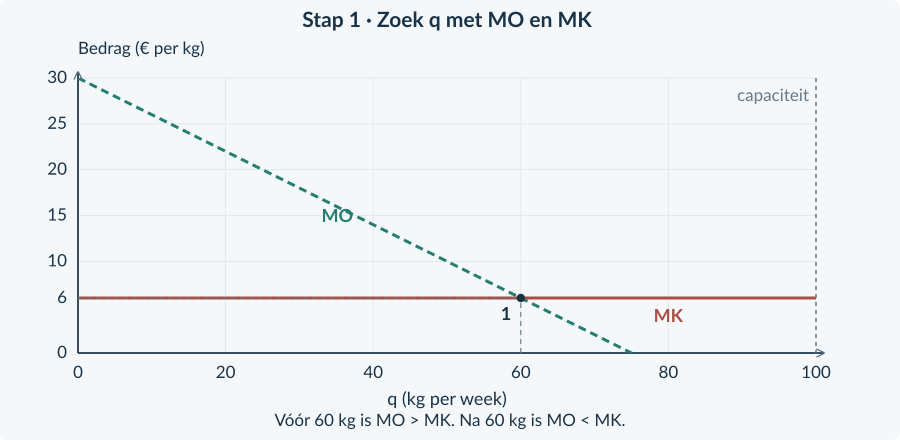
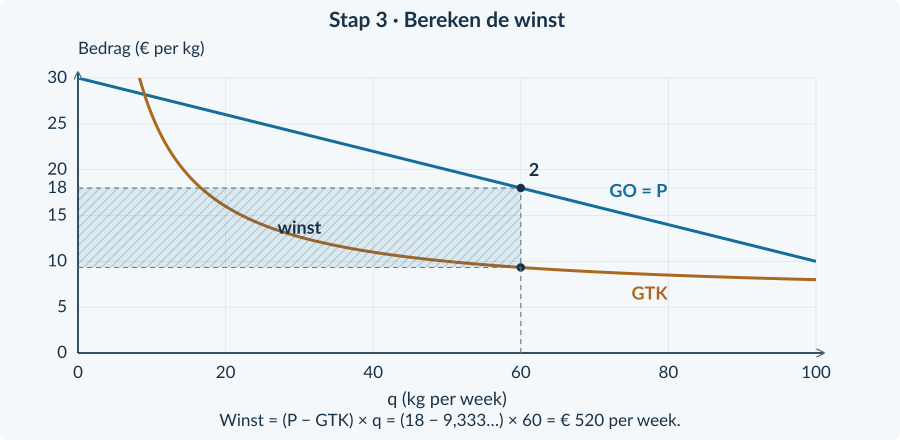
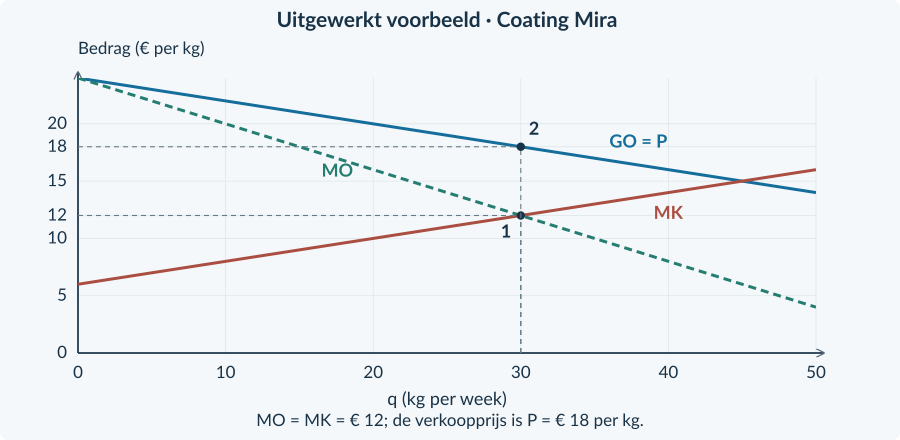
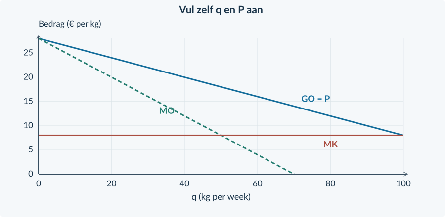

<!-- PAGE {"section": "4.1.4", "title": "Welke afzet geeft de meeste winst?", "origin_chapter": "4.1", "origin_page": 21, "edition_page": 31} -->

4.1.4 · WINSTMAXIMALISATIE BIJ MONOPOLIE

# Meer omzet, minder winst?
Een onderneming verkoopt een eigen mengsel. Door haar prijs te verlagen kan zij meer kg verkopen. Maar meer productie kost ook geld. De afzet met de hoogste omzet hoeft daarom niet de beste afzet te zijn.

<b>Lesdoelen</b> Je kunt MO en MK gebruiken om een winstmaximale haalbare afzet te kiezen. Je kunt daarna de verkoopprijs uit de vraagfunctie halen. Je kunt de totale winst berekenen en de grafische route markeren. Je kunt een verkeerde prijs- of productiekeuze met de berekening weerleggen.

We onderzoeken **P = 30 − 0,20q** en **TK = 6q + 200**. q is kg per week; P is euro per kg; TK is euro per week. De productiecapaciteit is 100 kg. De € 200 blijft deze week bestaan, ook bij q = 0. Alle geproduceerde kg worden tegen dezelfde prijs verkocht.

| q (kg per week) | P (€ per kg) | TO (€ per week) | TK (€ per week) | Winst (€ per week) |
|---:|---:|---:|---:|---:|
| 40 | 22 | 880 | 440 | 440 |
| 60 | 18 | 1.080 | 560 | 520 |
| 80 | 14 | 1.120 | 680 | 440 |

Van 60 naar 80 kg stijgt TO met € 40, maar TK met € 120. De winst daalt dus met € 80. Alleen op de omzet letten leidt hier tot een verkeerde keuze.

<b>De bekende keuze blijft bruikbaar</b> Je vergeleek in Boek 3 al MO en MK. Diezelfde vergelijking gebruik je opnieuw. Nieuw is dat MO daalt en onder de verkoopprijs ligt. Na het kiezen van q heb je daarom een extra stap nodig om P te vinden.

De tabel vergelijkt maar drie afzetten. Om ook tussen de rijen een optimum te vinden, gebruiken we de doorlopende functies. De volgende pagina’s werken de keuze stap voor stap uit.

<!-- PAGE {"section": "4.1.4", "title": "Stap 1: kies de hoeveelheid", "origin_chapter": "4.1", "origin_page": 22, "edition_page": 32} -->

### Vergelijk MO met MK
Uit de vraagfunctie volgt TO = 30q − 0,20q². Dus **MO = 30 − 0,40q**. De totale kosten zijn TK = 6q + 200, dus **MK = 6**.

Als MO groter is dan MK, voegt een kleine uitbreiding meer opbrengst dan kosten toe. De winst stijgt. Als MO kleiner is dan MK, verlaagt een uitbreiding de winst.

MO = MK 30 − 0,40q = 6 24 = 0,40q → q = 60

<figure><figcaption>Figuur 12. Bij punt 1 verandert de marginale vergelijking van MO > MK in MO < MK. Dit punt bepaalt de afzet, nog niet de verkoopprijs.</figcaption></figure>

### Controleer vóór én na de kandidaat
Bij q = 50 is MO = 10 en MK = 6: de winst kan nog stijgen. Bij q = 70 is MO = 2 en MK = 6: verder uitbreiden verlaagt de winst. De kandidaat q = 60 past binnen de capaciteit van 100 kg.

<b>Geen los trucje</b> MO = MK levert eerst een kandidaat op. Controleer het verloop van MO en MK én de haalbaarheid. In deze modellen daalt MO en is MK constant of stijgend. Daardoor stijgt de winst vóór het snijpunt en daalt zij erna.

<!-- PAGE {"section": "4.1.4", "title": "Stap 2: lees de verkoopprijs", "origin_chapter": "4.1", "origin_page": 23, "edition_page": 33} -->

### Blijf bij dezelfde q
Het snijpunt van MO en MK ligt op **q = 60** en op een bedrag van **€ 6 per kg**. Die € 6 is niet wat kopers betalen. Het is de marginale opbrengst en tegelijk de marginale kosten bij de gekozen afzet.

Ga bij q = 60 omhoog naar de **vraaglijn / GO-lijn**. Die lijn geeft de prijs waarvoor de 60 kg verkocht kunnen worden.
<figure><figcaption>Figuur 13. Van punt 1 naar de hoeveelheid; bij dezelfde hoeveelheid naar punt 2 op GO. Lees dan de prijs op de verticale as.</figcaption></figure>

P = 30 − 0,20 × 60 = € 18 per kg

### Controleer met de vraagfunctie
Vul € 18 terug in: 18 = 30 − 0,20q geeft q = 60. De gekozen prijs en hoeveelheid vormen dus één combinatie op de vraaglijn.

<b>De veelgemaakte fout</b> “Bij het snijpunt is het bedrag € 6, dus ik vraag € 6.” Onjuist: dit is het bedrag op MO en MK. De verkoopprijs hoort bij GO. Bij het monopolie-optimum geldt hier <b>P > MO = MK</b>.

Bij de prijsnemer lagen P, GO en MO op dezelfde horizontale lijn. Daarom zag je daar geen apart hoger prijspunt. Juist dit verschil maakt het teruglezen via GO noodzakelijk.

<!-- PAGE {"section": "4.1.4", "title": "Stap 3: bereken de winst", "origin_chapter": "4.1", "origin_page": 24, "edition_page": 34} -->

### Eerst de totale bedragen
We hebben q = 60 kg en P = € 18 per kg. Daarmee berekenen we TO en TK in euro per week.

TO = P × q = 18 × 60 = € 1.080 TK = 6 × 60 + 200 = € 560 Winst = TO − TK = € 520 per week

De constante kosten van € 200 horen bij TK. Zij vielen weg uit MK, maar niet uit de winstberekening.
<figure><figcaption>Figuur 14. De winstrechthoek gebruikt GTK bij de gekozen q. De rechthoek is geen consumentensurplus of welvaartsverlies.</figcaption></figure>

### Waarom is winst hier een rechthoek?
Bij q = 60 zijn de gemiddelde totale kosten **GTK = 560 / 60 = € 9,333… per kg**. Het verschil met P is de winst per kg. Vermenigvuldig met het aantal kg.

Winst = (P − GTK) × q

Reken met ongeronde GTK, of gebruik direct TO − TK. In een grafiek van **totale** bedragen is winst juist de verticale afstand tussen TO en TK. Hier staan bedragen **per kg** op de verticale as, daarom gebruik je een oppervlakte.

<b>Omzet is een ander maximum</b> Voor dit voorbeeld geeft MO = 0 de afzet q = 75 met TO = € 1.125. Maar TK is dan € 650 en de winst € 475: minder dan de € 520 bij q = 60.

<!-- PAGE {"section": "4.1.4", "title": "Wat als het snijpunt niet haalbaar is?", "origin_chapter": "4.1", "origin_page": 25, "edition_page": 35} -->

### Een kleinere productiecapaciteit
Stel dat dezelfde onderneming geen 100 maar **50 kg per week** kan maken. De theoretische kandidaat q = 60 is dan niet uitvoerbaar. MO blijft tot 50 groter dan MK, dus de winst stijgt tot aan de grens.
<figure><figcaption>Figuur 15. De capaciteit is geen nieuwe vraaglijn. Zij begrenst de uitvoerbare hoeveelheden.</figcaption></figure>

q = 50 → P = 30 − 0,20 × 50 = € 20 TO = € 1.000; TK = € 500; winst = € 500

Vergelijk zo nodig ook met q = 0. Dan is de winst deze week −€ 200. De productie van 50 kg is beter. In de oefeningen betekent “haalbare q” dus: niet negatief en niet hoger dan de productiecapaciteit.

<b>Maximale winst kan toch een verlies zijn</b> Een monopolie garandeert geen positieve winst. Als in het oorspronkelijke voorbeeld de onvermijdbare constante kosten € 900 zijn, verandert MO of MK niet. Bij q = 60 is de winst dan 1.080 − (360 + 900) = −€ 180. Dat is nog steeds beter dan −€ 900 bij q = 0.

Dit is een keuze voor de beschreven week met gegeven capaciteit en onvermijdbare constante kosten. We onderzoeken hier geen aparte langetermijnbeslissing om een bedrijf te starten of te sluiten.

<!-- PAGE {"section": "4.1.4", "title": "Eén complete winstberekening", "origin_chapter": "4.1", "origin_page": 26, "edition_page": 36} -->

## Uitgewerkt voorbeeld
**Coating Mira.** P = 24 − 0,20q en TK = 0,10q² + 6q + 80. q is kg per week; P is euro per kg; TK is euro per week. De capaciteit is 50 kg. De € 80 is deze week onvermijdbaar. Alle kg worden tegen één prijs verkocht.

**1 · Maak de marginale functies.**

TO = 24q − 0,20q² → MO = 24 − 0,40q TK = 0,10q² + 6q + 80 → MK = 0,20q + 6

**2 · Kies q en controleer.** 24 − 0,40q = 0,20q + 6 → 18 = 0,60q → **q = 30**. Bij q = 20 is MO = 16 > MK = 10. Bij q = 40 is MO = 8 < MK = 14. De winst stijgt dus eerst en daalt daarna. 30 kg past binnen de capaciteit.

**3 · Lees P uit de vraag.** P = 24 − 0,20 × 30 = **€ 18 per kg**.

**4 · Bereken winst.** TO = 18 × 30 = € 540. TK = 0,10 × 30² + 6 × 30 + 80 = € 350. Winst = **€ 190 per week**. Bij q = 0 zou het verlies € 80 zijn. GTK = 350 / 30 = € 11,666… per kg.
<figure><figcaption>Figuur 16. Het bedrag bij MO = MK is € 12; de prijs op GO is € 18. Deze twee bedragen blijven apart.</figcaption></figure>

<b>Onthouden</b> MO en MK → q → verloop en capaciteit controleren → P uit vraag/GO → TO − TK. Lees nooit P uit MO. In de gemengde opgaven kies je zelf tussen deze route en de prijsnemersroute.

<!-- PAGE {"section": "4.1.4", "title": "De juiste lijn kiezen", "origin_chapter": "4.1", "origin_page": 27, "edition_page": 37} -->

## Startopgaven

<b>Korte route:</b> Startopgaven → Zelfstandige oefening → Doeloefening. Extra hulp nodig? Maak eerst Begeleide inoefening.

<b>Opgave 31 · Opbrengst en kosten terughalen</b>

Voor een onderneming geldt P = 20 − 0,10q en TK = 0,05q² + 2q + 50. q is kg per week.

<b>a.</b> Stel TO, MO en MK op.

<b>b.</b> Bereken P, MO en MK bij q = 40. Is een kleine uitbreiding rond die q gunstig voor de winst?

<b>Opgave 32 · Welk getal is de prijs?</b>

Bij een afzet van 30 kg lees je in een ondernemingsgrafiek af: MO = MK = € 8 per kg en GO = € 14 per kg.

<b>a.</b> Welke prijs betalen de kopers bij die afzet?

<b>b.</b> Bereken TO. Welke informatie ontbreekt nog om de totale winst te berekenen?

## Begeleide inoefening

Heb je deze hulp niet nodig? Ga dan verder met Zelfstandige oefening.

<b>Opgave 33 · Volg de gemarkeerde route</b>

Gebruik figuur 17. De afzet is al gekozen; alle kg worden verkocht.

<b>a.</b> Leg uit waarom punt 1 de afzet bepaalt en punt 2 de verkoopprijs geeft.

<b>b.</b> De totale kosten bij q = 80 zijn € 420. Bereken de winst met de afgelezen prijs.

<figure><figcaption>Figuur 17. De volledige route is eerst zichtbaar, voordat je deze zelf gaat aanvullen.</figcaption></figure>

<!-- PAGE {"section": "4.1.4", "title": "De route zelf aanvullen", "origin_chapter": "4.1", "origin_page": 28, "edition_page": 38} -->

Begeleide inoefening · vervolg

<b>Opgave 34 · Waslaag Wavo</b>

Voor deze oefenmonopolist geldt P = 28 − 0,20q, TO = 28q − 0,20q² en TK = 8q + 100. q is kg per week. De capaciteit is 100 kg; de € 100 blijft ook zonder productie bestaan.

<b>a.</b> Stel MO en MK op. Los MO = MK op. Controleer dat de afzet past binnen de capaciteit en dat MO daarna onder MK ligt.

<b>b.</b> Markeer in figuur 18 de gevonden q en ga bij dezelfde q naar GO. Noteer de prijs.

<b>c.</b> Bereken TO, TK en winst bij deze combinatie.

<figure><figcaption>Figuur 18. De lijnen zijn gegeven; voeg zelf de route naar hoeveelheid en prijs toe.</figcaption></figure>

<b>Opgave 35 · Twee wijzigingen bij Wavo</b>

Begin telkens bij de gegevens van opgave 34. Door meer belangstelling wordt de vraag P = 32 − 0,20q. Tegelijk stijgen de constante kosten van € 100 naar € 180; de variabele kosten en capaciteit blijven gelijk.

<b>a.</b> Bekijk alleen de nieuwe vraag. Welke nieuwe MO hoort erbij en welke q volgt?

<b>b.</b> Bekijk alleen de hogere constante kosten. Verandert MK of de gekozen q? Wat gebeurt er bij dezelfde q met de winst?

<b>c.</b> Welke q en P horen bij beide veranderingen samen?

<b>d.</b> Weerleg: “Alle kosten stijgen, dus de monopolist moet minder produceren.”

<!-- PAGE {"section": "4.1.4", "title": "De volledige methode toepassen", "origin_chapter": "4.1", "origin_page": 29, "edition_page": 39} -->

## Zelfstandige oefening

<b>Opgave 36 · Hars Helder</b>

P = 40 − 0,20q en TK = 0,10q² + 4q + 100. q is kg per week; P is euro per kg; TK is euro per week. De capaciteit is 70 kg en de € 100 blijft deze week ook bij q = 0 bestaan.

<b>a.</b> Stel TO, MO en MK op. Bepaal de winstmaximale haalbare q en onderbouw met de marginale vergelijking.

<b>b.</b> Bereken de verkoopprijs. Markeer q en P in figuur 19.

<b>c.</b> Bereken de totale winst. Controleer dat niet produceren geen betere uitkomst geeft.

<figure><figcaption>Figuur 19. De figuur loopt verder dan de productiecapaciteit. Houd die grens zelf in het oog.</figcaption></figure>

<b>Opgave 37 · Een kleinere machine</b>

P = 22 − 0,20q en TK = 2q + 50. q is kg per week. De machine kan maximaal 40 kg produceren. De € 50 is deze week onvermijdbaar.

<b>a.</b> Bereken eerst de theoretische q bij MO = MK. Kies daarna de beste haalbare q en leg uit.

<b>b.</b> Bereken P en de totale winst bij de werkelijk gekozen q. Waarom hoort daar een andere prijs bij dan bij de theoretische kandidaat?

<!-- PAGE {"section": "4.1.4", "title": "Hoeveelheid, prijs en winst onderbouwen", "origin_chapter": "4.1", "origin_page": 30, "edition_page": 40} -->

## Doeloefening

<b>Bron · Korrels Nova</b> Nova is de enige aanbieder van een specifiek materiaal. Voor deze week geldt P = 40 − 0,25q en TK = 0,125q² + 10q + 200. q is kg per week; P is euro per kg; TK is euro per week. De capaciteit is 80 kg. De € 200 is ook bij q = 0 onvermijdbaar. De hoeveelheden zijn deelbaar; iedere kg heeft binnen een verkoopplan dezelfde prijs.

<b>Opgave 38 · Korrels Nova</b>

Gebruik de bron en figuur 20.

<b>a.</b> (2p) Stel TO, MO en MK op.

<b>b.</b> (3p) Bereken de winstmaximale haalbare q. Controleer het verloop van MO tegenover MK en de capaciteit.

<b>c.</b> (1p) Bereken de bijbehorende verkoopprijs.

<b>d.</b> (3p) Bereken TO, TK, winst en GTK. Controleer ook de uitkomst bij q = 0.

<b>e.</b> (2p) Markeer in de grafiek de gekozen q en P. Maak met hulplijnen zichtbaar hoe je van MO = MK naar de verkoopprijs gaat.

<b>f.</b> (2p) Een leerling gebruikt P = MK en vindt q = 60. Leg uit waarom dit niet de juiste winstkeuze is. Gebruik de marginale bedragen bij q = 60.

<figure><figcaption>Figuur 20. Teken de lijnen niet opnieuw. Voeg de gevraagde route en labels toe.</figcaption></figure>

<!-- PAGE {"section": "4.1.4", "title": "Is het optimum ook een goed resultaat?", "origin_chapter": "4.1", "origin_page": 31, "edition_page": 41} -->

## Denkertje / Bonusopgave

<b>Opgave 39 · Dezelfde keuze, toch verlies</b>

Een analist vergelijkt twee ondernemingen met dezelfde vraag en dezelfde variabele kosten. Alleen hun onvermijdbare constante kosten verschillen. Bij hun beste haalbare q maakt A € 300 winst. B heeft € 500 hogere constante kosten. Beide hebben voldoende capaciteit; de constante kosten blijven in de onderzochte periode ook bij q = 0 bestaan.

<b>a.</b> Leg uit waarom dezelfde q het winstmaximum kan geven voor A én B.

<b>b.</b> Bereken de winst van B bij die q. Is “monopolist” dus een garantie voor positieve winst?

<b>c.</b> Welke vergelijking heb je nodig voordat je in deze periode voor q = 0 kiest? Leg uit waarom een negatief winstbedrag op zichzelf niet genoeg is.

## Herhaling / Herhaling en interleaving

<b>Opgave 40 · Bedragen en percentages</b>

Een marktprijs stijgt van € 10 naar € 11. De verkochte hoeveelheid daalt van 200 naar 180 kg per week.

<b>a.</b> Bereken Ev met de oude waarden als noemer. Bereken ook TO vóór en na. Is de omzet exact gelijk gebleven?

<b>b.</b> Bij een andere onderneming is de subsidie € 2 per verkochte kg en de totale gesubsidieerde afzet 150 kg. Bereken de overheidsuitgaven. Waarom gebruik je niet alleen de extra kg ten opzichte van vroeger?

<b>Laatste controle vóór de gemengde opgaven</b> Kun je q, P en winst apart aanwijzen? Kun je uitleggen waarom MO en MK de hoeveelheid bepalen, maar GO de prijs geeft? Controleer steeds de capaciteit en laat constante kosten niet uit de winstberekening verdwijnen.

In §4.2.1 onderzoeken we het monopolie ook vanuit kopers en de totale welvaart. Hier hebben we alleen de opbrengsten, kosten en keuze van de onderneming onderzocht.

