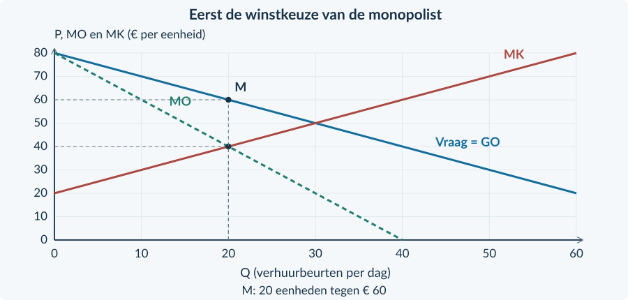

<!-- PAGE {"section": "4.2.1", "title": "Van winst naar welvaart", "origin_chapter": "4.2", "origin_page": 3, "edition_page": 3} -->

4.2.1 · WELVAARTSEFFECTEN VAN MONOPOLIE

# Meer winst. Ook meer welvaart?

Een verhuurbedrijf verhoogt de prijs en verhuurt minder apparaten. De winst stijgt. Klanten betalen meer of haken af. Is er alleen geld verschoven, of gaat er ook gezamenlijk voordeel verloren?

<b>Lesdoelen</b> Je kunt de monopolie-uitkomst vergelijken met een efficiënte uitkomst. Je kunt CS, PS en totaal surplus berekenen en arceren. Je kunt een overdracht onderscheiden van welvaartsverlies en PS onderscheiden van winst.

### Dezelfde markt, twee verschillende vragen
In hoofdstuk 4.1 zochten we de grootste winst voor één onderneming. Nu kijken we naar het voordeel van **kopers én verkopers samen**. We houden de vraag, productiekosten en kwaliteit gelijk. Er zijn hier geen externe effecten: buitenstaanders hebben geen kosten of baten van de transacties.

**Consumentensurplus (CS)** is het verschil tussen de betalingsbereidheid en de betaalde prijs, opgeteld over de verkochte eenheden. **Producentensurplus (PS)** is de opbrengst boven de variabele kosten. Het ligt tussen de verkoopprijs en de marginale-kostenlijn, tot aan de verkochte hoeveelheid.

TS = CS + PS winst = PS − TCK

We noemen TS het **totale surplus**. TCK zijn de totale constante kosten. Bij de vergelijking blijven die kosten gelijk. Daarom geven veranderingen van TS hier ook de verandering van het gezamenlijke voordeel na aftrek van TCK.

<b>Welke hoeveelheid?</b> In hoofdstuk 4.1 stond q voor één onderneming. Hier gebruiken we Q voor de hele markt. Bij één monopolist zijn q en Q hetzelfde aantal. Bij de vergelijking gebruiken we steeds de kosten van de héle onderzochte productie.

### Welvaart is niet hetzelfde als een eerlijke verdeling
Meer totaal surplus zegt nog niet wie het krijgt. De surplusberekening gebruikt betalingsbereidheid in euro en geeft geen volledig oordeel over alle aspecten van welzijn of rechtvaardigheid.

<!-- PAGE {"section": "4.2.1", "title": "Twee uitkomsten in dezelfde grafiek", "origin_chapter": "4.2", "origin_page": 4, "edition_page": 4} -->

### Eerst de keuze van de monopolist
Voor de verhuur van apparaten geldt **P = 80 − Q** en **MK = 20 + Q**. P en MK zijn euro per verhuur; Q is verhuurbeurten per dag. De capaciteit is 60. Alle klanten betalen in één situatie dezelfde prijs. Andere omstandigheden blijven gelijk.

De bekende route geeft TO = 80Q − Q² en MO = 80 − 2Q. Uit MO = MK volgt **Qm = 20**. Op de vraaglijn hoort daarbij **Pm = € 60**.
<figure><figcaption>Figuur 2. Punt M ligt op de vraaglijn. Het snijpunt van MO en MK bepaalt alleen de hoeveelheid.</figcaption></figure>

### Dan de efficiënte hoeveelheid
Een extra verhuur verhoogt het gezamenlijke voordeel zolang de betalingsbereidheid groter is dan MK. Voor het laatste zinvolle beetje productie geldt daarom **P = MK**: 80 − Q = 20 + Q. Dat geeft **Qe = 30** en **Pe = € 50**.

<b>Een vergelijkingsmaatstaf</b> De efficiënte uitkomst gebruikt dezelfde vraag en dezelfde kosten als de monopolie-uitkomst. We veranderen niet tegelijk de techniek of kwaliteit. Dit is geen bewering dat elke echte concurrerende markt exact zo werkt.

<!-- PAGE {"section": "4.2.1", "title": "De gebieden uit elkaar houden", "origin_chapter": "4.2", "origin_page": 5, "edition_page": 5} -->

### Wat gebeurt er met het voordeel van kopers?
Bij de efficiënte uitkomst is CS = ½ × 30 × (80 − 50) = **€ 450 per dag**. Bij monopolie is CS = ½ × 20 × (80 − 60) = **€ 200 per dag**.

Kopers verliezen € 250. Maar dat bedrag verdwijnt niet helemaal. De twintig blijvende verhuurbeurten worden € 10 duurder: **€ 200 gaat van kopers naar de aanbieder**. Bij de tien weggevallen verhuurbeurten verdwijnt voordeel voor beide kanten.
<figure><figcaption>Figuur 3. De rechthoek is een overdracht. Alleen de driehoek tussen Q = 20 en Q = 30 is verloren surplus.</figcaption></figure>

### Wat krijgt de aanbieder?
Bij monopolie is MK bij Q = 20 gelijk aan € 40. PS is een rechthoek van 20 × (60 − 40), plus een driehoek van ½ × 20 × (40 − 20): samen **€ 600**. Bij Qe = 30 is PS = ½ × 30 × (50 − 20) = **€ 450**.

PS stijgt met € 150, niet met € 200: de aanbieder krijgt de overdracht, maar verliest ook € 50 surplus door de lagere afzet. TS daalt van € 900 naar € 800. Het **welvaartsverlies is € 100**.

<b>Verloren transacties</b> De driehoek heeft basis 30 − 20 = 10 verhuurbeurten en hoogte 60 − 40 = € 20 per beurt. Welvaartsverlies = ½ × 10 × 20 = € 100 per dag. Het is geen rekening die iemand ontvangt.

<!-- PAGE {"section": "4.2.1", "title": "Eén volledige vergelijking", "origin_chapter": "4.2", "origin_page": 6, "edition_page": 6} -->

## Uitgewerkt voorbeeld

**Studiohuur** is de enige aanbieder in deze oefencase. Vraag: P = 70 − Q. Totale kosten: TK = 100 + 10Q + 0,5Q². Q is sessies per week; P is euro per sessie. De capaciteit is 50 sessies. De € 100 constante kosten zijn in deze week onvermijdelijk. Er zijn geen externe effecten.

**1 · Vind beide hoeveelheden.** MO = 70 − 2Q en MK = 10 + Q. Monopolie: 70 − 2Q = 10 + Q → Qm = 20. Lees Pm = 70 − 20 = € 50. Efficiënt: 70 − Q = 10 + Q → Qe = 30 en Pe = € 40. Beide hoeveelheden zijn haalbaar.

**2 · Selecteer en bereken de gebieden.**

| Per week | Monopolie: Q = 20 | Efficiënt: Q = 30 |
|---|---:|---:|
| CS | ½ × 20 × (70 − 50) = € 200 | ½ × 30 × (70 − 40) = € 450 |
| PS | 20 × (50 − 30) + ½ × 20 × (30 − 10) = € 600 | ½ × 30 × (40 − 10) = € 450 |
| TS | € 800 | € 900 |
| Winst = PS − 100 | € 500 | € 350 |

**3 · Controleer het verlies.** TS daalt € 100. De driehoek geeft hetzelfde: ½ × (30 − 20) × (50 − 30) = € 100.

**4 · Leg de verdeling uit.** De overdracht is 20 × (50 − 40) = € 200. De daling van CS is groter, omdat ook kopersvoordeel van weggevallen sessies verdwijnt. Meer PS is hier dus niet meer TS.
<figure><figcaption>Figuur 4. Bij Studiohuur is de driehoek van het verlies los te zien van de rechthoek van de overdracht.</figcaption></figure>

<b>Onthouden</b> Bereken Qm met MO = MK en Qe met P = MK. Lees beide prijzen op de vraaglijn. Bereken CS en PS bij de werkelijk verkochte hoeveelheid. Welvaartsverlies = verschil in TS. Trek constante kosten nog van PS af voor winst. In §4.2.2 onderzoeken we verschillende prijzen per groep.

<!-- PAGE {"section": "4.2.1", "title": "Opfrissen en aflezen", "origin_chapter": "4.2", "origin_page": 7, "edition_page": 7} -->

## Startopgaven

<b>Korte route:</b> Startopgaven → Zelfstandige oefening → Doeloefening. Extra hulp nodig? Maak eerst Begeleide inoefening.

<b>Opgave 1 · De bekende monopolieprocedure</b>

Voor een aanbieder geldt P = 30 − 0,5Q en TK = 40 + 10Q. Q is bezoeken per dag; P is euro per bezoek. De capaciteit is 40 bezoeken.

<b>a.</b> Bepaal MO en MK. Bereken Qm en Pm.

<b>b.</b> Bereken de winst bij die hoeveelheid.

<b>Opgave 2 · Niet elk verlies is verdwenen</b>

Na een prijsverandering daalt CS met € 120 per week. PS stijgt met € 80. Andere onderdelen van de welvaartsvergelijking veranderen niet.

<b>a.</b> Bereken de verandering van TS.

<b>b.</b> Een leerling noemt de hele € 120 welvaartsverlies. Wat vergeet hij?

## Begeleide inoefening

Heb je deze hulp niet nodig? Ga dan verder met Zelfstandige oefening.

<b>Opgave 3 · Herken de twee gebieden</b>

Gebruik de volledig gemarkeerde figuur op deze pagina. Dezelfde vraag en kosten gelden in beide uitkomsten.

<b>a.</b> Lees Qm, Pm, Qe en Pe af. Benoem de economische functie van gebied A en gebied B.

<b>b.</b> Bereken de oppervlakte van A en B.

<figure><figcaption>Figuur 5. A wordt door andere marktdeelnemers ontvangen; B niet. Beide bedragen zijn euro per dag.</figcaption></figure>

<!-- PAGE {"section": "4.2.1", "title": "Van gebieden naar een conclusie", "origin_chapter": "4.2", "origin_page": 8, "edition_page": 8} -->

<b>Opgave 4 · Een tabel aanvullen</b>

Een aanbieder verhuurt opslagvakken. Bij monopolie zijn Q = 20 en P = € 50; de efficiënte uitkomst is Q = 30 en P = € 40. De vraag begint bij € 70; MK = 10 + Q. Alle bedragen hieronder zijn per week. Er zijn geen externe effecten.

<b>a.</b> Vul de lege cellen van de tabel in. Gebruik voor PS bij monopolie eerst een rechthoek en daarna een driehoek.

<b>b.</b> Bereken de overdracht en het welvaartsverlies.

| Situatie | CS (€ per week) | PS (€ per week) | TS (€ per week) |
|---|---:|---:|---:|
| Monopolie | … | … | … |
| Efficiënt | 450 | 450 | … |

## Zelfstandige oefening

<b>Opgave 5 · Twee effecten tegelijk</b>

Door één prijs- en afzetverandering bij een verhuurder ontstaat een overdracht van € 300 van kopers naar verkopers. Daarnaast vervalt € 60 koperssurplus en € 40 producentensurplus door niet meer gesloten transacties. Er verandert verder niets.

<b>a.</b> Bekijk alleen de overdracht. Wat doet die met CS, PS en TS?

<b>b.</b> Bekijk alleen de weggevallen transacties. Hoe verandert TS?

<b>c.</b> Bereken de totale verandering van CS, PS en TS.

<b>d.</b> Beoordeel: “PS stijgt, dus er is geen marktfalen.”

<b>Opgave 6 · De markt voor prints</b>

P = 60 − Q en MK = Q. Q is prints per week en P euro per print, met 0 ≤ Q ≤ 50. Er zijn geen externe effecten.

<b>a.</b> Bepaal de monopolie-uitkomst en de efficiënte uitkomst.

<b>b.</b> Bereken CS, PS en TS bij monopolie en bepaal het welvaartsverlies.

<!-- PAGE {"section": "4.2.1", "title": "Doel: verdeling en verlies", "origin_chapter": "4.2", "origin_page": 9, "edition_page": 9} -->

## Doeloefening

<b>Bron · De enige VR-studio</b> Eén studio bedient de hele beschreven markt. Vraag: P = 80 − 0,5Q. Kosten: TK = 200 + 20Q + 0,25Q²; dus MK = 20 + 0,5Q. Q is sessies per week, P is euro per sessie. De capaciteit is 100 sessies. De € 200 constante kosten blijven deze week in beide situaties gelijk. Vergelijk met dezelfde vraag en kosten bij de efficiënte hoeveelheid. Geen externe effecten of andere veranderingen.

<b>Opgave 7 · De VR-studio</b>

Gebruik de bron en de basisgrafiek. De lijnen zijn al gegeven.

<b>a.</b> (3p) Bereken Qm en Pm, en daarna Qe en Pe.

<b>b.</b> (3p) Markeer beide uitkomsten en arceer CS en PS bij monopolie. Bereken die bedragen en de winst.

<b>c.</b> (3p) Bereken TS in beide situaties en het welvaartsverlies. Benoem basis en hoogte van de verliesdriehoek.

<b>d.</b> (2p) Bereken de overdracht op de blijvende sessies. Leg uit waarom die niet zelf het welvaartsverlies is.

<b>e.</b> (2p) Beoordeel: “Meer producentensurplus betekent dat deze uitkomst voor de samenleving beter én eerlijker is.”

<figure><figcaption>Figuur 6. Gegeven lijnen voor de VR-studio. Voeg alleen de gevraagde markeringen en arceringen toe.</figcaption></figure>

<!-- PAGE {"section": "4.2.1", "title": "Een vergelijking zorgvuldig gebruiken", "origin_chapter": "4.2", "origin_page": 10, "edition_page": 10} -->

## Denkertje / Bonusopgave

<b>Opgave 8 · Een betere techniek</b>

Een ontwerper zegt: “Mijn nieuwe techniek heeft lagere kosten. Daarom mag je mijn monopolie niet vergelijken met een concurrerende markt met de oude, dure techniek.” Er zijn nog geen cijfers over de nieuwe kosten of toekomstige uitvindingen.

<b>a.</b> Waarom kan een vergelijking met verschillende technieken de oorzaak van een welvaartsverschil vertroebelen?

<b>b.</b> Stel twee eerlijke vergelijkingen voor die samen meer inzicht geven.

<b>c.</b> Bewijst het bestaan van een patent al dat de totale maatschappelijke uitkomst beter is?

## Herhaling / Herhaling en interleaving

<b>Opgave 9 · De belasting blijft een wig</b>

Op een concurrerende markt is de oorspronkelijke prijs € 12. Na een belasting betalen kopers € 15 en ontvangen producenten € 10. Er worden 80 stuks per week verkocht.

<b>a.</b> Bereken de belasting per stuk en de overheidsopbrengst.

<b>b.</b> Bereken het kopers- en verkopersdeel van de belasting per verkocht stuk.

<b>Terug naar de hoofdvraag</b> Dezelfde prijsverandering kan tegelijk een overdracht én verloren surplus veroorzaken. Houd die twee effecten in je berekening apart.

