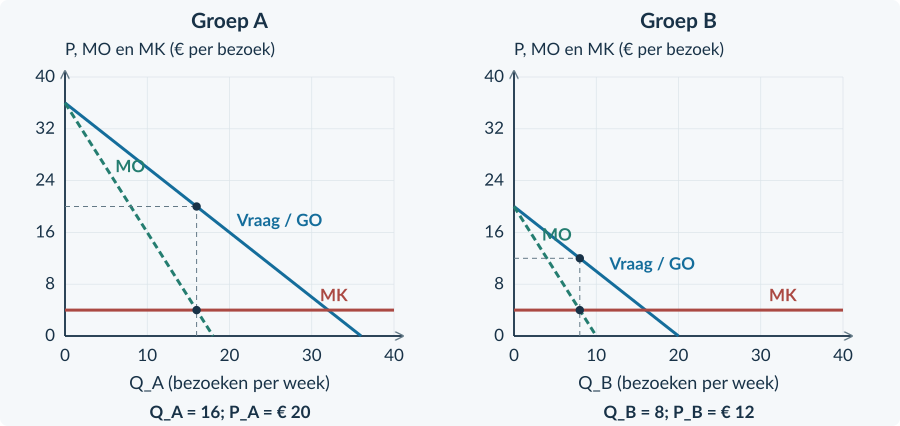

<!-- PAGE {"section": "4.2.2", "title": "Dezelfde dienst, een andere prijs", "origin_chapter": "4.2", "origin_page": 11, "edition_page": 11} -->

4.2.2 · PRIJSDISCRIMINATIE

# Waarom krijgt de één korting?

Twee bezoekers gebruiken dezelfde klimhal, op hetzelfde tijdstip. Een student betaalt minder dan een andere bezoeker. De toegang kost de hal evenveel. Waarom verkoopt de hal niet aan iedereen voor dezelfde prijs?

<b>Lesdoelen</b> Je kunt prijsdiscriminatie herkennen en de voorwaarden uitleggen. Je kunt twee gescheiden groepen vergelijken met één gezamenlijke prijs. Je kunt omzet, kosten, winst en de verdeling van surplus beoordelen.

<b>Prijsdiscriminatie</b> Een aanbieder vraagt verschillende prijzen voor hetzelfde product of dezelfde dienst, terwijl het prijsverschil niet door een verschil in kosten wordt verklaard.

### Drie voorwaarden moeten passen
De aanbieder heeft **enige marktmacht**: hij kan zijn prijs beïnvloeden. Hij kan groepen met een verschillende betalingsbereidheid of prijsgevoeligheid **herkennen en apart behandelen**. En kopers kunnen het goed niet gemakkelijk goedkoop kopen en vervolgens doorverkopen aan de duurdere groep.

Een persoonlijk toegangsbewijs kan doorverkoop verhinderen. Twee afzonderlijke prijzen werken niet als iedereen zonder controle het goedkoopste kaartje kan kiezen.
<figure><figcaption>Figuur 7. De aanbieder moet de groepen werkelijk kunnen scheiden. Alleen een andere prijslijst is niet genoeg.</figcaption></figure>

<b>Niet elk prijsverschil is prijsdiscriminatie</b> Een product thuisbezorgen kan duurder zijn doordat bezorging extra kost. Een luxere kamer is niet dezelfde dienst als een eenvoudige kamer. Beschrijf daarom eerst het product en de kosten.

<!-- PAGE {"section": "4.2.2", "title": "De bekende methode, nu tweemaal", "origin_chapter": "4.2", "origin_page": 12, "edition_page": 12} -->

### Elke groep heeft haar eigen vraag
Groep A en groep B reageren ieder op hun eigen prijs. De aanbieder bepaalt binnen elke groep één uniforme prijs. De twee prijzen mogen wel verschillen.

Voor een sporthal geldt in een oefenweek: **P_A = 36 − Q_A** en **P_B = 20 − Q_B**. Prijzen zijn euro per bezoek; hoeveelheden zijn bezoeken per week. Q_A loopt van 0 tot 36 en Q_B van 0 tot 20. Andere vraagfactoren blijven gelijk.

De marginale kosten zijn steeds **€ 4 per extra bezoek**, ook als beide groepen samen meer komen. De capaciteit is ruim genoeg voor 56 bezoeken. Daarom kunnen we de bekende MO/MK-keuze voor elke groep apart uitvoeren.
<figure><figcaption>Figuur 8. De twee panelen gebruiken dezelfde schaal. Lees de prijs van iedere groep af op haar eigen vraaglijn, niet op MO.</figcaption></figure>

Per groep: MO = MK → Q → P op de eigen vraaglijn TO totaal = P_A × Q_A + P_B × Q_B TK totaal = TCK + 4 × (Q_A + Q_B)

<b>Constante kosten tel je eenmaal</b> Het zijn twee klantgroepen van één bedrijf. Dezelfde huur of installatie is niet ineens twee keer nodig. Als MK zou afhangen van de totale productie, kun je beide groepen niet zomaar los optimaliseren. Dat complexere geval gebruiken we hier niet.

<!-- PAGE {"section": "4.2.2", "title": "Een prijsvergelijking uitwerken", "origin_chapter": "4.2", "origin_page": 13, "edition_page": 13} -->

## Uitgewerkt voorbeeld

**Avondhal** gebruikt de gegevens van de vorige pagina. De constante kosten zijn € 64 per week. Met één gemeenschappelijke prijs van € 16 verkoopt de hal 20 bezoeken aan A en 4 aan B. De bron geeft deze gemeenschappelijke prijs; we hoeven hem niet opnieuw te bepalen. Er zijn geen externe effecten.

**1 · Herken de voorwaarden.** De groepen gebruiken dezelfde voorziening en kosten per bezoek evenveel. Persoonlijke passen houden de groepen gescheiden. Beide vraagfuncties blijven bij de vergelijking gelijk.

**2 · Bepaal de aparte keuzes.** Voor A: MO_A = 36 − 2Q_A = 4 → Q_A = 16 en P_A = € 20. Voor B: MO_B = 20 − 2Q_B = 4 → Q_B = 8 en P_B = € 12. Bij beide groepen ligt MO vóór deze hoeveelheid boven MK en erna eronder.

**3 · Bereken het bedrijfsresultaat.**

| Per week | Eén prijs | Twee groepsprijzen |
|---|---:|---:|
| Totale afzet | 20 + 4 = 24 | 16 + 8 = 24 |
| TO | 16 × 24 = € 384 | 20 × 16 + 12 × 8 = € 416 |
| TK | 64 + 4 × 24 = € 160 | 64 + 4 × 24 = € 160 |
| Winst | € 224 | € 256 |

**4 · Kijk ook naar kopers.** A betaalt meer en koopt minder; B betaalt minder en koopt meer. CS_A daalt van ½ × 20 × 20 = € 200 naar ½ × 16 × 16 = € 128. CS_B stijgt van € 8 naar € 32. Samen daalt CS van € 208 naar € 160.

**5 · Begrens je conclusie.** PS stijgt van 384 − 96 = € 288 naar 416 − 96 = € 320. TS daalt daardoor van € 496 naar € 480. De aanbieder wint, maar dat is geen bewijs voor meer totale welvaart. Zelfs de gelijke totale afzet garandeert dat niet: de verdeling van de bezoeken verandert.

<b>Onthouden</b> Herken groepen en controleer doorverkoop. Kies per groep Q en lees de bijbehorende P. Tel omzet op, maar tel de gezamenlijke constante kosten slechts eenmaal. Beoordeel daarna de verdeling; winst en welvaart zijn verschillende uitkomsten.

<!-- PAGE {"section": "4.2.2", "title": "Herkennen en narekenen", "origin_chapter": "4.2", "origin_page": 14, "edition_page": 14} -->

## Startopgaven

<b>Korte route:</b> Startopgaven → Zelfstandige oefening → Doeloefening. Extra hulp nodig? Maak eerst Begeleide inoefening.

<b>Opgave 10 · Twee inkomsten, één bedrijf</b>

Een aanbieder verkoopt in één week 30 bezoeken voor € 12 en 20 bezoeken voor € 8. De variabele kosten zijn € 3 per bezoek; de gezamenlijke constante kosten zijn € 90.

<b>a.</b> Bereken totale omzet, totale kosten en winst.

<b>b.</b> Waarom trek je de € 90 niet voor elke groep afzonderlijk af?

<b>Opgave 11 · Drie prijskaartjes</b>

A: dezelfde rondleiding is goedkoper met een gecontroleerde studentenpas, zonder kostenverschil. B: een taxi rekent extra voor een langere rit. C: een abonnement met extra opslag kost meer.

<b>a.</b> Welke situatie beschrijft prijsdiscriminatie? Leg uit.

<b>b.</b> Waarom zijn B en C geen voldoende bewijs?

## Begeleide inoefening

Heb je deze hulp niet nodig? Ga dan verder met Zelfstandige oefening.

<b>Opgave 12 · Een volledig ingevuld paneel</b>

Lees in de figuur de keuzes van Lichtzaal voor twee soorten persoonlijke passen. MK = € 4 per bezoek. Er zijn geen extra kosten om groepen te scheiden.

<b>a.</b> Lees voor A en B de hoeveelheid en de prijs af. Bereken de totale omzet.

<b>b.</b> Leg uit waarom het horizontale niveau van € 4 niet de verkoopprijs is.

<figure><figcaption>Figuur 9. Gebruik de gemarkeerde hoeveelheden. Ga daarna naar de vraaglijn voor de prijs.</figcaption></figure>

<!-- PAGE {"section": "4.2.2", "title": "De gezamenlijke kosten bewaken", "origin_chapter": "4.2", "origin_page": 15, "edition_page": 15} -->

<b>Opgave 13 · De rekentabel van de ijsbaan</b>

Dezelfde ijsbaandienst wordt aan twee herkenbare groepen verkocht. De bron geeft de haalbare keuzes in de tabel. Variabele kosten: € 2 per bezoek. Gezamenlijke constante kosten: € 100 per week.

<b>a.</b> Vul eerst de lege cellen TO, TK en winst in voor beide situaties.

<b>b.</b> Een leerling rekent bij twee prijzen € 220 winst. Welke kostenpost ontbreekt in zijn berekening 320 − 100?

| Gegeven | Eén prijs | Twee prijzen |
|---|---:|---:|
| Prijs A / afzet A | € 10 / 20 | € 12 / 15 |
| Prijs B / afzet B | € 10 / 10 | € 7 / 20 |
| TO (€ per week) | … | … |
| TK (€ per week) | … | … |
| Winst (€ per week) | … | … |

## Zelfstandige oefening

<b>Opgave 14 · Toegang tot een tentoonstelling</b>

Voor groep A geldt P_A = 28 − Q_A; voor B geldt P_B = 20 − Q_B. Prijzen zijn euro per bezoek, hoeveelheden bezoeken per week. MK = € 4 voor beide groepen. TCK = € 40 per week. De capaciteit is 48. De groepen gebruiken dezelfde dienst en kunnen niet doorverkopen.

<b>a.</b> Bereken de winstmaximale afzet en de prijs voor elke groep.

<b>b.</b> Bereken de totale winst en geef één reden waarom de twee prijzen uitvoerbaar zijn.

<!-- PAGE {"section": "4.2.2", "title": "Niet alleen het bedrijf beoordelen", "origin_chapter": "4.2", "origin_page": 16, "edition_page": 16} -->

<b>Opgave 15 · Tegengestelde gevolgen</b>

Een ontspanningscentrum vervangt één tarief door groepsprijzen. Deelnemers van A betalen meer; CS_A daalt € 90. B krijgt korting; CS_B stijgt € 30. PS stijgt € 40 per week. Geen andere maatschappelijke posten veranderen.

<b>a.</b> Bekijk eerst alleen de prijsverandering voor A. Wat gebeurt met het surplus van A?

<b>b.</b> Bekijk nu alleen de prijsverandering voor B. Wat gebeurt met het surplus van B?

<b>c.</b> Bereken de verandering van het totale CS en van TS.

<b>d.</b> Beoordeel: “Er is korting en de aanbieder verdient meer, dus alle partijen winnen.”

### Gebruik prijsgevoeligheid als verklaring, niet als etiket
Een groep met goede alternatieven kan sterker afhaken bij een prijsverhoging. Dat maakt een lager tarief aantrekkelijk voor een aanbieder. Maar “student”, “volwassene” of “zakelijke klant” is op zichzelf geen bewijs voor een bepaalde elasticiteit. Gebruik gegevens over keuzes of reacties uit de bron.

Ook de helling van een getekende lijn is niet genoeg. Bij verschillende prijzen en hoeveelheden kunnen dezelfde absolute veranderingen heel andere procentuele veranderingen zijn. In dit hoofdstuk leiden we hiervoor geen nieuwe elasticiteitsformule af.

<b>Een advies in drie zinnen</b> Beschrijf eerst wat met de winst gebeurt. Noem daarna welke klantgroep voordeel of nadeel ondervindt. Beperk ten slotte je welvaartsconclusie tot de bekende bedragen en aannames.

<!-- PAGE {"section": "4.2.2", "title": "Doel: één prijs en twee prijzen", "origin_chapter": "4.2", "origin_page": 17, "edition_page": 17} -->

## Doeloefening

<b>Bron A · FilmLab</b> FilmLab biedt dezelfde toegangsdienst aan A en B. Het heeft marktmacht. De passen zijn persoonlijk; groepen worden gecontroleerd en doorverkoop is onmogelijk. Vraag: P_A = 40 − Q_A en P_B = 24 − Q_B. P is euro per bezoek; Q_A en Q_B zijn bezoeken per week. De hoeveelheden lopen van 0 tot 40 en van 0 tot 24. MK = € 8 voor elk bezoek. TCK = € 80 per week, samen voor beide groepen. Capaciteit: 64 bezoeken.

<b>Bron B · De vergelijking</b> Bij één gegeven prijs van € 20 koopt A 20 bezoeken en B 4. Het totale CS is dan € 208 per week. Bij de afzonderlijk winstmaximale groepsprijzen is het totale CS € 160. De vraag en kosten veranderen niet; er zijn geen externe effecten.

<b>Opgave 16 · FilmLab</b>

Gebruik beide bronnen. Je hoeft de gemeenschappelijke prijs van € 20 niet opnieuw te bepalen.

<b>a.</b> (3p) Bereken per groep MO, de winstmaximale hoeveelheid en de groepsprijs.

<b>b.</b> (3p) Bereken TO en winst bij één prijs en bij de groepsprijzen.

<b>c.</b> (2p) Welke groep betaalt meer en welke minder? Noem één noodzakelijke voorwaarde uit bron A.

<b>d.</b> (3p) Bereken met bron B PS en TS in beide situaties. Is de hogere winst hier ook een hogere totale welvaart?

<b>e.</b> (2p) Waarom bewijst deze ene case niet dat prijsdiscriminatie altijd welvaart verlaagt?

<figure><figcaption>Figuur 10. De twee groepen zijn gescheiden. Vul de benodigde hoeveelheden en prijzen aan.</figcaption></figure>

<!-- PAGE {"section": "4.2.2", "title": "Een conclusie kan van geval verschillen", "origin_chapter": "4.2", "origin_page": 18, "edition_page": 18} -->

## Denkertje / Bonusopgave

<b>Opgave 17 · Dezelfde naam, een ander gevolg</b>

Een onderzoeker beschrijft twee denkbeeldige prijsdiscriminatiegevallen. Er zijn geen externe effecten. In geval I verandert CS van € 500 naar € 430 en PS van € 300 naar € 350. In geval II verandert CS van € 100 naar € 160 en PS van € 200 naar € 260. De bedragen zijn per maand.

<b>a.</b> Vergelijk de verandering van TS in beide gevallen.

<b>b.</b> Geef een mogelijke verklaring voor het verschil, zonder te doen alsof de cijfers die verklaring bewijzen.

<b>c.</b> Welke extra broninformatie heb je nodig om te beoordelen wie erop vooruitgaat?

## Herhaling / Herhaling en interleaving

<b>Opgave 18 · Terug naar één uniforme prijs</b>

Een monopolist gebruikt P = 24 − 0,2Q en MK = € 4. Q is stuks per week; de capaciteit is 100.

<b>a.</b> Bereken Qm en Pm.

<b>b.</b> Bereken het consumentensurplus bij monopolie.

