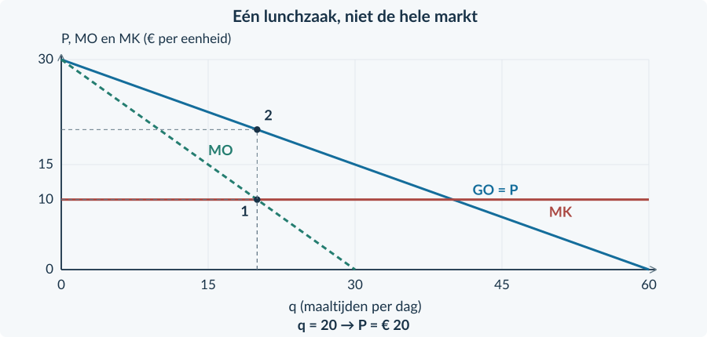

<!-- PAGE {"section": "4.2.3", "title": "Vier marktvormen herkennen", "origin_chapter": "4.2", "origin_page": 19, "edition_page": 19} -->

4.2.3 · MARKTVORMEN VERGELIJKEN

# Veel merken. Ook veel concurrentie?

In een winkel staan twintig merken frisdrank. Maar misschien zijn die merken van slechts enkele ondernemingen. Om concurrentie te beoordelen, moet je weten wie aanbiedt, wat kopers als alternatief zien en wie kan toetreden.

<b>Lesdoelen</b> Je kunt vier marktvormen onderscheiden met brongegevens. Je kunt de rol van productverschillen en toetreding uitleggen. Je kunt de bekende winstprocedure toepassen op een gegeven ondernemingsmodel.

### Gebruik kenmerken, niet alleen een bedrijfsnaam
Een **homogeen product** is in de ogen van kopers gelijkwaardig aan dat van andere aanbieders. Bij **heterogene producten** zien kopers verschillen, bijvoorbeeld in kwaliteit, smaak, plaats of service. Het aantal merken hoeft niet gelijk te zijn aan het aantal zelfstandige aanbieders.

| Marktvorm | Aanbieders | Product | Toetreding in het model |
|---|---|---|---|
| Volkomen concurrentie | Veel kleine | Homogeen | Vrij |
| Monopolistische concurrentie | Veel | Heterogeen | Relatief eenvoudig |
| Oligopolie | Enkele grote | Homogeen of heterogeen | Vaak belemmerd |
| Monopolie | Eén | Geen goed alternatief binnen de afgebakende markt | Sterk belemmerd |

Bij **monopolistische concurrentie** heeft elke onderneming enige ruimte voor een eigen prijs, maar er zijn veel alternatieven. Denk aan de verschillende lunchzaken in een beschreven winkelgebied. Dat is niet hetzelfde als een monopolie.

Bij **oligopolie** hangt een prijskeuze mede af van wat de andere grote ondernemingen doen. Er bestaat daarom niet één vraaglijn die voor elke oligopolist in elke situatie geldt.

<b>Marktvorm en uitkomst zijn verschillende vragen</b> Een marktvorm herkennen bewijst nog niet hoeveel winst een onderneming maakt. Daarvoor zijn prijs, vraag en kosten nodig. Een hoge prijs alleen bewijst evenmin een monopolie.

<!-- PAGE {"section": "4.2.3", "title": "Een bekende berekening in een nieuwe markt", "origin_chapter": "4.2", "origin_page": 20, "edition_page": 20} -->

## Uitgewerkt voorbeeld

In het centrum zijn veel onafhankelijke ijszaken. Ze verschillen in smaak en locatie. Nieuwe zaken kunnen relatief eenvoudig beginnen. Voor **IJsatelier** geldt op korte termijn P = 18 − 0,10q. MK = € 6 per portie en TCK = € 120 per dag. q is porties per dag, met een capaciteit van 100. Andere zaken veranderen in deze berekening hun gedrag niet.

**1 · Classificeer met bronbewijs.** Veel aanbieders, productverschillen en relatief eenvoudige toetreding passen bij **monopolistische concurrentie**. De zaak is geen monopolist op de ijsmarkt.

**2 · Gebruik de gegeven vraag voor deze zaak.** TO = 18q − 0,10q² en MO = 18 − 0,20q. De dalende lijn geldt voor één onderneming en voor de beschreven situatie, niet voor alle markten met veel aanbieders.

**3 · Kies q, lees P en bereken winst.** MO = MK geeft 18 − 0,20q = 6 → q = 60. Dat past binnen de capaciteit. Vóór 60 is MO groter dan MK en erna kleiner. P = 18 − 0,10 × 60 = € 12. TO = € 720 en TK = 120 + 6 × 60 = € 480. De winst is **€ 240 per dag**.
<figure><figcaption>Figuur 11. Hetzelfde rekenpad als bij monopolie, maar nu voor één zaak tussen veel aanbieders van verschillende producten.</figcaption></figure>

**4 · Begrens het resultaat.** Dit is een berekening voor deze vraag en deze korte termijn. De marktvorm alleen levert geen bedrag van € 240 op. Een reactie van concurrenten kan de gegeven vraag veranderen.

<b>Onthouden</b> Classificeer met aantal aanbieders, product en toetreding. Kies daarna het gegeven ondernemingsmodel. De rekenregel kan bekend zijn terwijl de economische situatie anders is. We bouwen hier geen apart strategisch model voor oligopolie.

<!-- PAGE {"section": "4.2.3", "title": "Van bron naar kenmerk", "origin_chapter": "4.2", "origin_page": 21, "edition_page": 21} -->

## Startopgaven

<b>Korte route:</b> Startopgaven → Zelfstandige oefening → Doeloefening. Extra hulp nodig? Maak eerst Begeleide inoefening.

<b>Opgave 19 · Prijsnemer of prijszetter?</b>

Onderneming A is een kleine prijsnemer en ontvangt € 9 per kg. Voor onderneming B geldt P = 18 − 0,20q. q is kg per week.

<b>a.</b> Geef voor A GO en MO.

<b>b.</b> Bepaal TO en MO voor B. Is MO bij positieve q gelijk aan P?

<b>Opgave 20 · Vier logo’s</b>

Vier populaire merken meel zijn allemaal eigendom van dezelfde producent. Over andere meelproducenten geeft de bron niets.

<b>a.</b> Bewijzen vier merken dat er vier zelfstandige aanbieders zijn?

<b>b.</b> Kun je nu zeker zeggen dat de hele meelmarkt een monopolie is?

## Begeleide inoefening

Heb je deze hulp niet nodig? Ga dan verder met Zelfstandige oefening.

<b>Opgave 21 · De kenmerken staan er al</b>

A: veel telers leveren een identieke kwaliteit graan; toetreding is vrij. B: veel onafhankelijke kapsalons bieden verschillende service; beginnen is relatief eenvoudig. C: drie grote fabrikanten domineren een markt met hoge startkosten. D: één leverancier bezit de enige toegestane toegang tot een voorziening.

<b>a.</b> Koppel A tot en met D aan de vier marktvormen.

<b>b.</b> Welke informatie onderscheidt B van een monopolie en C van volkomen concurrentie?

<b>Een bronantwoord opbouwen</b> Noem de marktvorm én twee passende gegevens. “Oligopolie, want drie ondernemingen beheersen de markt en starten kost veel geld” is sterker dan alleen “oligopolie”.

<!-- PAGE {"section": "4.2.3", "title": "Het gegeven model toepassen", "origin_chapter": "4.2", "origin_page": 22, "edition_page": 22} -->

<b>Opgave 22 · Een zaak met een eigen vraaglijn</b>

De figuur hoort bij één lunchzaak tussen veel vergelijkbare maar niet identieke lunchzaken. De bron houdt het gedrag van andere zaken gelijk. MK = € 10 per maaltijd; q is maaltijden per dag.

<b>a.</b> Lees de gemarkeerde hoeveelheid en prijs af. Welke twee lijnen gebruik je achtereenvolgens?

<b>b.</b> Waarom mag je dezelfde grafiek niet automatisch voor iedere oligopolist gebruiken?

<figure><figcaption>Figuur 12. De route is gegeven. Het aantal aanbieders verandert de algebra niet, maar wel de betekenis en voorwaarden van de vraaglijn.</figcaption></figure>

## Zelfstandige oefening

<b>Opgave 23 · Twee veranderingen in een winkelstraat</b>

Eerst zijn er veel onafhankelijke gelijksoortige winkels. Daarna kopen twee ketens bijna alle winkels op. Tegelijk gaan de winkels sterk verschillen in assortiment. Er worden geen prijs- of kostencijfers gegeven.

<b>a.</b> Bekijk eerst alleen de overnames. Welk kenmerk verandert?

<b>b.</b> Bekijk alleen de verschillende assortimenten. Welk kenmerk verandert?

<b>c.</b> Combineer de twee veranderingen. Welke marktvorm past nu het best bij de bron?

<b>d.</b> Beoordeel: “Door verschillende assortimenten is er nu zeker monopolistische concurrentie.”

<!-- PAGE {"section": "4.2.3", "title": "Zelf toepassen en doeloefening", "origin_chapter": "4.2", "origin_page": 23, "edition_page": 23} -->

<b>Opgave 24 · Een kleine bakker met een eigen recept</b>

Voor één bakker tussen veel zelfstandige bakkers geldt op korte termijn P = 20 − 0,10q en TK = 80 + 4q. q is producten per dag; de capaciteit is 100. Het gedrag van concurrenten blijft gelijk.

<b>a.</b> Bereken de winstmaximale hoeveelheid, prijs en winst.

<b>b.</b> Maakt de gebruikte rekenprocedure deze bakker tot monopolist?

## Doeloefening

<b>Bron A · Vier afgebakende markten</b> I: veel kleine telers bieden een identieke grondstof aan; kopers kennen de prijzen en toetreding is vrij. II: veel onafhankelijke lunchzaken verschillen in smaak en locatie; toetreding is relatief eenvoudig. III: drie grote aanbieders bedienen vrijwel de hele markt; een nieuw netwerk bouwen kost veel. IV: één aanbieder heeft als enige toegang tot een noodzakelijke voorziening; binnen deze markt zijn geen goede alternatieven.

<b>Bron B · Lunchzaak Puur</b> Puur hoort bij markt II. Voor één dag geldt P = 30 − 0,25q en TK = 144 + 6q. q is maaltijden per dag; P is euro per maaltijd. De productiecapaciteit is 80 maaltijden. De vaste kosten blijven ook bij q = 0 bestaan. Gedrag van concurrenten, kwaliteit en overige vraagfactoren blijven in deze berekening gelijk.

<b>Opgave 25 · Marktvorm is het begin</b>

Gebruik alleen de beschreven markten en de gegeven korte-termijnberekening.

<b>a.</b> (4p) Classificeer I tot en met IV. Geef voor elke markt het beslissende bronbewijs.

<b>b.</b> (2p) Bepaal voor Puur TO, MO en MK.

<b>c.</b> (3p) Bereken de winstmaximale haalbare q, de verkoopprijs en de winst.

<b>d.</b> (2p) Verklaar waarom Puur geen horizontale GO-lijn hoeft te hebben, ook al zijn er veel aanbieders.

<b>e.</b> (2p) Mag je de functie van Puur zonder extra broninformatie gebruiken voor markt III? Leg uit.

<b>Controle van je antwoord</b> Verbind de classificatie aan de bron. Houd de hoeveelheid van één zaak (q) apart van de hele markt (Q). Lees de verkoopprijs op de vraaglijn.

<!-- PAGE {"section": "4.2.3", "title": "Een markt is een afbakening", "origin_chapter": "4.2", "origin_page": 24, "edition_page": 24} -->

## Denkertje / Bonusopgave

<b>Opgave 26 · De enige winkel op het station</b>

Op één perron staat één broodjeswinkel. Buiten het station liggen meerdere lunchzaken. Reizigers met haast blijven vaak op het perron; reizigers met veel tijd lopen geregeld naar buiten.

<b>a.</b> Waarom kan de conclusie over marktmacht verschillen per klantgroep?

<b>b.</b> Welke gegevens zou je verzamelen voordat je de markt definitief afbakent?

<b>c.</b> Waarom is “één winkel in beeld” onvoldoende bewijs van een monopolie?

## Herhaling / Herhaling en interleaving

<b>Opgave 27 · De vaste kosten nogmaals controleren</b>

Twee klantgroepen leveren samen € 900 omzet. Er zijn in totaal 80 bezoeken. Variabele kosten zijn € 5 per bezoek en gezamenlijke constante kosten € 200.

<b>a.</b> Bereken PS en winst.

<b>b.</b> Leg uit welke fout ontstaat als iemand per groep € 200 vaste kosten aftrekt.

<b>Vooruitblik</b> Tot nu toe telden we voordelen binnen de markt. De volgende paragrafen voegen gevolgen toe voor mensen die niet aan de transactie deelnemen.

