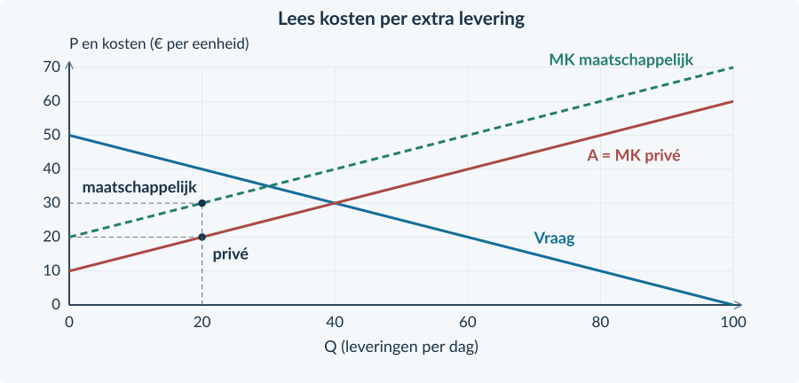
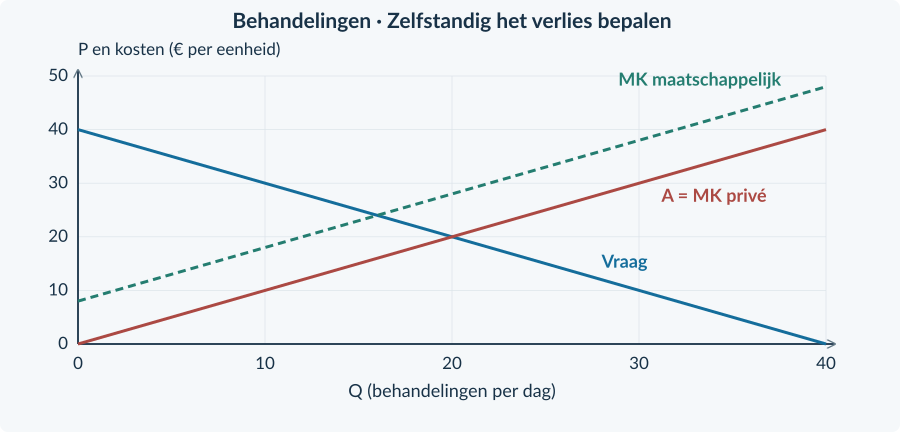
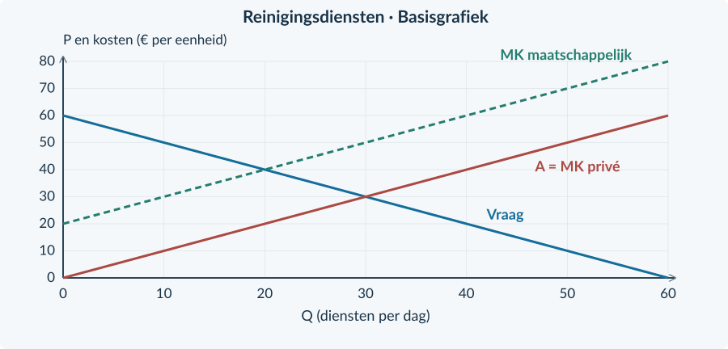

<!-- PAGE {"section": "4.2.4", "title": "Een derde partij krijgt de rekening", "origin_chapter": "4.2", "origin_page": 25, "edition_page": 25} -->

4.2.4 · NEGATIEVE EXTERNE EFFECTEN

# De koper betaalt. Wie draagt de schade?

Een bedrijf verkoopt leveringen. De klant betaalt de vervoerder, maar omwonenden ondervinden geluidshinder. Zij krijgen daarvoor geen vergoeding. De prijs kan dus lager zijn dan de kosten die de levering voor iedereen samen veroorzaakt.

<b>Lesdoelen</b> Je kunt een negatief extern effect en de getroffen derde partij benoemen. Je kunt private en maatschappelijke kosten onderscheiden. Je kunt een belastinguitkomst berekenen en de welvaartsvergelijking uitbreiden met externe kosten.

<b>Negatief extern effect</b> Nadeel voor een derde partij dat door productie of consumptie ontstaat en niet in de prijs of een vergoeding is verwerkt. De derde partij is geen koper of verkoper in de onderzochte transactie.

<figure><figcaption>Figuur 13. De betaling loopt tussen koper en verkoper. De hinder treft omwonenden buiten die transactie.</figcaption></figure>

### Privé kan de levering aantrekkelijk zijn
De vervoerder vergelijkt zijn ontvangsten met eigen kosten. De klant vergelijkt de prijs met eigen voordeel. Zonder heffing of vergoeding hoeven zij de hinder voor anderen niet mee te wegen.

Dat maakt niet elke levering verkeerd. Sommige leveringen leveren ook na aftrek van de schade voordeel op. De vraag is **hoeveel** activiteit gezamenlijk zinvol is, niet of alle activiteit moet verdwijnen.

<b>Verwar drie dingen niet</b> Een hoge rekening voor de koper is niet op zichzelf een extern effect. Een gewone productiekost van de verkoper is dat evenmin. Zoek een nadeel voor een buitenstaander dat niet wordt vergoed.

<!-- PAGE {"section": "4.2.4", "title": "Een nieuwe lijn, met een nieuwe betekenis", "origin_chapter": "4.2", "origin_page": 26, "edition_page": 26} -->

### Voeg de schade per extra eenheid toe
We gebruiken een concurrerende leveringsmarkt. De vraag is **P = 50 − 0,5Q** en het aanbod is **P = 10 + 0,5Q**. Q is leveringen per dag; P is euro per levering. Andere omstandigheden blijven gelijk. De aanbodlijn geeft hier de **marginale private kosten**: de eigen kosten van een extra levering.

Een onderzoek in deze oefencase waardeert de niet-vergoede schade op **€ 10 per levering**. Dat bedrag blijft bij elke hoeveelheid gelijk. De totale externe kosten zijn dus 10 × Q, niet alleen 10 maal de extra of de “te veel” uitgevoerde leveringen.

MK maatschappelijk = MK privé + externe kosten per extra eenheid Hier: MK maatschappelijk = 20 + 0,5Q

<figure><figcaption>Figuur 14. Begin met vraag en private kosten. De maatschappelijke-kostenlijn ligt bij dezelfde Q precies € 10 hoger.</figcaption></figure>

De maatschappelijke-kostenlijn laat **echte kosten voor alle betrokkenen samen** zien. Zij is niet automatisch de lijn waar bedrijven hun ongereguleerde aanbod op baseren. Zonder prikkel verandert hun eigen rekening nog niet.

Zonder ingrijpen: 50 − 0,5Q = 10 + 0,5Q → **Q₀ = 40, P₀ = € 30**. De maatschappelijke vergelijking is anders: 50 − 0,5Q = 20 + 0,5Q → **Qe = 30**.

<!-- PAGE {"section": "4.2.4", "title": "Waarom is veertig hier te veel?", "origin_chapter": "4.2", "origin_page": 27, "edition_page": 27} -->

### Beoordeel de volgende levering
Bij Q = 35 is de betalingsbereidheid € 32,50. De private marginale kosten zijn € 27,50. Koper en verkoper kunnen dus allebei voordeel zien. Maar inclusief € 10 hinder kost die levering de samenleving € 37,50. Het gezamenlijke nadeel is groter dan het gezamenlijke voordeel.

Tussen Q = 30 en Q = 40 worden leveringen uitgevoerd waarvoor de private vergelijking gunstig lijkt, maar de maatschappelijke vergelijking ongunstig is. Dat verschil veroorzaakt welvaartsverlies.
<figure><figcaption>Figuur 15. Het verloren surplus ligt tussen vraag en maatschappelijke kosten, van de efficiënte naar de ongereguleerde hoeveelheid.</figcaption></figure>

### Kijk breder dan CS + PS
Zonder belasting is CS = ½ × 40 × (50 − 30) = € 400. PS = ½ × 40 × (30 − 10) = € 400. Het private totale surplus is dus € 800.

De omwonenden dragen echter 40 × € 10 = € 400 schade. Het **maatschappelijk surplus** in dit model is € 800 − € 400 = **€ 400 per dag**.

Maatschappelijk surplus zonder heffing = CS + PS − totale externe kosten

<b>Een begrensde maatstaf</b> We tellen in deze oefencase eurobedragen zonder verdelingsgewichten. Andere externe effecten, vaste kosten en uitvoeringskosten ontbreken. Verander je die aannames, dan verandert mogelijk de beoordeling.

<!-- PAGE {"section": "4.2.4", "title": "De bekende heffing verandert de eigen rekening", "origin_chapter": "4.2", "origin_page": 28, "edition_page": 28} -->

### Gebruik opnieuw de twee prijzen uit Boek 3
Een heffing van **t = € 10 per levering**, afgedragen door de verkoper, maakt de schade voelbaar in de prijskeuze. Kopers betalen Pc. Producenten ontvangen na afdracht Pp. Voor het evenwicht geldt:

Pc = Pp + t 50 − 0,5Q = (10 + 0,5Q) + 10 Q = 30; Pc = € 35; Pp = € 25

<figure><figcaption>Figuur 16. In deze case valt aanbod in kopersprijzen samen met maatschappelijke kosten, omdat t precies € 10 is. De producent blijft op de oorspronkelijke A aflezen.</figcaption></figure>

### Overheidsontvangsten blijven een overdracht
De overheid ontvangt 10 × 30 = € 300. Dat geld verdwijnt niet uit de samenleving. Als we CS en PS na belasting berekenen, is de afdracht daar al buiten gehouden. Daarom tellen we de ontvangst van de overheid weer mee.

Maatschappelijk surplus met heffing = CS + PS + belastingopbrengst − externe kosten

De € 300 belastingopbrengst is geen bewijs dat de omwonenden € 300 schadevergoeding krijgen. Ontvangst van geld en resterende hinder zijn verschillende posten. In deze case zijn de bedragen toevallig gelijk door de gekozen heffing per levering.

<b>Niet: elke belasting is precies goed</b> Bij de gegeven constante schade en zonder andere verstoringen bereikt t = € 10 hier de efficiënte hoeveelheid. Een onbekende schade, een te hoog tarief of uitvoeringskosten kunnen tot een andere conclusie leiden.

<!-- PAGE {"section": "4.2.4", "title": "Uitgewerkt: een kleinere productiemarkt", "origin_chapter": "4.2", "origin_page": 29, "edition_page": 29} -->

## Uitgewerkt voorbeeld

**Kleurwater** is een denkbeeldige concurrerende markt voor wasbeurten. Vraag: Pc = 40 − Q. Aanbod: Pp = Q. Q is wasbeurten per dag, van 0 tot 40; beide prijzen zijn euro per beurt. Elke beurt veroorzaakt € 8 niet-vergoede hinder voor omwonenden. De verkopers dragen een heffing van € 8 per beurt af. Er zijn geen uitvoeringskosten of andere externe effecten.

**1 · Benoem de ontbrekende partij.** Omwonenden ondervinden hinder zonder vergoeding. Hun kosten horen niet bij de oorspronkelijke private aanbodlijn.

**2 · Bereken de ongereguleerde uitkomst.** Zonder heffing: 40 − Q = Q → Q₀ = 20. De prijs is € 20 per beurt.

**3 · Gebruik de heffingswig.** Pc = Pp + 8 geeft 40 − Q = Q + 8 → Q₁ = 16. Kopers betalen € 24; verkopers ontvangen € 16. Controle: 24 − 16 = € 8.

**4 · Bereken ontvangsten en schade.** De heffingsopbrengst is 8 × 16 = **€ 128 per dag**. De schade daalt van 8 × 20 = € 160 naar 8 × 16 = **€ 128 per dag**. Er blijft dus schade bestaan.
<figure><figcaption>Figuur 17. De heffing verlaagt het aantal wasbeurten van 20 naar 16. Het verschil tussen beide prijzen is de heffing, niet het verschil tussen beide hoeveelheden.</figcaption></figure>

<!-- PAGE {"section": "4.2.4", "title": "Uitgewerkt: de volledige welvaartscontrole", "origin_chapter": "4.2", "origin_page": 30, "edition_page": 30} -->

Uitgewerkt voorbeeld · vervolg

**5 · Bereken alle onderdelen met dezelfde grenzen.**

| Post (€ per dag) | Zonder heffing | Met heffing |
|---|---:|---:|
| CS | ½ × 20 × 20 = 200 | ½ × 16 × 16 = 128 |
| PS | ½ × 20 × 20 = 200 | ½ × 16 × 16 = 128 |
| Overheidsontvangsten | 0 | 8 × 16 = 128 |
| Externe kosten | 8 × 20 = 160 | 8 × 16 = 128 |
| Maatschappelijk surplus | 200 + 200 − 160 = **240** | 128 + 128 + 128 − 128 = **256** |

**6 · Vergelijk en verklaar.** CS + PS daalt van € 400 naar € 256. Toch stijgt het maatschappelijk surplus met **€ 16 per dag**. Ontvangsten verschuiven naar de overheid en de externe schade neemt af. Alle onderdelen samen bepalen de uitkomst.

De efficiënte hoeveelheid volgt uit betalingsbereidheid = maatschappelijke MK: 40 − Q = Q + 8 → Qe = 16. De ongereguleerde markt produceerde vier beurten te veel. De verliesdriehoek had basis 4 en hoogte € 8: ½ × 4 × 8 = **€ 16**.

<b>De verdwenen € 144 is niet de hele rekening</b> CS + PS daalt € 144. Daarvan komt € 128 bij de overheid terecht. Het resterende private verlies is € 16. Tegelijk verdwijnt € 32 echte schade. Netto: € 32 − € 16 = € 16 maatschappelijke verbetering.

### Waarom verschilt dit van Boek 3?
In Boek 3 begon de welvaartsvergelijking zonder externe effecten. Een heffing liet toen voordelige transacties verdwijnen. Hier veroorzaakten sommige transacties meer maatschappelijke kosten dan baten. Juist die activiteit verminderen kan de uitkomst verbeteren.

<b>Onthouden</b> Derde partij → eigen kosten en maatschappelijke kosten → oorspronkelijke markt → heffingswig → CS, PS, overheidsontvangst en resterende schade → maatschappelijke conclusie. Hetzelfde rekenmiddel krijgt een andere betekenis door de externe schade.

<!-- PAGE {"section": "4.2.4", "title": "De nieuwe kosten herkennen", "origin_chapter": "4.2", "origin_page": 31, "edition_page": 31} -->

## Startopgaven

<b>Korte route:</b> Startopgaven → Zelfstandige oefening → Doeloefening. Extra hulp nodig? Maak eerst Begeleide inoefening.

<b>Opgave 28 · Een heffing terughalen</b>

Vraag: Pc = 20 − Q. Aanbod: Pp = Q. De verkoper draagt € 4 per eenheid af. Q is stuks per dag.

<b>a.</b> Bereken Q, Pc en Pp na de heffing.

<b>b.</b> Bereken de heffingsopbrengst.

<b>Opgave 29 · Wie staat buiten de transactie?</b>

A: een klant betaalt veel voor een schaars kaartje. B: geluid van een bedrijf verstoort onbetaald de nachtrust van buren. C: een bakker betaalt zijn meelrekening.

<b>a.</b> Welke situatie beschrijft een negatief extern effect? Benoem de derde partij.

<b>b.</b> Waarom zijn A en C op zichzelf geen externe kosten?

## Begeleide inoefening

Heb je deze hulp niet nodig? Ga dan verder met Zelfstandige oefening.

<b>Opgave 30 · Lees beide kostenlijnen</b>

De figuur toont een markt met € 10 externe schade per levering. Gebruik Q = 20.

<b>a.</b> Lees de private en maatschappelijke marginale kosten af.

<b>b.</b> Bereken de totale externe schade bij 20 leveringen. Waarom is die niet € 10?

<b>c.</b> Markeer Q₀ = 40 en Qe = 30. Arceer het oorspronkelijke verlies tussen die hoeveelheden: gebruik de vraag en de maatschappelijke-kostenlijn.

<figure><figcaption>Figuur 18. De verticale afstand geeft schade per levering. Totale schade vereist ook het aantal leveringen.</figcaption></figure>

<!-- PAGE {"section": "4.2.4", "title": "Alle posten meenemen", "origin_chapter": "4.2", "origin_page": 32, "edition_page": 32} -->

<b>Opgave 31 · Een gedeeltelijke correctie</b>

Op een markt veroorzaakt elke eenheid € 8 externe schade. Met een heffing van € 4 worden 18 eenheden per dag verkocht. CS en PS zijn beide € 162 per dag. Zonder heffing was het maatschappelijk surplus € 240.

<b>a.</b> Vul eerst de ontbrekende posten in: overheidsontvangst, externe schade en maatschappelijk surplus.

<b>b.</b> Vergelijk met € 240. Bewijst verbetering dat alle externe schade verdwenen is?

| Post (€ per dag) | Met heffing |
|---|---:|
| CS + PS | 324 |
| Overheidsontvangst | … |
| Externe schade | … |
| Maatschappelijk surplus | … |

## Zelfstandige oefening

<b>Opgave 32 · Eigen kosten en schade veranderen tegelijk</b>

Bij dezelfde hoeveelheid productie stijgen de private kosten per extra eenheid met € 3 door duurder materiaal. Tegelijk daalt de externe schade per eenheid met € 5 door minder geluid. Er verandert verder niets.

<b>a.</b> Wat doet alleen het duurdere materiaal met maatschappelijke MK?

<b>b.</b> Wat doet alleen de afname van geluid met maatschappelijke MK?

<b>c.</b> Bepaal het gezamenlijke effect op de maatschappelijke kosten per extra eenheid.

<b>d.</b> Beoordeel: “Meer eigen kosten betekent hier meer maatschappelijke kosten per extra eenheid.”

<!-- PAGE {"section": "4.2.4", "title": "Zelfstandig: van rekenuitkomst naar verliesgebied", "origin_chapter": "4.2", "origin_page": 33, "edition_page": 33} -->

<b>Opgave 33 · Een nieuwe productiemarkt</b>

Voor behandelingen geldt Pc = 40 − Q en Pp = Q, in euro per behandeling; Q is behandelingen per dag. De schade aan omwonenden is € 8 per behandeling. Een producentenheffing bedraagt € 8. Er zijn geen andere maatschappelijke posten.

<b>a.</b> Bereken de oorspronkelijke en de belaste uitkomst, inclusief beide prijzen.

<b>b.</b> Bereken het maatschappelijk surplus vóór en na.

<b>c.</b> Bepaal de efficiënte hoeveelheid. Arceer het oorspronkelijke welvaartsverlies in de gegeven grafiek en bereken het.

<figure><figcaption>Figuur 19. Gebruik de bron en de gegeven lijnen. Voeg zelf de hoeveelheden, prijzen en het gevraagde gebied toe.</figcaption></figure>

<!-- PAGE {"section": "4.2.4", "title": "Doel: een belasting inclusief derden", "origin_chapter": "4.2", "origin_page": 34, "edition_page": 34} -->

## Doeloefening

<b>Bron · Reinigingsdiensten</b> Veel bedrijven bieden dezelfde reinigingsdienst aan. Vraag: Pc = 60 − Q; aanbod: Pp = Q. Q is diensten per dag van 0 tot 60; prijzen zijn euro per dienst. Elke dienst veroorzaakt € 20 niet-vergoede overlast voor omwonenden. De overheid voert een door producenten afgedragen heffing van € 20 per dienst in. Er zijn geen uitvoeringskosten, vaste kosten of andere externe effecten. Andere vraag- en aanbodfactoren veranderen niet.

<b>Opgave 34 · Wie telt mee?</b>

Gebruik de bron en de basisgrafiek.

<b>a.</b> (3p) Noem de derde partij. Bereken de oorspronkelijke hoeveelheid en prijs, en de totale externe schade.

<b>b.</b> (3p) Bereken met de heffingswig Q, Pc, Pp en de overheidsontvangst.

<b>c.</b> (4p) Bereken het maatschappelijk surplus vóór en na ingrijpen. Laat alle vier posten zien.

<b>d.</b> (2p) Markeer de efficiënte hoeveelheid en arceer het oorspronkelijke welvaartsverlies. Benoem basis en hoogte.

<b>e.</b> (2p) Beoordeel: “CS en PS dalen door de belasting, dus de maatschappij verliest.”

<figure><figcaption>Figuur 20. De private en maatschappelijke kosten zijn gegeven. Voeg de uitkomsten en het gevraagde verliesgebied toe.</figcaption></figure>

<!-- PAGE {"section": "4.2.4", "title": "Een bedrag is nog geen zekerheid", "origin_chapter": "4.2", "origin_page": 35, "edition_page": 35} -->

## Denkertje / Bonusopgave

<b>Opgave 35 · Hoe goed kennen we de schade?</b>

Een gemeente leest een schatting: externe schade ligt tussen € 6 en € 14 per levering. De gemiddelde waarde is € 10. Een adviseur zegt daarom dat een heffing van precies € 10 onder alle omstandigheden het beste is.

<b>a.</b> Welk verschil bestaat er tussen de eerdere oefencase en deze bron?

<b>b.</b> Noem twee gegevens die belangrijk zijn voor een beter advies.

<b>c.</b> Formuleer een voorzichtiger conclusie.

## Herhaling / Herhaling en interleaving

<b>Opgave 36 · Niet de prijs van de MO-lijn</b>

Voor een monopolist geldt P = 40 − Q en MK = 10. Q is stuks per week; de capaciteit is 30.

<b>a.</b> Bereken Qm en Pm.

<b>b.</b> Leg uit waarom € 10 niet de verkoopprijs is.

