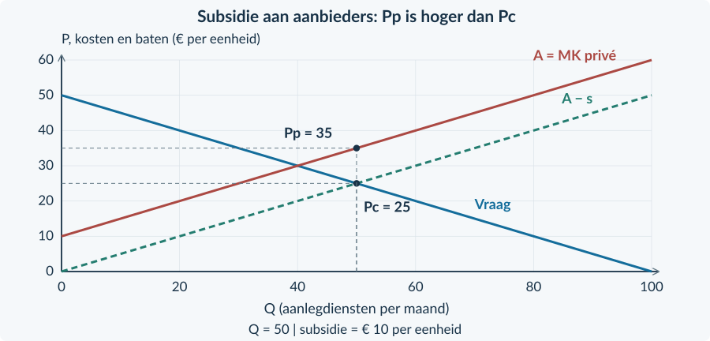
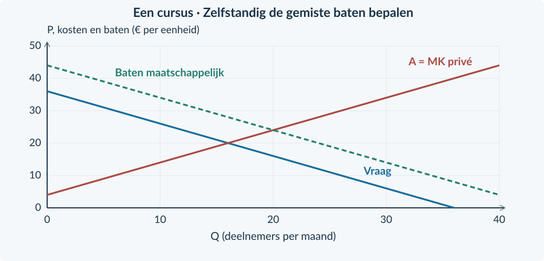
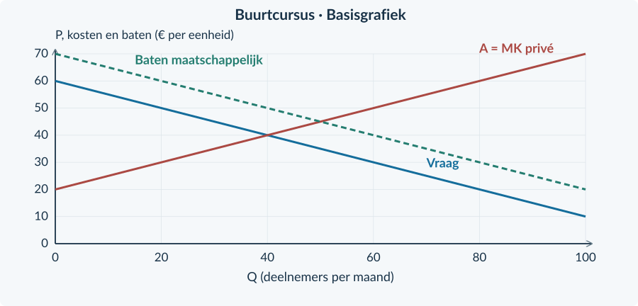

<!-- PAGE {"section": "4.2.5", "title": "Voordeel voor mensen buiten de markt", "origin_chapter": "4.2", "origin_page": 36, "edition_page": 36} -->

4.2.5 · POSITIEVE EXTERNE EFFECTEN

# Wie profiteert zonder te betalen?

Een inwoner laat een groene voortuin aanleggen. Hij geniet van de tuin en betaalt de hovenier. Ook buren genieten van het uitzicht, zonder daarvoor te betalen. Bij zijn eigen keuze telt hij hun voordeel niet volledig mee.

<b>Lesdoelen</b> Je kunt private voordelen onderscheiden van voordelen voor derden. Je kunt een subsidie-uitkomst en overheidsuitgaven berekenen. Je kunt beoordelen hoe externe baten de welvaartsconclusie veranderen.

<b>Positief extern effect</b> Voordeel voor een derde partij dat door productie of consumptie ontstaat en niet in een betaling of vergoeding is verwerkt. Het voordeel voor de koper zelf is geen extern voordeel.

<figure><figcaption>Figuur 21. De koper krijgt privévoordeel. Het extra voordeel voor buren staat daar los van en wordt niet door hun betaling vergoed.</figcaption></figure>

### Vrijwillige keuzes kunnen te weinig activiteit opleveren
De koper vergelijkt zijn eigen voordeel met de prijs. Als anderen ook voordeel hebben, kan een extra activiteit gezamenlijk aantrekkelijk zijn terwijl de koper haar niet uit zichzelf koopt.

Ook hier geldt niet: zoveel mogelijk is het beste. Een extra tuin, cursus of andere activiteit gebruikt schaarse middelen. We vergelijken daarom de **baten voor iedereen samen** met de extra productiekosten.

<b>Twee verschillende vormen van voordeel</b> De hovenier ontvangt een betaling voor zijn werk. Dat is onderdeel van de markttransactie, geen extern effect. Het onbetaalde uitzichtvoordeel voor buren is in deze oefencase wél extern.

<!-- PAGE {"section": "4.2.5", "title": "De vraaglijn is nog niet het hele voordeel", "origin_chapter": "4.2", "origin_page": 37, "edition_page": 37} -->

### Voeg voordeel voor anderen toe
Voor tuinaanleg geldt in een oefenperiode **P = 50 − 0,5Q** en aanbod **P = 10 + 0,5Q**. Q is aangelegde tuinen per maand; P is euro per gestandaardiseerde aanlegdienst. De getallen zijn een vereenvoudigd rekenmodel. Andere omstandigheden blijven gelijk.

De vraaglijn geeft de **private betalingsbereidheid per extra dienst**. De bron waardeert het bijkomende voordeel voor buren op € 10 per dienst. De maatschappelijke baten per extra dienst liggen dan € 10 boven de vraaglijn.

Baten voor iedereen per extra dienst = private betalingsbereidheid + extern voordeel Hier: 60 − 0,5Q

<figure><figcaption>Figuur 22. De hogere lijn toont maatschappelijke baten. Zij is niet ineens de prijs die de koper zelf wil betalen.</figcaption></figure>

Zonder subsidie komen vraag en aanbod samen bij Q₀ = 40 en P₀ = € 30. De maatschappelijke vergelijking is **60 − 0,5Q = 10 + 0,5Q**. De efficiënte hoeveelheid is dus **Qe = 50**.

Bij Q = 45 is het private voordeel € 27,50 en zijn de kosten € 32,50. Zonder steun koopt deze extra klant niet. Inclusief € 10 voordeel voor buren zijn de maatschappelijke baten € 37,50: meer dan de kosten.

<!-- PAGE {"section": "4.2.5", "title": "De subsidie en het externe voordeel", "origin_chapter": "4.2", "origin_page": 38, "edition_page": 38} -->

### Hetzelfde rekenmiddel als in Boek 3
De overheid betaalt de **aanbieder € 10 per uitgevoerde dienst**. Kopers betalen Pc. Aanbieders ontvangen Pp: de kopersbetaling plus de subsidie. De hovenier krijgt dus niet alleen het bedrag dat de klant betaalt.

Pp = Pc + s 10 + 0,5Q = (50 − 0,5Q) + 10 Q = 50; Pc = € 25; Pp = € 35

<figure><figcaption>Figuur 23. Vraag en aanbod in kopersprijzen bepalen Q en Pc. Lees bij dezelfde Q op het oorspronkelijke aanbod Pp af.</figcaption></figure>

De subsidie wordt betaald op **alle 50 uitgevoerde diensten**, niet alleen op de tien extra diensten. De overheid geeft dus 10 × 50 = € 500 per maand uit.

Het externe voordeel is volgens de bron eveneens 10 × 50 = € 500. Maar het zijn verschillende posten. De subsidie is een betaling. Het externe voordeel is het echte voordeel voor de buren. De overheid creëert niet automatisch € 1 voordeel door € 1 te betalen.

<b>Het bedrag moet bij de bron passen</b> Bij constante externe baten van € 10 bereikt een subsidie van € 10 hier de efficiënte hoeveelheid. Dat geldt onder deze vraag-, kosten- en uitvoeringsaannames. Een hoger bedrag is niet automatisch beter.

<!-- PAGE {"section": "4.2.5", "title": "De welvaartsrekening verandert", "origin_chapter": "4.2", "origin_page": 39, "edition_page": 39} -->

### Eerst de marktdeelnemers, dan de ontbrekende posten
CS wordt berekend met **de prijs die kopers betalen**. PS wordt berekend met **wat aanbieders ontvangen inclusief subsidie**. De subsidie zit daardoor al in het producentensurplus. Om de samenleving als geheel te bekijken, trekken we de overheidsuitgave af.

Maatschappelijk surplus met subsidie = CS + PS − subsidie-uitgaven + externe baten

Voor de tuinaanlegcase ontstaat deze vergelijking:

| Post (€ per maand) | Zonder subsidie | Met € 10 subsidie |
|---|---:|---:|
| CS | ½ × 40 × (50 − 30) = 400 | ½ × 50 × (50 − 25) = 625 |
| PS | ½ × 40 × (30 − 10) = 400 | ½ × 50 × (35 − 10) = 625 |
| Subsidie-uitgaven | 0 | 10 × 50 = 500 |
| Externe baten | 10 × 40 = 400 | 10 × 50 = 500 |
| Maatschappelijk surplus | **1.200** | **1.250** |

Er ontstaat **€ 50 meer maatschappelijk surplus**. Dat is niet de hele € 500 subsidie en ook niet de hele € 100 extra baten voor buren. De tien extra diensten hebben daarnaast private baten en productiekosten.

Het oorspronkelijke verlies is de driehoek tussen maatschappelijke baten en kosten van Q = 40 tot Q = 50: ½ × 10 × 10 = **€ 50**. De subsidie haalt hier die onderproductie weg.

<b>De vergelijking met Boek 3</b> Zonder extern voordeel zou dezelfde subsidie het maatschappelijk surplus verlagen van € 800 naar € 750. Met de gegeven baten voor derden stijgt het van € 1.200 naar € 1.250. De rekenmethode is niet tegengesproken: de welvaartsgrens is veranderd.

<b>Aannames</b> We veronderstellen concurrentie, geen extra maatschappelijke schade, geen uitvoeringskosten en geen extra kosten van financiering. Een echte beleidsbeoordeling heeft hiervoor meer gegevens nodig.

<!-- PAGE {"section": "4.2.5", "title": "Uitgewerkt: een cursus voor een buurt", "origin_chapter": "4.2", "origin_page": 40, "edition_page": 40} -->

## Uitgewerkt voorbeeld

Voor **Buurtvaardig** geldt vraag Pc = 50 − Q en aanbod Pp = 10 + Q. Q is cursusplaatsen per maand; prijzen zijn euro per plaats. Er zijn veel aanbieders. De bron waardeert het voordeel voor andere buurtbewoners op € 8 per deelnemer, naast het eigen voordeel van de deelnemer. De overheid betaalt aanbieders € 8 per gebruikte cursusplaats. Andere kosten of baten ontbreken.

**1 · Benoem het externe voordeel.** De deelnemer heeft zelf voordeel van de cursus. Dat staat in de vraag. Alleen het bijkomende, onbetaalde voordeel voor andere buurtbewoners telt als externe baat.

**2 · Bereken de oorspronkelijke markt.** 50 − Q = 10 + Q → Q₀ = 20. Zonder subsidie betalen en ontvangen partijen € 30 per plaats.

**3 · Gebruik de omgekeerde wig.** Pp = Pc + 8 geeft 10 + Q = 50 − Q + 8 → Q₁ = 24. Pc = € 26 en Pp = € 34. Controle: 34 − 26 = € 8.

**4 · Bereken overheid en derden.** De subsidie kost 8 × 24 = **€ 192 per maand**. De externe baten nemen toe van 8 × 20 = € 160 naar **€ 192 per maand**. Beide bedragen zijn berekend met alle deelnemers in die situatie.
<figure><figcaption>Figuur 24. Dezelfde subsidieprocedure als voorheen. Nieuw is het afzonderlijke voordeel voor mensen buiten de markt.</figcaption></figure>

<!-- PAGE {"section": "4.2.5", "title": "Uitgewerkt: marktvoordeel en echte baten", "origin_chapter": "4.2", "origin_page": 41, "edition_page": 41} -->

Uitgewerkt voorbeeld · vervolg

**5 · Bouw de vergelijking op.**

| Post (€ per maand) | Zonder subsidie | Met subsidie |
|---|---:|---:|
| CS | ½ × 20 × (50 − 30) = 200 | ½ × 24 × (50 − 26) = 288 |
| PS | ½ × 20 × (30 − 10) = 200 | ½ × 24 × (34 − 10) = 288 |
| Subsidie-uitgaven | 0 | 192 |
| Externe baten | 160 | 192 |
| Maatschappelijk surplus | 200 + 200 + 160 = **560** | 288 + 288 − 192 + 192 = **576** |

**6 · Trek een begrensde conclusie.** Het maatschappelijk surplus stijgt met € 16. De extra vier plaatsen leveren € 32 extra externe baten op. Na aftrek van de extra private productiekosten en toevoeging van de private voordelen blijft € 16 netto verbetering over.

De maatschappelijke batenlijn is 58 − Q. Vergelijk met MK = 10 + Q: 58 − Q = 10 + Q → **Qe = 24**. Het oorspronkelijke verlies is ½ × (24 − 20) × 8 = **€ 16 per maand**.
<figure><figcaption>Figuur 25. De driehoek markeert gemiste gezamenlijke voordelen van cursusplaatsen die zonder subsidie niet worden gebruikt.</figcaption></figure>

<b>Onthouden</b> Derdenvoordeel apart van kopersvoordeel → oorspronkelijke uitkomst → subsidiewig → alle gebruikte plaatsen → CS + PS − uitgaven + externe baten → conclusie onder de gegeven aannames. Een andere subsidiehoogte vereist opnieuw rekenen.

<!-- PAGE {"section": "4.2.5", "title": "Betalingen en baten herkennen", "origin_chapter": "4.2", "origin_page": 42, "edition_page": 42} -->

## Startopgaven

<b>Korte route:</b> Startopgaven → Zelfstandige oefening → Doeloefening. Extra hulp nodig? Maak eerst Begeleide inoefening.

<b>Opgave 37 · De subsidie uit Boek 3</b>

Vraag: Pc = 20 − Q. Aanbod: Pp = 4 + Q. Producenten ontvangen € 4 subsidie per verkochte eenheid. Q is stuks per dag; prijzen zijn euro per stuk.

<b>a.</b> Bereken Q, Pc en Pp na de subsidie.

<b>b.</b> Bereken de overheidsuitgaven.

<b>Opgave 38 · Wie ontvangt het voordeel?</b>

Een deelnemer betaalt voor een cursus. Zelf leert zij er iets van. De aanbieder ontvangt lesgeld. Volgens de bron helpen de aangeleerde vaardigheden daarnaast andere buurtbewoners, zonder dat zij betalen.

<b>a.</b> Welk voordeel is extern en welk voordeel hoort bij de koper?

<b>b.</b> Is het lesgeld van de aanbieder ook een externe baat?

## Begeleide inoefening

Heb je deze hulp niet nodig? Ga dan verder met Zelfstandige oefening.

<b>Opgave 39 · Twee batenlijnen lezen</b>

Gebruik de figuur. Het externe voordeel is € 10 per aanlegdienst.

<b>a.</b> Lees bij Q = 20 de private en maatschappelijke baten per extra dienst af.

<b>b.</b> Welke van die bedragen is de betalingsbereidheid van de koper zelf?

<b>c.</b> Markeer Q₀ = 40 en Qe = 50. Arceer de oorspronkelijke gemiste baten tussen die hoeveelheden: gebruik de maatschappelijke-batenlijn en MK.

<figure><figcaption>Figuur 26. De verticale afstand is extern voordeel per eenheid; de hele hogere lijn is geen extra betaling.</figcaption></figure>

<!-- PAGE {"section": "4.2.5", "title": "De posten stap voor stap combineren", "origin_chapter": "4.2", "origin_page": 43, "edition_page": 43} -->

<b>Opgave 40 · Een lagere subsidie</b>

Een concurrerende cursusmarkt krijgt € 4 subsidie per deelnemer. Er doen 22 deelnemers per maand mee. CS en PS zijn beide € 242. De bron waardeert het externe voordeel op € 8 per deelnemer. Zonder subsidie was het maatschappelijk surplus € 560.

<b>a.</b> Bereken eerst subsidie-uitgaven en externe baten; vul daarna het maatschappelijk surplus in.

<b>b.</b> Vergelijk met de beginsituatie. Waarom mogen uitgaven en externe baten hier niet tegen elkaar worden weggestreept?

| Post (€ per maand) | Nieuwe situatie |
|---|---:|
| CS + PS | 484 |
| Subsidie-uitgaven | … |
| Externe baten | … |
| Maatschappelijk surplus | … |

## Zelfstandige oefening

<b>Opgave 41 · Twee voordelen veranderen tegelijk</b>

Bij dezelfde hoeveelheid activiteit neemt het private voordeel van één extra activiteit met € 2 toe. Tegelijk daalt het extra voordeel voor derden met € 5. De productiekosten veranderen niet.

<b>a.</b> Beschrijf de invloed van alleen de stijging van het private voordeel.

<b>b.</b> Beschrijf de invloed van alleen de daling van het externe voordeel.

<b>c.</b> Bereken het gezamenlijke effect op de maatschappelijke baten per extra activiteit.

<b>d.</b> Beoordeel: “Als kopers meer voordeel krijgen, stijgen de maatschappelijke baten altijd.”

<!-- PAGE {"section": "4.2.5", "title": "Zelfstandig: van subsidie naar gemiste baten", "origin_chapter": "4.2", "origin_page": 44, "edition_page": 44} -->

<b>Opgave 42 · Een cursus met hulp aan anderen</b>

Vraag Pc = 36 − Q; aanbod Pp = 4 + Q. Q is deelnemers per maand, prijzen zijn euro per deelnemer. Het externe voordeel is € 8 per deelnemer. Aanbieders ontvangen een subsidie van € 8; andere maatschappelijke posten ontbreken.

<b>a.</b> Bereken de oorspronkelijke en de gesubsidieerde uitkomst.

<b>b.</b> Bereken het maatschappelijk surplus vóór en na.

<b>c.</b> Bepaal de efficiënte hoeveelheid. Arceer de oorspronkelijk gemiste baten in de gegeven grafiek en bereken het verlies.

<figure><figcaption>Figuur 27. De private vraag, maatschappelijke baten en aanbodlijn zijn gegeven; de uitkomsten en het verliesgebied nog niet.</figcaption></figure>

<!-- PAGE {"section": "4.2.5", "title": "Doel: subsidie en maatschappelijk voordeel", "origin_chapter": "4.2", "origin_page": 45, "edition_page": 45} -->

## Doeloefening

<b>Bron · Buurtcursus</b> Een cursus geeft deelnemers eigen voordeel én helpt andere buurtbewoners. De bron waardeert uitsluitend dat bijkomende voordeel op € 10 per deelnemer. Vraag: Pc = 60 − 0,5Q; aanbod: Pp = 20 + 0,5Q. Q is deelnemers per maand van 0 tot 100; prijzen zijn euro per deelnemer. Er zijn veel aanbieders. De overheid betaalt aanbieders € 10 subsidie voor elke gebruikte cursusplaats. Andere omstandigheden blijven gelijk. Er zijn geen andere externe effecten, vaste kosten, financierings- of uitvoeringskosten.

<b>Opgave 43 · Eigen voordeel en voordeel voor anderen</b>

Gebruik de bron en de basisgrafiek.

<b>a.</b> (2p) Benoem het private en externe voordeel. Bereken de oorspronkelijke hoeveelheid en prijs.

<b>b.</b> (3p) Bereken na de subsidie Q, Pc, Pp en de overheidsuitgaven.

<b>c.</b> (4p) Bereken CS, PS en het maatschappelijk surplus vóór en na.

<b>d.</b> (2p) Bepaal de efficiënte hoeveelheid en arceer het oorspronkelijke welvaartsverlies.

<b>e.</b> (2p) Leg uit waarom dit anders uitpakt dan dezelfde subsidie zonder externe baten.

<figure><figcaption>Figuur 28. De private vraag, maatschappelijke baten en oorspronkelijke aanbodlijn zijn gegeven. De subsidie is geen nieuwe externe baat.</figcaption></figure>

<!-- PAGE {"section": "4.2.5", "title": "Meer steun is niet vanzelf beter", "origin_chapter": "4.2", "origin_page": 46, "edition_page": 46} -->

## Denkertje / Bonusopgave

<b>Opgave 44 · Een te ruime regeling?</b>

Een model voor tuinaanleg heeft € 10 extern voordeel per dienst. Er zijn geen andere maatschappelijke posten. De bron geeft drie volledig berekende scenario’s. Alle bedragen zijn euro per maand.

<b>a.</b> Bereken het maatschappelijk surplus in de drie rijen.

<b>b.</b> Waarom is “meer externe baten” niet voldoende om de grootste subsidie te kiezen?

<b>c.</b> Wat kun je wél en niet concluderen uit deze drie scenario’s?

| Subsidie per dienst | Q (per maand) | CS + PS | Subsidie-uitgaven | Externe baten |
|---|---:|---:|---:|---:|
| € 0 | 40 | 800 | 0 | 400 |
| € 10 | 50 | 1.250 | 500 | 500 |
| € 30 | 70 | 2.450 | 2.100 | 700 |

## Herhaling / Herhaling en interleaving

<b>Opgave 45 · Belasting is niet de schade</b>

Bij 20 verkochte eenheden per dag bedraagt een heffing € 6 per eenheid. De bron schat de resterende externe schade op € 10 per eenheid.

<b>a.</b> Bereken de belastingopbrengst en de totale externe schade.

<b>b.</b> Hoe neem je deze twee posten mee naast CS en PS?

