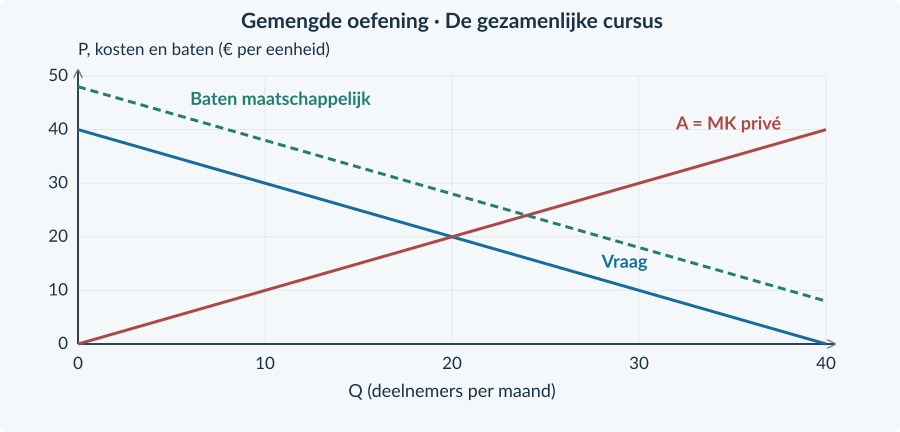

<!-- PAGE {"section": "4.2.7", "title": "Gemengde opgaven", "origin_chapter": "4.2", "origin_page": 53, "edition_page": 53} -->

4.2.7 · GEMENGDE OPGAVEN: MARKTVORMEN EN MARKTFALEN

# Welke rekening hoort bij deze markt?

De volgende gevallen gebruiken alleen eerder behandelde technieken. Je moet nu zelf bepalen welke rekening bij de bron past. Een hogere winst, meer deelnemers of een grote overheidsontvangst is nog geen eindconclusie.

<b>Lesdoelen</b> Je kunt uit bronnen het passende model kiezen. Je kunt marktgedrag verbinden met surplus en gevolgen voor derden. Je kunt een beleidsconclusie onderbouwen én begrenzen.

## Gemengde oefening

<b>Opgave 55 · Eerst de juiste vraag</b>

A: één aanbieder verkoopt minder om meer winst te maken; er zijn geen externe effecten. B: veel aanbieders veroorzaken per product niet-vergoede schade bij buren. C: twee herkenbare klantgroepen betalen verschillende prijzen voor dezelfde dienst.

<b>a.</b> Welke vergelijking heb je bij A nodig om welvaartsverlies te bepalen?

<b>b.</b> Welke post mag bij B niet ontbreken? Welke bekende techniek helpt als een heffing wordt ingevoerd?

<b>c.</b> Wat controleer je bij C voordat je afzonderlijke prijzen als haalbaar behandelt?

### Een bruikbaar antwoord laat de keuze zien
Schrijf bijvoorbeeld: **“Deze bron gaat over niet-vergoede schade aan buren. Daarom vergelijk ik niet alleen CS + PS, maar trek ik ook de totale externe kosten af.”**

Noem daarna de berekening en de conclusie. Het is niet nodig om alle formules uit het hoofdstuk op elke bron los te laten.

<b>Werk met dezelfde periode</b> Vergelijk dagbedragen met dagbedragen en maandbedragen met maandbedragen. De twee cases in de doeloefening zijn afzonderlijke markten; hun bedragen worden niet bij elkaar opgeteld.

<!-- PAGE {"section": "4.2.7", "title": "Cijfers en verdeling combineren", "origin_chapter": "4.2", "origin_page": 54, "edition_page": 54} -->

<b>Opgave 56 · Het centrum voor bezoekers</b>

Een aanbieder met marktmacht kan twee klantgroepen betrouwbaar scheiden. Dezelfde dienst kost voor iedere bezoeker € 2 aan variabele kosten. Gezamenlijke vaste kosten: € 60 per week. De tabel geeft twee uitvoerbare prijsplannen. Andere omstandigheden blijven gelijk en er zijn geen externe effecten.

<b>a.</b> Bereken bij ieder plan de totale omzet en winst.

<b>b.</b> Bereken met het gegeven CS voor beide plannen TS.

<b>c.</b> Beoordeel: “De totale afzet is gelijk en de winst stijgt, dus er kan geen nadeel zijn.”

<b>d.</b> Wat zou veranderen als de goedkope kaartjes zonder controle konden worden doorverkocht?

| Gegeven | Eén prijs | Groepsprijzen |
|---|---:|---:|
| Prijs A | € 10 | € 12 |
| Aantal A | 30 | 25 |
| Prijs B | € 10 | € 8 |
| Aantal B | 10 | 15 |
| Totaal CS (€ per week) | 200 | 170 |

<b>Geen nieuw rekenmodel</b> De prijs- en afzetkeuzes zijn in deze bron gegeven. Je vergelijkt hun gevolgen. Je hoeft geen ontbrekende vraagfunctie te reconstrueren of de gezamenlijke prijs opnieuw te optimaliseren.

### Onderbouw per groep
Een verandering van het totale consumentensurplus zegt nog niet dat elk individu hetzelfde ervaart. Begin je uitleg met de prijs- en afzetverandering van A en B afzonderlijk. Maak daarna pas de stap naar totalen.

<!-- PAGE {"section": "4.2.7", "title": "Een extern voordeel en uitvoeringskosten", "origin_chapter": "4.2", "origin_page": 55, "edition_page": 55} -->

<b>Opgave 57 · De gezamenlijke cursus</b>

Een concurrerende cursusmarkt heeft vraag Pc = 40 − Q en aanbod Pp = Q. Q is deelnemers per maand, met 0 ≤ Q ≤ 40; prijzen zijn euro per deelnemer. Andere buurtbewoners hebben € 8 bijkomend voordeel per deelnemer, zonder ervoor te betalen. Aanbieders krijgen € 8 subsidie per gebruikte plaats. De uitvoering verbruikt € 10 aan middelen per maand. Er zijn geen andere maatschappelijke posten.

<b>a.</b> Bereken de oorspronkelijke markt en de uitkomst met subsidie, inclusief beide prijzen.

<b>b.</b> Bereken de overheidsuitgaven en het totale externe voordeel na de subsidie.

<b>c.</b> CS en PS zijn zonder subsidie elk € 200 en met subsidie elk € 288. Bereken de maatschappelijke verandering, inclusief uitvoering.

<b>d.</b> Waarom kun je niet gewoon de stijging van CS + PS als welvaartswinst rapporteren?

<figure><figcaption>Figuur 30. Gebruik de al bekende private vraag, maatschappelijke baten en kosten om de hoeveelheden te controleren.</figcaption></figure>

<b>Van berekening naar oordeel</b> Benoem het criterium en vergelijk de volledige maatschappelijke rekening vóór en na. Geef vervolgens aan of je conclusie gevoelig kan zijn voor veranderende uitvoeringskosten of een overschat extern voordeel. Een begrotingsbedrag alleen is geen welvaartsoordeel.

<!-- PAGE {"section": "4.2.7", "title": "Bronnen bij de doeloefening", "origin_chapter": "4.2", "origin_page": 56, "edition_page": 56} -->

## Doeloefening

<b>Bron A · Studio Solo</b> Eén aanbieder verhuurt de hele afgebakende markt voor studiosessies. Vraag: P = 70 − Q. TK = 100 + 10Q + 0,5Q² en MK = 10 + Q. Q is sessies per week en P euro per sessie. Capaciteit: 50 sessies. Constante kosten blijven in deze week gelijk. Er zijn geen externe effecten. De efficiënte vergelijkingsuitkomst bij dezelfde vraag en kosten is Qe = 30, Pe = € 40 en TSe = € 900 per week.

<figure><figcaption>Figuur 31. Bron A: vraag, MO en MK voor dezelfde markt. De monopolie-uitkomst is nog niet gemarkeerd.</figcaption></figure>

<b>Bron B · Reiniging bij woningen</b> Veel aanbieders leveren dezelfde dienst. Vraag: Pc = 60 − Q; aanbod: Pp = Q. Q is diensten per dag; prijzen zijn euro per dienst. Iedere dienst veroorzaakt € 20 niet-vergoede schade aan omwonenden. Producenten gaan € 20 per dienst afdragen. Na de heffing zijn CS en PS elk € 200 per dag. Zonder ingrijpen is het maatschappelijk surplus € 300 per dag. Geen uitvoeringskosten of andere externe effecten.

<figure><figcaption>Figuur 32. Bron B: private en maatschappelijke kosten. Het gaat hier om een andere markt en een andere periode dan in bron A.</figcaption></figure>

<!-- PAGE {"section": "4.2.7", "title": "Doel: zelf het juiste model kiezen", "origin_chapter": "4.2", "origin_page": 57, "edition_page": 57} -->

<b>Opgave 58 · Twee markten, twee oorzaken</b>

Gebruik de bronnen op de linkerpagina. Onderbouw berekeningen met eenheden en conclusies met brongegevens.

<b>a.</b> (3p) Bepaal voor Studio Solo de winstmaximale hoeveelheid en verkoopprijs. Bereken ook de winst.

<b>b.</b> (4p) Bereken CS, PS en TS bij Solo en vergelijk met het gegeven TSe. Arceer het welvaartsverlies in figuur A.

<b>c.</b> (3p) Bereken in bron B de belaste hoeveelheid, Pc, Pp en de heffingsopbrengst.

<b>d.</b> (2p) Bereken met bron B het maatschappelijk surplus na de heffing en de verandering ten opzichte van de beginsituatie.

<b>e.</b> (2p) Leg uit waarom minder verkopen bij Solo welvaartsverlies geeft, maar minder diensten in bron B juist verbetering kan geven.

<b>f.</b> (2p) Beoordeel: “Een heffing van € 20 is dus ook vanzelf de beste oplossing voor Studio Solo.”

<b>Controleer vóór je afsluit</b> Is PS onderscheiden van winst? Is de prijs op de juiste lijn afgelezen? Zijn schade en overheidsontvangst allebei meegenomen? Gaat je conclusie alleen over de markt waarvoor je hebt gerekend?

### Schrijf geen grotere conclusie dan je bewijs
Een berekende verbetering in bron B is geen bewijs dat elke omwonende schadeloos is gesteld. Het welvaartsverlies in A is geen bewijs dat de hoogste mogelijke afzet altijd gewenst is. Je antwoord moet bij vraag, kosten, derden en de periode uit de bron blijven.

<!-- PAGE {"section": "4.2.7", "title": "De belangrijkste denkfouten herstellen", "origin_chapter": "4.2", "origin_page": 58, "edition_page": 58} -->

## Extra gemengde oefening

<b>Opgave 59 · Drie overtuigend klinkende uitspraken</b>

Beoordeel elke uitspraak. Geef niet alleen “juist” of “onjuist”, maar herstel de redenering.

<b>a.</b> “Bij twee klantgroepen moet je voor elke groep opnieuw de totale huur aftrekken.”

<b>b.</b> “Een producent met een dalende vraaglijn heeft altijd een monopolie.”

<b>c.</b> “Bij een subsidie is het externe voordeel gelijk aan wat de overheid uitgeeft.”

## Herhaling / Herhaling en interleaving

<b>Opgave 60 · Dezelfde techniek in twee vormen</b>

A: voor één onderneming geldt P = 30 − 0,5q en MK = € 10, met capaciteit 30. B: op een markt betalen kopers € 18, ontvangen producenten € 14 en worden 50 stuks verkocht. Alle bedragen bij B gelden per week.

<b>a.</b> Bereken voor A de winstmaximale q en verkoopprijs.

<b>b.</b> Bereken voor B de heffing per stuk en de overheidsontvangst.

<b>c.</b> Welke extra informatie is nodig om in B een maatschappelijke welvaartsverandering vast te stellen?

<b>Je hoofdstuk in één zin</b> Kies het juiste model, tel alle relevante partijen mee en onderscheid een betaling van een echte verandering in kosten of baten.

