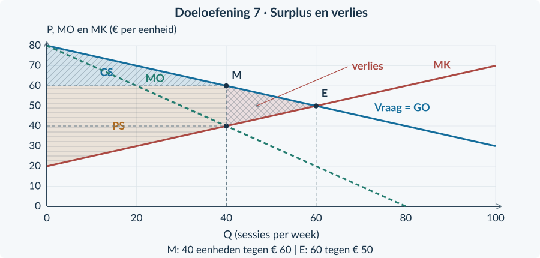
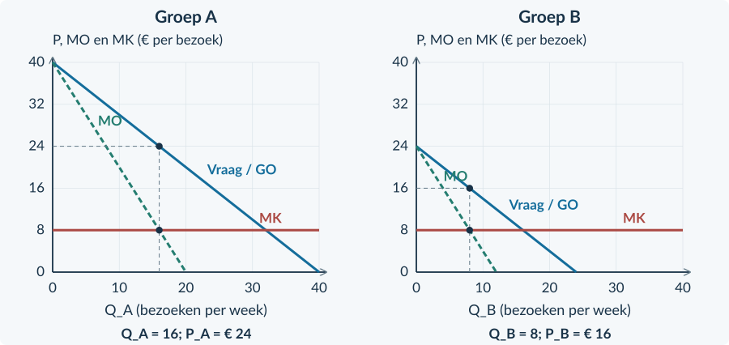
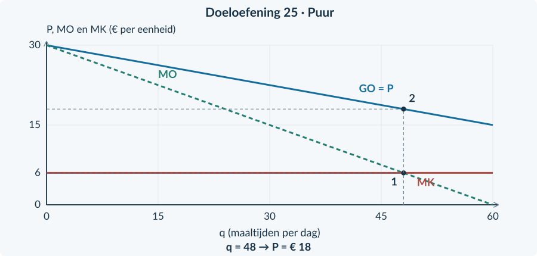
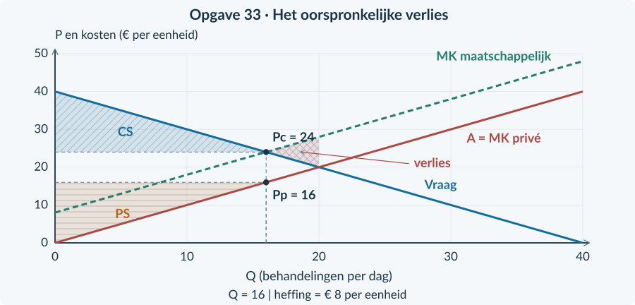
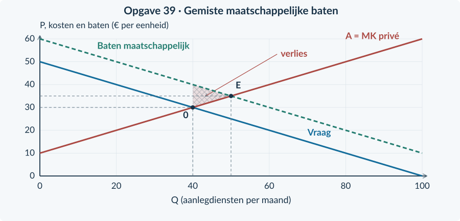
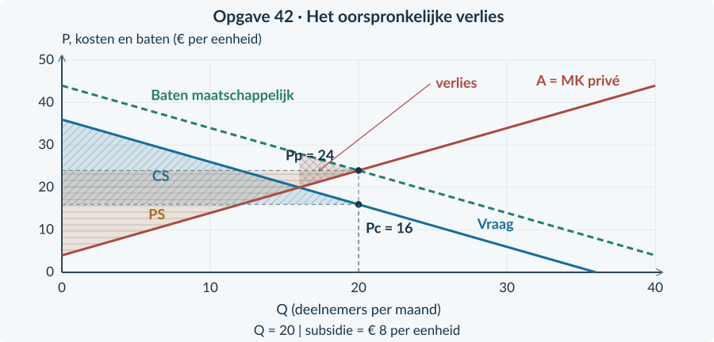
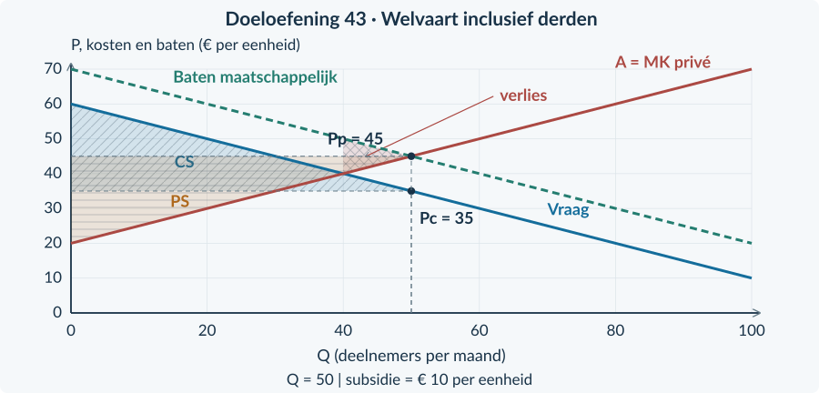
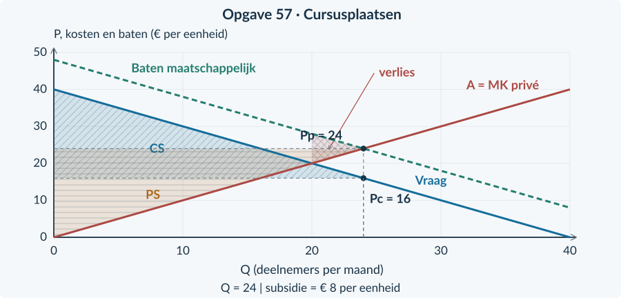
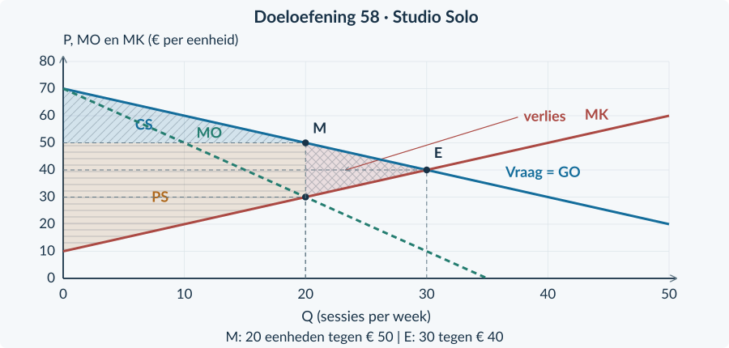
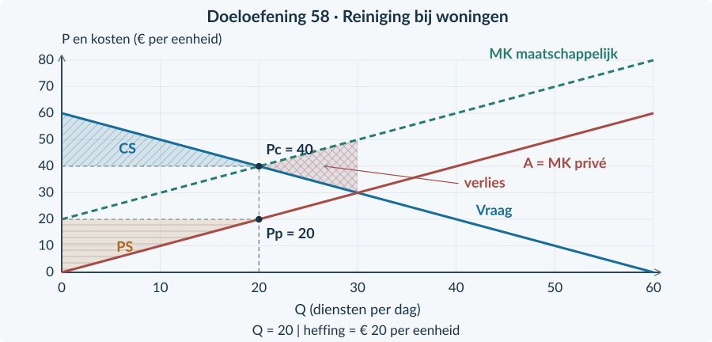

<!-- PAGE {"section": "Antwoorden", "title": "Inhoud"} -->

BOEK 4 · HOOFDSTUK 2 · ANTWOORDBOEK

# Marktvormen en marktfalen

Dit antwoordboek hoort bij de leerlingtekst van hoofdstuk 4.2. De nummers van de opgaven en deelvragen zijn gelijk. Alle rekenuitkomsten horen bij de vereenvoudigde brongegevens, niet bij gemeten werkelijke markten.

| Paragraaf | Opgaven |
|---|---|
| 4.2.1 Welvaartseffecten van monopolie | 1–9 |
| 4.2.2 Prijsdiscriminatie | 10–18 |
| 4.2.3 Marktvormen vergelijken | 19–27 |
| 4.2.4 Negatieve externe effecten | 28–36 |
| 4.2.5 Positieve externe effecten | 37–45 |
| 4.2.6 Overheidsingrijpen bij marktfalen | 46–54 |
| 4.2.7 Gemengde opgaven | 55–60 |

### Gebruik het antwoord als controle
Vergelijk niet alleen de einduitkomst. Controleer de hoeveelheid, de juiste prijs, alle maatschappelijke posten en de eenheid. Een antwoord dat een belastingoverdracht als echte schade behandelt, is niet goed doordat er toevallig hetzelfde eindbedrag uitkomt.

### Bij uitlegvragen
De gegeven formulering is een voorbeeldantwoord. Accepteer een andere duidelijke formulering wanneer de economische redenering klopt en de conclusie door de bron wordt gedragen. Voor het denkertje is vooral de kwaliteit van het argument belangrijk.

### Tekening en rekenwerk
De oplossingsfiguren laten gevraagde gebieden en punten zien. Een andere leesbare schaal of arcering is mogelijk, mits assen, prijzen, hoeveelheden en gebieden correct zijn. In de leerlingenversie zijn basisgrafieken geleverd; leerlingen hoeven de lijnen niet onnodig opnieuw te tekenen.

<b>Drie vaste controles</b> PS is niet hetzelfde als winst. MO is niet hetzelfde als de verkoopprijs of maatschappelijke baten. Een overheidsbetaling is niet hetzelfde als een echt extern effect.

<!-- PAGE {"section": "4.2.1", "title": "Antwoorden"} -->

# 4.2.1 · Welvaartseffecten van monopolie

Startopgaven

<h3 id="antwoord1">Opgave 1 · De bekende monopolieprocedure</h3>

<b>a.</b> TO = 30Q − 0,5Q², dus MO = 30 − Q. MK = 10. Uit 30 − Q = 10 volgt Qm = 20 bezoeken per dag, binnen de capaciteit. Pm = 30 − 0,5 × 20 = € 20 per bezoek.

<b>b.</b> TO = 20 × 20 = € 400; TK = 40 + 10 × 20 = € 240. Winst = 400 − 240 = € 160 per dag.

<h3 id="antwoord2">Opgave 2 · Niet elk verlies is verdwenen</h3>

<b>a.</b> ΔTS = −120 + 80 = −€ 40 per week. Het gezamenlijke surplus daalt dus met € 40.

<b>b.</b> Hij vergeet de € 80 die bij producenten terechtkomt. Dat deel is een overdracht binnen de onderzochte groep. Alleen het saldo van € 40 verdwijnt uit TS.

Begeleide inoefening

<h3 id="antwoord3">Opgave 3 · Herken de twee gebieden</h3>

<b>a.</b> Qm = 20, Pm = € 60, Qe = 30 en Pe = € 50. A is de overdracht op de blijvende verkopen; B is het welvaartsverlies door minder verkopen.

<b>b.</b> A = 20 × (60 − 50) = € 200 per dag. B = ½ × (30 − 20) × (60 − 40) = € 100 per dag.

<h3 id="antwoord4">Opgave 4 · Een tabel aanvullen</h3>

<b>a.</b> Monopolie: CS = ½ × 20 × 20 = € 200; PS = 20 × 20 + ½ × 20 × 20 = € 600; TS = € 800. Efficiënt: CS = € 450; PS = € 450; TS = € 900.

<b>b.</b> Overdracht = 20 × (50 − 40) = € 200. Welvaartsverlies = 900 − 800 = € 100 per week.

Zelfstandige oefening

<h3 id="antwoord5">Opgave 5 · Twee effecten tegelijk</h3>

<b>a.</b> CS daalt € 300 en PS stijgt € 300. TS verandert door deze overdracht niet.

<b>b.</b> TS daalt met 60 + 40 = € 100.

<b>c.</b> ΔCS = −300 − 60 = −€ 360; ΔPS = +300 − 40 = +€ 260; ΔTS = −€ 100.

<b>d.</b> Onjuist. Het extra PS voor de verkoper is kleiner dan het verlies voor kopers. TS daalt met € 100 door gemiste wederzijds voordelige transacties.

<h3 id="antwoord6">Opgave 6 · De markt voor prints</h3>

<b>a.</b> MO = 60 − 2Q. MO = MK geeft Qm = 20 en Pm = € 40. P = MK geeft Qe = 30 en Pe = € 30.

<b>b.</b> CSm = ½ × 20 × 20 = € 200. PSm = 20 × (40 − 20) + ½ × 20 × 20 = € 600. TSm = € 800. Efficiënt: CSe = PSe = ½ × 30 × 30 = € 450, dus TSe = € 900. Welvaartsverlies = € 100 per week.

Doeloefening

<h3 id="antwoord7">Opgave 7 · De VR-studio</h3>

<b>a.</b> MO = 80 − Q. Monopolie: 80 − Q = 20 + 0,5Q → 60 = 1,5Q → Qm = 40 sessies, Pm = € 60. Efficiënt: 80 − 0,5Q = 20 + 0,5Q → Qe = 60, Pe = € 50. Beide passen binnen 100.

<b>b.</b> CSm = ½ × 40 × (80 − 60) = € 400. MK(40) = € 40. PSm = 40 × (60 − 40) + ½ × 40 × (40 − 20) = 800 + 400 = € 1.200. Winst = PS − TCK = 1.200 − 200 = € 1.000 per week. Gebieden: CS tussen vraag en P = 60; PS tussen P = 60 en MK, tot Q = 40.

<b>c.</b> TSm = 400 + 1.200 = € 1.600. Efficiënt: CSe = ½ × 60 × 30 = € 900 en PSe = ½ × 60 × 30 = € 900; TSe = € 1.800. Verlies = € 200 per week. Basis = 60 − 40 = 20 sessies; hoogte = 60 − 40 = € 20 per sessie; ½ × 20 × 20 = € 200.

<b>d.</b> Overdracht = 40 × (60 − 50) = € 400 per week. Die € 400 verplaatst zich van kopers naar de aanbieder en blijft binnen CS + PS. Het verlies van € 200 betreft niet meer uitgevoerde, gezamenlijk voordelige sessies.

<b>e.</b> Onjuist. PS stijgt van € 900 naar € 1.200, maar TS daalt van € 1.800 naar € 1.600. Wie het voordeel krijgt en wat eerlijk is, vragen bovendien een afzonderlijk verdelingsoordeel. De berekening bevat geen norm voor eerlijkheid.

<figure><figcaption>Oplossingsfiguur bij opgave 7. De rekenuitkomsten en de gevraagde markeringen horen bij dezelfde brongegevens.</figcaption></figure>

Denkertje / Bonusopgave

<h3 id="antwoord8">Opgave 8 · Een betere techniek</h3>

<b>a.</b> Dan veranderen marktvorm én kosten tegelijk. Een verschil in TS kan door de prijskeuze komen, door lagere productiekosten of door beide. De afzonderlijke invloed van marktmacht is zo niet af te leiden.

<b>b.</b> Vergelijk eerst monopolie en de efficiënte hoeveelheid bij dezelfde nieuwe techniek. Dat isoleert de beperking van afzet. Vergelijk daarnaast de oude en nieuwe techniek onder dezelfde prijs- of marktaannames. Daarvoor zijn kostengegevens nodig.

<b>c.</b> Nee. Het patent kan in de bron een prikkel of barrière vormen, maar het netto-effect vereist informatie over innovatievoordeel, prijs, productie, looptijd en alternatieven. Die informatie ontbreekt hier.

<b>Beoordeling:</b> een eigen antwoord is passend als de genoemde aannames, ontbrekende informatie en conclusie logisch verbonden zijn. Alleen een losse mening is onvoldoende.

Herhaling / Herhaling en interleaving

<h3 id="antwoord9">Opgave 9 · De belasting blijft een wig</h3>

<b>a.</b> t = Pc − Pp = 15 − 10 = € 5 per stuk. Opbrengst = 5 × 80 = € 400 per week.

<b>b.</b> Kopersdeel = 15 − 12 = € 3; verkopersdeel = 12 − 10 = € 2. Samen € 5. Wie de belasting afdraagt, is hiermee nog niet vastgesteld.

<!-- PAGE {"section": "4.2.2", "title": "Antwoorden"} -->

# 4.2.2 · Prijsdiscriminatie

Startopgaven

<h3 id="antwoord10">Opgave 10 · Twee inkomsten, één bedrijf</h3>

<b>a.</b> TO = 30 × 12 + 20 × 8 = € 520. Q = 50. TK = 90 + 3 × 50 = € 240. Winst = 520 − 240 = € 280 per week.

<b>b.</b> Het gaat om één gezamenlijke vaste kostenpost. Die nogmaals aftrekken zou de kosten dubbel tellen en de winst te laag maken.

<h3 id="antwoord11">Opgave 11 · Drie prijskaartjes</h3>

<b>a.</b> A: dezelfde dienst, maar een andere prijs die niet door andere kosten wordt verklaard. De pas maakt het onderscheid tussen groepen mogelijk.

<b>b.</b> Bij B verandert de geleverde afstand en daarmee de dienst en de kosten. Bij C wordt meer opslag geleverd. Verschillende producten of kosten kunnen het prijsverschil verklaren.

Begeleide inoefening

<h3 id="antwoord12">Opgave 12 · Een volledig ingevuld paneel</h3>

<b>a.</b> A: Q_A = 16 en P_A = € 20. B: Q_B = 8 en P_B = € 12. TO = 16 × 20 + 8 × 12 = € 416 per week.

<b>b.</b> € 4 is MK en bij de gekozen hoeveelheden ook MO. De verkoopprijs staat voor elke groep hoger op haar eigen vraaglijn: € 20 respectievelijk € 12.

<h3 id="antwoord13">Opgave 13 · De rekentabel van de ijsbaan</h3>

<b>a.</b> Eén prijs: Q = 20 + 10 = 30; TO = 10 × 30 = € 300; TK = 100 + 2 × 30 = € 160; winst = € 140. Twee prijzen: Q = 15 + 20 = 35; TO = 12 × 15 + 7 × 20 = € 320; TK = 100 + 2 × 35 = € 170; winst = € 150.

<b>b.</b> Hij heeft wel de constante kosten afgetrokken, maar de variabele kosten 2 × 35 = € 70 niet. Omzet minus alleen vaste kosten is niet de winst.

Zelfstandige oefening

<h3 id="antwoord14">Opgave 14 · Toegang tot een tentoonstelling</h3>

<b>a.</b> MO_A = 28 − 2Q_A = 4 geeft Q_A = 12 en P_A = € 16. MO_B = 20 − 2Q_B = 4 geeft Q_B = 8 en P_B = € 12. Samen 20, dus haalbaar. MO daalt in beide groepen door MK heen.

<b>b.</b> TO = 16 × 12 + 12 × 8 = € 288. TK = 40 + 4 × (12 + 8) = € 120. Winst = € 168 per week. De groepen zijn herkenbaar en doorverkoop is uitgesloten; daardoor kan niet iedereen de lagere prijs kiezen.

<h3 id="antwoord15">Opgave 15 · Tegengestelde gevolgen</h3>

<b>a.</b> A betaalt meer en verliest € 90 consumentensurplus.

<b>b.</b> B krijgt korting en wint € 30 consumentensurplus. Dat staat los van het verlies bij A.

<b>c.</b> ΔCS = −90 + 30 = −€ 60. ΔTS = −60 + 40 = −€ 20 per week.

<b>d.</b> Onjuist. De korting geldt alleen voor B. A verliest meer surplus dan B wint; zelfs na de PS-stijging daalt TS met € 20. Een voordeel voor één groep is geen voordeel voor iedereen.

Doeloefening

<h3 id="antwoord16">Opgave 16 · FilmLab</h3>

<b>a.</b> MO_A = 40 − 2Q_A; 40 − 2Q_A = 8 → Q_A = 16, P_A = € 24. MO_B = 24 − 2Q_B; 24 − 2Q_B = 8 → Q_B = 8, P_B = € 16. Beide marginale lijnen dalen; vóór de keuze is MO groter dan MK en erna kleiner. Samen 24 ≤ 64.

<b>b.</b> Eén prijs: TO = 20 × (20 + 4) = € 480; TK = 80 + 8 × 24 = € 272; winst = € 208. Groepsprijzen: TO = 24 × 16 + 16 × 8 = € 512; TK = € 272; winst = € 240 per week. De vaste kosten worden één keer afgetrokken.

<b>c.</b> A betaalt € 24 in plaats van € 20; B betaalt € 16 in plaats van € 20. Bijvoorbeeld: de persoonlijke gecontroleerde passen voorkomen doorverkoop en houden de groepen gescheiden.

<b>d.</b> PS = TO − TVK. Eén prijs: PS = 480 − 192 = € 288; TS = 208 + 288 = € 496. Groepsprijzen: PS = 512 − 192 = € 320; TS = 160 + 320 = € 480. Winst stijgt € 32, maar TS daalt € 16. Dus niet in deze case.

<b>e.</b> Dit resultaat hoort bij de gegeven vraag, kosten en afzet. In een andere case kunnen bijvoorbeeld extra kopers worden bereikt die anders niets kopen. Dan kan de verandering van TS anders zijn. Zonder die gegevens is geen algemene richting bewezen.

<figure><figcaption>Oplossingsfiguur bij opgave 16. De rekenuitkomsten en de gevraagde markeringen horen bij dezelfde brongegevens.</figcaption></figure>

Denkertje / Bonusopgave

<h3 id="antwoord17">Opgave 17 · Dezelfde naam, een ander gevolg</h3>

<b>a.</b> Geval I: TS gaat van 800 naar 780, dus −€ 20. Geval II: TS gaat van 300 naar 420, dus +€ 120 per maand.

<b>b.</b> In II kan een lagere prijs een nieuwe groep kopers hebben bereikt, waardoor meer voordelige transacties ontstaan. In I kan vooral afzet tussen groepen zijn verschoven. Dit zijn mogelijke mechanismen; de opgegeven totaalcijfers bewijzen de oorzaak niet.

<b>c.</b> Prijzen, afzet en CS per klantgroep, en informatie over wie de ondernemingsopbrengst ontvangt. Een hoger totaal kan nog steeds verlies voor een afzonderlijke groep verbergen.

<b>Beoordeling:</b> een eigen antwoord is passend als de genoemde aannames, ontbrekende informatie en conclusie logisch verbonden zijn. Alleen een losse mening is onvoldoende.

Herhaling / Herhaling en interleaving

<h3 id="antwoord18">Opgave 18 · Terug naar één uniforme prijs</h3>

<b>a.</b> MO = 24 − 0,4Q. MO = 4 geeft Qm = 50 stuks per week, binnen de capaciteit. Pm = 24 − 0,2 × 50 = € 14 per stuk.

<b>b.</b> CS = ½ × 50 × (24 − 14) = € 250 per week. Het ligt boven P = 14 en onder de vraaglijn, tot Q = 50.

<!-- PAGE {"section": "4.2.3", "title": "Antwoorden"} -->

# 4.2.3 · Marktvormen vergelijken

Startopgaven

<h3 id="antwoord19">Opgave 19 · Prijsnemer of prijszetter?</h3>

<b>a.</b> Bij de prijsnemer zijn GO = MO = P = € 9 per kg, binnen de haalbare productie.

<b>b.</b> TO = 18q − 0,20q²; MO = 18 − 0,40q. Bij positieve q is MO lager dan P: een extra verkoop tegen een lagere uniforme prijs verlaagt ook de opbrengst op eerdere eenheden.

<h3 id="antwoord20">Opgave 20 · Vier logo’s</h3>

<b>a.</b> Nee. De vier merken horen bij één producent. Merken tellen is niet hetzelfde als zelfstandige ondernemingen tellen.

<b>b.</b> Nee. Informatie over andere aanbieders en goede alternatieven ontbreekt. De markt moet eerst worden afgebakend.

Begeleide inoefening

<h3 id="antwoord21">Opgave 21 · De kenmerken staan er al</h3>

<b>a.</b> A: volkomen concurrentie. B: monopolistische concurrentie. C: oligopolie. D: monopolie.

<b>b.</b> B heeft veel zelfstandige aanbieders en relatief eenvoudige toetreding. C heeft slechts drie grote aanbieders en hoge startkosten; dat wijkt af van veel kleine prijsnemers met vrije toetreding.

<h3 id="antwoord22">Opgave 22 · Een zaak met een eigen vraaglijn</h3>

<b>a.</b> q = 20 maaltijden per dag en P = € 20. Eerst bepaalt MO = MK de hoeveelheid; daarna lees je bij die hoeveelheid P op GO/vraag.

<b>b.</b> De figuur is een specifieke vraag- en kostenaanname voor deze lunchzaak. Bij oligopolie kan de vraag naar één onderneming mede afhangen van de reacties van andere grote ondernemingen; daarvoor zijn extra aannames nodig.

Zelfstandige oefening

<h3 id="antwoord23">Opgave 23 · Twee veranderingen in een winkelstraat</h3>

<b>a.</b> Het aantal zelfstandige aanbieders neemt af: veel winkels vallen nu onder slechts twee beslissende ondernemingen.

<b>b.</b> De productverschillen nemen toe: kopers zien meer heterogeniteit.

<b>c.</b> Enkele grote aanbieders én heterogene producten: oligopolie. De twee kenmerken moeten samen worden gebruikt.

<b>d.</b> Dat volgt niet. Monopolistische concurrentie vereist veel aanbieders. Twee dominerende ketens passen eerder bij oligopolie met heterogene producten. Productverschillen alleen bepalen de marktvorm niet.

<h3 id="antwoord24">Opgave 24 · Een kleine bakker met een eigen recept</h3>

<b>a.</b> TO = 20q − 0,10q², MO = 20 − 0,20q en MK = 4. MO = MK geeft q = 80, binnen de capaciteit; MO daalt door MK. P = € 12. TO = 12 × 80 = € 960; TK = 80 + 4 × 80 = € 400; winst = € 560 per dag.

<b>b.</b> Nee. Ook een onderneming onder monopolistische concurrentie kan een dalende eigen vraag hebben. De bron noemt juist veel aanbieders. De procedure is geen bewijs van een monopolie.

Doeloefening

<h3 id="antwoord25">Opgave 25 · Marktvorm is het begin</h3>

<b>a.</b> I: volkomen concurrentie: veel kleine aanbieders, homogeen product en vrije toetreding. II: monopolistische concurrentie: veel aanbieders, heterogene diensten en relatief eenvoudige toetreding. III: oligopolie: drie grote aanbieders en hoge toetredingskosten. IV: monopolie: één aanbieder en een onoverkomelijke toegangsdrempel binnen de afgebakende markt.

<b>b.</b> TO = (30 − 0,25q)q = 30q − 0,25q². MO = 30 − 0,50q. MK = 6; de constante € 144 verdwijnt bij de marginale afleiding.

<b>c.</b> 30 − 0,50q = 6 geeft q = 48. Dat is lager dan de capaciteit van 80. MO ligt ervoor boven 6 en erna eronder. P = 30 − 0,25 × 48 = € 18. TO = 18 × 48 = € 864; TK = 144 + 6 × 48 = € 432; winst = € 432 per dag.

<b>d.</b> De producten zijn heterogeen: klanten onderscheiden smaak en locatie. Puur heeft daardoor enige invloed op de prijs. Een kleine prijsnemer bij volkomen concurrentie biedt juist een homogeen goed aan en neemt P als gegeven.

<b>e.</b> Nee. De functie geldt voor Puur onder de gegeven voorwaarden. Bij oligopolie moet onder meer duidelijk zijn hoe concurrenten reageren. De marktvorm III levert geen universele functie P = 30 − 0,25q op.

<figure><figcaption>Oplossingsfiguur bij opgave 25. De rekenuitkomsten en de gevraagde markeringen horen bij dezelfde brongegevens.</figcaption></figure>

Denkertje / Bonusopgave

<h3 id="antwoord26">Opgave 26 · De enige winkel op het station</h3>

<b>a.</b> Reizigers met weinig tijd hebben minder bruikbare alternatieven dan reizigers die naar buiten kunnen. De effectieve concurrentie en prijsgevoeligheid kunnen dus verschillen, hoewel hetzelfde bedrijf verkoopt.

<b>b.</b> Bijvoorbeeld hoeveel reizigers bij een prijsverhoging elders kopen, hoeveel tijd dat kost en welke alternatieven zij als gelijkwaardig zien. Een keuze voor marktgrenzen vraagt gedragsinformatie.

<b>c.</b> Een foto zegt niets over alternatieven buiten beeld of over de relevante marktgrens. Eén locatie kan nog steeds concurrentie ondervinden van andere aanbieders.

<b>Beoordeling:</b> een eigen antwoord is passend als de genoemde aannames, ontbrekende informatie en conclusie logisch verbonden zijn. Alleen een losse mening is onvoldoende.

Herhaling / Herhaling en interleaving

<h3 id="antwoord27">Opgave 27 · De vaste kosten nogmaals controleren</h3>

<b>a.</b> TVK = 80 × 5 = € 400. PS = TO − TVK = 900 − 400 = € 500. Winst = PS − TCK = 500 − 200 = € 300.

<b>b.</b> Dan telt diegene dezelfde gezamenlijke kosten twee keer. De totale winst wordt daardoor € 200 te laag berekend.

<!-- PAGE {"section": "4.2.4", "title": "Antwoorden"} -->

# 4.2.4 · Negatieve externe effecten

Startopgaven

<h3 id="antwoord28">Opgave 28 · Een heffing terughalen</h3>

<b>a.</b> 20 − Q = Q + 4 → 16 = 2Q → Q = 8. Pc = 20 − 8 = € 12 en Pp = € 8 per stuk. De wig is € 4.

<b>b.</b> Opbrengst = t × Q = 4 × 8 = € 32 per dag. Gebruik de verkochte hoeveelheid na heffing.

<h3 id="antwoord29">Opgave 29 · Wie staat buiten de transactie?</h3>

<b>a.</b> B: de buren zijn geen koper of verkoper in de bedrijfstransactie, maar ondervinden niet-vergoede geluidshinder.

<b>b.</b> A betreft een betaling van de koper binnen de transactie. C is een eigen productiekost die de bakker betaalt. Er is zonder extra informatie geen niet-vergoed nadeel voor derden aangetoond.

Begeleide inoefening

<h3 id="antwoord30">Opgave 30 · Lees beide kostenlijnen</h3>

<b>a.</b> Bij Q = 20 zijn MK privé = 10 + 0,5 × 20 = € 20 en MK maatschappelijk = € 30 per levering.

<b>b.</b> Totale schade = 20 × 10 = € 200 per dag. € 10 is de schade van één levering, niet van alle leveringen samen.

<b>c.</b> De verliesdriehoek loopt van Q = 30 tot 40. Bij Q = 40 is maatschappelijke MK € 40 en betalingsbereidheid € 30: hoogte € 10. Verlies = ½ × 10 × 10 = € 50 per dag.

<figure><figcaption>Oplossingsfiguur bij opgave 30. De rekenuitkomsten en de gevraagde markeringen horen bij dezelfde brongegevens.</figcaption></figure>

<h3 id="antwoord31">Opgave 31 · Een gedeeltelijke correctie</h3>

<b>a.</b> Overheidsontvangst = 4 × 18 = € 72; externe schade = 8 × 18 = € 144. Maatschappelijk surplus = 162 + 162 + 72 − 144 = € 252 per dag.

<b>b.</b> Verbetering = 252 − 240 = € 12 per dag. Nee: er resteert € 144 schade. Meer maatschappelijk surplus is niet hetzelfde als nul hinder.

Zelfstandige oefening

<h3 id="antwoord32">Opgave 32 · Eigen kosten en schade veranderen tegelijk</h3>

<b>a.</b> De private MK stijgt € 3; bij gelijkblijvende externe schade stijgt maatschappelijke MK daardoor ook € 3 per eenheid.

<b>b.</b> De externe schade daalt € 5. Bij gelijkblijvende private kosten daalt maatschappelijke MK daardoor € 5 per eenheid.

<b>c.</b> Het gezamenlijke effect is +3 − 5 = −€ 2 per extra eenheid.

<b>d.</b> Onjuist: private kosten stijgen, maar de maatschappelijke MK daalt door de grotere afname van externe schade.

<h3 id="antwoord33">Opgave 33 · Een nieuwe productiemarkt</h3>

<b>a.</b> Zonder heffing: 40 − Q = Q → Q₀ = 20 en P₀ = € 20. Met heffing: 40 − Q = Q + 8 → Q₁ = 16, Pc = € 24 en Pp = € 16.

<b>b.</b> Voor: CS = PS = ½ × 20 × 20 = € 200; schade = € 160; maatschappelijk surplus = € 240. Na: CS = PS = € 128; ontvangst = € 128; schade = € 128; maatschappelijk surplus = € 256. De verbetering is € 16 per dag.

<b>c.</b> Maatschappelijke MK = Q + 8. 40 − Q = Q + 8 → Qe = 16. De verliesdriehoek ligt tussen de maatschappelijke-kostenlijn en de vraag van Q = 16 tot 20. Basis = 4 behandelingen, hoogte = € 8. Verlies = ½ × 4 × 8 = € 16 per dag.

<figure><figcaption>Oplossingsfiguur bij opgave 33. De rekenuitkomsten en de gevraagde markeringen horen bij dezelfde brongegevens.</figcaption></figure>

Doeloefening

<h3 id="antwoord34">Opgave 34 · Wie telt mee?</h3>

<b>a.</b> De derde partij bestaat uit de omwonenden. Zonder heffing: 60 − Q = Q → Q₀ = 30 diensten; P₀ = € 30 per dienst. Schade = 20 × 30 = € 600 per dag.

<b>b.</b> 60 − Q = Q + 20 → Q₁ = 20 diensten per dag. Pc = € 40; Pp = € 20. Controle: 40 − 20 = 20. Ontvangst = 20 × 20 = € 400 per dag.

<b>c.</b> Voor: CS = ½ × 30 × 30 = € 450; PS = € 450; ontvangst = 0; schade = € 600; maatschappelijk surplus = € 300. Na: CS = ½ × 20 × 20 = € 200; PS = € 200; ontvangst = € 400; schade = € 400; maatschappelijk surplus = € 400 per dag.

<b>d.</b> MK maatschappelijk = Q + 20. 60 − Q = Q + 20 geeft Qe = 20. Het verlies is de driehoek tussen vraag en maatschappelijke MK van Q = 20 tot Q = 30: basis 10 diensten, hoogte € 20 per dienst. Oppervlakte = ½ × 10 × 20 = € 100 per dag.

<b>e.</b> Onjuist in deze case. De overheidsontvangst en de afgenomen externe schade moeten ook worden meegeteld. Het maatschappelijk surplus stijgt van € 300 naar € 400. Dit bewijst niet dat ieder afzonderlijk persoon wint of dat elke belasting goed is.

<figure><figcaption>Oplossingsfiguur bij opgave 34. De rekenuitkomsten en de gevraagde markeringen horen bij dezelfde brongegevens.</figcaption></figure>

Denkertje / Bonusopgave

<h3 id="antwoord35">Opgave 35 · Hoe goed kennen we de schade?</h3>

<b>a.</b> In de oefencase stond constante schade per levering exact vast. Hier is zij onzeker en mogelijk afhankelijk van omstandigheden. Een gemiddelde is niet automatisch de marginale schade in elke situatie.

<b>b.</b> Bijvoorbeeld hoe de schade verandert met tijd en hoeveelheid, wie de schade ondervindt, hoe vraag en aanbod op de heffing reageren, en wat meten en handhaven kost. Twee relevante, uitgelegde gegevens volstaan.

<b>c.</b> Een heffing van € 10 kan een bruikbaar uitgangspunt zijn bij de gemiddelde schatting, maar het optimale tarief is met deze informatie niet exact bewezen. Het advies moet worden getoetst aan schade, reacties en uitvoeringskosten.

<b>Beoordeling:</b> een eigen antwoord is passend als de genoemde aannames, ontbrekende informatie en conclusie logisch verbonden zijn. Alleen een losse mening is onvoldoende.

Herhaling / Herhaling en interleaving

<h3 id="antwoord36">Opgave 36 · Niet de prijs van de MO-lijn</h3>

<b>a.</b> MO = 40 − 2Q. MO = MK geeft 40 − 2Q = 10 → Qm = 15 stuks per week. Pm = 40 − 15 = € 25. De hoeveelheid past binnen de capaciteit.

<b>b.</b> € 10 is bij de gekozen hoeveelheid MO = MK. De verkoopprijs wordt op de vraaglijn afgelezen en is € 25. Dezelfde prijsleesmethode uit hoofdstuk 4.1 blijft gelden.

<!-- PAGE {"section": "4.2.5", "title": "Antwoorden"} -->

# 4.2.5 · Positieve externe effecten

Startopgaven

<h3 id="antwoord37">Opgave 37 · De subsidie uit Boek 3</h3>

<b>a.</b> Pp = Pc + 4: 4 + Q = 20 − Q + 4 → Q = 10. Pc = € 10 en Pp = € 14 per stuk. Het verschil is de subsidie van € 4.

<b>b.</b> Uitgaven = 4 × 10 = € 40 per dag. De subsidie geldt voor elke verkochte eenheid, niet alleen de extra eenheden.

<h3 id="antwoord38">Opgave 38 · Wie ontvangt het voordeel?</h3>

<b>a.</b> Het onbetaalde voordeel voor andere buurtbewoners is extern. Wat de deelnemer zelf leert, vormt haar private voordeel en kan in haar betalingsbereidheid zitten.

<b>b.</b> Nee. Lesgeld is een betaling binnen de markttransactie. Het apart als externe baat toevoegen zou dezelfde marktbetaling dubbel waarderen.

Begeleide inoefening

<h3 id="antwoord39">Opgave 39 · Twee batenlijnen lezen</h3>

<b>a.</b> Private baten = 50 − 0,5 × 20 = € 40. Maatschappelijke baten = 60 − 0,5 × 20 = € 50 per extra dienst.

<b>b.</b> € 40. De extra € 10 is voordeel voor anderen. De hogere batenlijn is niet automatisch een feitelijke vraaglijn waar kopers € 50 betalen.

<b>c.</b> Het verlies is de driehoek tussen Q = 40 en 50. Bij Q = 40 zijn maatschappelijke baten € 40 en MK € 30. Basis = 10 diensten, hoogte = € 10. Verlies = € 50 per maand.

<figure><figcaption>Oplossingsfiguur bij opgave 39. De rekenuitkomsten en de gevraagde markeringen horen bij dezelfde brongegevens.</figcaption></figure>

<h3 id="antwoord40">Opgave 40 · Een lagere subsidie</h3>

<b>a.</b> Uitgaven = 4 × 22 = € 88. Externe baten = 8 × 22 = € 176. Maatschappelijk surplus = 242 + 242 − 88 + 176 = € 572 per maand.

<b>b.</b> Verbetering = 572 − 560 = € 12. Uitgaven zijn € 88 en externe baten € 176: ze zijn verschillende posten met verschillende bedragen. De ene volgt uit de subsidie, de andere uit het opgegeven echte derdenvoordeel.

Zelfstandige oefening

<h3 id="antwoord41">Opgave 41 · Twee voordelen veranderen tegelijk</h3>

<b>a.</b> De maatschappelijke baten per extra activiteit stijgen daardoor met € 2, zolang het externe voordeel gelijk blijft.

<b>b.</b> De maatschappelijke baten per extra activiteit dalen daardoor met € 5, zolang het private voordeel gelijk blijft.

<b>c.</b> Samen veranderen de maatschappelijke baten met +2 − 5 = −€ 3 per extra activiteit.

<b>d.</b> Onjuist: veranderingen voor derden kunnen groter zijn en de andere kant op werken. Hier dalen de maatschappelijke baten ondanks het hogere private voordeel.

<h3 id="antwoord42">Opgave 42 · Een cursus met hulp aan anderen</h3>

<b>a.</b> Zonder subsidie: 36 − Q = 4 + Q → Q₀ = 16, P₀ = € 20. Met subsidie: 4 + Q = 36 − Q + 8 → Q₁ = 20, Pc = € 16 en Pp = € 24.

<b>b.</b> Voor: CS = PS = ½ × 16 × 16 = € 128; externe baten = 8 × 16 = € 128; maatschappelijk surplus = € 384. Na: CS = PS = ½ × 20 × 20 = € 200; uitgaven = € 160; externe baten = € 160; maatschappelijk surplus = € 400. Verbetering: € 16 per maand.

<b>c.</b> Maatschappelijke baten = 44 − Q. 44 − Q = 4 + Q → Qe = 20. De driehoek tussen maatschappelijke baten en MK loopt van Q = 16 tot 20. Basis = 4 deelnemers, hoogte = € 8. Verlies = ½ × 4 × 8 = € 16 per maand.

<figure><figcaption>Oplossingsfiguur bij opgave 42. De rekenuitkomsten en de gevraagde markeringen horen bij dezelfde brongegevens.</figcaption></figure>

Doeloefening

<h3 id="antwoord43">Opgave 43 · Eigen voordeel en voordeel voor anderen</h3>

<b>a.</b> Het eigen voordeel van deelnemers staat in de vraag; het bijkomende onbetaalde voordeel voor andere buurtbewoners is extern. 60 − 0,5Q = 20 + 0,5Q → Q₀ = 40 en P₀ = € 40 per deelnemer.

<b>b.</b> 20 + 0,5Q = 60 − 0,5Q + 10 → Q₁ = 50. Pc = 60 − 25 = € 35; Pp = 20 + 25 = € 45. Uitgaven = 10 × 50 = € 500 per maand.

<b>c.</b> Voor: CS = PS = ½ × 40 × 20 = € 400; externe baten = 10 × 40 = € 400; maatschappelijk surplus = € 1.200. Na: CS = PS = ½ × 50 × 25 = € 625; uitgaven = € 500; externe baten = € 500; maatschappelijk surplus = 625 + 625 − 500 + 500 = € 1.250 per maand.

<b>d.</b> Maatschappelijke baten per extra deelnemer = 70 − 0,5Q. Vergelijk met MK = 20 + 0,5Q: Qe = 50. De driehoek tussen maatschappelijke baten en MK van Q = 40 tot Q = 50 heeft basis 10 deelnemers en hoogte € 10; verlies = ½ × 10 × 10 = € 50 per maand.

<b>e.</b> Zonder externe baten zou het maatschappelijk surplus van 800 naar 625 + 625 − 500 = € 750 dalen. Met het gegeven voordeel voor derden stijgt het juist van 1.200 naar 1.250. Niet de subsidie alleen, maar de volledige maatschappelijke rekening bepaalt de conclusie.

<figure><figcaption>Oplossingsfiguur bij opgave 43. De rekenuitkomsten en de gevraagde markeringen horen bij dezelfde brongegevens.</figcaption></figure>

Denkertje / Bonusopgave

<h3 id="antwoord44">Opgave 44 · Een te ruime regeling?</h3>

<b>a.</b> Geen subsidie: 800 − 0 + 400 = € 1.200. Subsidie € 10: 1.250 − 500 + 500 = € 1.250. Subsidie € 30: 2.450 − 2.100 + 700 = € 1.050.

<b>b.</b> Meer activiteit geeft meer externe baten, maar gebruikt ook extra middelen. De subsidie-uitgaven zitten al bij de marktdeelnemers en moeten worden afgetrokken. Bij € 30 wordt zo veel gestimuleerd dat het netto-surplus lager is, ook al zijn de externe baten hoger.

<b>c.</b> Van deze drie is € 10 het beste volgens de genoemde surplusmaatstaf. Dat is geen universeel subsidiebedrag en bewijst niet dat alle echte kosten, onzekerheden of verdelingswensen zijn meegenomen.

<b>Beoordeling:</b> een eigen antwoord is passend als de genoemde aannames, ontbrekende informatie en conclusie logisch verbonden zijn. Alleen een losse mening is onvoldoende.

Herhaling / Herhaling en interleaving

<h3 id="antwoord45">Opgave 45 · Belasting is niet de schade</h3>

<b>a.</b> Opbrengst = 6 × 20 = € 120 per dag. Schade = 10 × 20 = € 200 per dag.

<b>b.</b> Maatschappelijk surplus = CS + PS + 120 − 200. De ontvangst is een overdracht aan de overheid; de schade is een echt nadeel voor derden. Ze zijn niet hetzelfde bedrag.

<!-- PAGE {"section": "4.2.6", "title": "Antwoorden"} -->

# 4.2.6 · Overheidsingrijpen bij marktfalen

Startopgaven

<h3 id="antwoord46">Opgave 46 · De juiste welvaartsrekening</h3>

<b>a.</b> 300 + 200 + 100 − 150 − 20 = € 430 per dag. De overheidsontvangst wordt meegeteld; schade en het echte middelenverbruik worden afgetrokken.

<b>b.</b> De ontvangst is een overdracht. Om een welvaartsverandering te bepalen zijn ook CS, PS, schade, uitvoeringskosten én een vergelijkbare beginsituatie nodig.

<h3 id="antwoord47">Opgave 47 · Een doel of een middel?</h3>

<b>a.</b> Een subsidie is een instrument, geen bewijs dat een probleem is opgelost. Het doel, de oorzaak en de verwachte reactie ontbreken.

<b>b.</b> Bijvoorbeeld: meer van de beschreven activiteit laten plaatsvinden zolang de extra maatschappelijke baten groter zijn dan de extra kosten. Of: het maatschappelijke surplus verhogen, inclusief echte baten, kosten en uitvoering.

Begeleide inoefening

<h3 id="antwoord48">Opgave 48 · De stappen zijn nog zichtbaar</h3>

<b>a.</b> Probleem: niet-vergoede hinder voor omwonenden. Oorzaak: die schade zit niet volledig in de keuzes van bezoekers en organisatoren. Instrumenten: een heffing per evenement of een maximum aan het aantal evenementen.

<b>b.</b> Bijvoorbeeld hun effect op het aantal evenementen, de schade per evenement, het surplus van deelnemers, de uitvoeringskosten en de naleving. Twee gegevens met hun functie in de vergelijking volstaan.

<h3 id="antwoord49">Opgave 49 · Hetzelfde resultaat vóór uitvoering</h3>

<b>a.</b> A: 420 − 10 = € 410. B: 450 − 60 = € 390 per dag.

<b>b.</b> A, met € 410 in plaats van € 390. De extra uitvoeringskosten van B zijn groter dan zijn voordeel vóór uitvoering. Zonder die kosten zou de vergelijking onvolledig zijn.

Zelfstandige oefening

<h3 id="antwoord50">Opgave 50 · Een prijsvoorstel voor een voorziening</h3>

<b>a.</b> Oud: 400 + 1.000 = € 1.400. Nieuw: 650 + 850 − 40 = € 1.460. Verbetering = € 60 per maand.

<b>b.</b> Volgens het genoemde criterium is het voorstel gunstiger: +€ 60. De aanbieder verliest echter € 150 PS. Een efficiënter resultaat is dus niet automatisch een verbetering voor elke partij.

<h3 id="antwoord51">Opgave 51 · Een lage prijs is geen schadeloosstelling</h3>

<b>a.</b> Tekort = Qv − Qa = 50 − 20 = 30 activiteiten per dag. Werkelijk uitgevoerd = 20. Resterende schade = 20 × 10 = € 200 per dag.

<b>b.</b> Onjuist. Er blijft € 200 schade voor buren bestaan; bovendien krijgen niet alle vragers de activiteit. Voor een volledige vergelijking zijn ook de toewijzing en andere surplusposten nodig. Een lagere prijs is geen vergoeding aan derden.

Doeloefening

<h3 id="antwoord52">Opgave 52 · Twee plannen voor hetzelfde probleem</h3>

<b>a.</b> Marktfalen: niet-vergoede geluidsschade aan derden. H maakt activiteit via de heffingswig minder aantrekkelijk; G begrenst de activiteit rechtstreeks. Beide beperken onder de bronvoorwaarden het aantal schadelijke diensten.

<b>b.</b> 50 − 0,5Q = 10 + 0,5Q + 10 → Q = 30. Pc = € 35 en Pp = € 25. Ontvangsten = 10 × 30 = € 300 per dag.

<b>c.</b> H: 225 + 225 + 300 − 300 − 20 = € 430 per dag. G: 225 + 525 + 0 − 300 − 40 = € 410 per dag.

<b>d.</b> H levert volgens de gegevens € 20 per dag meer maatschappelijk surplus op. Dat advies veronderstelt bijvoorbeeld de gegeven naleving, efficiënte toewijzing of juiste schatting van uitvoeringskosten. Zonder die aanname kan de rangorde veranderen.

<b>e.</b> PS is bij G € 525 en bij H € 225. De producenten krijgen bij de hoeveelheidgrens meer surplus, terwijl bij H € 300 naar de overheid gaat. Hun belang verschilt van het genoemde maatschappelijke criterium. Dat maakt de berekening niet onjuist.

Denkertje / Bonusopgave

<h3 id="antwoord53">Opgave 53 · De rangorde is niet zeker</h3>

<b>a.</b> Beste uitkomst: 100 − 20 = +€ 80 per dag. Slechtste uitkomst: 100 − 140 = −€ 40 per dag.

<b>b.</b> De netto-uitkomst kan positief of negatief zijn. Bovendien ontbreekt verdelingsinformatie. De onzekerheid mag niet worden weggerekend door alleen het gunstigste kostengetal te kiezen.

<b>c.</b> Bijvoorbeeld een begrensde proef om echte uitvoeringskosten en naleving te meten, met een vooraf gekozen beoordelingscriterium. Ook onderzoek naar de verdeling is relevant. De stap moet een concreet ontbrekend gegeven opleveren.

<b>Beoordeling:</b> een eigen antwoord is passend als de genoemde aannames, ontbrekende informatie en conclusie logisch verbonden zijn. Alleen een losse mening is onvoldoende.

Herhaling / Herhaling en interleaving

<h3 id="antwoord54">Opgave 54 · Een heffing en een subsidie naast elkaar</h3>

<b>a.</b> A: heffing, want kopers betalen meer dan producenten ontvangen; t = 18 − 14 = € 4. B: subsidie, want producenten ontvangen meer dan kopers betalen; s = 17 − 12 = € 5.

<b>b.</b> A: overheid ontvangt 4 × 50 = € 200 per week. B: overheid betaalt 5 × 60 = € 300 per week. Deze budgetbedragen zijn niet vanzelf de welvaartsverandering.

<!-- PAGE {"section": "4.2.7", "title": "Antwoorden"} -->

# 4.2.7 · Gemengde opgaven: marktvormen en marktfalen

Gemengde oefening

<h3 id="antwoord55">Opgave 55 · Eerst de juiste vraag</h3>

<b>a.</b> Vergelijk de monopolie-uitkomst met een efficiënte uitkomst bij dezelfde vraag en kosten. Bereken of identificeer beide TS-waarden en het verloren surplus; een prijsverschil alleen is onvoldoende.

<b>b.</b> De totale externe schade moet van de maatschappelijke rekening af. De bekende heffingswig Pc = Pp + t geeft de nieuwe hoeveelheid en prijzen; daarna tel je CS, PS en overheid op en trek je schade en eventuele uitvoering af.

<b>c.</b> Of de aanbieder marktmacht heeft, de groepen kan herkennen en doorverkoop of overstappen naar het goedkope tarief kan voorkomen. Bij aparte optimalisatie moeten de kostenvoorwaarden ook passend zijn.

<h3 id="antwoord56">Opgave 56 · Het centrum voor bezoekers</h3>

<b>a.</b> Eén prijs: Q = 30 + 10 = 40; TO = 10 × 40 = € 400; TK = 60 + 2 × 40 = € 140; winst = € 260. Groepsprijzen: Q = 25 + 15 = 40; TO = 12 × 25 + 8 × 15 = € 420; TK = € 140; winst = € 280 per week.

<b>b.</b> PS één prijs = 400 − 80 = € 320; TS = 200 + 320 = € 520. PS groepsprijzen = 420 − 80 = € 340; TS = 170 + 340 = € 510. TS daalt € 10 per week.

<b>c.</b> Onjuist. De verdeling van verkopen tussen groepen verandert. A betaalt meer en koopt minder; B betaalt minder en koopt meer. Het totale CS daalt € 30, terwijl PS € 20 stijgt; daardoor daalt TS € 10.

<b>d.</b> Kopers uit de dure groep kunnen dan goedkope kaartjes overnemen. De opgegeven gescheiden groepsprijzen en verkopen blijven niet vanzelf uitvoerbaar.

<h3 id="antwoord57">Opgave 57 · De gezamenlijke cursus</h3>

<b>a.</b> Zonder subsidie: 40 − Q = Q → Q₀ = 20 en P₀ = € 20. Met subsidie: Q = 40 − Q + 8 → Q₁ = 24. Pc = € 16 en Pp = € 24.

<b>b.</b> Uitgaven = 8 × 24 = € 192 per maand. Externe baten = 8 × 24 = € 192 per maand. Hun bedragen zijn gelijk door de gekozen gegevens; het blijven verschillende posten.

<b>c.</b> Voor: 200 + 200 + 8 × 20 = € 560. Na: 288 + 288 − 192 + 192 − 10 = € 566. De nettoverbetering is € 6 per maand.

<b>d.</b> De stijging van CS + PS bevat de ontvangen subsidie. Overheidsuitgaven, externe baten en echte uitvoeringskosten moeten ook worden meegenomen. Anders wordt een overdracht voor echte extra welvaart aangezien.

<figure><figcaption>Oplossingsfiguur bij opgave 57. De rekenuitkomsten en de gevraagde markeringen horen bij dezelfde brongegevens.</figcaption></figure>

Doeloefening

<h3 id="antwoord58">Opgave 58 · Twee markten, twee oorzaken</h3>

<b>a.</b> MO = 70 − 2Q. 70 − 2Q = 10 + Q geeft Qm = 20 sessies per week. MO daalt door MK en 20 past binnen 50. Pm = € 50. TO = 50 × 20 = € 1.000; TK = 100 + 10 × 20 + 0,5 × 20² = € 500; winst = € 500 per week.

<b>b.</b> CS = ½ × 20 × (70 − 50) = € 200. MK(20) = € 30; PS = 20 × (50 − 30) + ½ × 20 × (30 − 10) = € 600. TS = € 800. Welvaartsverlies = 900 − 800 = € 100 per week. Het is de driehoek tussen vraag en MK van Q = 20 tot Q = 30, basis 10 en hoogte 20.

<b>c.</b> Pc = Pp + 20: 60 − Q = Q + 20 → Q = 20 diensten per dag. Pc = € 40; Pp = € 20. Heffingsopbrengst = 20 × 20 = € 400 per dag.

<b>d.</b> Totale externe schade na heffing = 20 × 20 = € 400 per dag. Maatschappelijk surplus = 200 + 200 + 400 − 400 = € 400. Verbetering = 400 − 300 = € 100 per dag.

<b>e.</b> Bij Solo zijn er geen externe effecten; tussen Qm en Qe is betalingsbereidheid groter dan MK en verdwijnen voordelige transacties. Bij B veroorzaken sommige oorspronkelijke diensten meer maatschappelijke kosten dan baten door schade aan derden. Het verminderen van die diensten vergroot het maatschappelijke saldo.

<b>f.</b> Dat volgt niet. De heffing van € 20 in B past bij de daar gegeven externe schade en concurrentie. Solo heeft juist marktmacht en geen genoemde externe schade. Zonder analyse van dat probleem en de beleidsreactie is dezelfde maatregel niet gerechtvaardigd.

<figure><figcaption>Oplossingsfiguur bij opgave 58. De rekenuitkomsten en de gevraagde markeringen horen bij dezelfde brongegevens.</figcaption></figure>
<figure><figcaption>Oplossingsfiguur bij opgave 58. De rekenuitkomsten en de gevraagde markeringen horen bij dezelfde brongegevens.</figcaption></figure>

Extra gemengde oefening

<h3 id="antwoord59">Opgave 59 · Drie overtuigend klinkende uitspraken</h3>

<b>a.</b> Onjuist als het om één gezamenlijke huur gaat. Tel de totale omzet en afzet samen, bereken de totale variabele kosten en trek de gezamenlijke huur eenmaal af. Alleen werkelijk aparte kosten worden apart meegeteld.

<b>b.</b> Onjuist. Ook onder monopolistische concurrentie kan een onderneming een dalende eigen vraag hebben. De marktvorm vereist broninformatie over aanbieders, productverschillen en toetreding.

<b>c.</b> Onjuist als algemene regel. De subsidie volgt uit het tarief en de gebruikte hoeveelheid; externe baten volgen uit de werkelijke voordelen voor derden. Soms zijn de bedragen in een oefencase gelijk, maar het zijn verschillende posten.

Herhaling / Herhaling en interleaving

<h3 id="antwoord60">Opgave 60 · Dezelfde techniek in twee vormen</h3>

<b>a.</b> MO = 30 − q. MO = 10 geeft q = 20, binnen de capaciteit. P = 30 − 0,5 × 20 = € 20 per eenheid. De hoeveelheid komt uit MO/MK, de prijs uit de vraag.

<b>b.</b> t = Pc − Pp = 18 − 14 = € 4 per stuk. Ontvangst = 4 × 50 = € 200 per week.

<b>c.</b> Een vergelijkbare beginsituatie en de relevante CS-, PS- en externe-effectposten, plus eventuele echte uitvoeringskosten. Alleen de wig en de overheidsontvangst bepalen de welvaartsverandering niet.

