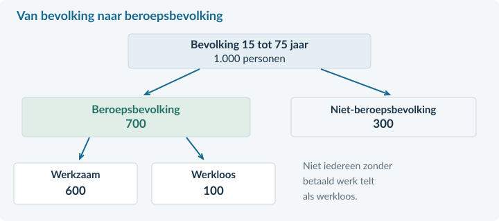
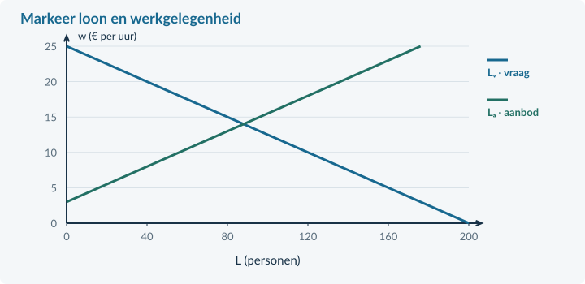

<!-- PAGE {"section": "4.3.2", "title": "Wie doet mee?", "origin_chapter": "4.3", "origin_page": 12, "edition_page": 12} -->

4.3.2 · ARBEIDSAANBOD, PARTICIPATIE EN EVENWICHT

# Geen baan. Ook werkloos?

Noor heeft een betaalde bijbaan. Amir heeft geen werk, zoekt actief en kan direct beginnen. Tess heeft geen baan en zoekt er ook geen. Alle drie zijn 17. Toch tellen ze niet op dezelfde manier mee.

<b>Lesdoelen</b> Je kunt werkenden, werklozen en niet-deelnemers onderscheiden. Je kunt bruto- en netto-arbeidsparticipatie berekenen. Je kunt met een bekend marktmodel het evenwichtsloon en de werkgelegenheid vinden.

<b>Definitie · beroepsbevolking</b> De mensen die betaald werk hebben, plus de mensen zonder betaald werk die recent werk hebben gezocht en direct beschikbaar zijn. De eerste groep is de werkzame beroepsbevolking; de tweede de werkloze beroepsbevolking.

<figure><figcaption>Figuur 7. Een fictieve bevolking van 1.000 personen: 700 behoren tot de beroepsbevolking. De 100 werklozen zitten al in die 700.</figcaption></figure>

De **niet-beroepsbevolking** bestaat uit mensen zonder betaald werk die niet recent hebben gezocht of niet direct beschikbaar zijn. Geen baan hebben is dus niet voldoende om als werkloos te tellen.

Noor telt als werkzaam, ook met weinig betaalde uren. Amir telt als werkloos. Tess behoort tot de niet-beroepsbevolking. Een leerling of student kan dus in elk van deze groepen vallen.

We gebruiken in de bevolkingsbronnen steeds **15 tot 75 jaar**: 15-jarigen wel, 75-jarigen niet. De definitie van de groepen en de gekozen leeftijdsgrens sluiten aan bij de CBS-begrippen. De cijfers zijn voor dit boek bedacht.

<!-- PAGE {"section": "4.3.2", "title": "Participatie: kies de juiste teller", "origin_chapter": "4.3", "origin_page": 13, "edition_page": 13} -->

### Hoe groot is het aandeel dat meedoet?
**Arbeidsparticipatie** gaat over deelname aan de arbeidsmarkt. Bij bruto-participatie tel je werkenden én werklozen. Bij netto-participatie tel je alleen mensen met betaald werk. Voor beide gebruik je dezelfde bevolking als noemer.

bruto-participatie = beroepsbevolking / bevolking × 100% netto-participatie = werkenden / bevolking × 100%

In de figuur op de vorige pagina is de bevolking 1.000 personen. De beroepsbevolking is 600 + 100 = 700 personen.

Bruto-participatie = 700 / 1.000 × 100% = **70%**. 
Netto-participatie = 600 / 1.000 × 100% = **60%**.

Het verschil van 10 procentpunt is hier het aandeel werklozen **in de hele bevolking**. Het is niet het werkloosheidspercentage. Dat percentage krijgt in §4.3.3 een andere noemer.

### Een waarneming is geen aanbodlijn
De telling zegt hoeveel mensen in een regio op dit moment meedoen. Een **arbeidsaanbodlijn** toont hoeveel arbeid huishoudens bij verschillende lonen willen aanbieden, terwijl de andere omstandigheden gelijk blijven.

In ons model loopt de aanbodlijn op. Een hoger loon kan meer mensen aantrekken of mensen meer uren laten aanbieden. Hoe mensen reageren hangt ook af van beschikbare tijd, zorgtaken, opleiding en voorkeuren. We gebruiken de stijgende lijn als vereenvoudiging voor de onderzochte markt.

Meer beschikbare gekwalificeerde werknemers kunnen de aanbodlijn naar rechts verschuiven. Een verandering van alleen het loon is juist een beweging langs die lijn.

<b>Tel geen groepen dubbel</b> Beroepsbevolking = werkenden + werklozen. Voeg de werklozen niet nogmaals toe aan een al gegeven beroepsbevolking. Houd bevolkingscijfers en een aparte sectorberekening uit elkaar.

<!-- PAGE {"section": "4.3.2", "title": "Evenwicht: nieuwe namen, bekende methode", "origin_chapter": "4.3", "origin_page": 14, "edition_page": 14} -->

### Van productprijs naar uurloon
Bij een gewone markt stelde je gevraagde en aangeboden hoeveelheid aan elkaar gelijk. Hier doe je hetzelfde. Alleen de economische betekenis en eenheden veranderen.

<table><thead><tr><th>Bekende markt</th><th>Arbeidsmarkt</th></tr></thead><tbody><tr><td>Prijs P</td><td>Uurloon w</td></tr><tr><td>Gevraagde hoeveelheid Qᵥ</td><td>Arbeidsvraag Lᵥ door werkgevers</td></tr><tr><td>Aangeboden hoeveelheid Qₐ</td><td>Arbeidsaanbod Lₐ door huishoudens</td></tr><tr><td>Qᵥ = Qₐ</td><td>Lᵥ = Lₐ</td></tr></tbody></table>

In een kleine voorbeeldsector geldt **Lᵥ = 180 − 10w** en **Lₐ = −20 + 10w**. L is het aantal personen; iedereen biedt één baan met 20 uur per week aan. w is het loon in euro per uur. We gebruiken deze functies voor € 2 ≤ w ≤ € 18.

Gelijkstellen: 180 − 10w = −20 + 10w → 200 = 20w → **w = € 10 per uur**.

Invullen: L = 180 − 10 × 10 = **80 personen**. Controle: −20 + 10 × 10 = 80 personen.

<figure><figcaption>Figuur 8. Het snijpunt E geeft het evenwichtsloon en de werkgelegenheid. Loon staat verticaal; de hoeveelheid arbeid staat horizontaal.</figcaption></figure>

<b>De modelafspraak</b> Er zijn veel werkgevers en werknemers, vergelijkbare arbeid en geen loonvloer. Het loon kan zich aanpassen. Iedereen vindt direct een passende werkgever of werknemer. Daardoor worden in het evenwicht alle aangeboden arbeidsplaatsen gevuld. Dit is niet een beschrijving van elke werkelijke arbeidsmarkt.

<!-- PAGE {"section": "4.3.2", "title": "Uitgewerkt voorbeeld", "origin_chapter": "4.3", "origin_page": 15, "edition_page": 15} -->

## Uitgewerkt voorbeeld

<b>Regio en voorbeeldsector</b> Een fictieve regio heeft 2.000 inwoners van 15 tot 75 jaar: 1.260 werken, 140 zijn werkloos en 600 behoren niet tot de beroepsbevolking. Een <b>aparte</b> sector heeft Lᵥ = 160 − 5w en Lₐ = −20 + 5w. L is het aantal personen met elk 20 uur per week; w is het uurloon in euro. Het model geldt voor € 4 ≤ w ≤ € 32 en kent vrije loonaanpassing zonder zoekproblemen.

### 1 · Stel de groepen vast
Beroepsbevolking = werkenden + werklozen = 1.260 + 140 = **1.400 personen**. Controle: 1.400 + 600 = 2.000 personen.

### 2 · Bereken de deelname
Bruto: 1.400 / 2.000 × 100% = **70%**. 
Netto: 1.260 / 2.000 × 100% = **63%**.

### 3 · Stel in de sector vraag en aanbod gelijk
160 − 5w = −20 + 5w → 180 = 10w → **w = € 18 per uur**. 
L = 160 − 5 × 18 = **70 personen**. Controle: −20 + 5 × 18 = 70.

De werkgevers vragen bij dit loon arbeid van 70 personen. Huishoudens bieden bij dit loon arbeid van 70 personen aan. De werkgelegenheid in dit model is dus 70 personen, niet de 1.400 uit de regiotelling.

<figure><figcaption>Figuur 9. Gebruik het loon uit het snijpunt. De horizontale hoeveelheid blijft een aantal personen, niet een geldbedrag.</figcaption></figure>

<b>Samenvatting §4.3.2</b> Kies eerst groep en leeftijdsbereik. Bruto telt werkenden én werklozen; netto alleen werkenden. Deel door de aangegeven bevolking. Vind het model-evenwicht met Lᵥ = Lₐ en controleer door invullen. In §4.3.3 kijken we naar werkloosheid en veranderingen.

<!-- PAGE {"section": "4.3.2", "title": "Start en groepen herkennen", "origin_chapter": "4.3", "origin_page": 16, "edition_page": 16} -->

## Startopgaven

<b>Korte route:</b> Startopgaven → Zelfstandige oefening → Doeloefening. Extra hulp nodig? Maak eerst Begeleide inoefening.

<b>Opgave 10 · Een bekende markt</b>

Voor een product geldt Qᵥ = 120 − 4P en Qₐ = 20 + P. P is euro per product en Q is producten per week.

<b>a.</b> Bereken de evenwichtsprijs en -hoeveelheid.

<b>b.</b> Bereken hoeveel procent 72 is van 120.

<b>Opgave 11 · Zoeken én beschikbaar zijn</b>

Lina heeft betaald werk. Mo heeft geen betaald werk, zoekt en kan direct beginnen. Bo heeft geen werk en is niet beschikbaar.

<b>a.</b> Deel de drie personen in: werkzaam, werkloos of niet-beroepsbevolking.

## Begeleide inoefening

Heb je deze hulp niet nodig? Ga dan verder met Zelfstandige oefening.

<b>Opgave 12 · Dezelfde bevolking, twee percentages</b>

Een wijk telt 800 inwoners van 15 tot 75 jaar. Er zijn 480 werkenden, 80 werklozen en 240 niet-deelnemers.

<b>a.</b> Bereken eerst de beroepsbevolking. Welke twee groepen tel je op?

<b>b.</b> Bereken bruto- en netto-participatie. Gebruik voor beide de 800 inwoners als noemer.

<b>Opgave 13 · Vul de evenwichtsroute aan</b>

Een arbeidsmarkt heeft Lᵥ = 140 − 5w en Lₐ = −20 + 5w. L is het aantal personen; w is het uurloon in euro. Gebruik € 4 ≤ w ≤ € 28 en vrije loonaanpassing.

<b>a.</b> Vul eerst de ontbrekende waarden in: 140 − 5w = −20 + 5w → … = 10w → w = … → L = … .

<b>b.</b> Wie vragen deze 60 eenheden arbeid en wie bieden ze aan?

<!-- PAGE {"section": "4.3.2", "title": "Van steun naar zelfstandig", "origin_chapter": "4.3", "origin_page": 17, "edition_page": 17} -->

## Zelfstandige oefening

<b>Opgave 14 · Participatie in een dorp</b>

Een dorp heeft 1.200 inwoners van 15 tot 75 jaar. 720 hebben betaald werk; 120 hebben geen werk, hebben recent gezocht en zijn direct beschikbaar. De rest werkt niet en zoekt niet.

<b>a.</b> Bereken de beroepsbevolking en beide participatiepercentages.

<b>Opgave 15 · De markt voor magazijnmedewerkers</b>

Lᵥ = 200 − 8w en Lₐ = −24 + 8w. L is het aantal personen met ieder 20 uur per week; w is het uurloon in euro. De functies gelden voor € 3 ≤ w ≤ € 25. Loon past vrij aan en alle matches komen direct tot stand.

<b>a.</b> Bereken het evenwichtsloon en de werkgelegenheid. Markeer het punt E in de basisgrafiek hieronder.

<figure><figcaption>Figuur 10. Basisgrafiek bij opgave 15. Voeg E en de bijbehorende hulplijnen toe.</figcaption></figure>

<!-- PAGE {"section": "4.3.2", "title": "Doeloefening", "origin_chapter": "4.3", "origin_page": 18, "edition_page": 18} -->

## Doeloefening

<b>Opgave 16 · Waterstad en de bezorgsector</b>

Bron A: Waterstad telt 5.000 inwoners van 15 tot 75 jaar. Er zijn 3.000 werkenden, 500 werklozen en 1.500 niet-deelnemers. Bron B: een afzonderlijk model voor bezorgers geeft Lᵥ = 240 − 10w en Lₐ = −40 + 10w. L is het aantal personen met 20 uur per week; w is het uurloon in euro. Het model geldt voor € 4 ≤ w ≤ € 24. Het loon is flexibel; er zijn geen zoekproblemen of loonafspraken.

<b>a.</b> (3p) Bereken met bron A de beroepsbevolking en de bruto- en netto-participatie.

<b>b.</b> (3p) Bereken met bron B het evenwichtsloon en de werkgelegenheid. Markeer E in de basisgrafiek hieronder.

<b>c.</b> (2p) Leg uit wie bij dit loon arbeid vragen en aanbieden. Waarom vervangt de modeluitkomst de regiotelling niet?

<figure><figcaption>Figuur 11. Basisgrafiek bij opgave 16. Benoem het berekende evenwicht met loon en hoeveelheid.</figcaption></figure>

<!-- PAGE {"section": "4.3.2", "title": "Denkertje en herhaling", "origin_chapter": "4.3", "origin_page": 19, "edition_page": 19} -->

## Denkertje / Bonusopgave

<b>Opgave 17 · Meer deelname, evenveel werk</b>

In een gebied met 1.000 inwoners van 15 tot 75 jaar werken eerst 600 mensen en zoeken 100 anderen zonder baan actief werk. Later gaan 50 niet-deelnemers ook zoeken en zijn direct beschikbaar. Niemand vindt of verliest werk.

<b>a.</b> Leg uit wat met bruto- en netto-participatie gebeurt. Beoordeel de uitspraak: “Hogere deelname betekent altijd meer werkenden.”

## Herhaling / Herhaling en interleaving

<b>Opgave 18 · De belastingwig terughalen</b>

Bij een belasting op een product betaalt de koper € 12 en ontvangt de verkoper na afdracht € 9. Er worden 200 producten per week verkocht.

<b>a.</b> Bereken de belasting per product en de overheidsontvangsten.

<b>De volgende stap</b> Een evenwichtsgrafiek laat een vereenvoudigd mechanisme zien. Werkloosheidscijfers zijn waarnemingen. In §4.3.3 leer je die twee gebruiken zonder ze met elkaar te verwarren.

