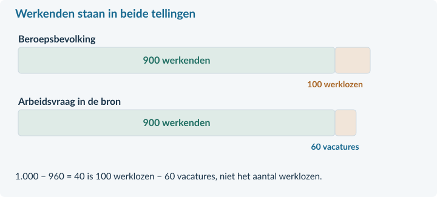

<!-- PAGE {"section": "4.3.3", "title": "Werkloos: kies de juiste noemer", "origin_chapter": "4.3", "origin_page": 20, "edition_page": 20} -->

4.3.3 · WERKLOOSHEID EN VERANDERINGEN OP DE ARBEIDSMARKT

# Vacatures én werklozen. Hoe kan dat?

Een regio telt honderd werklozen, terwijl werkgevers zestig mensen zoeken. Is de werkloosheid dan eigenlijk maar veertig? Nee. Een openstaande baan is nog niet door een werkloze vervuld.

<b>Lesdoelen</b> Je kunt het werkloosheidspercentage berekenen. Je kunt oorzaken van werkloosheid onderscheiden. Je kunt een verschuiving van arbeidsvraag verwerken en uitleggen waarom een model niet alle waargenomen werkloosheid beschrijft.

werklozen = beroepsbevolking − werkenden werkloosheidspercentage = werklozen / beroepsbevolking × 100%

Bij 900 werkenden en 100 werklozen is de beroepsbevolking 1.000 personen. Het werkloosheidspercentage is 100 / 1.000 × 100% = **10%**. De noemer is nu niet de hele bevolking.

<figure><figcaption>Figuur 12. Een fictieve bron telt één baan per werkende en één persoon per vacature. De 900 werkenden komen in beide tellingen voor.</figcaption></figure>

In deze bron is arbeidsvraag = werkgelegenheid + vacatures = 900 + 60 = 960 arbeidsplaatsen. Arbeidsaanbod = beroepsbevolking = 1.000 personen.

Maar aanbod − vraag = 1.000 − 960 = 40 is **niet** het aantal werklozen. Je hebt dan vacatures van werklozen afgetrokken. Er zijn nog steeds 100 mensen zonder werk die zoeken en beschikbaar zijn.

<b>Gelijke eenheden zijn nodig</b> In werkelijke bronnen kunnen banen en personen verschillen: één persoon kan meer banen hebben. Onze rekenvoorbeelden melden daarom expliciet wanneer één persoon bij één baan hoort.

<!-- PAGE {"section": "4.3.3", "title": "Verschillende oorzaken", "origin_chapter": "4.3", "origin_page": 21, "edition_page": 21} -->

### Minder bestedingen, andere productie of zoektijd?
Bij **conjuncturele werkloosheid** is er minder vraag naar goederen en diensten. Huishoudens of bedrijven besteden minder. Bedrijven krijgen minder opdrachten en hebben daardoor minder personeel nodig. Het probleem is hier niet dat iedereen plotseling de verkeerde opleiding heeft.

Bij **structurele werkloosheid** past de beschikbare arbeid niet goed bij het werk dat gevraagd wordt. Techniek kan beroepen veranderen. Een regio kan veel werkzoekenden hebben, terwijl passende banen ergens anders liggen. Scholing en verhuizing kosten tijd en geld.

**Frictiewerkloosheid** ontstaat doordat het tijd kost om een passende baan en werknemer te vinden. Iemand kan tussen twee banen zitten, zonder dat er te weinig banen voor zijn beroep zijn. We rekenen deze zoektijd hier tot structurele werkloosheid.

<figure><figcaption>Figuur 13. De bron moet de oorzaak ondersteunen. “Lang werkloos” of “weinig vacatures” is op zichzelf nog geen volledige verklaring.</figcaption></figure>

### Waarom vallen vacatures en werklozen niet direct samen?
Een installateur zoekt een ervaren elektricien. Een werkloze kandidaat heeft ervaring als winkelmedewerker. Er is een vacature én iemand zoekt werk, maar er is nog geen passende match. Ook reistijd, werktijden en informatie kunnen een match in de weg staan.

Een hoog totaal aantal vacatures bewijst daarom niet dat iedere werkzoekende direct kan beginnen. Evenmin betekent ieder langdurig werkloosheidsgeval automatisch dat het conjunctureel is.

<b>Benoem een mechanisme</b> Schrijf bijvoorbeeld: “Minder consumentenbestedingen → minder winkelverkopen → minder vraag naar winkelpersoneel.” Het woord conjunctureel alleen verklaart nog niets.

<!-- PAGE {"section": "4.3.3", "title": "Een verschuiving bij flexibel loon", "origin_chapter": "4.3", "origin_page": 22, "edition_page": 22} -->

### Minder opdrachten verschuiven de arbeidsvraag
We gebruiken opnieuw het bekende marktmodel. De lijnen tonen verbanden bij verder gelijke omstandigheden. De aanbodlijn blijft nu gelijk; door minder bestedingen daalt de arbeidsvraag bij ieder loon.

Oud: **Lᵥ = 200 − 10w**. Nieuw: **Lᵥ = 160 − 10w**. 
Aanbod: **Lₐ = −40 + 10w**. L is het aantal personen met ieder 20 uur per week; w is het uurloon in euro. We gebruiken € 4 ≤ w ≤ € 16. Het loon kan vrij aanpassen, zonder vacatures of zoekproblemen.

<figure><figcaption>Figuur 14. E₀ is het oude evenwicht: € 12 en 80 personen. Na de daling van de arbeidsvraag ligt E₁ bij € 10 en 60 personen.</figcaption></figure>

Nieuwe vergelijking: 160 − 10w = −40 + 10w → 200 = 20w → **w = € 10**. 
Invullen: L = 160 − 10 × 10 = **60 personen**.

De nieuwe evenwichtswerkgelegenheid is lager. Toch is er in dit eenvoudige model geen aanbodoverschot bij het nieuwe loon. Bij € 10 willen minder personen arbeid aanbieden dan bij € 12. Gevraagde en aangeboden hoeveelheid zijn nu beide 60.

Dat betekent niet dat iedereen in de echte regio onmiddellijk werk vindt. Het model laat zoekproblemen, verschillen in vaardigheden en vaste afspraken weg.

<b>Geen dubbele verschuiving</b> De arbeidsvraaglijn verschuift naar links. Het dalende loon veroorzaakt een <b>beweging langs de gelijk gebleven aanbodlijn</b>. Een nieuwe evenwichtsprijs is niet automatisch een verschuiving van beide lijnen.

<!-- PAGE {"section": "4.3.3", "title": "Hetzelfde verlies aan vraag, maar vast loon", "origin_chapter": "4.3", "origin_page": 23, "edition_page": 23} -->

### Het loon daalt niet meteen
Veronderstel nu dat in precies dezelfde sector het uurloon voorlopig **€ 12 blijft**. Dat kan bijvoorbeeld door bestaande loonafspraken. We gebruiken dezelfde nieuwe arbeidsvraag en dezelfde aanbodlijn als op de vorige pagina.

Vraag bij € 12: 160 − 10 × 12 = **40 personen**. 
Aanbod bij € 12: −40 + 10 × 12 = **80 personen**.

<figure><figcaption>Figuur 15. Bij het vastgehouden loon ligt de nieuwe vraag bij 40 en het aanbod bij 80 personen. Het horizontale verschil is 40 personen.</figcaption></figure>

Er zijn in dit model geen vacatures, geen zoekproblemen en geen tweede baan per persoon. Alle 40 gevraagde plaatsen worden gevuld. De overige 40 aanbieders willen werken, zoeken werk en zijn beschikbaar, maar vinden hier geen baan.

Vergelijk de twee situaties. Bij een flexibel loon ontstaat € 10 met 60 werkenden. Bij een loon dat € 12 blijft, zijn er 40 werkenden en 40 niet-geplaatste aanbieders. Hetzelfde verschil in opdrachten krijgt dus een andere uitkomst door de **loonaanpassing**.

### Wat mag je concluderen?
Je kunt de uitkomst onder beide aannames berekenen. Je kunt uit deze berekening niet bewijzen dat werkelijke lonen direct dalen of dat alle echte werkloosheid door vaste lonen ontstaat.

<b>Telling of model?</b> In een waarneming tel je werklozen rechtstreeks of als beroepsbevolking min werkenden. Alleen onder de expliciete modelvoorwaarden zonder vacatures of mismatch mag je het arbeidsaanbodoverschot als modelwerkloosheid lezen.

<!-- PAGE {"section": "4.3.3", "title": "Uitgewerkt voorbeeld", "origin_chapter": "4.3", "origin_page": 24, "edition_page": 24} -->

## Uitgewerkt voorbeeld

<b>Minder evenementen</b> Een regio telt 1.840 werkenden en 160 werklozen. Er zijn 90 vacatures; elke werkende heeft precies één baan. In een aparte evenementenmarkt daalt de arbeidsvraag van Lᵥ = 200 − 8w naar Lᵥ = 168 − 8w. Het aanbod blijft Lₐ = −24 + 8w. L is het aantal personen, w het uurloon in euro; € 3 ≤ w ≤ € 21. Het oude evenwicht is w = € 14 en L = 88. Consumenten besparen op evenementen.

### 1 · Bereken de waargenomen werkloosheid
Beroepsbevolking = 1.840 + 160 = **2.000 personen**. 
Werkloosheidspercentage = 160 / 2.000 × 100% = **8%**.

Arbeidsvraag = 1.840 + 90 = **1.930 arbeidsplaatsen**. Het verschil van 70 is werklozen min vacatures, niet de werkloosheid.

### 2 · Noem de oorzaak en de verschuiving
Minder bestedingen → minder evenementen → minder arbeidsvraag. Dit is **conjunctureel**. Vraag verschuift naar links; aanbod blijft gelijk.

### 3 · Bereken het nieuwe evenwicht bij flexibel loon
168 − 8w = −24 + 8w → 192 = 16w → **w = € 12**. 
L = 168 − 8 × 12 = **72 personen**.

### 4 · Vergelijk met voorlopig vast loon
Bij € 14: Lᵥ = 168 − 8 × 14 = **56** en Lₐ = −24 + 8 × 14 = **88 personen**. Zonder vacatures of zoekproblemen worden 56 plaatsen gevuld en is het aanbodoverschot **32 personen**.

De sectorgrafiek vervangt niet de aparte regiotelling.

<b>Samenvatting §4.3.3</b> Werkloosheid gebruikt de beroepsbevolking als noemer. Trek vacatures niet af. Benoem oorzaak en loonaanpassing. Houd model en waarneming gescheiden. In §4.3.4 voegen we een minimumloon toe.

<!-- PAGE {"section": "4.3.3", "title": "Start en een oorzaak herkennen", "origin_chapter": "4.3", "origin_page": 25, "edition_page": 25} -->

## Startopgaven

<b>Korte route:</b> Startopgaven → Zelfstandige oefening → Doeloefening. Extra hulp nodig? Maak eerst Begeleide inoefening.

<b>Opgave 19 · Terug naar de groepen</b>

Een gemeente telt 4.000 inwoners van 15 tot 75 jaar. Er zijn 2.400 werkenden en 400 werklozen.

<b>a.</b> Bereken de beroepsbevolking en de bruto-participatie.

<b>Opgave 20 · Een andere noemer</b>

In een andere regio is 6% van de bevolking werkloos. De bruto-participatie is 60%.

<b>a.</b> Is het werkloosheidspercentage automatisch 6%? Leg uit zonder het precieze percentage te hoeven berekenen.

<b>b.</b> Een andere werkzoekende is tussen twee banen drie weken op zoek. De vaardigheden sluiten aan bij openstaande vacatures. Welk type werkloosheid past hierbij?

## Begeleide inoefening

Heb je deze hulp niet nodig? Ga dan verder met Zelfstandige oefening.

<b>Opgave 21 · Een vervulde baan ontbreekt nog</b>

Een klein gebied telt 450 werkenden, 50 werklozen en 30 vacatures. Iedereen heeft hoogstens één baan. Een vacature past niet bij iedere werkzoekende.

<b>a.</b> Bereken eerst de beroepsbevolking en daarna het werkloosheidspercentage.

<b>b.</b> Een leerling rekent (500 − 480) / 500 × 100% = 4%. Wat trekt die leerling ten onrechte af?

<!-- PAGE {"section": "4.3.3", "title": "Van oorzaak naar uitkomst", "origin_chapter": "4.3", "origin_page": 26, "edition_page": 26} -->

Begeleide inoefening · vervolg

Heb je deze hulp niet nodig? Ga dan verder met Zelfstandige oefening.

<b>Opgave 22 · Wat verandert er?</b>

Een reisbureau krijgt minder boekingen doordat huishoudens minder besteden. In zijn arbeidsmarkt blijft het loon eerst gelijk.

<b>a.</b> Noem de oorzaak van werkloosheid die bij de bron past en maak de keten af: minder bestedingen → … → minder vraag naar arbeid.

<b>b.</b> Welke lijn verschuift en welke druk op loon en werkgelegenheid ontstaat als het loon later wel kan dalen?

## Zelfstandige oefening

<b>Opgave 23 · Werk en techniek</b>

Een provincie heeft 4.500 werkenden en 500 werklozen. Een deel van de werklozen deed invoerwerk dat nu door software wordt uitgevoerd. Nieuwe vacatures vragen andere vaardigheden.

<b>a.</b> Bereken het werkloosheidspercentage en benoem de best passende oorzaak voor de beschreven groep.

<b>Opgave 24 · Minder schoonmaakopdrachten</b>

Oud: Lᵥ = 180 − 5w. Nieuw: Lᵥ = 160 − 5w. Aanbod blijft Lₐ = −20 + 5w. L is het aantal personen; w is het uurloon in euro. Gebruik € 4 ≤ w ≤ € 32. Oud evenwicht: € 20 en 80 personen. Loon is vrij aanpasbaar; er zijn geen vacatures of zoekproblemen.

<b>a.</b> Bereken het nieuwe evenwicht. Benoem één verschuiving en één beweging langs een lijn.

<b>b.</b> Bereken het aanbodoverschot als het loon toch € 20 blijft.

<!-- PAGE {"section": "4.3.3", "title": "Doeloefening", "origin_chapter": "4.3", "origin_page": 27, "edition_page": 27} -->

## Doeloefening

<b>Opgave 25 · Rivierenregio: cijfers en een sector</b>

Bron A: de regio telt 2.700 werkenden, 300 werklozen en 120 vacatures. Iedere werkende heeft één baan. Bron B: in een afzonderlijke sector nemen de opdrachten af doordat huishoudens minder besteden. Lᵥ daalt van 180 − 6w naar 144 − 6w; Lₐ blijft −12 + 6w. L is het aantal personen; w is het uurloon in euro; € 2 ≤ w ≤ € 24. Het oude evenwicht is € 16 en 84 personen. Er zijn in dit sector-model geen vacatures of zoekproblemen.

<b>a.</b> (3p) Bereken met bron A het werkloosheidspercentage. Leg uit waarom arbeidsaanbod min arbeidsvraag hier niet de werkloosheid geeft.

<b>b.</b> (3p) Benoem met bron B de oorzaak en bereken het nieuwe evenwicht als het loon vrij aanpast.

<b>c.</b> (3p) Markeer het oude en nieuwe evenwicht in de basisgrafiek. Bereken daarna het aanbodoverschot bij een loon dat € 16 blijft.

<figure><figcaption>Figuur 16. De oude en nieuwe vraaglijn en de aanbodlijn zijn gegeven. Voeg alleen E₀ en E₁ toe.</figcaption></figure>

<!-- PAGE {"section": "4.3.3", "title": "Denkertje en herhaling", "origin_chapter": "4.3", "origin_page": 28, "edition_page": 28} -->

## Denkertje / Bonusopgave

<b>Opgave 26 · Een dalend percentage zonder extra banen</b>

Een dorp telt eerst 900 werkenden en 100 werklozen. Later stoppen 50 werklozen met zoeken. Zij hebben geen betaald werk en horen nu bij de niet-beroepsbevolking. Er komt geen baan bij.

<b>a.</b> Beoordeel: “De lagere werkloosheid bewijst dat meer mensen werk hebben.” Gebruik zowel aantallen als percentages.

## Herhaling / Herhaling en interleaving

<b>Opgave 27 · Marginale opbrengst uit hoofdstuk 4.1</b>

Een onderneming heeft P = 30 − 0,5q en TK = 6q + 100. P is euro per product, q producten per week. De gevraagde hoeveelheid is niet negatief.

<b>a.</b> Bepaal TO en MO.

<b>Terugblik</b> Een cijfer wordt pas betekenisvol met de juiste teller, noemer en definitie. Een modeluitkomst vraagt bovendien een expliciete aanname over loonaanpassing.

