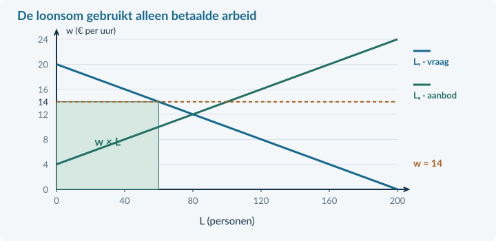
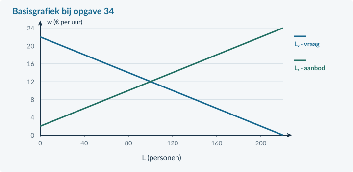

<!-- PAGE {"section": "4.3.4", "title": "Een ondergrens aan het loon", "origin_chapter": "4.3", "origin_page": 29, "edition_page": 29} -->

4.3.4 · MINIMUMLOON

# Een hoger uurloon voor iedereen?

Een minimumloon kan het uurloon verhogen. Maar is de totale hoeveelheid betaald werk dan ook groter? We gebruiken de minimumprijs uit Boek 3 opnieuw, nu met loon en arbeid.

<b>Lesdoelen</b> Je kunt bepalen of een minimumloon bindend is. Je kunt in een gegeven model arbeidsvraag, arbeidsaanbod, werkgelegenheid en loonsom berekenen. Je kunt verschillen tussen groepen werknemers uitleggen.

<b>Definitie · minimumloon</b> Een ondergrens waaronder het loon niet mag liggen. In dit hoofdstuk gebruiken we fictieve uurlonen om een economisch model te onderzoeken, niet de actuele wettelijke bedragen.

<table><thead><tr><th>Minimumprijs bij een product</th><th>Minimumloon in ons model</th></tr></thead><tbody><tr><td>Vergelijk de ondergrens met de evenwichtsprijs.</td><td>Vergelijk de ondergrens met het evenwichtsloon.</td></tr><tr><td>Bereken vraag en aanbod bij de opgelegde prijs.</td><td>Bereken arbeidsvraag en arbeidsaanbod bij het loon.</td></tr><tr><td>Stel vast hoeveel er werkelijk wordt verkocht.</td><td>Stel vast hoeveel arbeid werkelijk wordt betaald.</td></tr></tbody></table>

Als het evenwichtsloon € 12 is en het minimum € 10, verandert het evenwicht niet. € 12 is immers toegestaan. Het minimum is dan **niet-bindend**. Het feitelijke loon wordt dus niet automatisch € 10.

<figure><figcaption>Figuur 17. Een loonvloer onder het evenwicht raakt de feitelijke loonvorming in dit model niet.</figcaption></figure>

Model: concurrerende werkgevers, vergelijkbare arbeid en naleving van de vloer. Werkgevers passen personeelsaantallen aan; alle gevraagde plaatsen worden gevuld, zonder vacatures of zoekproblemen.

<!-- PAGE {"section": "4.3.4", "title": "Een bindend minimumloon", "origin_chapter": "4.3", "origin_page": 30, "edition_page": 30} -->

### Hoger dan het evenwicht
In dezelfde voorbeeldmarkt geldt **Lᵥ = 200 − 10w** en **Lₐ = −40 + 10w**, voor € 4 ≤ w ≤ € 20. L is het aantal personen met ieder 20 uur per week; w is het uurloon in euro. Het vrije evenwicht is **€ 12 en 80 personen**.

Nu komt er een minimumloon van € 14. Dat ligt boven het evenwicht en is **bindend**. In dit model wordt het loon € 14.

Arbeidsvraag: 200 − 10 × 14 = **60 personen**. 
Arbeidsaanbod: −40 + 10 × 14 = **100 personen**.

<figure><figcaption>Figuur 18. Het minimumloon verandert het loon op de bestaande lijnen. Het aanbodoverschot is een horizontale afstand, geen oppervlakte.</figcaption></figure>

Werkgelegenheid = **60 personen**: werkgevers vullen alle gevraagde plaatsen. Het aanbodoverschot is 100 − 60 = **40 personen**. Die 40 willen bij dit loon werken, zoeken en zijn beschikbaar, maar krijgen in dit model geen baan.

### Niet alle veertig hebben hun baan verloren
Eerst werkten 80 personen; nu 60. Dat zijn **20 minder werkenden**. Tegelijk groeit het aantal aanbieders van 80 naar 100: **20 extra aanbieders**.

Het nieuwe verschil van 40 bestaat dus uit 20 minder werkenden én 20 extra aanbieders. Je mag niet zeggen dat alle 40 een baan hebben verloren.

<b>Wie heeft voordeel?</b> Wie hetzelfde aantal uren blijft werken, krijgt meer loon per uur. Wie geen werk krijgt, ontvangt dat hogere loon niet. Een uitspraak over “de werknemers” moet daarom aangeven over welke groep zij gaat.

<!-- PAGE {"section": "4.3.4", "title": "Loonsom: loon maal betaalde arbeid", "origin_chapter": "4.3", "origin_page": 31, "edition_page": 31} -->

### Het loon per uur en de totale uitbetaling
De **loonsom** is het totale loon dat werknemers samen ontvangen in een periode. Kijk steeds naar de arbeid die werkelijk wordt betaald, niet naar alle arbeid die mensen graag willen aanbieden.

loonsom per week = uurloon × betaalde uren per week = uurloon × uren per werknemer × werkenden

Oud: € 12 × 20 uur × 80 personen = **€ 19.200 per week**. 
Nieuw: € 14 × 20 uur × 60 personen = **€ 16.800 per week**.

De loonsom daalt hier met (€ 16.800 − € 19.200) / € 19.200 × 100% = **12,5%**. Het hogere uurloon weegt niet op tegen de daling van het aantal betaalde uren.

<figure><figcaption>Figuur 19. De rechthoek w × L gebruikt het aantal werkenden. Omdat L hier personen is, vermenigvuldig je nog met 20 uur per persoon per week.</figcaption></figure>

Bij een andere arbeidsvraag kan de werkgelegenheid minder sterk reageren. Dan kan een hoger uurloon samengaan met een hogere totale loonsom. Reken daarom beide situaties uit; onthoud geen vaste uitkomst voor de loonsom.

### Geen algemene voorspelling over de werkelijkheid
Werkgevers kunnen anders reageren dan in dit eenvoudige model. Ook productiviteit, vacatures, prijzen en marktverhoudingen kunnen veranderen. Een berekende daling in ons model bewijst niet dat iedere echte minimumloonsverhoging precies dit effect heeft.

<b>Geen automatische aankoop door de overheid</b> Een minimumloon betekent niet dat de overheid de niet-geplaatste arbeid “opkoopt”. Daarvoor zou een afzonderlijke regeling in de bron moeten staan.

<!-- PAGE {"section": "4.3.4", "title": "Uitgewerkt voorbeeld", "origin_chapter": "4.3", "origin_page": 32, "edition_page": 32} -->

## Uitgewerkt voorbeeld

<b>Een loonvloer in de pakketbranche</b> Lᵥ = 180 − 5w; Lₐ = −20 + 5w, voor € 4 ≤ w ≤ € 36. L is het aantal personen met ieder 20 betaalde uren per week; w is het uurloon in euro. Het minimumloon wordt € 22. Neem concurrerende werkgevers, gelijke arbeid en geen vacatures of zoekproblemen aan. Het brutoloon is in dit model ook de volledige uurkost voor de werkgever.

### 1 · Bereken het vrije evenwicht en toets de ondergrens
180 − 5w = −20 + 5w → 200 = 10w → **w = € 20**. 
L = 180 − 5 × 20 = **80 personen**. € 22 > € 20: de vloer is bindend.

### 2 · Bereken beide hoeveelheden en de werkgelegenheid
Lᵥ = 180 − 5 × 22 = **70 personen**. 
Lₐ = −20 + 5 × 22 = **90 personen**. 
Er werken **70 personen**. Het aanbodoverschot is 90 − 70 = **20 personen**.

### 3 · Vergelijk de loonsommen
Oud: € 20 × 20 × 80 = **€ 32.000 per week**. 
Nieuw: € 22 × 20 × 70 = **€ 30.800 per week**. 
Verandering: (30.800 − 32.000) / 32.000 × 100% = **−3,75%**.

### 4 · Leg de verdeling uit
Wie 20 uur blijft werken, krijgt € 440 in plaats van € 400 per week. Er zijn wel 10 minder werkenden. Het aanbod groeit met 10 personen. Samen geeft dat het nieuwe aanbodoverschot van 20 personen.

Het hogere loon geldt dus niet als inkomen voor alle 90 aanbieders. Zonder individuele gegevens weten we ook niet welke personen hun baan behouden.

<b>Samenvatting §4.3.4</b> Eerst het vrije evenwicht, dan de bindendheid. Bereken vraag, aanbod en betaald werk afzonderlijk. Gebruik betaald werk voor de loonsom. Maak onderscheid tussen blijvende werknemers, minder werkenden en extra aanbieders. In de gemengde opgaven combineer je de methoden uit dit hoofdstuk.

<!-- PAGE {"section": "4.3.4", "title": "Start en een vloer herkennen", "origin_chapter": "4.3", "origin_page": 33, "edition_page": 33} -->

## Startopgaven

<b>Korte route:</b> Startopgaven → Zelfstandige oefening → Doeloefening. Extra hulp nodig? Maak eerst Begeleide inoefening.

<b>Opgave 28 · De minimumprijs terughalen</b>

Op een goederenmarkt is de evenwichtsprijs € 8. Er komt een minimumprijs van € 10. Bij € 10 is de vraag 60 en het aanbod 100 producten per week. De overheid koopt niets op.

<b>a.</b> Hoeveel producten worden verkocht en hoe groot is het aanbodoverschot?

<b>Opgave 29 · Personen zijn geen uren</b>

Er werken 50 mensen. Ieder werkt 20 uur per week tegen € 15 bruto per uur.

<b>a.</b> Bereken de loonsom per week.

## Begeleide inoefening

Heb je deze hulp niet nodig? Ga dan verder met Zelfstandige oefening.

<figure><figcaption>Figuur 20. Bij het voorbeeld worden 70 personen gevraagd en bieden 90 personen arbeid aan. Gebruik de gemarkeerde uitkomst.</figcaption></figure>

<b>Opgave 30 · Begrijpen vóór rekenen</b>

Gebruik het volledig uitgewerkte voorbeeld op de vorige pagina: oud € 20 en 80 werkenden; nieuw € 22, 70 werkenden en 90 aanbieders.

<b>a.</b> Hoeveel minder mensen werken er? Hoeveel extra mensen bieden arbeid aan?

<b>b.</b> Waarom reken je voor de nieuwe loonsom niet met alle 90 aanbieders?

<!-- PAGE {"section": "4.3.4", "title": "Van begeleid naar zelfstandig", "origin_chapter": "4.3", "origin_page": 34, "edition_page": 34} -->

Begeleide inoefening · vervolg

Heb je deze hulp niet nodig? Ga dan verder met Zelfstandige oefening.

<b>Opgave 31 · De vloer stap voor stap</b>

Lᵥ = 180 − 6w en Lₐ = −12 + 6w. L is het aantal personen met 20 uur per week; w is het uurloon in euro. Gebruik € 2 ≤ w ≤ € 30. Het vrije evenwicht is € 16 en 84 personen. Alle gevraagde plaatsen worden gevuld. Een minimum van € 18 wordt ingevoerd.

<b>a.</b> Toets de bindendheid en bereken Lᵥ en Lₐ bij het minimum.

<b>b.</b> Bereken de werkgelegenheid, het aanbodoverschot en de nieuwe loonsom.

## Zelfstandige oefening

<b>Opgave 32 · Een andere reactie</b>

In een cateringmarkt geldt Lᵥ = 140 − 2w en Lₐ = 5w, met L in personen en w in euro per uur. Iedereen werkt 20 uur per week. Het vrije evenwicht is € 20 en 100 personen. Alle gevraagde plaatsen worden gevuld. Het minimum wordt € 22.

<b>a.</b> Bereken werkgelegenheid, aanbodoverschot en loonsom bij de vloer. Vergelijk met de oude loonsom.

<b>Opgave 33 · Een minimum onder de markt</b>

In een aparte markt is het vrije evenwicht € 24 per uur met 60 werkenden. Het minimumloon wordt € 21. Alle overige omstandigheden blijven gelijk.

<b>a.</b> Welk loon en welke werkgelegenheid verwacht je volgens het model? Licht toe.

<!-- PAGE {"section": "4.3.4", "title": "Doeloefening", "origin_chapter": "4.3", "origin_page": 35, "edition_page": 35} -->

## Doeloefening

<b>Opgave 34 · Een loonvloer in de sorteercentra</b>

Lᵥ = 220 − 10w en Lₐ = −20 + 10w, voor € 2 ≤ w ≤ € 22. L is het aantal personen met ieder 25 betaalde uren per week; w is het brutouurloon in euro. Een fictief minimumloon wordt € 14. Werkgevers concurreren; er zijn geen vacatures of zoekproblemen. Alle gevraagde plaatsen worden gevuld. Alle aanbieders zonder baan zoeken en zijn direct beschikbaar.

<b>a.</b> (2p) Bereken het vrije evenwicht en bepaal of de loonvloer bindend is.

<b>b.</b> (3p) Bereken bij de loonvloer arbeidsvraag, arbeidsaanbod, werkgelegenheid en aanbodoverschot. Geef de loonvloer en beide hoeveelheden aan in de basisgrafiek.

<b>c.</b> (3p) Bereken de loonsom vóór en na de verandering en de procentuele verandering.

<b>d.</b> (2p) Leg uit waarom “alle 40 hebben hun baan verloren” en “iedereen verdient meer” geen juiste conclusies zijn.

<figure><figcaption>Figuur 21. De vraag- en aanbodlijn zijn gegeven. Vul de loonvloer, vraag en aanbod aan; teken de lijnen niet opnieuw.</figcaption></figure>

<!-- PAGE {"section": "4.3.4", "title": "Denkertje en herhaling", "origin_chapter": "4.3", "origin_page": 36, "edition_page": 36} -->

## Denkertje / Bonusopgave

<b>Opgave 35 · Een hoger loon, minder uren per persoon</b>

Een werknemer krijgt eerst € 16 per uur en werkt 25 uur per week. Later krijgt deze werknemer € 18 per uur maar werkt 20 uur. Deze verandering geldt voor alle werknemers; hun aantal blijft gelijk.

<b>a.</b> Beoordeel welke uitspraken juist zijn: het uurloon stijgt, het weekloon stijgt, de werkgelegenheid in personen daalt, de arbeidsinzet in uren daalt. Leg uit waarom de eenheid ertoe doet.

## Herhaling / Herhaling en interleaving

<b>Opgave 36 · Productiviteit blijft nodig</b>

Een producent maakt 4.800 producten in 800 arbeidsuren. De volledige uurkosten zijn € 27.

<b>a.</b> Bereken de arbeidsproductiviteit en loonkosten per product.

<b>Terugblik</b> Bij een loonmaatregel reken je niet alleen met het uurloon. Je controleert ook betaald werk, aangeboden arbeid, arbeidsduur en de totale loonsom.

