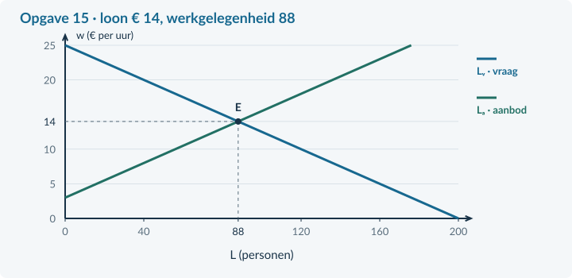
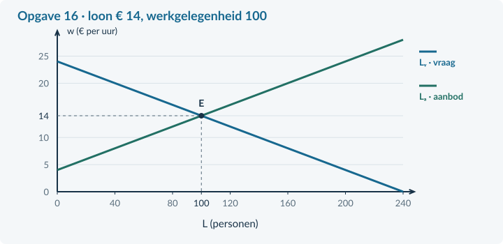
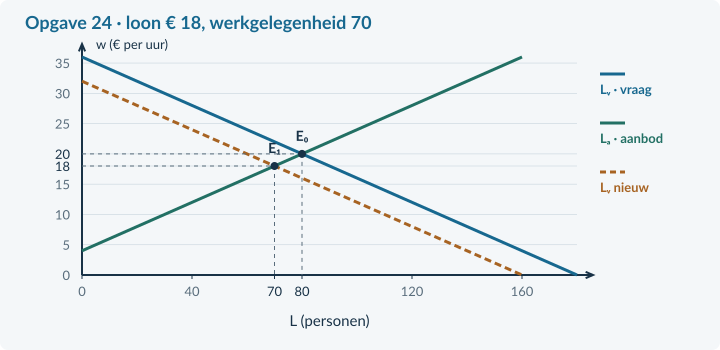
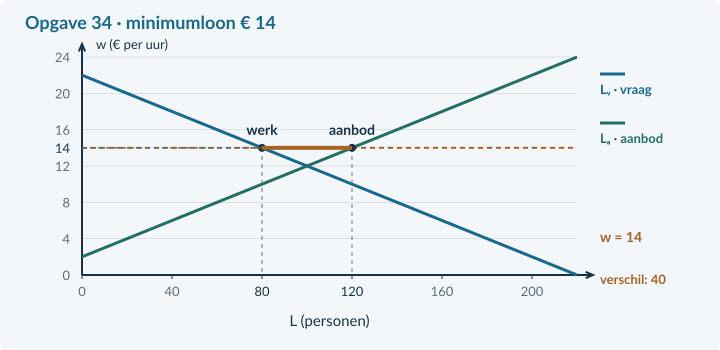
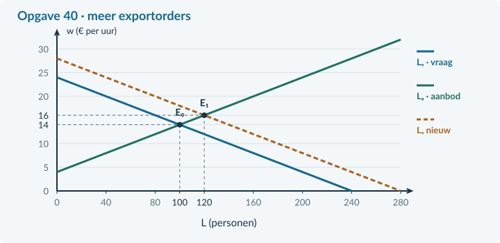

<!-- PAGE {"section": "Antwoorden", "title": "Inhoud"} -->

BOEK 4 · HOOFDSTUK 3

# Antwoorden · Arbeidsmarkt

Dit antwoordboek hoort bij de 41 opgaven van het hoofdstuk. De volgorde en letters zijn gelijk aan die in het leerlingboek.

<b>Rekenen en afronden</b> Schrijf eerst de verhouding of vergelijking, vul de waarden in en vermeld de eenheid. Reken tussentijds met de exacte waarde. Rond geldbedragen en percentages zo nodig af op twee decimalen. Een indexcijfer heeft geen euroteken. Het werkloosheidspercentage gebruikt een andere noemer dan participatie.

<b>Betekenis van de antwoorden</b> Bij open vragen zijn ook andere antwoorden goed als zij kloppen met de bron en de opgegeven modelaannames. De bonusvragen geven een mogelijk sterk antwoord met beoordelingscriteria, geen verplichte formulering.

De punten staan bij de doeloefeningen in het leerlingboek. Waardeer een correcte werkwijze en passende eenheden; straf dezelfde doorwerkfout niet telkens opnieuw.

<a href="#a431"><b>4.3.1 Arbeidsvraag en arbeidsproductiviteit</b>Opgaven 1–9</a><a href="#a432"><b>4.3.2 Arbeidsaanbod, participatie en evenwicht</b>Opgaven 10–18</a><a href="#a433"><b>4.3.3 Werkloosheid en veranderingen op de arbeidsmarkt</b>Opgaven 19–27</a><a href="#a434"><b>4.3.4 Minimumloon</b>Opgaven 28–36</a><a href="#a435"><b>4.3.5 Gemengde opgaven: arbeidsmarkt</b>Opgaven 37–41</a>

Alle numerieke gevallen zijn lesmodellen. Uit modelwerkloosheid volgt geen gemeten Nederlands werkloosheidscijfer. Minimumlonen zijn fictief.

<!-- PAGE {"section": "4.3.1", "title": "Arbeidsvraag en arbeidsproductiviteit"} -->

# 4.3.1 · Arbeidsvraag en arbeidsproductiviteit

Startopgaven

<h3 id="antwoord1">Opgave 1 · Een bekende verhouding</h3>

<b>a.</b> Gemiddelde kosten = totale kosten / productie = € 2.700 / 900 = <b>€ 3 per poster</b>. <i>Waarom:</i> Je verdeelt de totale kosten over de geproduceerde posters.

<b>b.</b> (1.080 − 900) / 900 × 100% = <b>20%</b>. <i>Waarom:</i> De oude productie is de basis van de vergelijking.

<h3 id="antwoord2">Opgave 2 · Wie koopt wat?</h3>

<b>a.</b> Het restaurant vraagt arbeid; de kok biedt arbeid aan. Het restaurant betaalt loon voor de arbeid van de kok. <i>Waarom:</i> Een baan aanbieden is niet hetzelfde als arbeid aanbieden.

Begeleide inoefening

<h3 id="antwoord3">Opgave 3 · Een order erbij</h3>

<b>a.</b> 100 − 80 = <b>20 extra arbeidsuren per week</b>. <i>Waarom:</i> Beide hoeveelheden horen bij hetzelfde uurloon van € 16.

<b>b.</b> De orders veranderen, niet het loon. Bij hetzelfde loon vraagt het bedrijf meer arbeid: de vraaglijn verschuift naar rechts. <i>Waarom:</i> Een verandering van een andere vraagbepalende factor verandert de hele relatie.

<h3 id="antwoord4">Opgave 4 · Een tabel opbouwen</h3>

<b>a.</b> Week 1: 1.600 / 400 = <b>4 kaarsen per uur</b>. Week 2: 2.400 / 6 = <b>400 arbeidsuren</b>. Week 2: € 21 / 6 = <b>€ 3,50 per kaars</b>. <i>Waarom:</i> De productie en productiviteit groeien even sterk. De benodigde uren blijven gelijk.

<b>b.</b> Per arbeidsuur worden meer kaarsen gemaakt. De productiviteit stijgt sterker dan de uurkosten, zodat elke kaars een kleiner deel van die uurkosten draagt. <i>Waarom:</i> Een uurbedrag en een bedrag per product hebben verschillende noemers.

Zelfstandige oefening

<h3 id="antwoord5">Opgave 5 · Bestellingen voor een meubelmaker</h3>

<b>a.</b> 1.200 / 200 = <b>6 delen per arbeidsuur</b>. <i>Waarom:</i> Je deelt productie door de bijbehorende arbeidsuren.

<b>b.</b> Uren nieuw = 1.500 / 7,5 = <b>200 uur</b>. Oud: € 30 / 6 = <b>€ 5 per deel</b>. Nieuw: € 30 / 7,5 = <b>€ 4 per deel</b>. <i>Waarom:</i> Meer productie en een hogere productiviteit kunnen samengaan met dezelfde arbeidsinzet.

<h3 id="antwoord6">Opgave 6 · Loon én orders veranderen</h3>

<b>a.</b> Bij € 16: <b>80 uur</b>. Bij € 20: <b>60 uur</b>. Dit is een beweging langs de oorspronkelijke arbeidsvraaglijn naar minder arbeid. <i>Waarom:</i> Alle andere factoren worden voor dit deel gelijk gehouden.

<b>b.</b> Naar rechts: bij hetzelfde loon wil het bedrijf meer arbeid inzetten. <i>Waarom:</i> Meer opdrachten vragen bij dezelfde techniek om meer arbeidsinzet.

<b>c.</b> Nee. De loonstijging vermindert de gevraagde hoeveelheid, terwijl extra orders de arbeidsvraag vergroten. De grootte van de tweede verandering ontbreekt. <i>Waarom:</i> Tegengestelde effecten geven zonder omvang geen vast nettoresultaat.

<b>d.</b> Alleen de extra orders verschuiven de vraaglijn. De loonstijging geeft een beweging langs de toepasselijke vraaglijn. <i>Waarom:</i> De factor die op de verticale as staat, verandert de positie op de lijn; een andere vraagfactor verandert de lijn.

<figure><figcaption>Uitwerking bij opgave 6. De getallen en eenheden horen bij de bijbehorende bron.</figcaption></figure>
Doeloefening

<h3 id="antwoord7">Opgave 7 · FrameWerk groeit</h3>

<b>a.</b> Oude productiviteit = 2.400 / 600 = <b>4 frames per uur</b>. Nieuwe uren = 3.300 / 5,5 = <b>600 uur per week</b>. <i>Waarom:</i> Productie en productiviteit stijgen beide met 37,5%; de benodigde uren blijven gelijk.

<b>b.</b> Oud: € 24 / 4 = <b>€ 6 per frame</b>. Nieuw: € 26,40 / 5,5 = <b>€ 4,80 per frame</b>. <i>Waarom:</i> Het hogere uurbedrag wordt over meer frames verdeeld.

<b>c.</b> Onjuist. In dit plan stijgt de productiviteit, maar blijven <b>600 arbeidsuren</b> nodig doordat de productie eveneens stijgt. <i>Waarom:</i> Arbeidsinzet hangt af van productie én productiviteit.

<b>d.</b> (1) Een beweging langs de vraaglijn naar minder arbeid. (2) Een verschuiving naar rechts: bij hetzelfde loon is meer arbeid nodig voor de extra orders. <i>Waarom:</i> De twee verklaringen houden verschillende factoren constant.

Denkertje / Bonusopgave

<h3 id="antwoord8">Opgave 8 · Wie lijkt het productiefst?</h3>

<b>a.</b> Een sterk antwoord: beide ateliers maken 60 tassen per medewerker in de genoemde periode, maar de gewerkte uren ontbreken. Bij A kunnen de tien medewerkers ieder 30 uur werken: 600 / 300 = 2 tassen per uur. Bij B kunnen de acht medewerkers ieder 20 uur werken: 480 / 160 = 3 tassen per uur. De vergelijking per uur verschilt dan. <b>Beoordelingscriteria:</b> onderscheidt personen en uren; gebruikt dezelfde periode; geeft een consistent tegenvoorbeeld.

Herhaling / Herhaling en interleaving

<h3 id="antwoord9">Opgave 9 · Kosten uit Boek 2</h3>

<b>a.</b> TK = 600 + 12 × 100 = <b>€ 1.800 per week</b>. GTK = 1.800 / 100 = <b>€ 18 per reparatie</b>. <i>Waarom:</i> Totale kosten zijn een weekbedrag; gemiddelde kosten zijn een bedrag per reparatie. Herhaal bij moeite §2.1.1.

<b>b.</b> De constante kosten van € 600 worden over meer reparaties verdeeld. De variabele kosten blijven € 12 per reparatie. <i>Waarom:</i> Een dalend gemiddelde betekent niet dat de totale kosten dalen.

<!-- PAGE {"section": "4.3.2", "title": "Arbeidsaanbod, participatie en evenwicht"} -->

# 4.3.2 · Arbeidsaanbod, participatie en evenwicht

Startopgaven

<h3 id="antwoord10">Opgave 10 · Een bekende markt</h3>

<b>a.</b> 120 − 4P = 20 + P → 100 = 5P → <b>P = € 20</b>. Q = 120 − 4 × 20 = <b>40 producten per week</b>. <i>Waarom:</i> Het evenwicht ligt waar gevraagde en aangeboden hoeveelheid gelijk zijn.

<b>b.</b> 72 / 120 × 100% = <b>60%</b>. <i>Waarom:</i> Het gevraagde aandeel bepaalt de teller; het totaal is de noemer.

<h3 id="antwoord11">Opgave 11 · Zoeken én beschikbaar zijn</h3>

<b>a.</b> Lina: <b>werkzaam</b>. Mo: <b>werkloos</b>. Bo: <b>niet-beroepsbevolking</b>. <i>Waarom:</i> Voor werkloos tellen zijn zowel recent zoeken als directe beschikbaarheid nodig, naast geen betaald werk.

Begeleide inoefening

<h3 id="antwoord12">Opgave 12 · Dezelfde bevolking, twee percentages</h3>

<b>a.</b> 480 werkenden + 80 werklozen = <b>560 personen</b>. <i>Waarom:</i> Beide groepen nemen deel aan de arbeidsmarkt.

<b>b.</b> Bruto = 560 / 800 × 100% = <b>70%</b>. Netto = 480 / 800 × 100% = <b>60%</b>. <i>Waarom:</i> Bruto en netto verschillen in de teller, niet in de noemer.

<h3 id="antwoord13">Opgave 13 · Vul de evenwichtsroute aan</h3>

<b>a.</b> 160 = 10w → <b>w = € 16 per uur</b>. L = 140 − 5 × 16 = <b>60 personen</b>. Controle aanbod: −20 + 5 × 16 = 60. <i>Waarom:</i> Dezelfde vergelijking als op de goederenmarkt krijgt een loon- en arbeidsinterpretatie.

<b>b.</b> Werkgevers vragen de arbeid van 60 personen. Huishoudens bieden die arbeid aan. <i>Waarom:</i> De werkgever koopt arbeid, niet de werknemer.

Zelfstandige oefening

<h3 id="antwoord14">Opgave 14 · Participatie in een dorp</h3>

<b>a.</b> Beroepsbevolking = 720 + 120 = <b>840 personen</b>. Bruto = 840 / 1.200 × 100% = <b>70%</b>. Netto = 720 / 1.200 × 100% = <b>60%</b>. <i>Waarom:</i> Werklozen tellen wel mee in bruto-participatie, maar niet in netto-participatie.

<h3 id="antwoord15">Opgave 15 · De markt voor magazijnmedewerkers</h3>

<b>a.</b> 200 − 8w = −24 + 8w → 224 = 16w → <b>w = € 14 per uur</b>. L = 200 − 8 × 14 = <b>88 personen</b>. E ligt bij (L = 88; w = 14). <i>Waarom:</i> Beide lijnen geven bij dit loon dezelfde hoeveelheid; het model veronderstelt dat de banen worden gevuld.

<figure><figcaption>Uitwerking bij opgave 15. De getallen en eenheden horen bij de bijbehorende bron.</figcaption></figure>
Doeloefening

<h3 id="antwoord16">Opgave 16 · Waterstad en de bezorgsector</h3>

<b>a.</b> Beroepsbevolking = 3.000 + 500 = <b>3.500 personen</b>. Bruto = 3.500 / 5.000 × 100% = <b>70%</b>. Netto = 3.000 / 5.000 × 100% = <b>60%</b>. <i>Waarom:</i> De 5.000 inwoners zijn voor beide percentages de noemer.

<b>b.</b> 240 − 10w = −40 + 10w → 280 = 20w → <b>w = € 14 per uur</b>. L = 240 − 140 = <b>100 personen</b>. Controle: −40 + 140 = 100. <i>Waarom:</i> Werkgevers en aanbieders stemmen in het model bij dit loon overeen over dezelfde hoeveelheid.

<b>c.</b> Werkgevers vragen arbeid; huishoudens bieden die aan. De 100 personen horen bij een aparte sector en een vereenvoudigd model, niet bij alle inwoners van Waterstad. <i>Waarom:</i> Een sectorfunctie en een waargenomen bevolkingsbron beschrijven verschillende objecten.

<figure><figcaption>Uitwerking bij opgave 16. De getallen en eenheden horen bij de bijbehorende bron.</figcaption></figure>
Denkertje / Bonusopgave

<h3 id="antwoord17">Opgave 17 · Meer deelname, evenveel werk</h3>

<b>a.</b> Bruto-participatie stijgt van (600 + 100) / 1.000 × 100% = 70% naar (600 + 150) / 1.000 × 100% = 75%. Netto blijft 600 / 1.000 × 100% = 60%. De uitspraak is onjuist: deelname kan stijgen doordat meer mensen zonder baan gaan zoeken. <b>Beoordelingscriteria:</b> houdt de bevolking gelijk; telt zoekenden in bruto; stelt vast dat werkenden en netto-participatie gelijk blijven.

Herhaling / Herhaling en interleaving

<h3 id="antwoord18">Opgave 18 · De belastingwig terughalen</h3>

<b>a.</b> Belasting = € 12 − € 9 = <b>€ 3 per product</b>. Ontvangsten = € 3 × 200 = <b>€ 600 per week</b>. <i>Waarom:</i> De overheid ontvangt het bedrag over de werkelijk verkochte producten. Herhaal bij moeite §3.1.1.

<!-- PAGE {"section": "4.3.3", "title": "Werkloosheid en veranderingen op de arbeidsmarkt"} -->

# 4.3.3 · Werkloosheid en veranderingen op de arbeidsmarkt

Startopgaven

<h3 id="antwoord19">Opgave 19 · Terug naar de groepen</h3>

<b>a.</b> Beroepsbevolking = 2.400 + 400 = <b>2.800 personen</b>. Bruto = 2.800 / 4.000 × 100% = <b>70%</b>. <i>Waarom:</i> Bruto-participatie gebruikt alle inwoners in de opgegeven leeftijdsgroep als noemer.

<h3 id="antwoord20">Opgave 20 · Een andere noemer</h3>

<b>a.</b> Nee. Het werkloosheidspercentage deelt werklozen door de beroepsbevolking, niet door alle inwoners. <i>Waarom:</i> Dezelfde teller kan met een andere noemer een ander percentage geven.

<b>b.</b> Frictiewerkloosheid: het kost tijd om een passende werkgever en werknemer bij elkaar te brengen. <i>Waarom:</i> De bron wijst op zoektijd, niet op te weinig bestedingen of verdwenen vaardigheden.

Begeleide inoefening

<h3 id="antwoord21">Opgave 21 · Een vervulde baan ontbreekt nog</h3>

<b>a.</b> Beroepsbevolking = 450 + 50 = <b>500 personen</b>. Werkloosheid = 50 / 500 × 100% = <b>10%</b>. <i>Waarom:</i> De 30 vacatures zijn nog niet vervuld en veranderen de telling van 50 werklozen niet.

<b>b.</b> De leerling trekt via de arbeidsvraag van 480 ook de <b>30 vacatures</b> van de 50 werklozen af. <i>Waarom:</i> Arbeidsvraag = 450 werkenden + 30 vacatures; het verschil is niet de werkloosheid.

<h3 id="antwoord22">Opgave 22 · Wat verandert er?</h3>

<b>a.</b> Een conjuncturele oorzaak. Minder bestedingen → minder reisboekingen → minder werk voor het reisbureau → minder vraag naar arbeid. <i>Waarom:</i> De bron beschrijft een daling van de vraag naar eindproducten.

<b>b.</b> De arbeidsvraag verschuift naar links. In het eenvoudige model ontstaat neerwaartse loondruk en een lagere evenwichtswerkgelegenheid. <i>Waarom:</i> Bij een lager loon beweeg je langs de onveranderde aanbodlijn.

Zelfstandige oefening

<h3 id="antwoord23">Opgave 23 · Werk en techniek</h3>

<b>a.</b> Beroepsbevolking = 4.500 + 500 = <b>5.000 personen</b>. Werkloosheid = 500 / 5.000 × 100% = <b>10%</b>. De beschreven groep heeft een <b>structurele</b> oorzaak: ander werk vraagt andere vaardigheden. <i>Waarom:</i> De bron wijst op een verandering in techniek en aansluiting van vaardigheden, niet op lagere totale bestedingen.

<h3 id="antwoord24">Opgave 24 · Minder schoonmaakopdrachten</h3>

<b>a.</b> 160 − 5w = −20 + 5w → 180 = 10w → <b>w = € 18</b>. L = 160 − 5 × 18 = <b>70 personen</b>. Vraag verschuift naar links; het lagere loon geeft een beweging langs aanbod naar minder aanbod. <i>Waarom:</i> De aanbodfunctie blijft gelijk.

<b>b.</b> Lᵥ = 160 − 100 = <b>60 personen</b>. Lₐ = −20 + 100 = <b>80 personen</b>. Overschot = 80 − 60 = <b>20 personen</b>. <i>Waarom:</i> Bij het vastgehouden loon wordt de nieuwe vraag niet door loonaanpassing in evenwicht gebracht.

<figure><figcaption>Uitwerking bij opgave 24. De getallen en eenheden horen bij de bijbehorende bron.</figcaption></figure>
Doeloefening

<h3 id="antwoord25">Opgave 25 · Rivierenregio: cijfers en een sector</h3>

<b>a.</b> Beroepsbevolking = 2.700 + 300 = <b>3.000 personen</b>. Werkloosheid = 300 / 3.000 × 100% = <b>10%</b>. Arbeidsvraag = 2.700 + 120 = 2.820; het verschil 180 is 300 − 120, niet de 300 werklozen. <i>Waarom:</i> Vacatures zijn nog niet ingevuld.

<b>b.</b> Conjuncturele oorzaak: minder bestedingen verlagen opdrachten en arbeidsvraag. 144 − 6w = −12 + 6w → 156 = 12w → <b>w = € 13</b>. L = 144 − 6 × 13 = <b>66 personen</b>. <i>Waarom:</i> De oude evenwichtswerkgelegenheid van 84 daalt; dit is geen berekening van alle werklozen in de regio.

<b>c.</b> E₀ = (84;16), E₁ = (66;13). Bij € 16: Lᵥ = 144 − 96 = <b>48</b>, Lₐ = −12 + 96 = <b>84 personen</b>. Overschot = <b>36 personen</b>. <i>Waarom:</i> Een gelijkblijvend loon en een flexibel loon leveren niet dezelfde sectoruitkomst op.

<figure><figcaption>Uitwerking bij opgave 25. De getallen en eenheden horen bij de bijbehorende bron.</figcaption></figure>
Denkertje / Bonusopgave

<h3 id="antwoord26">Opgave 26 · Een dalend percentage zonder extra banen</h3>

<b>a.</b> Eerst is de beroepsbevolking 1.000 en het werkloosheidspercentage 100 / 1.000 × 100% = 10%. Later zijn er 900 werkenden en 50 werklozen: beroepsbevolking 950; werkloosheidspercentage 50 / 950 × 100% ≈ 5,26%. Het aantal werkenden blijft 900. De daling komt door uitstroom uit de beroepsbevolking, niet door extra banen. <b>Beoordelingscriteria:</b> verandert zowel teller als noemer; houdt werkenden op 900; onderscheidt stoppen met zoeken van een baan vinden.

Herhaling / Herhaling en interleaving

<h3 id="antwoord27">Opgave 27 · Marginale opbrengst uit hoofdstuk 4.1</h3>

<b>a.</b> TO = P × q = (30 − 0,5q)q = <b>30q − 0,5q²</b>, in euro per week. MO = <b>30 − q</b>, in euro per extra product. <i>Waarom:</i> Bij een uniforme lagere prijs verandert ook de opbrengst op eerdere eenheden. Herhaal bij moeite §4.1.2.

<!-- PAGE {"section": "4.3.4", "title": "Minimumloon"} -->

# 4.3.4 · Minimumloon

Startopgaven

<h3 id="antwoord28">Opgave 28 · De minimumprijs terughalen</h3>

<b>a.</b> Er worden <b>60 producten per week</b> verkocht. Aanbodoverschot = 100 − 60 = <b>40 producten per week</b>. <i>Waarom:</i> Zonder aankoopregeling zijn er niet automatisch kopers voor alle aangeboden producten.

<h3 id="antwoord29">Opgave 29 · Personen zijn geen uren</h3>

<b>a.</b> € 15 × 20 × 50 = <b>€ 15.000 per week</b>. <i>Waarom:</i> Het uurloon moet met het aantal betaalde uren worden vermenigvuldigd.

Begeleide inoefening

<h3 id="antwoord30">Opgave 30 · Begrijpen vóór rekenen</h3>

<b>a.</b> Minder werkenden: 80 − 70 = <b>10 personen</b>. Extra aanbieders: 90 − 80 = <b>10 personen</b>. <i>Waarom:</i> Samen vormen deze veranderingen het nieuwe verschil van 20 personen.

<b>b.</b> Alleen de 70 werkenden ontvangen loon voor de gevraagde arbeid. De overige 20 krijgen in dit model geen baan. <i>Waarom:</i> Aanbod is niet hetzelfde als betaalde arbeid.

<h3 id="antwoord31">Opgave 31 · De vloer stap voor stap</h3>

<b>a.</b> € 18 > € 16: <b>bindend</b>. Lᵥ = 180 − 6 × 18 = <b>72</b>. Lₐ = −12 + 6 × 18 = <b>96 personen</b>. <i>Waarom:</i> De ondergrens ligt boven het vrije evenwichtsloon.

<b>b.</b> Werkgelegenheid = <b>72 personen</b>. Overschot = 96 − 72 = <b>24 personen</b>. Loonsom = € 18 × 20 × 72 = <b>€ 25.920 per week</b>. <i>Waarom:</i> Je gebruikt de daadwerkelijk gevulde plaatsen voor de loonsom.

<figure><figcaption>Uitwerking bij opgave 31. De getallen en eenheden horen bij de bijbehorende bron.</figcaption></figure>
Zelfstandige oefening

<h3 id="antwoord32">Opgave 32 · Een andere reactie</h3>

<b>a.</b> Lᵥ = 140 − 2 × 22 = <b>96 personen</b>; Lₐ = 5 × 22 = <b>110 personen</b>. Overschot = <b>14 personen</b>. Nieuw: 22 × 20 × 96 = <b>€ 42.240 per week</b>. Oud: 20 × 20 × 100 = <b>€ 40.000 per week</b>. Stijging: <b>€ 2.240</b>. <i>Waarom:</i> Hier daalt betaald werk relatief weinig, zodat de loonsom stijgt.

<h3 id="antwoord33">Opgave 33 · Een minimum onder de markt</h3>

<b>a.</b> <b>€ 24 per uur en 60 werkenden</b>. De vloer is niet-bindend, omdat het vrije loon erboven ligt. <i>Waarom:</i> Een minimum is een ondergrens, geen verplichte prijs.

Doeloefening

<h3 id="antwoord34">Opgave 34 · Een loonvloer in de sorteercentra</h3>

<b>a.</b> 220 − 10w = −20 + 10w → 240 = 20w → <b>w = € 12</b>. L = 220 − 10 × 12 = <b>100 personen</b>. € 14 > € 12: <b>bindend</b>. <i>Waarom:</i> De loonvloer sluit het vrije evenwicht uit.

<b>b.</b> Lᵥ = 220 − 140 = <b>80</b>; Lₐ = −20 + 140 = <b>120 personen</b>. Werkgelegenheid = <b>80</b>; overschot = 120 − 80 = <b>40 personen</b>. <i>Waarom:</i> De aangeboden 120 banen aan arbeid worden niet alle door werkgevers gevraagd.

<b>c.</b> Oud = 12 × 25 × 100 = <b>€ 30.000 per week</b>. Nieuw = 14 × 25 × 80 = <b>€ 28.000 per week</b>. (28.000 − 30.000) / 30.000 × 100% ≈ <b>−6,67%</b>. <i>Waarom:</i> De stijging van het uurloon compenseert hier de afname van betaalde uren niet.

<b>d.</b> Er zijn <b>20 minder werkenden</b> en <b>20 extra aanbieders</b>. Samen vormen zij het verschil van 40. Alleen wie werk houdt en dezelfde uren werkt, krijgt het hogere weekloon. <i>Waarom:</i> Aanbodoverschot, banenverlies en inkomenswinst zijn verschillende grootheden.

<figure><figcaption>Uitwerking bij opgave 34. De getallen en eenheden horen bij de bijbehorende bron.</figcaption></figure>
Denkertje / Bonusopgave

<h3 id="antwoord35">Opgave 35 · Een hoger loon, minder uren per persoon</h3>

<b>a.</b> Het uurloon stijgt. Het weekloon daalt van 16 × 25 = € 400 naar 18 × 20 = € 360. De werkgelegenheid in personen blijft gelijk, maar het aantal gewerkte uren daalt. Een hogere prijs per uur zegt dus niet genoeg over het inkomen per week. <b>Beoordelingscriteria:</b> rekent beide weeklonen juist; houdt personen gelijk; onderscheidt uren van personen en uurloon van weekloon.

Herhaling / Herhaling en interleaving

<h3 id="antwoord36">Opgave 36 · Productiviteit blijft nodig</h3>

<b>a.</b> Productiviteit = 4.800 / 800 = <b>6 producten per uur</b>. Loonkosten = € 27 / 6 = <b>€ 4,50 per product</b>. <i>Waarom:</i> Een uurkost moet je over de productie in dat uur verdelen. Herhaal bij moeite §4.3.1.

<!-- PAGE {"section": "4.3.5", "title": "Gemengde opgaven: arbeidsmarkt"} -->

# 4.3.5 · Gemengde opgaven: arbeidsmarkt

Gemengde oefening

<h3 id="antwoord46">Opgave 37 · Drie uitspraken controleren</h3>

<b>a.</b> Het bedrijf gebruikt 160 / 40 = <b>4 fte</b>, maar er werken <b>8 personen</b>. <i>Waarom:</i> Fte is de omvang van de arbeidsinzet, geen telling van mensen.

<b>b.</b> Beroepsbevolking = 960 + 40 = <b>1.000 personen</b>; werkloosheid = 40 / 1.000 × 100% = <b>4%</b>. <i>Waarom:</i> De 30 vacatures mogen niet van de 40 werklozen worden afgetrokken.

<b>c.</b> Dat kan wel als de productiviteit voldoende sterk stijgt. Je deelt uurkosten door productie per uur. <i>Waarom:</i> Het uurbedrag en het productbedrag hebben verschillende eenheden.

<h3 id="antwoord47">Opgave 38 · Een exporteur automatiseert</h3>

<b>a.</b> Oude productiviteit = 6.000 / 1.000 = <b>6 onderdelen per uur</b>. Nieuwe uren = 7.560 / 7,2 = <b>1.050 uur</b>. Verandering = 50 / 1.000 × 100% = <b>+5%</b>. <i>Waarom:</i> De productie groeit sterker dan de productiviteit.

<b>b.</b> Oud = 24 / 6 = <b>€ 4 per onderdeel</b>. Nieuw = 25,20 / 7,2 = <b>€ 3,50 per onderdeel</b>. Winststijging is niet bewezen: opbrengsten en andere kosten ontbreken. <i>Waarom:</i> Loonkosten per product zijn niet alle kosten en niet de totale winst.

<h3 id="antwoord48">Opgave 39 · Een loonminimumloonregel boven de markt</h3>

<b>a.</b> 180 − 6w = −12 + 6w → 192 = 12w → <b>w = € 16</b>, L = <b>84 personen</b>. Bij € 18: Lᵥ = 72; de werkgelegenheid is <b>72 personen</b>. Loonsom = 18 × 20 × 72 = <b>€ 25.920 per week</b>. <i>Waarom:</i> De minimumloonregel ligt boven het vrije loon en bindt.

<b>b.</b> Nee; het loon verandert de hoeveelheid langs de vraaglijn. Lₐ = −12 + 6 × 18 = <b>96</b>; overschot = 96 − 72 = <b>24 personen</b>. <i>Waarom:</i> Een loonregel en een verschuiving van de onderliggende arbeidsvraag zijn niet hetzelfde.

Doeloefening

<h3 id="antwoord49">Opgave 40 · Werk in Havenregio</h3>

<b>a.</b> Bevolking = 12.600 + 1.400 + 6.000 = <b>20.000 personen</b>. Beroepsbevolking = <b>14.000 personen</b>. Bruto = 14.000 / 20.000 × 100% = <b>70%</b>. Werkloosheid = 1.400 / 14.000 × 100% = <b>10%</b>. <i>Waarom:</i> Participatie en werkloosheid hebben verschillende noemers.

<b>b.</b> 240 − 10w = −40 + 10w → 280 = 20w → <b>w = € 14</b>. L = 240 − 10 × 14 = <b>100 personen</b>. <i>Waarom:</i> Bij het evenwicht zijn arbeidsvraag en arbeidsaanbod gelijk.

<b>c.</b> 280 − 10w = −40 + 10w → 320 = 20w → <b>w = € 16</b>. L = 280 − 10 × 16 = <b>120 personen</b>. E₀ = (100;14); E₁ = (120;16). <i>Waarom:</i> Extra orders verschuiven arbeidsvraag naar rechts; de nieuwe werkgelegenheid is hoger.

<b>d.</b> De <b>extra exportorders</b> verschuiven de arbeidsvraag. Het hogere loon is een uitkomst van de nieuwe verhouding. Langs de gelijk gebleven aanbodlijn stijgt de aangeboden hoeveelheid van 100 naar 120 personen. <i>Waarom:</i> Oorzaak van een lijnverschuiving en beweging langs een andere lijn zijn verschillende onderdelen van de aanpassing.

<b>e.</b> Oud = 24 / 8 = <b>€ 3 per product</b>. Nieuw = 25,20 / 8,8 = <b>€ 2,863636… ≈ € 2,86 per product</b>. Verandering = (2,863636… − 3) / 3 × 100% ≈ <b>−4,55%</b>. <i>Waarom:</i> Reken met onafgeronde bedragen tot het eindantwoord.

<b>f.</b> Onder de veronderstelde veranderingen dalen de loonkosten per product. Meer banen zijn niet gegarandeerd: de toekomstige productie/orders ontbreken. Bij dezelfde productie zou de hogere productiviteit juist minder arbeidsuren vragen. <i>Waarom:</i> Een dalend bedrag per product bepaalt niet vanzelf hoeveel producten worden gemaakt of hoeveel mensen werken.

<figure><figcaption>Uitwerking bij opgave 40. De getallen en eenheden horen bij de bijbehorende bron.</figcaption></figure>
Denkertje / Bonusopgave

<h3 id="antwoord50">Opgave 41 · Hetzelfde bericht, verschillende verklaringen</h3>

<b>a.</b> Een mogelijkheid is groei van de arbeidsvraag door extra orders: meer aanstellingen verlagen de werkloosheid en concurrentie om personeel geeft opwaartse loondruk. Een andere mogelijkheid is een combinatie van loonafspraken en mensen die stoppen met zoeken; het werkloosheidscijfer kan dan dalen zonder extra banen, terwijl bestaande vacatures door mismatch openblijven. Nodig zijn bijvoorbeeld werkenden, beroepsbevolking, gewerkte uren, nieuwe orders en aard van vacatures. <b>Beoordelingscriteria:</b> geeft twee intern mogelijke mechanismen; trekt geen noodzakelijke causaliteit uit het bericht; noemt gegevens die de verklaringen onderscheiden.

