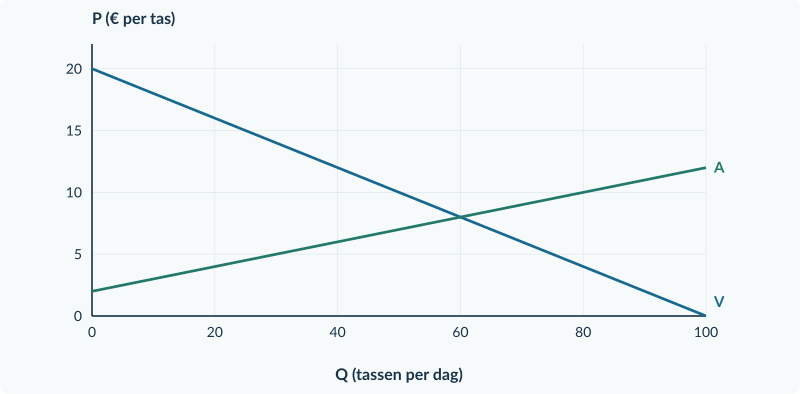

# 3.1.1 · Belastingen: wig en nieuw evenwicht

Revision: `book34-lesson-balance-v3-20260915`. Exercise 7. Candidate: independent approval not conferred.

## Doeloefening

<b>Opgave 7 · Bedrukte tassen</b>

Verschillende aanbieders verkopen dezelfde soort bedrukte tas. Vraag: Pc = 20 − 0,20Q. Aanbod: Pp = 2 + 0,10Q. Q is tassen per dag; prijzen zijn euro per tas. De overheid heft € 3 per verkochte tas. De verkopers dragen de belasting af. De andere marktomstandigheden blijven gelijk.

<b>a.</b> Bereken de vrije evenwichtsprijs en -hoeveelheid.

<b>b.</b> Stel na invoering van de belasting het aanbod in kopersprijzen op. Bereken de nieuwe hoeveelheid.

<b>c.</b> Bereken de prijs die kopers betalen en het bedrag dat verkopers na afdracht ontvangen.

<b>d.</b> Teken de nieuwe aanbodlijn in de basisgrafiek. Markeer de nieuwe hoeveelheid, beide prijzen en de belastingwig.

<b>e.</b> Een verkoper zegt: “Wij dragen alles af; dus wij dragen ook de hele economische last.” Beoordeel met de oude en nieuwe prijzen.

<figure><figcaption>Figuur 5. Basisgrafiek bij de doeloefening. Gebruik V voor de kopersprijs en de oorspronkelijke A voor de verkopersontvangst.</figcaption></figure>

<b>Controle vóór je inlevert</b> Staan beide prijzen bij dezelfde Q? Is hun verschil precies € 3? Heeft de hoeveelheid de juiste eenheid?

# Antwoorden

<b>a.</b> 20 − 0,20Q = 2 + 0,10Q → 18 = 0,30Q → Q₀ = <b>60 tassen per dag</b>. P₀ = 20 − 0,20 × 60 = <b>€ 8 per tas</b>.

<b>Waarom:</b> Zonder belasting zijn vraag en aanbod gelijk bij één prijs.

<b>b.</b> Pc = Pp + 3 = <b>5 + 0,10Q</b>. 20 − 0,20Q = 5 + 0,10Q → 15 = 0,30Q → Qt = <b>50 tassen per dag</b>.

<b>Waarom:</b> De € 3 wordt aan de aanbodfunctie in kopersprijzen toegevoegd.

<b>c.</b> Pc = 20 − 0,20 × 50 = <b>€ 10</b>. Pp = 2 + 0,10 × 50 = <b>€ 7 per tas</b>. Controle: 10 − 7 = € 3.

<b>Waarom:</b> De prijzen horen bij dezelfde 50 verkochte tassen.

<b>d.</b> Teken A + t met prijsas-snijding € 5. Markeer (50; 10) op V en (50; 7) op A; verbind de punten verticaal.

<b>Waarom:</b> Op A + t lees je niet af wat na afdracht voor de verkoper overblijft.

<b>e.</b> Onjuist. De koper betaalt 10 − 8 = <b>€ 2 meer</b>; de verkoper houdt 8 − 7 = <b>€ 1 minder</b> over. De verkoper draagt € 3 af, maar draagt economisch € 1 per tas.

<b>Waarom:</b> Afdragen is een betalingshandeling; dragen vergelijkt met de oude prijs.

<figure><figcaption>Opgave 7: kopers betalen € 10, verkopers ontvangen € 7; er worden 50 tassen verkocht.</figcaption></figure>