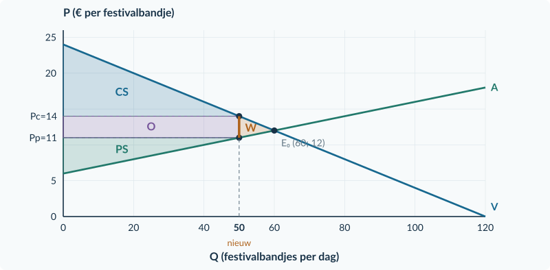
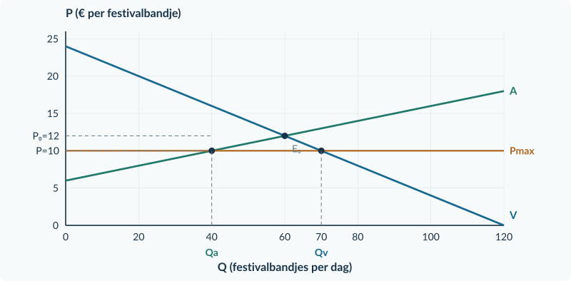

# 3.1.6 · Gemengde opgaven: overheidsingrijpen

Revision: `book34-lesson-balance-v3-20260915`. Exercise 48. Candidate: independent approval not conferred.

## Doeloefening

<b>Opgave 48 · Twee plannen voor festivalbandjes</b> 
Een gemeente onderzoekt de markt voor eenvoudige festivalbandjes. Verschillende aanbieders verkopen hetzelfde product. Alle bedragen en voorstellen zijn fictief.

### Bron 1 · De markt zonder maatregel

Vraag: **Pc = 24 − 0,20Q**. Aanbod: **Pp = 6 + 0,10Q**. Q is bandjes per dag; Pc en Pp zijn euro per bandje. Zonder maatregel is Pc = Pp. Het CS in het vrije evenwicht is € 360 per dag; het PS is € 180 per dag.

### Bron 2 · Twee alternatieven, niet tegelijk

**Plan A.** De aanbieder draagt € 3 af per verkocht bandje. Er zijn geen andere geldstromen of effecten voor buitenstaanders. Ook uitvoeringskosten blijven buiten beschouwing.

**Plan B.** Een verkoopprijs boven € 10 is verboden. Er is geen extra aanvoer. Alle aangeboden bandjes worden verkocht aan de vragers met de hoogste betalingsbereidheid. Er is geen belasting, subsidie of overheidsopkoop.

### Bron 3 · De beleidsclaim

“Plan B maakt een bandje bereikbaar voor iedereen die er bij € 10 een wil. Plan A levert de overheid geld op; dat geld is volledig verdwenen welvaart.”

<figure><figcaption>Figuur 1. Basisgrafiek bij opgave 48. Gebruik deze voor plan A. De plannen zijn alternatieven: pas ze niet tegelijk toe.</figcaption></figure>

De vragen staan op de tegenoverliggende pagina. Voor plan B volstaan berekeningen en een conclusie; je hoeft geen tweede grafiek te tekenen.

<b>Opgave 48 · Vragen</b>

Gebruik de bronnen en de grafiek op pagina 46. Noteer berekening, eenheid en conclusie.

<b>a.</b> Benoem de maatregelen van plan A en B. Bereken met bron 1 het vrije evenwicht.

<b>b.</b> Bereken voor plan A het nieuwe aanbod in kopersprijzen, de verkochte hoeveelheid, Pc en Pp. Noteer de economische last per bandje voor kopers en verkopers.

<b>c.</b> Bereken bij plan A de overheidsontvangsten, CS, PS en het welvaartsverlies. Gebruik de oorspronkelijke vraag- en aanbodlijn voor de surplusgebieden.

<b>d.</b> Markeer in de basisgrafiek de twee prijzen en de nieuwe hoeveelheid van plan A. Arceer de overheidsontvangsten en het welvaartsverlies verschillend. Benoem beide gebieden.

<b>e.</b> Bereken voor plan B Qv, Qa, werkelijke verkopen en tekort. Controleer eerst of de prijsregel bindt.

<b>f.</b> Beoordeel beide delen van de beleidsclaim uit bron 3. Gebruik minstens één berekening per deel. Geef daarna één verschil tussen de plannen dat voor kopers van belang is; trek geen niet-berekende algemene welvaartsconclusie over plan B.

### Kijk na je berekeningen terug

| Controle | Wat je in je antwoord moet kunnen aanwijzen |
|---|---|
| Modelkeuze | Plan A heeft twee prijzen; plan B één begrensde prijs. |
| Transacties | Geen berekening van budget of surplus over onverkochte bandjes. |
| Geldstroom | Overheidsontvangsten zijn niet volledig welvaartsverlies. |
| Bronconclusie | Een tekort beperkt toegang; een lage prijs garandeert geen aankoop. |

<b>Een onderbouwde conclusie</b> Een bruikbaar antwoord combineert een brongegeven, een berekening en een gevolg. Bijvoorbeeld: “Omdat er maar … bandjes worden aangeboden, kunnen niet alle … vragers kopen.” Vul de getallen zelf in.

# Antwoorden

<b>a.</b> A is een belasting per product; B een maximumprijs. Vrij evenwicht: 24 − 0,20Q = 6 + 0,10Q → 18 = 0,30Q → Q₀ = <b>60 bandjes per dag</b>. P₀ = 24 − 0,20 × 60 = <b>€ 12 per bandje</b>.

<b>Waarom:</b> Eerst identificeer je het mechanisme; daarna kies je de rekenroute.

<b>b.</b> Bij A: Pc = 9 + 0,10Q. 24 − 0,20Q = 9 + 0,10Q → Qt = <b>50</b>. Pc = 24 − 0,20 × 50 = <b>€ 14</b>; Pp = 6 + 0,10 × 50 = <b>€ 11</b>. Koperslast = 14 − 12 = <b>€ 2</b>; verkoperslast = 12 − 11 = <b>€ 1 per bandje</b>.

<b>Waarom:</b> Pc − Pp is precies de belasting van € 3.

<b>c.</b> O = 3 × 50 = <b>€ 150 per dag</b>. CS = ½ × 50 × (24 − 14) = <b>€ 250</b>. PS = ½ × 50 × (11 − 6) = <b>€ 125</b>. Nieuwe welvaartsmaat = 250 + 125 + 150 = <b>€ 525</b>. Oud = 360 + 180 = € 540. W = 540 − 525 = <b>€ 15 per dag</b>.

<b>Waarom:</b> Overheidsontvangsten tellen mee in de maat; ze zijn geen verdwenen geld.

<b>d.</b> Qt = 50; Pc = € 14; Pp = € 11. O is de rechthoek van Q = 0 tot 50 tussen P = 11 en 14. W ligt tussen Q = 50 en Q = 60: ½ × 10 × 3 = € 15.

<b>Waarom:</b> O gebruikt de overblijvende verkopen; W de gemiste voordelige transacties.

<b>e.</b> Bij B bindt € 10, want het ligt onder € 12. 10 = 24 − 0,20Qv → Qv = <b>70</b>. 10 = 6 + 0,10Qa → Qa = <b>40</b>. Verkopen = <b>40</b>; tekort = 70 − 40 = <b>30 bandjes per dag</b>.

<b>Waarom:</b> Geen extra aanvoer betekent dat niet alle vragers kunnen kopen.

<b>f.</b> Beide delen zijn onjuist. Bij B willen 70 mensen een bandje, maar er worden 40 verkocht: 30 vragers krijgen er geen. Bij A ontvangt de overheid € 150, terwijl W € 15 is. Een onderbouwd verschil: kopers die onder B kunnen kopen betalen € 10 in plaats van € 14 onder A, maar er worden ook 40 in plaats van 50 bandjes verkocht. Er volgt hier geen volledige welvaartsrangschikking van beide plannen.

<b>Waarom:</b> Een conclusie benoemt zowel prijs als toegang en onderscheidt een overdracht van een verlies.

<figure><figcaption>Opgave 48, plan A: O = € 150 en W = € 15 per dag.</figcaption></figure>
<figure><figcaption>Opgave 48, plan B: Qv = 70, Qa = 40, verkoop 40 en tekort 30. Deze tweede grafiek was niet verplicht.</figcaption></figure>