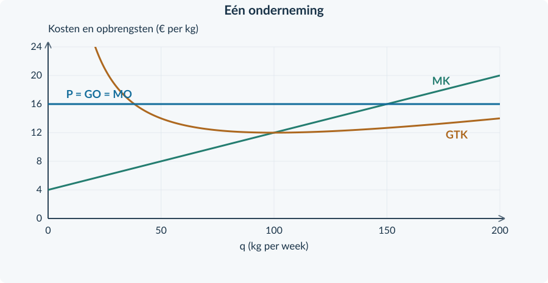
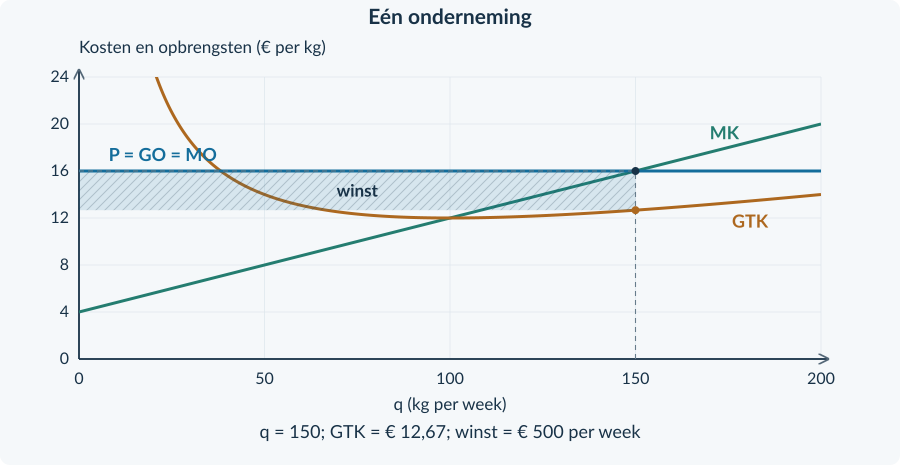

# 3.2.3 · Winstmaximalisatie bij volkomen concurrentie

Revision: `book34-lesson-balance-v3-20260915`. Exercise 27. Candidate: independent approval not conferred.

## Doeloefening

<b>Opgave 27 · Korrels voor kwekerijen</b>

Een prijsnemende producent verkoopt één standaardkwaliteit korrels. P = € 16 per kg. TK = 0,04q² + 4q + 400. q is kg per week, TK is euro per week. Capaciteit: 200 kg. De € 400 is deze week onvermijdbaar.

<b>a.</b> (2p) Stel de functie voor MK op.

<b>b.</b> (3p) Bepaal de winstmaximale haalbare q. Onderbouw het maximum met MK links en rechts van je uitkomst.

<b>c.</b> (3p) Bereken TO, TK en totale winst bij de gekozen q.

<b>d.</b> (3p) Bereken GTK en geef in de grafiek q en de winstrechthoek aan. Benoem breedte en hoogte.

<b>e.</b> (1p) Vergelijk de winst met niet produceren (q = 0).

<b>f.</b> (2p) Door een storing wordt de capaciteit 120 kg. Kostenfunctie en prijs blijven gelijk. Welke q kies je nu? Licht toe; een nieuwe winstberekening is niet nodig.

<figure><figcaption>Figuur 8. Alle verticale bedragen zijn per kg. De horizontale as geeft de productie per week.</figcaption></figure>

# Antwoorden

<b>a.</b> 0,04q² → 0,08q; 4q → 4; 400 → 0. Dus <b>MK = 0,08q + 4</b>.

<b>Waarom:</b> De afgeleide beschrijft de kostenstijging per extra kg in het doorlopende model.

<b>b.</b> MO = 16. 16 = 0,08q + 4 → 12 = 0,08q → <b>q = 150 kg per week</b>. Bij q = 125 is MK = 14; bij 175 is MK = 18. MK stijgt van onder naar boven MO. 150 ≤ 200.

<b>Waarom:</b> De winst stijgt vóór 150 en daalt erna; de kandidaat is haalbaar.

<b>c.</b> TO = 16 × 150 = <b>€ 2.400</b>. TK = 0,04 × 150² + 4 × 150 + 400 = 900 + 600 + 400 = <b>€ 1.900</b>. Winst = <b>€ 500 per week</b>.

<b>Waarom:</b> Trek alle kosten af van de opbrengst, inclusief de € 400 constante kosten.

<b>d.</b> GTK = 1.900 / 150 = <b>€ 12,666… per kg</b>, afgerond € 12,67. Breedte = 150 kg/week; hoogte = 16 − 12,666… = € 3,333…/kg. Winstoppervlakte = <b>€ 500/week</b>.

<b>Waarom:</b> Rond GTK niet af vóór de oppervlakteberekening. Gebruik anders rechtstreeks TO − TK.

<b>e.</b> Bij q = 0: TO = 0, TK = 400 en winst = <b>−€ 400 per week</b>. € 500 is hoger dan −€ 400.

<b>Waarom:</b> De constante kosten zijn deze week ook bij niet produceren onvermijdbaar.

<b>f.</b> Kies <b>q = 120 kg per week</b>. Het snijpunt bij 150 is onhaalbaar. Bij 120 is MK = 0,08 × 120 + 4 = € 13,60 per kg, nog steeds lager dan MO = 16.

<b>Waarom:</b> De winst stijgt tot de nieuwe grens; daarom wordt de capaciteit benut.

<figure><figcaption>Oplossing doeloefening 27d. De hoogte is € 3,333… per kg, niet € 16 per kg.</figcaption></figure>