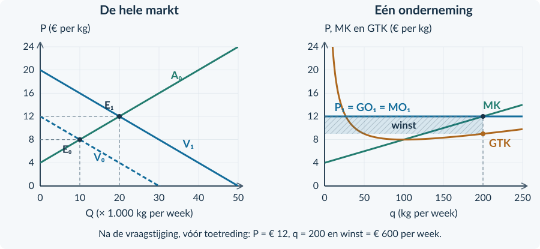

# 3.2.4 · Gemengde opgaven: de prijsnemende onderneming

Revision: `book34-lesson-balance-v3-20260915`. Exercise 35. Candidate: independent approval not conferred.

## Doeloefening
### Opgave 35 · Kweekkorrels op twee momenten

<b>Bron A · De markt</b> Veel kleine bedrijven verkopen dezelfde kwaliteit kweekkorrels. Kopers kennen de prijzen. In de beginsituatie geldt: <b>Qv₀ = 30.000 − 2.500P</b> en <b>Qa₀ = 2.500P − 10.000</b>. Door een nieuwe toepassing neemt de vraag toe tot <b>Qv₁ = 50.000 − 2.500P</b>. In de onderzochte korte periode verandert het aantal bedrijven niet: Qa₀ blijft gelden. Q is kg per week; P is euro per kg.

<b>Bron B · Eén onderneming</b> Voor iedere onderneming geldt <b>TK = 0,02q² + 4q + 200</b>. q is kg per week; capaciteit is 250 kg. Alle productie wordt verkocht. 

<figure><figcaption>Figuur 1. Gebruik deze basisgrafieken. Markt: V₀, V₁ en A₀. Onderneming: MK en GTK.</figcaption></figure>

De vragen staan op de rechterpagina. Gebruik eerst de beginsituatie en daarna de situatie direct na de vraagverandering. Laat tussenresultaten staan.

<b>Opgave 35 · Kweekkorrels: van markt naar bedrijf</b>

Gebruik bronnen A en B en figuur 1 op de linkerpagina.

<b>a.</b> (3p) Bereken in de beginsituatie P₀ en Q₀. Eén onderneming kiest dan q = 100. Controleer met TO en TK dat haar winst nul is.

<b>b.</b> (2p) Bereken direct na de vraagstijging, bij het gegeven ongewijzigde aanbod, P₁ en Q₁. Markeer het nieuwe evenwicht E₁ in de marktgrafiek.

<b>c.</b> (3p) Stel MK op. Bepaal bij P₁ de winstmaximale q van één onderneming. Controleer de capaciteit en het verloop van MO en MK.

<b>d.</b> (3p) Bereken de winst en GTK bij die q. Teken rechts de nieuwe P = GO = MO-lijn en arceer de winstrechthoek.

<b>e.</b> (2p) Vergelijk de procentuele stijging van Q met die van q. Waarom zijn Q en q ondanks die vergelijking niet dezelfde grootheid?

<b>Afronden</b> Bereken met ongeronde tussenuitkomsten. Schrijf bij iedere hoeveelheid of deze bij de markt of één onderneming hoort. De ruimte hieronder kun je gebruiken voor je redenering.

# Antwoorden

<b>a.</b> 30.000 − 2.500P = 2.500P − 10.000 → 40.000 = 5.000P → <b>P₀ = € 8/kg</b>. Q₀ = 2.500 × 8 − 10.000 = <b>10.000 kg/week</b>. Bij q = 100: TO = 8 × 100 = € 800; TK = 0,02 × 100² + 4 × 100 + 200 = € 800. Winst = <b>€ 0/week</b>.

<b>Waarom:</b> De beginsituatie is voor de onderneming kostendekkend.

<b>b.</b> 50.000 − 2.500P = 2.500P − 10.000 → 60.000 = 5.000P → <b>P₁ = € 12/kg</b>. Q₁ = 2.500 × 12 − 10.000 = <b>20.000 kg/week</b>. E₁ ligt op (20.000; 12).

<b>Waarom:</b> Direct na de vraagstijging geldt nog hetzelfde aanbod: het aantal bedrijven is gelijk gebleven.

<b>c.</b> MK = <b>0,04q + 4</b>. 12 = 0,04q + 4 → <b>q = 200 kg/week</b>. 200 ≤ 250. Bij q = 150 is MK = 10; bij q = 250 is MK = 14.

<b>Waarom:</b> De winst stijgt vóór 200 en daalt erna; de gekozen q is haalbaar.

<b>d.</b> TO = 12 × 200 = € 2.400. TK = 0,02 × 200² + 4 × 200 + 200 = 800 + 800 + 200 = € 1.800. Winst = <b>€ 600/week</b>. GTK = 1.800 / 200 = <b>€ 9/kg</b>. Rechthoek: breedte 200, hoogte 12 − 9 = 3.

<b>Waarom:</b> De opbrengstlijn in de ondernemingsgrafiek ligt op P = 12; de winst is een oppervlak, geen snijpunt.

<b>e.</b> Q stijgt van 10.000 naar 20.000: <b>100%</b>. q stijgt van 100 naar 200: eveneens <b>100%</b>. Q beschrijft alle ondernemingen samen en q één bedrijf. Gelijke procentuele verandering maakt de niveaus of economische objecten niet gelijk.

<figure><figcaption>Doeloefening 35b–d. De nieuwe vraag verhoogt eerst P en de productie van de bestaande ondernemingen.</figcaption></figure>