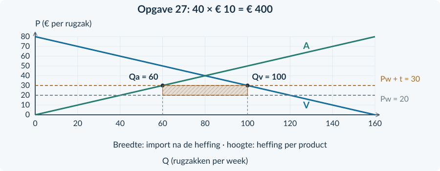

# 3.3.3 · Protectionisme: invoerheffingen en importquota

Revision: `book34-lesson-balance-v3-20260915`. Exercise 27. Candidate: independent approval not conferred.

## Doeloefening

<b>Lesbron · Schoolrugzakken in Daro</b> Daro is klein en prijsnemend. Er zijn veel concurrerende aanbieders van gelijkwaardige rugzakken. Transportkosten en effecten op derden ontbreken. De wereldprijs is € 20. Daro heft € 10 per ingevoerde rugzak, afgedragen door importeurs. Er blijft import. De minister wil meer binnenlandse productie. Winkeliers vrezen hogere prijzen voor scholieren. Een alternatief is een quotum met gratis vergunningen, zonder heffing.

| Situatie | Prijs | Verbruik per week | Productie per week |
|---|---:|---:|---:|
| Vrije invoer | € 20 | 120 | 40 |
| Met heffing | € 30 | 100 | 60 |
<figure><figcaption>Figuur 6. De lijnen en prijzen zijn gegeven. Teken alleen de gevraagde opbrengstrechthoek; niet opnieuw de markt.</figcaption></figure>

<b>Opgave 27 · Doel, berekening en verdeling</b>

Gebruik de lesbron, tabel en figuur 6.

<b>a.</b> (3p) Bereken de import na de heffing en de heffingsopbrengst per week.

<b>b.</b> (2p) Arceer in figuur 6 de heffingsopbrengst. Benoem de breedte en hoogte met eenheid.

<b>c.</b> (2p) Leg met gegevens uit waarom binnenlandse producenten en kopers verschillend worden geraakt.

<b>d.</b> (2p) Beoordeel: “Het productiedoel wordt bereikt, dus de maatregel is voor iedereen gunstig.”

<b>e.</b> (2p) Waarom levert het beschreven alternatieve quotum niet dezelfde overheidsopbrengst op?

# Antwoorden

<b>a.</b> Import = 100 − 60 = <b>40 rugzakken per week</b>. Heffingsopbrengst = 10 × 40 = <b>€ 400 per week</b>. <i>Waarom:</i> De heffing wordt alleen over de resterende import ontvangen.

<b>b.</b> Arceer de rechthoek tussen Q = 60 en Q = 100, en P = € 20 en P = € 30. Breedte: <b>40 rugzakken per week</b>; hoogte: <b>€ 10 per rugzak</b>. <i>Waarom:</i> Hoeveelheid per week maal euro per rugzak geeft euro per week.

<b>c.</b> Binnenlandse producenten ontvangen € 30 in plaats van € 20 en leveren 60 in plaats van 40 rugzakken. Kopers betalen meer en gebruiken 100 in plaats van 120 rugzakken. <i>Waarom:</i> De hogere binnenlandse prijs werkt in tegengestelde richting op aanbod en vraag.

<b>d.</b> Het productiedoel wordt ondersteund door de stijging van 40 naar 60. Maar scholieren betalen meer, zodat “voor iedereen gunstig” niet volgt. <i>Waarom:</i> Een doel over productie is niet hetzelfde als een oordeel over alle groepen.

<b>e.</b> Het alternatief geeft vergunningen gratis en heft geen invoerheffing. Er is dus geen vergelijkbare betaling per ingevoerde rugzak aan de overheid. <i>Waarom:</i> Zelfs bij dezelfde importhoeveelheid hoeft de opbrengst niet dezelfde te zijn.

<figure><figcaption>Antwoordfiguur bij opgave 27. De rechthoek heeft een oppervlakte van € 400 per week.</figcaption></figure>