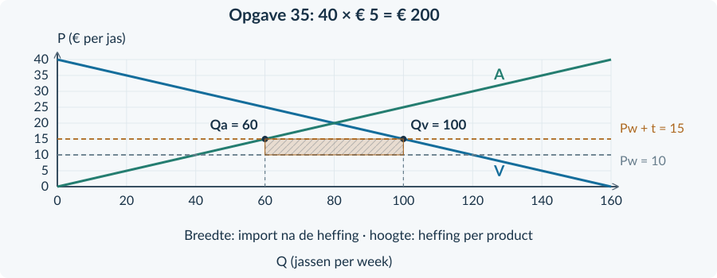

# 3.3.4 · Gemengde opgaven: internationale handel

Revision: `book34-lesson-balance-v3-20260915`. Exercise 35. Candidate: independent approval not conferred.

## Doeloefening

OPGAVE 35 · REGENJASSEN IN NERIN · BRONNEN

<b>Bron A · Productie en specialisatie</b> Nerin en Pelta maken machines en regenjassen van dezelfde kwaliteit. Nerin gebruikt voor beide minder middelen. Het voordeel bij machines is groot; bij jassen klein. Voor extra jassen geeft Nerin relatief veel machineproductie op. Pelta geeft daarvoor minder machines op. Beide landen kunnen hun productiemiddelen voor beide activiteiten gebruiken.

<b>Bron B · Markt en maatregel</b> Nerin is klein en prijsnemend. De markt kent concurrentie, voldoende buitenlandse levering, geen transportkosten en geen effecten op derden. Alle prijzen zijn in euro. De wereldprijs is € 10. Nerin heft € 5 per ingevoerde jas, afgedragen door importeurs. Er blijft import. De minister wil binnenlandse productie behouden. Een winkelier wijst op duurdere regenkleding voor gezinnen.

| Situatie | Prijs per jas | Binnenlands verbruik | Binnenlandse productie |
|---|---:|---:|---:|
| Vrije invoer | € 10 | 120 | 40 |
| Met heffing | € 15 | 100 | 60 |

Alle hoeveelheden zijn regenjassen per week.

<figure><figcaption>Figuur 3. De binnenlandse regenjassenmarkt. De twee prijslijnen zijn gegeven; de heffingsopbrengst is nog niet aangegeven.</figcaption></figure>
<b>Bron C · Een alternatief</b> Een voorstel wil de invoer begrenzen met een importquotum. De overheid geeft de invoervergunningen gratis weg en heft geen invoerheffing.

De vragen staan op de tegenoverliggende pagina.

Doeloefening · vervolg

<b>Opgave 35 · Regenjassen in Nerin</b>

Gebruik de drie bronnen, de tabel en figuur 3 op pagina 34. Noteer bij berekeningen de eenheden en bij uitleg het gebruikte brongegeven.

<b>a.</b> (3p) Leg met bron A uit waarom Pelta een comparatief voordeel kan hebben bij regenjassen, terwijl Nerin bij beide activiteiten een absoluut voordeel heeft.

<b>b.</b> (3p) Bereken met bron B de import na de heffing en de heffingsopbrengst per week.

<b>c.</b> (3p) Leg met prijs én hoeveelheid uit wat de maatregel betekent voor binnenlandse jassenmakers en binnenlandse kopers.

<b>d.</b> (2p) Arceer de heffingsopbrengst in figuur 3. Benoem de breedte en hoogte met hun eenheden.

<b>e.</b> (2p) Waarom mag de overheid bij het quotum uit bron C niet zonder meer dezelfde ontvangsten verwachten?

<b>f.</b> (3p) De minister zegt: “De binnenlandse productie stijgt, dus de heffing is voor alle inwoners gunstig.” Geef een oordeel met twee concrete gegevens uit de bronnen of tabel. Maak duidelijk welke conclusie wél wordt ondersteund.

### Controle vóór het inleveren
Je hebt niet opnieuw alle surplusgebieden hoeven uitrekenen. Je moet wel uitleggen welke groepen een hogere prijs ontvangen of juist betalen.

Controleer je eigen werk: heb je alleen de <b>ingevoerde</b> jassen belast? En heb je bij het comparatieve voordeel uitgelegd wat Pelta relatief minder opgeeft?

<b>Een goede eindzin</b> Een sterke conclusie kan een beleidseffect erkennen én een te brede uitspraak afwijzen. Dat is geen tegenspraak.

# Antwoorden

<b>a.</b> Pelta offert voor extra jassen minder machineproductie op. Het heeft dus lagere alternatieve kosten van jassen, ook al gebruikt Nerin absoluut minder middelen voor beide producten. <i>Waarom:</i> De bron maakt het verschil tussen absoluut en comparatief voordeel expliciet.

<b>b.</b> Import = 100 − 60 = <b>40 jassen per week</b>. Opbrengst = 5 × 40 = <b>€ 200 per week</b>. <i>Waarom:</i> De import na de heffing bepaalt de ontvangsten.

<b>c.</b> Jassenmakers ontvangen € 15 in plaats van € 10 en produceren 60 in plaats van 40 jassen. Kopers betalen € 5 meer en gebruiken 100 in plaats van 120. <i>Waarom:</i> De stijgende binnenlandse prijs helpt aanbieders en benadeelt gebruikers.

<b>d.</b> Rechthoek van Q = 60 tot 100 en van P = € 10 tot 15. Breedte = <b>40 jassen per week</b>; hoogte = <b>€ 5 per jas</b>. <i>Waarom:</i> Deze oppervlakte is heffing maal ingevoerde hoeveelheid.

<b>e.</b> Volgens bron C zijn de vergunningen gratis en is er geen invoerheffing. De overheid ontvangt dus niet hetzelfde bedrag per ingevoerde jas. <i>Waarom:</i> Een importgrens creëert niet automatisch belastingontvangsten.

<b>f.</b> Het productiedoel wordt ondersteund: productie stijgt van 40 naar 60. Maar gezinnen betalen € 15 in plaats van € 10 per jas. De conclusie “voor alle inwoners gunstig” is daarom te breed. <i>Waarom:</i> De twee concrete gegevens laten zien dat doelbereik en gevolgen voor alle groepen niet samenvallen.

<figure><figcaption>Antwoordfiguur bij opgave 35. Alleen de 40 ingevoerde jassen bepalen de breedte.</figcaption></figure>