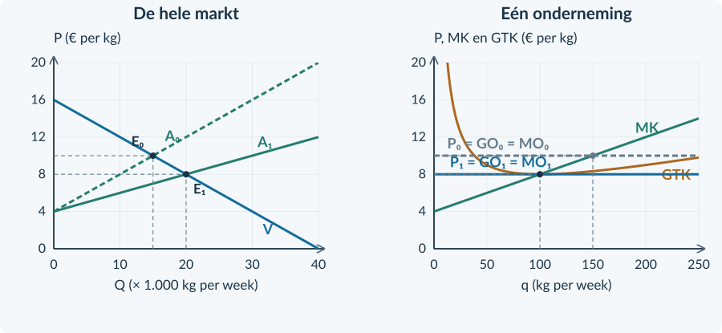

# 4.1.1 · Toetreding, uittreding en langetermijnevenwicht

Revision: `book34-lesson-balance-v3-20260915`. Exercise 7. Candidate: independent approval not conferred.

## Doeloefening

<b>Opgave 7 · Standaard koffiebonen</b>

In deze oefenmarkt gebruiken alle bedrijven TK = 0,02q² + 4q + 200. q is kg per week; capaciteit is 250 kg. TK bevat alle kosten, inclusief € 120 normale ondernemersbeloning per week. Toetreding is vrij. Marktvraag, technologie en inputprijzen blijven gelijk. Het minimum GTK is € 8 bij q = 100.

<b>a.</b> (3p) Lees de beginprijs af. Stel MK op, bepaal q en bereken de economische winst van één bedrijf.

<b>b.</b> (2p) Leg uit waarom er bedrijven toetreden en hoe dit de prijs beïnvloedt.

<b>c.</b> (2p) Teken in de marktgrafiek een passende A₁ voor de langetermijnprijs. Teken rechts de bijbehorende P = GO = MO-lijn. Laat de kostencurven staan.

<b>d.</b> (3p) Bepaal de langetermijnprijs en q. Bereken TO en TK en controleer de economische winst.

<b>e.</b> (2p) Een leerling zegt: “Met nul winst verdient de ondernemer niets en is de omzet verdwenen.” Weerleg beide delen met de gegevens.

<figure><figcaption>Figuur 7. Geef de langetermijnaanpassing aan, onder de aannames van de bron.</figcaption></figure>

# Antwoorden

<b>a.</b> Afgelezen beginprijs: <b>€ 10 per kg</b>. MK = 0,04q + 4. 10 = 0,04q + 4 → q = <b>150 kg/week</b>, haalbaar binnen 250. TO = 10 × 150 = € 1.500. TK = 0,02 × 150² + 4 × 150 + 200 = 450 + 600 + 200 = € 1.250. Economische winst = <b>€ 250/week</b>.

<b>Waarom:</b> De prijs ligt boven GTK bij de gekozen q.

<b>b.</b> Die overwinst trekt aanbieders aan. Bij elke prijs neemt het marktaanbod toe. Bij gelijkblijvende vraag daalt daardoor de marktprijs.

<b>Waarom:</b> Nieuwe bedrijven kunnen dezelfde kostentechniek gebruiken.

<b>c.</b> Teken A₁ rechts van A en laat die V snijden bij P = 8. Rechts komt P = GO = MO = 8. MK en GTK blijven staan.

<b>Waarom:</b> Het aantal aanbieders en de prijs veranderen; de kostenfuncties zijn volgens de bron ongewijzigd.

<b>d.</b> P = <b>€ 8 per kg</b> en q = <b>100 kg/week</b>. TO = 8 × 100 = <b>€ 800/week</b>. TK = 0,02 × 100² + 4 × 100 + 200 = 200 + 400 + 200 = <b>€ 800/week</b>. Winst = <b>€ 0/week</b>.

<b>Waarom:</b> Bij minimum GTK is de prijs precies voldoende voor alle economische kosten.

<b>e.</b> De omzet is nog <b>€ 800/week</b>, niet nul. In TK zit nog <b>€ 120 normale ondernemersbeloning/week</b>. Alleen de extra economische winst is verdwenen.

<b>Waarom:</b> Nul economische winst is een verschil tussen twee gelijke positieve totaalbedragen.

<figure><figcaption>Oplossing doeloefening 7. Meer totale afzet, maar minder afzet van één bedrijf.</figcaption></figure>