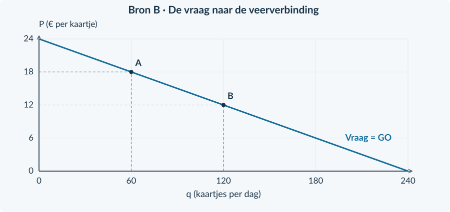
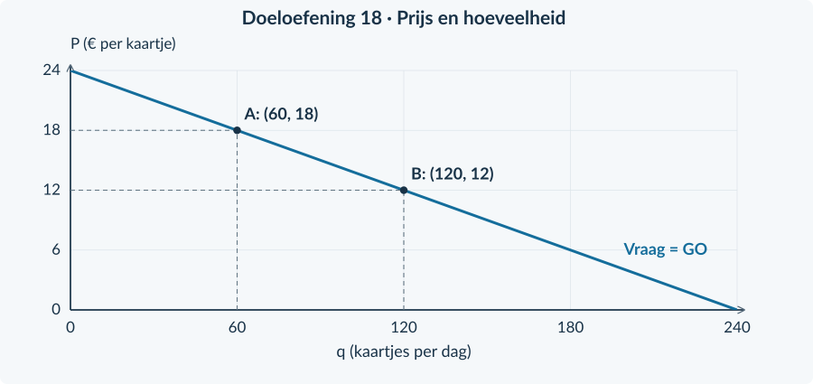

# 4.1.2 · Monopolie: kenmerken

Revision: `book34-lesson-balance-v3-20260915`. Exercise 18. Candidate: independent approval not conferred.

## Doeloefening

<b>Bron A · Eilandveer</b> Voor de directe verbinding tussen Haven en Eiland heeft Eilandveer als enige een vergunning. In de onderzochte periode krijgt geen ander bedrijf toegang. Reizigers kunnen hun reis wel uitstellen of afzien van de overtocht. Alle kaartjes in een gekozen situatie hebben dezelfde prijs. De capaciteit is 240 kaartjes per dag.

<b>Bron B · Vraag</b> P = 24 − 0,10q. P is euro per kaartje; q is kaartjes per dag, van 0 tot 240. Overige vraagfactoren blijven gelijk.

<b>Opgave 18 · Eilandveer</b>

Gebruik beide bronnen en figuur 4.

<b>a.</b> (2p) Welk gegeven vormt hier een toetredingsbarrière? Leg uit waarom dit een monopolie op de beschreven verbinding ondersteunt.

<b>b.</b> (2p) Noem twee verschillen met volkomen concurrentie: één over toetreding en één over de vraaglijn van de onderneming.

<b>c.</b> (2p) Bereken de prijs bij punt A met q = 60 en bij punt B met q = 120.

<b>d.</b> (2p) De eigenaar wil 120 kaartjes verkopen voor € 18. Is dat volgens de bron haalbaar? Onderbouw met de vraagfunctie.

<b>e.</b> (2p) Beoordeel: “Zonder concurrenten kan ik elke prijs vragen én dezelfde afzet houden.” Gebruik de bron om je antwoord te begrenzen.

<figure><figcaption>Figuur 4. Gebruik de lijn om de berekende combinaties te controleren.</figcaption></figure>

# Antwoorden

<b>a.</b> Alleen Eilandveer krijgt in de onderzochte periode de vergunning. Andere bedrijven krijgen geen toegang. Dit is een <b>toetredingsbarrière</b> en ondersteunt één aanbieder op de afgebakende directe verbinding.

<b>b.</b> Bij volkomen concurrentie is toetreding vrij; hier verhindert een exclusieve vergunning toetreding. Eén kleine prijsnemer heeft een horizontale vraaglijn bij de marktprijs; de monopolist bedient de hele markt en heeft hier een dalende vraaglijn.

<b>c.</b> P(60) = 24 − 0,10 × 60 = <b>€ 18 per kaartje</b>. P(120) = 24 − 12 = <b>€ 12 per kaartje</b>.

<b>d.</b> Nee. Bij € 18 geldt 18 = 24 − 0,10q → q = <b>60 kaartjes</b>. De gewenste 120 kaartjes vragen volgens de functie om € 12 per kaartje. De capaciteit is niet het probleem: 120 ligt onder 240.

<b>e.</b> De uitspraak is onjuist. Het bedrijf heeft invloed op P, maar reizigers kunnen uitstellen of niet reizen. De bron laat zien dat een hogere prijs samengaat met minder afzet. Het alleenrecht neemt de dalende vraag niet weg.

<figure><figcaption>De combinatie (120, 18) ligt boven de vraaglijn. Wel mogelijk zijn A = (60, 18) en B = (120, 12).</figcaption></figure>