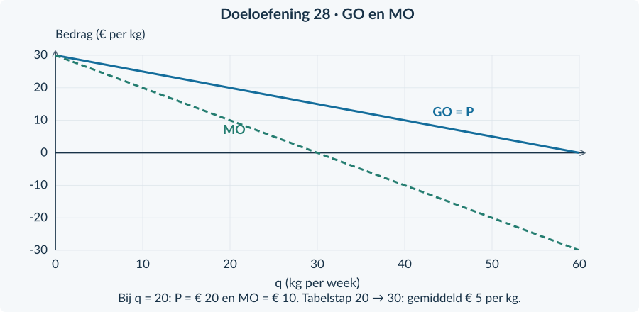

# 4.1.3 · Marginale opbrengst bij monopolie

Revision: `book34-lesson-balance-v3-20260915`. Exercise 28. Candidate: independent approval not conferred.

## Doeloefening

<b>Bron · Pigment Prisma</b> Prisma is in dit oefenmodel de enige verkoper van een specifiek pigment. De vraag is P = 30 − 0,50q, voor 0 ≤ q ≤ 60. P is euro per kg; q is kg per week. Alle kg binnen een weekplan hebben dezelfde prijs. De hoeveelheden kunnen in dit rekenmodel ook delen van een kg zijn.

<b>Opgave 28 · Pigment Prisma</b>

Gebruik de bron. Noteer bij ieder bedrag wat het meet.

<b>a.</b> (2p) Stel uit de vraagfunctie de TO-functie en de MO-functie op. Laat de tussenstap met haakjes zien.

<b>b.</b> (2p) Neem de tabel over en vul de prijzen en totale opbrengsten in.

<b>c.</b> (3p) Bereken met de tabel de gemiddelde extra opbrengst per kg van 20 naar 30 kg. Bereken daarnaast MO bij q = 20 en leg uit waarom de uitkomsten verschillen.

<b>d.</b> (3p) Bereken voor de stap van 20 naar 30 kg afzonderlijk de opbrengst van de extra kg en de lagere opbrengst op de eerste 20 kg. Controleer de netto omzettoename.

<b>e.</b> (2p) Een leerling zegt: “Bij q = 20 is de prijs € 20. Daarom moet MO ook € 20 zijn.” Beoordeel met je berekening en de uniforme prijs uit de bron.

| q (kg per week) | P (€ per kg) | TO (€ per week) |
|---:|---:|---:|
| 10 | … | … |
| 20 | … | … |
| 30 | … | … |

<b>Laat je controle zien</b> Je hebt twee manieren gebruikt om dezelfde verandering van TO te berekenen. Die moeten hetzelfde totaalbedrag opleveren. Een MO-puntwaarde en een gemiddelde over een grote stap hoeven niet gelijk te zijn.

# Antwoorden

<b>a.</b> TO = P × q = (30 − 0,50q) × q = <b>30q − 0,50q²</b>. De afgeleide is <b>MO = 30 − q</b>. TO is euro per week; MO is euro per kg.

<b>b.</b> Gebruik per rij P = 30 − 0,50q en vervolgens TO = P × q. Bij 20 kg is dat bijvoorbeeld P = 30 − 10 = € 20 en TO = 20 × 20 = € 400.

<b>c.</b> Van 20 naar 30 kg: ΔTO / Δq = (450 − 400) / (30 − 20) = <b>€ 5 per kg</b>. MO(20) = 30 − 20 = <b>€ 10 per kg</b>. De tabel geeft een gemiddelde over 10 kg. De afgeleide geldt bij het beginpunt; MO daalt tijdens de toename en bereikt nul bij 30 kg.

<b>d.</b> De 10 extra kg leveren 10 × € 15 = <b>€ 150</b> op. De eerste 20 kg leveren 20 × (€ 20 − € 15) = <b>€ 100 minder</b> op. Netto stijgt TO met 150 − 100 = <b>€ 50 per week</b>. Dat klopt met 450 − 400.

<b>e.</b> Onjuist. De verkoopprijs bij q = 20 is € 20 per kg, maar MO(20) = <b>€ 10 per kg</b>. Om iets meer te verkopen moet Prisma de uniforme prijs verlagen. Dat vermindert ook de opbrengst op de eerste hoeveelheid, waardoor MO lager is dan P.

<table>
<thead>
<tr>
<th style="text-align:right">q (kg per week)</th>
<th style="text-align:right">P (€ per kg)</th>
<th style="text-align:right">TO (€ per week)</th>
</tr>
</thead>
<tbody>
<tr>
<td style="text-align:right">10</td>
<td style="text-align:right">25</td>
<td style="text-align:right">250</td>
</tr>
<tr>
<td style="text-align:right">20</td>
<td style="text-align:right">20</td>
<td style="text-align:right">400</td>
</tr>
<tr>
<td style="text-align:right">30</td>
<td style="text-align:right">15</td>
<td style="text-align:right">450</td>
</tr>
</tbody>
</table>
<figure><figcaption>Bij dezelfde q meet GO de prijs per verkochte kg en MO de verandering van TO bij een heel kleine uitbreiding.</figcaption></figure>