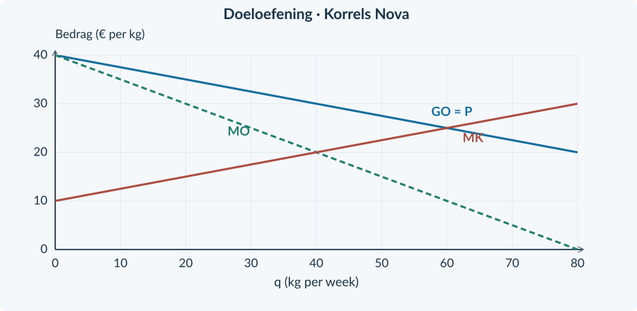
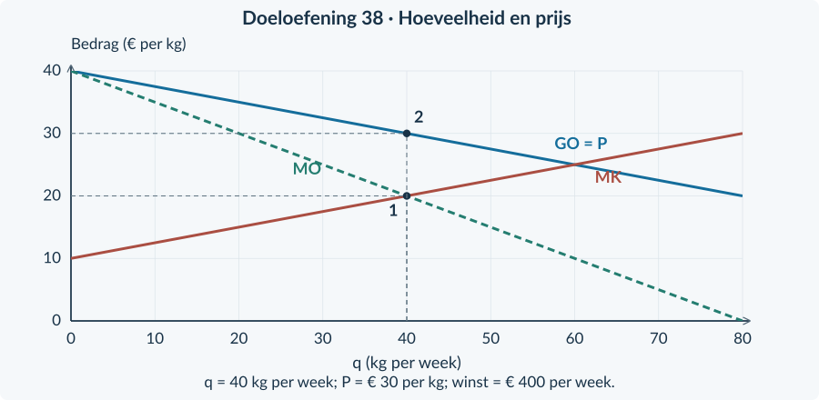
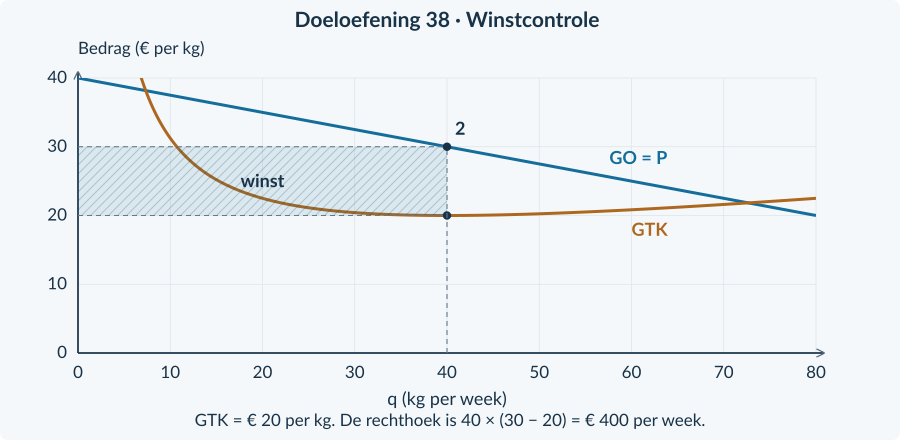

# 4.1.4 · Winstmaximalisatie bij monopolie

Revision: `book34-lesson-balance-v3-20260915`. Exercise 38. Candidate: independent approval not conferred.

## Doeloefening

<b>Bron · Korrels Nova</b> Nova is de enige aanbieder van een specifiek materiaal. Voor deze week geldt P = 40 − 0,25q en TK = 0,125q² + 10q + 200. q is kg per week; P is euro per kg; TK is euro per week. De capaciteit is 80 kg. De € 200 is ook bij q = 0 onvermijdbaar. De hoeveelheden zijn deelbaar; iedere kg heeft binnen een verkoopplan dezelfde prijs.

<b>Opgave 38 · Korrels Nova</b>

Gebruik de bron en figuur 20.

<b>a.</b> (2p) Stel TO, MO en MK op.

<b>b.</b> (3p) Bereken de winstmaximale haalbare q. Controleer het verloop van MO tegenover MK en de capaciteit.

<b>c.</b> (1p) Bereken de bijbehorende verkoopprijs.

<b>d.</b> (3p) Bereken TO, TK, winst en GTK. Controleer ook de uitkomst bij q = 0.

<b>e.</b> (2p) Markeer in de grafiek de gekozen q en P. Maak met hulplijnen zichtbaar hoe je van MO = MK naar de verkoopprijs gaat.

<b>f.</b> (2p) Een leerling gebruikt P = MK en vindt q = 60. Leg uit waarom dit niet de juiste winstkeuze is. Gebruik de marginale bedragen bij q = 60.

<figure><figcaption>Figuur 20. Teken de lijnen niet opnieuw. Voeg de gevraagde route en labels toe.</figcaption></figure>

# Antwoorden

<b>a.</b> TO = (40 − 0,25q) × q = <b>40q − 0,25q²</b>. MO = <b>40 − 0,50q</b>. Differentieer TK = 0,125q² + 10q + 200: <b>MK = 0,25q + 10</b>.

<b>b.</b> MO = MK geeft 40 − 0,50q = 0,25q + 10 → 30 = 0,75q → <b>q = 40 kg per week</b>. Dit past binnen 80 kg capaciteit. MO daalt en MK stijgt. Controle: bij q = 20 is MO = 30 &gt; MK = 15; bij q = 60 is MO = 10 &lt; MK = 25. De winst stijgt dus vóór 40 en daalt erna.

<b>c.</b> Lees P uit de vraagfunctie: P = 40 − 0,25 × 40 = <b>€ 30 per kg</b>. Niet uit MO, want MO(40) = € 20.

<b>d.</b> TO = 30 × 40 = <b>€ 1.200 per week</b>. TK = 0,125 × 40² + 10 × 40 + 200 = 200 + 400 + 200 = <b>€ 800 per week</b>. Winst = 1.200 − 800 = <b>€ 400 per week</b>. GTK = 800 / 40 = <b>€ 20 per kg</b>. Bij q = 0 is de winst −€ 200, dus niet produceren is niet beter.

<b>e.</b> De eerste hulplijn gaat vanaf het MO/MK-snijpunt naar <b>q = 40</b>. De verticale route bij q = 40 gaat vervolgens naar de GO-lijn, waarna je horizontaal <b>P = € 30</b> afleest. Zie de bovenste figuur.

<b>f.</b> Bij q = 60 geldt wel P = MK = € 25, maar <b>MO = € 10</b>. MO &lt; MK, dus een kleine vermindering van q verhoogt de winst. P = MK is niet de monopolistische winstregel. De winst bij 60 kg is bovendien 25 × 60 − (0,125 × 60² + 10 × 60 + 200) = 1.500 − 1.250 = € 250, lager dan € 400.

<figure><figcaption>De juiste route: hoeveelheid uit MO/MK, prijs uit GO.</figcaption></figure>
<figure><figcaption>Een aanvullende winstcontrole met GTK bij q = 40. Dit is dezelfde winstberekening, niet een nieuwe optimalisatieregel.</figcaption></figure>