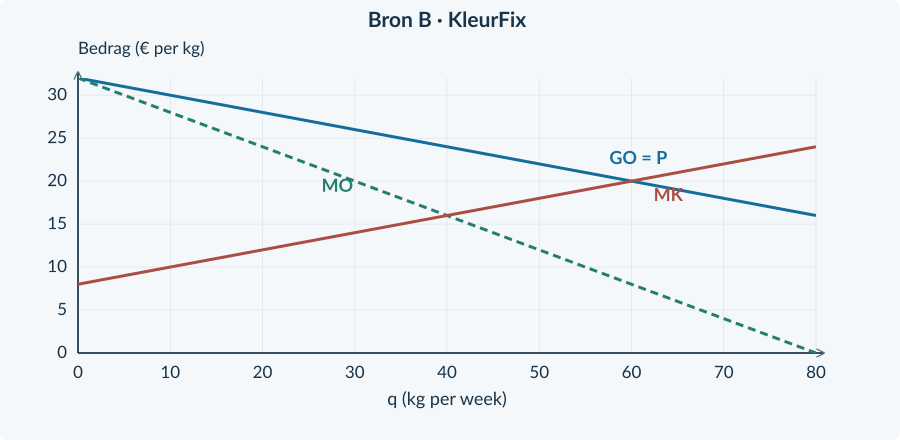
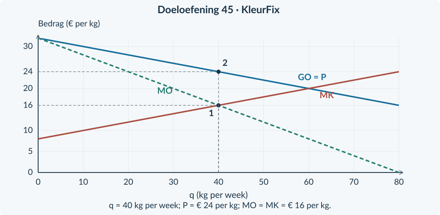

# 4.1.5 · Gemengde opgaven: concurrentie en monopolie

Revision: `book34-lesson-balance-v3-20260915`. Exercise 45. Candidate: independent approval not conferred.

Doeloefening · bronnen bij opgave 45

<b>Bron A · KleurFix</b> KleurFix verkoopt als enige een specifiek pigmentmengsel. Voor de beschreven periode heeft het bedrijf exclusief toegang tot een noodzakelijke grondstof. Er zijn binnen de afgebakende markt geen goede vervangers. Het bedrijf gebruikt een geel logo.

<b>Bron B · De monopolist</b> Vraag: P = 32 − 0,20q. Kosten: TK = 0,10q² + 8q + 120. q is kg per week; P is euro per kg; TK is euro per week. De productiecapaciteit is 60 kg. De € 120 is deze week onvermijdbaar. Alle kg binnen een plan worden tegen dezelfde prijs verkocht.

<figure><figcaption>Figuur 21. De drie lijnen zijn gegeven. Markeer op de volgende pagina je gekozen hoeveelheids- en prijsroute in deze figuur.</figcaption></figure>

<b>Bron C · Een afzonderlijke prijsnemer</b> Een kleine leverancier verkoopt op een andere markt een standaardmengsel. Hij neemt P = € 18 per kg als gegeven. Ook hier geldt TK = 0,10q² + 8q + 120 en een capaciteit van 60 kg per week. Zijn producten zijn gelijkwaardig aan die van vele andere leveranciers. De € 120 blijft deze week ook zonder productie bestaan.

B en C zijn afzonderlijke oefencases, niet twee beleidsvarianten van dezelfde markt. De kostenformule is bewust gelijk gehouden om de opbrengstroutes te vergelijken. De vragen staan op de tegenoverliggende pagina.

## Doeloefening

<b>Opgave 45 · KleurFix en een prijsnemer</b>

Gebruik bronnen A, B en C en figuur 21 op pagina 44.

<b>a.</b> (2p) Noem het brongegeven dat de toetredingsbarrière verklaart. Welk genoemd detail heb je niet nodig voor de berekeningen?

<b>b.</b> (3p) Stel voor KleurFix TO, MO en MK op. Bereken de winstmaximale q en controleer het marginale verloop en de productiecapaciteit.

<b>c.</b> (3p) Bereken voor KleurFix de verkoopprijs en de totale winst. Laat zien dat niet produceren geen betere keuze voor deze week is.

<b>d.</b> (2p) Markeer in figuur 21 de gekozen q en P. Gebruik hulplijnen die duidelijk maken welke lijn je voor elk getal gebruikt.

<b>e.</b> (3p) Bereken voor de prijsnemer uit bron C de winstmaximale haalbare q en de totale winst. Leg uit waar zijn verkoopprijs vandaan komt.

<b>f.</b> (2p) Een leerling zegt: “Bij beide ondernemingen gebruik ik MO = MK, dus bij beide lees ik de prijs uit het snijpunt af.” Beoordeel. Gebruik beide berekende prijzen en het marginale bedrag van KleurFix.

<b>Controleer vóór je afrondt</b> Past de afzet binnen de capaciteit? Staat de verkoopprijs op de juiste lijn? Heb je TO én TK gebruikt voor winst? Onderbouw je bronconclusie met een concreet gegeven?

# Antwoorden

<b>a.</b> De exclusieve toegang tot de noodzakelijke grondstof vormt de toetredingsbarrière. Het <b>gele logo</b> is niet nodig voor de berekeningen.

<b>b.</b> TO = (32 − 0,20q) × q = <b>32q − 0,20q²</b>; MO = <b>32 − 0,40q</b>; MK = <b>0,20q + 8</b>. Los 32 − 0,40q = 0,20q + 8 op: 24 = 0,60q → <b>q = 40 kg per week</b>. De dalende MO kruist de stijgende MK van boven naar beneden; de winst stijgt vóór 40 en daalt erna. 40 past binnen de capaciteit van 60.

<b>c.</b> P = 32 − 0,20 × 40 = <b>€ 24 per kg</b>. TO = 24 × 40 = <b>€ 960</b>. TK = 0,10 × 40² + 8 × 40 + 120 = 160 + 320 + 120 = <b>€ 600</b>. Winst = <b>€ 360 per week</b>. Bij q = 0 is de winst −€ 120, dus niet produceren is geen betere weekkeuze.

<b>d.</b> Markeer q = <b>40 kg</b> onder het MO/MK-snijpunt. Ga bij q = 40 naar de GO-lijn en lees daar <b>P = € 24</b> af. Het snijpuntbedrag zelf is € 16.

<b>e.</b> De prijsnemer ontvangt de gegeven marktprijs € 18. Daarom is MO = 18. MK = 0,20q + 8. Los 18 = 0,20q + 8 op: <b>q = 50 kg per week</b>, onder de capaciteit van 60. MK stijgt door MO, dus dit is een maximum. TO = 18 × 50 = € 900. TK = 0,10 × 50² + 8 × 50 + 120 = 250 + 400 + 120 = € 770. Winst = <b>€ 130 per week</b>.

<b>f.</b> De vergelijking MO = MK wordt bij beide gebruikt voor de hoeveelheid, maar de prijsroute verschilt. Bij de prijsnemer is <b>P = GO = MO = € 18</b>. Bij KleurFix is <b>MO = MK = € 16</b>, maar de verkoopprijs staat op GO en is <b>€ 24</b>. De leerling verwart de marginale opbrengst met de verkoopprijs.

<figure><figcaption>KleurFix: de marginale vergelijking kiest 40 kg; kopers betalen de prijs op GO.</figcaption></figure>