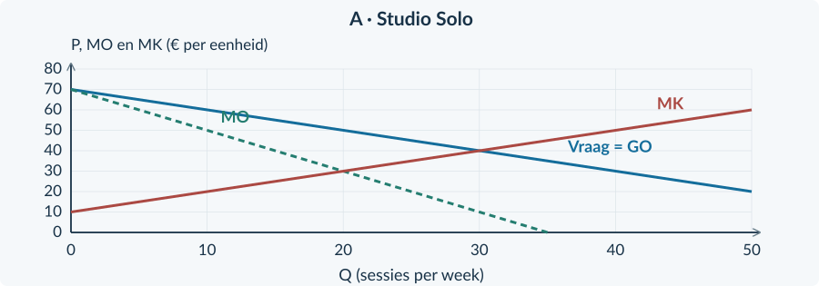

# 4.2.7 · Gemengde opgaven: marktvormen en marktfalen

Revision: `book34-lesson-balance-v3-20260915`. Exercise 58. Candidate: independent approval not conferred.

## Doeloefening

<b>Bron A · Studio Solo</b> Eén aanbieder verhuurt de hele afgebakende markt voor studiosessies. Vraag: P = 70 − Q. TK = 100 + 10Q + 0,5Q² en MK = 10 + Q. Q is sessies per week en P euro per sessie. Capaciteit: 50 sessies. Constante kosten blijven in deze week gelijk. Er zijn geen externe effecten. De efficiënte vergelijkingsuitkomst bij dezelfde vraag en kosten is Qe = 30, Pe = € 40 en TSe = € 900 per week.

<figure><figcaption>Figuur 31. Bron A: vraag, MO en MK voor dezelfde markt. De monopolie-uitkomst is nog niet gemarkeerd.</figcaption></figure>

<b>Bron B · Reiniging bij woningen</b> Veel aanbieders leveren dezelfde dienst. Vraag: Pc = 60 − Q; aanbod: Pp = Q. Q is diensten per dag; prijzen zijn euro per dienst. Iedere dienst veroorzaakt € 20 niet-vergoede schade aan omwonenden. Producenten gaan € 20 per dienst afdragen. Na de heffing zijn CS en PS elk € 200 per dag. Zonder ingrijpen is het maatschappelijk surplus € 300 per dag. Geen uitvoeringskosten of andere externe effecten.

<figure><figcaption>Figuur 32. Bron B: private en maatschappelijke kosten. Het gaat hier om een andere markt en een andere periode dan in bron A.</figcaption></figure>

<b>Opgave 58 · Twee markten, twee oorzaken</b>

Gebruik de bronnen op de linkerpagina. Onderbouw berekeningen met eenheden en conclusies met brongegevens.

<b>a.</b> (3p) Bepaal voor Studio Solo de winstmaximale hoeveelheid en verkoopprijs. Bereken ook de winst.

<b>b.</b> (4p) Bereken CS, PS en TS bij Solo en vergelijk met het gegeven TSe. Arceer het welvaartsverlies in figuur A.

<b>c.</b> (3p) Bereken in bron B de belaste hoeveelheid, Pc, Pp en de heffingsopbrengst.

<b>d.</b> (2p) Bereken met bron B het maatschappelijk surplus na de heffing en de verandering ten opzichte van de beginsituatie.

<b>e.</b> (2p) Leg uit waarom minder verkopen bij Solo welvaartsverlies geeft, maar minder diensten in bron B juist verbetering kan geven.

<b>f.</b> (2p) Beoordeel: “Een heffing van € 20 is dus ook vanzelf de beste oplossing voor Studio Solo.”

<b>Controleer vóór je afsluit</b> Is PS onderscheiden van winst? Is de prijs op de juiste lijn afgelezen? Zijn schade en overheidsontvangst allebei meegenomen? Gaat je conclusie alleen over de markt waarvoor je hebt gerekend?

### Schrijf geen grotere conclusie dan je bewijs
Een berekende verbetering in bron B is geen bewijs dat elke omwonende schadeloos is gesteld. Het welvaartsverlies in A is geen bewijs dat de hoogste mogelijke afzet altijd gewenst is. Je antwoord moet bij vraag, kosten, derden en de periode uit de bron blijven.

# Antwoorden

<b>a.</b> MO = 70 − 2Q. 70 − 2Q = 10 + Q geeft Qm = 20 sessies per week. MO daalt door MK en 20 past binnen 50. Pm = € 50. TO = 50 × 20 = € 1.000; TK = 100 + 10 × 20 + 0,5 × 20² = € 500; winst = € 500 per week.

<b>b.</b> CS = ½ × 20 × (70 − 50) = € 200. MK(20) = € 30; PS = 20 × (50 − 30) + ½ × 20 × (30 − 10) = € 600. TS = € 800. Welvaartsverlies = 900 − 800 = € 100 per week. Het is de driehoek tussen vraag en MK van Q = 20 tot Q = 30, basis 10 en hoogte 20.

<b>c.</b> Pc = Pp + 20: 60 − Q = Q + 20 → Q = 20 diensten per dag. Pc = € 40; Pp = € 20. Heffingsopbrengst = 20 × 20 = € 400 per dag.

<b>d.</b> Totale externe schade na heffing = 20 × 20 = € 400 per dag. Maatschappelijk surplus = 200 + 200 + 400 − 400 = € 400. Verbetering = 400 − 300 = € 100 per dag.

<b>e.</b> Bij Solo zijn er geen externe effecten; tussen Qm en Qe is betalingsbereidheid groter dan MK en verdwijnen voordelige transacties. Bij B veroorzaken sommige oorspronkelijke diensten meer maatschappelijke kosten dan baten door schade aan derden. Het verminderen van die diensten vergroot het maatschappelijke saldo.

<b>f.</b> Dat volgt niet. De heffing van € 20 in B past bij de daar gegeven externe schade en concurrentie. Solo heeft juist marktmacht en geen genoemde externe schade. Zonder analyse van dat probleem en de beleidsreactie is dezelfde maatregel niet gerechtvaardigd.

