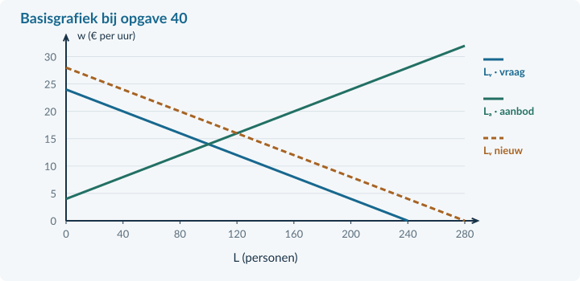

# 4.3.5 · Gemengde opgaven: arbeidsmarkt

Revision: `book34-lesson-balance-v3-20260915`. Exercise 40. Candidate: independent approval not conferred.

## Doeloefening

### Bronnen bij opgave 40 · Werk in Havenregio
Gebruik deze bronnen voor de vragen op de rechterpagina. **Bron A is een regiotelling. Bron B is een apart vereenvoudigd sectormodel.** Bron C beschrijft een afzonderlijk bedrijf.

<b>Bron A · Inwoners van 15 tot 75 jaar</b> <table><thead><tr><th>Groep</th><th>Personen</th></tr></thead><tbody><tr><td>Betaald werk</td><td>12.600</td></tr><tr><td>Geen betaald werk, recent gezocht en direct beschikbaar</td><td>1.400</td></tr><tr><td>Niet-beroepsbevolking</td><td>6.000</td></tr></tbody></table>

<b>Bron B · Verpakkingssector</b> Oorspronkelijk: Lᵥ = 240 − 10w; Lₐ = −40 + 10w. Door extra buitenlandse orders wordt de vraag Lᵥ = 280 − 10w. Het aanbod verandert niet. L is het aantal personen met ieder 20 uur per week; w is het uurloon in euro. Gebruik € 4 ≤ w ≤ € 24. Werkgevers concurreren, het loon kan vrij aanpassen en alle gevraagde plaatsen worden gevuld zonder vacatures of zoekproblemen.

<figure><figcaption>Figuur 24. Markeer in deze basisgrafiek het oude en nieuwe evenwicht. De verschuiving van de vraaglijn is al gegeven.</figcaption></figure>

<b>Bron C · Een nieuw werkproces</b> In een afzonderlijk bedrijf zouden de volledige uurkosten stijgen van € 24 naar € 25,20. De productiviteit zou stijgen van 8 naar 8,8 producten per uur. De omvang van de toekomstige orders en de overige productiekosten zijn nog onbekend. Een woordvoerder zegt: “Deze hogere productiviteit levert gegarandeerd meer banen op.”

<b>Opgave 40 · Werk in Havenregio</b>

Gebruik uitsluitend de relevante bronnen op de linkerpagina. Geef bij elke berekening de eenheid. Schrijf verklaringen in volledige zinnen.

<b>a.</b> (3p) Bereken met bron A de beroepsbevolking, bruto-participatie en het werkloosheidspercentage.

<b>b.</b> (2p) Bereken met bron B zelfstandig het oorspronkelijke evenwichtsloon en de werkgelegenheid.

<b>c.</b> (2p) Bereken het nieuwe evenwicht na de extra orders. Markeer beide evenwichten in de basisgrafiek.

<b>d.</b> (2p) Een leerling zegt: “De loonstijging verschuift de arbeidsvraag naar rechts.” Verbeter dit met bron B en benoem wat langs de aanbodlijn gebeurt.

<b>e.</b> (3p) Bereken met bron C de loonkosten per product vóór en na het nieuwe werkproces en de procentuele verandering.

<b>f.</b> (2p) Beoordeel de garantie van meer banen in bron C. Noem één ondersteunde uitkomst en één ontbrekend gegeven dat de werkgelegenheid kan beïnvloeden.

<b>Controle vóór inleveren</b> Heb je de twee noemers onderscheiden? Hebben je lonen en hoeveelheden eenheden? Is je conclusie niet sterker dan de informatie uit de bron?

# Antwoorden

<b>a.</b> Bevolking = 12.600 + 1.400 + 6.000 = <b>20.000 personen</b>. Beroepsbevolking = <b>14.000 personen</b>. Bruto = 14.000 / 20.000 × 100% = <b>70%</b>. Werkloosheid = 1.400 / 14.000 × 100% = <b>10%</b>. <i>Waarom:</i> Participatie en werkloosheid hebben verschillende noemers.

<b>b.</b> 240 − 10w = −40 + 10w → 280 = 20w → <b>w = € 14</b>. L = 240 − 10 × 14 = <b>100 personen</b>. <i>Waarom:</i> Bij het evenwicht zijn arbeidsvraag en arbeidsaanbod gelijk.

<b>c.</b> 280 − 10w = −40 + 10w → 320 = 20w → <b>w = € 16</b>. L = 280 − 10 × 16 = <b>120 personen</b>. E₀ = (100;14); E₁ = (120;16). <i>Waarom:</i> Extra orders verschuiven arbeidsvraag naar rechts; de nieuwe werkgelegenheid is hoger.

<b>d.</b> De <b>extra exportorders</b> verschuiven de arbeidsvraag. Het hogere loon is een uitkomst van de nieuwe verhouding. Langs de gelijk gebleven aanbodlijn stijgt de aangeboden hoeveelheid van 100 naar 120 personen. <i>Waarom:</i> Oorzaak van een lijnverschuiving en beweging langs een andere lijn zijn verschillende onderdelen van de aanpassing.

<b>e.</b> Oud = 24 / 8 = <b>€ 3 per product</b>. Nieuw = 25,20 / 8,8 = <b>€ 2,863636… ≈ € 2,86 per product</b>. Verandering = (2,863636… − 3) / 3 × 100% ≈ <b>−4,55%</b>. <i>Waarom:</i> Reken met onafgeronde bedragen tot het eindantwoord.

<b>f.</b> Onder de veronderstelde veranderingen dalen de loonkosten per product. Meer banen zijn niet gegarandeerd: de toekomstige productie/orders ontbreken. Bij dezelfde productie zou de hogere productiviteit juist minder arbeidsuren vragen. <i>Waarom:</i> Een dalend bedrag per product bepaalt niet vanzelf hoeveel producten worden gemaakt of hoeveel mensen werken.

