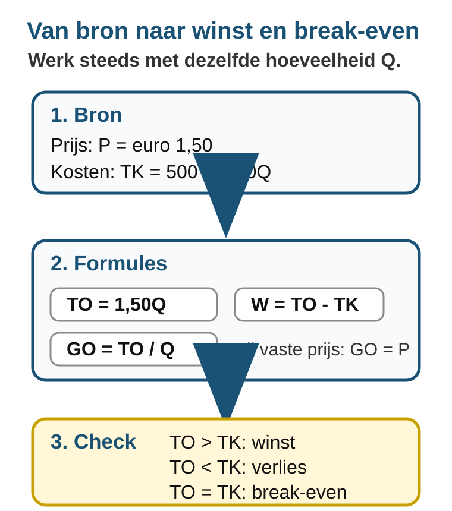
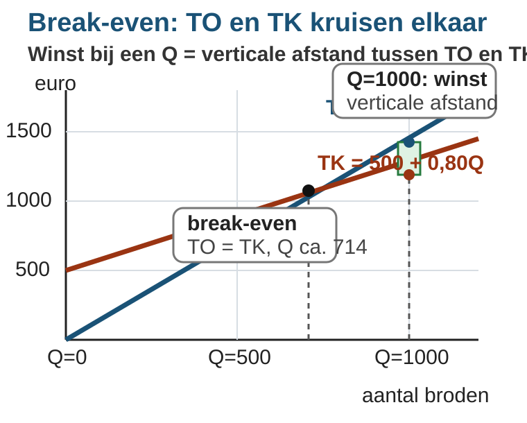
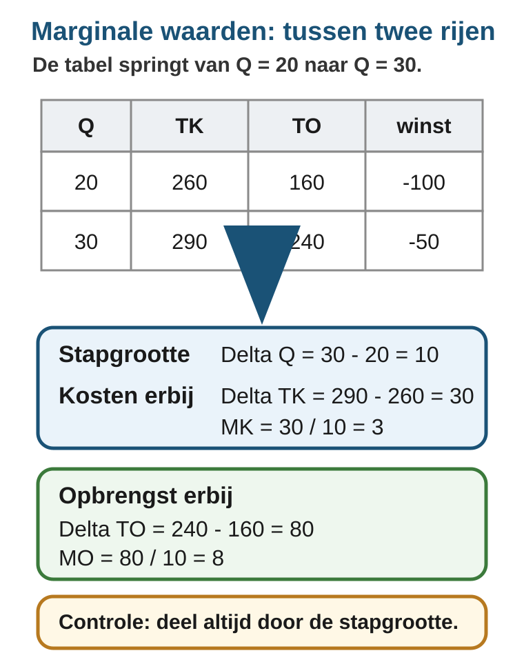

# Hoofdstuk 2.1 - Kosten en opbrengsten

## Inhoud

| Paragraaf | Onderwerp |
|---|---|
| 2.1.1 | Kostenstructuren |
| 2.1.2 | Opbrengsten, winst en break-even |
| 2.1.3 | Marginale kosten en marginale opbrengsten |
| 2.1.4 | Gemengde opgaven |

## Leerdoelen

Na dit hoofdstuk kun je:

- constante, variabele en totale kosten herkennen en berekenen;
- gemiddelde kosten berekenen en verklaren waarom `GCK` daalt als `Q` stijgt;
- totale opbrengst, gemiddelde opbrengst en winst berekenen;
- een break-evenpunt algebraisch en grafisch bepalen;
- `MK` en `MO` uit een tabel berekenen en gebruiken om extra productie te beoordelen.

## Waarom kosten en opbrengsten samen horen

Een ondernemer kijkt nooit alleen naar hoeveel hij verkoopt. Meer verkopen is
pas gunstig als de extra opbrengsten groter zijn dan de extra kosten. In dit
hoofdstuk leer je hoe je die afweging stap voor stap uitrekent.

# 2.1.1 Kostenstructuren

## Waarom wordt een brood goedkoper als je er meer bakt?

Een bakker huurt een kleine bakkerij voor EUR 500 per maand. Die huur betaalt
hij ook als hij bijna niets verkoopt. Voor elk brood heeft hij meel, gist,
energie en een zakje nodig. Dat kost EUR 0,80 per brood.

De bakker vraagt zich af: als ik twee keer zoveel broden bak, worden mijn
kosten dan ook precies twee keer zo hoog?

Het antwoord is nee. Een deel van de kosten blijft gelijk. Een ander deel groeit
mee met het aantal broden. In deze paragraaf leer je die twee soorten kosten
uit elkaar houden en berekenen wat de kosten per brood zijn.

In deze paragraaf gebruik je `Q` voor de productieomvang: het aantal producten.

---

## Theorie

### Totale constante kosten

Kosten die niet veranderen als `Q` verandert, heten **constante kosten**. Denk
aan huur, verzekeringen of een vast abonnement.

> **Definitie: TCK**
> `TCK` zijn de totale constante kosten. Deze kosten blijven gelijk als de
> productie verandert.

Voor de bakkerij geldt:

`TCK = 500`

Ook als de bakker 0 broden bakt, betaalt hij nog steeds EUR 500 huur.

### Totale variabele kosten

Kosten die wel veranderen als `Q` verandert, heten **variabele kosten**. Denk
aan grondstoffen, verpakking en energie per product.

> **Definitie: TVK**
> `TVK` zijn de totale variabele kosten. Deze kosten veranderen mee met `Q`.

De bakker heeft EUR 0,80 variabele kosten per brood. Bij `Q` broden is:

`TVK = 0,80Q`

Bij 500 broden:

`TVK = 0,80 x 500 = 400`

Bij 1000 broden:

`TVK = 0,80 x 1000 = 800`

### Totale kosten

De **totale kosten** zijn de constante kosten plus de variabele kosten.

> **Formulebox: totale kosten**
>
> `TK = TCK + TVK`

Voor de bakkerij:

`TK = 500 + 0,80Q`

| Q | TCK | TVK | TK |
|---:|---:|---:|---:|
| 0 | 500 | 0 | 500 |
| 500 | 500 | 400 | 900 |
| 1000 | 500 | 800 | 1300 |

De totale kosten stijgen als de bakker meer broden maakt, maar ze starten niet
bij nul. Dat komt door de constante kosten.

### Gemiddelde kosten

Een ondernemer wil vaak niet alleen weten wat alle producten samen kosten, maar
ook wat een product gemiddeld kost. Daarvoor deel je door `Q`.

> **Formulebox: gemiddelde kosten**
>
> `GTK = TK / Q`
>
> `GCK = TCK / Q`
>
> `GVK = TVK / Q`

Voor de bakkerij:

| Q | TCK | TVK | TK | GCK | GVK | GTK |
|---:|---:|---:|---:|---:|---:|---:|
| 500 | 500 | 400 | 900 | 1,00 | 0,80 | 1,80 |
| 1000 | 500 | 800 | 1300 | 0,50 | 0,80 | 1,30 |

`GCK` daalt als `Q` stijgt. Dezelfde EUR 500 huur wordt dan verdeeld over meer
broden. `GVK` blijft in dit voorbeeld gelijk, omdat elk extra brood steeds EUR
0,80 kost. Daardoor daalt ook `GTK`.

> **Veelgemaakte vergissing**
>
> `TCK` blijft gelijk als `Q` verandert. `GCK` blijft niet gelijk. Je deelt
> dezelfde constante kosten door een ander aantal producten.

---

## Uitgewerkt voorbeeld

Een foodtruck betaalt per dag EUR 300 voor standplaats en vergunningen. Per
broodje zijn de ingredienten en verpakking EUR 1,20.

**Vraag:** bereken `TCK`, `TVK`, `TK`, `GCK`, `GVK` en `GTK` bij 100 en 300
broodjes.

**Stap 1: Schrijf de kostenformules op.**

- `TCK = 300`
- `TVK = 1,20Q`
- `TK = 300 + 1,20Q`

**Stap 2: Bereken de totale kosten.**

| Q | TCK | TVK | TK |
|---:|---:|---:|---:|
| 100 | 300 | 120 | 420 |
| 300 | 300 | 360 | 660 |

**Stap 3: Deel door Q voor gemiddelde kosten.**

| Q | GCK | GVK | GTK |
|---:|---:|---:|---:|
| 100 | 3,00 | 1,20 | 4,20 |
| 300 | 1,00 | 1,20 | 2,20 |

**Stap 4: Trek de economische conclusie.**

Bij meer broodjes daalt `GCK` van EUR 3,00 naar EUR 1,00. De vaste kosten
worden uitgesmeerd over meer producten. `GVK` blijft EUR 1,20, omdat elk
broodje dezelfde variabele kosten heeft.

---

## Samenvatting

> **Onthouden**
>
> - `TCK`: totale constante kosten. Blijven gelijk als `Q` verandert.
> - `TVK`: totale variabele kosten. Veranderen mee met `Q`.
> - `TK = TCK + TVK`.
> - `GTK = TK / Q`, `GCK = TCK / Q`, `GVK = TVK / Q`.
> - Als `TCK` gelijk blijft, daalt `GCK` wanneer `Q` stijgt.
> - Verwissel nooit totale kosten met gemiddelde kosten: `TCK` is niet hetzelfde als `GCK`.

In de volgende paragraaf voeg je opbrengsten toe. Dan kun je bepalen of een
onderneming winst of verlies maakt.

## Vastgelopen op een opgave?

Gebruik steeds dezelfde route:

1. Schrijf eerst `TCK` en `TVK` op.
2. Bereken daarna `TK = TCK + TVK`.
3. Deel pas daarna door `Q` voor `GTK`, `GCK` en `GVK`.
4. Controleer je uitleg: zeg of het om totale kosten of gemiddelde kosten gaat.

---

## Opgaven

### Startoefeningen

**Opgave 1** *(lees de grafiek)*

Gebruik figuur 1 van de bakkerij.

**A.** Welke lijn laat `TCK` zien? Leg uit waaraan je dat ziet.

**B.** Lees uit de grafiek af: wat zijn `TVK` en `TK` bij `Q = 500`?

**C.** Lees uit de grafiek af: wat zijn `TVK` en `TK` bij `Q = 1000`?

**D.** De afstand tussen de `TK`-lijn en de `TVK`-lijn blijft overal even groot.
Welk bedrag stelt die afstand voor?

---

**Opgave 2** *(herken constante en variabele kosten)*

Een kleine drukkerij maakt posters. De drukkerij betaalt per maand EUR 900 huur
en EUR 175 voor een vast softwareabonnement. Papier en inkt kosten EUR 2 per
poster.

**A.** Welke kosten zijn constante kosten?

**B.** Welke kosten zijn variabele kosten?

**C.** Schrijf de formules voor `TCK`, `TVK` en `TK`.

**D.** Bereken `TK` bij `Q = 200` posters.

---

**Opgave 3** *(tabel met begeleiding)*

Een bedrijf heeft `TCK = 600` en `TVK = 3Q`.

**A.** Vul eerst `TCK`, `TVK` en `TK` in.

| Q | TCK | TVK | TK |
|---:|---:|---:|---:|
| 100 |  |  |  |
| 300 |  |  |  |
| 600 |  |  |  |

**B.** Bereken daarna `GCK`, `GVK` en `GTK`.

| Q | GCK | GVK | GTK |
|---:|---:|---:|---:|
| 100 |  |  |  |
| 300 |  |  |  |
| 600 |  |  |  |

**C.** Welke gemiddelde kosten blijven gelijk? Welke gemiddelde kosten dalen?

### Zelfstandige oefening

**Opgave 4**

Een fietsenmaker huurt een werkplaats voor EUR 1200 per maand. Voor iedere
fietsreparatie gebruikt hij gemiddeld EUR 18 aan onderdelen.

**A.** Schrijf de formules voor `TCK`, `TVK` en `TK`.

**B.** Bereken `TK` bij 40 reparaties en bij 80 reparaties.

**C.** Bereken `GCK`, `GVK` en `GTK` bij 40 reparaties en bij 80 reparaties.

**D.** Leg uit waarom `GTK` daalt als het aantal reparaties stijgt.

---

**Opgave 5**

Een maker van sportshirts heeft `TCK = 1500` en `TVK = 6Q`.

**A.** Bereken `TK`, `GCK`, `GVK` en `GTK` bij `Q = 250`.

**B.** Bereken `TK`, `GCK`, `GVK` en `GTK` bij `Q = 500`.

**C.** De ondernemer zegt: "Bij 500 shirts zijn mijn totale kosten lager dan bij
250 shirts." Leg uit waarom deze uitspraak fout is.

**D.** Welke kosten zijn wel lager bij 500 shirts dan bij 250 shirts?

### Herhaling

**Opgave 6** *(procenten en kosten samen)*

Een bedrijf maakt eerst 400 producten en daarna 500 producten. De constante
kosten zijn EUR 1000. De variabele kosten zijn EUR 4 per product.

**A.** Met hoeveel procent stijgt `Q`?

**B.** Bereken `GCK` bij 400 producten en bij 500 producten.

**C.** Met hoeveel procent daalt `GCK`?

**D.** Leg uit waarom `TVK` stijgt, terwijl `GCK` daalt.

### Doeloefening

**Opgave 7**

Een bakkerij heeft per maand EUR 500 constante kosten. Elk brood kost EUR 0,80
aan meel, gist en energie. Gebruik `Q` voor het aantal broden per maand.

**A.** Schrijf de formules voor `TCK`, `TVK` en `TK`.

**B.** Bereken `TCK`, `TVK` en `TK` bij `Q = 500` en bij `Q = 1000`.

**C.** Bereken `GTK`, `GVK` en `GCK` bij `Q = 500` en bij `Q = 1000`.

**D.** Wat gebeurt er met `GTK` als `Q` stijgt van 500 naar 1000? Leg uit waarom
dit logisch is.

**E.** Een leerling zegt: "`GCK` is altijd hetzelfde, want constante kosten
veranderen niet." Is dit juist? Leg uit.

### Denkertje

**Opgave 8**

Een bedrijf heeft `TCK = 500`. Bij 100 producten zijn de variabele kosten EUR 4
per product. Bij 200 producten stijgen de variabele kosten naar EUR 7 per
product, omdat er duur overwerk nodig is.

**A.** Bereken `GTK` bij 100 producten.

**B.** Bereken `GTK` bij 200 producten.

**C.** Daalt `GTK` hier als `Q` stijgt? Leg uit waarom dit voorbeeld anders is dan
de bakkerij.

# 2.1.2 Opbrengsten, winst en break-even

## Wanneer verdient de bakker zijn kosten terug?

In de vorige paragraaf berekende je de kosten van een bakkerij. De bakkerij had vaste kosten van €500 per maand en variabele kosten van €0,80 per brood. De kostenfunctie was:

`TK = 500 + 0,80Q`

Nu komt daar de verkoopkant bij. De bakker verkoopt elk brood voor €1,50. Daardoor kun je bepalen of de bakker winst of verlies maakt.

Het kernidee is eenvoudig:

> **Winst ontstaat niet doordat er veel verkocht wordt. Winst ontstaat pas als de totale opbrengst groter is dan de totale kosten.**

## Doeloefening

Deze opgave is het eindpunt van de paragraaf. Je hoeft hem nu nog niet volledig te kunnen maken. De theorie, het voorbeeld en de oefeningen hieronder leren precies de route naar deze opgave.

**Bron 1 - Bakkerij De Molen**

Bakkerij De Molen heeft de kostenfunctie `TK = 500 + 0,80Q`. De bakker verkoopt elk brood voor €1,50. Gebruik `Q` voor het aantal broden per maand.

**A.** Schrijf de formule voor `TO` als functie van `Q`.

**B.** Bereken `TO` en winst bij `Q = 500` en bij `Q = 1000`.

**C.** Bereken `GO` bij `Q = 500`. Wat valt je op?

**D.** Bij welke productieomvang draait de bakkerij precies break-even? Laat je berekening zien.

**E.** Teken een grafiek met `TK` en `TO`. Markeer het break-evenpunt en geef bij `Q = 1000` de winst aan.

---

Na deze paragraaf kun je:

- `TO = P × Q` opstellen en gebruiken;
- `GO = TO / Q` berekenen en herkennen dat `GO = P` als de prijs constant is;
- winst berekenen met `winst = TO - TK`;
- het break-evenpunt vinden met `TO = TK`;
- in een `TK`-`TO`-grafiek zien wanneer er verlies, break-even of winst is.

In deze paragraaf betekent `Q`: het aantal verkochte producten. We gaan ervan uit dat alles wat wordt geproduceerd ook wordt verkocht.

---

## Theorie

### 1. Totale opbrengst: TO

De **totale opbrengst** is het bedrag dat een onderneming ontvangt door producten te verkopen.

> **Formulebox: totale opbrengst**
>
> `TO = P × Q`
>
> `P` = prijs per product
> `Q` = aantal verkochte producten

Bij de bakkerij is de prijs per brood €1,50. De opbrengstfunctie is daarom:

`TO = 1,50Q`

| Q | Prijs per brood | TO |
|---:|---:|---:|
| 0 | 1,50 | 0 |
| 500 | 1,50 | 750 |
| 1000 | 1,50 | 1500 |

De `TO` begint bij nul. Als de bakker niets verkoopt, krijgt hij geen opbrengst. Bij elk extra brood komt er €1,50 opbrengst bij.

Lees figuur 1 als een route:

1. haal de prijs en kostenfunctie uit de bron;
2. maak `TO` en gebruik de gegeven `TK`;
3. vergelijk `TO` en `TK` om winst, verlies of break-even te bepalen.

### 2. Gemiddelde opbrengst: GO

De **gemiddelde opbrengst** is de opbrengst per verkocht product.

> **Formulebox: gemiddelde opbrengst**
>
> `GO = TO / Q`

Bij `Q = 500` geldt:

`GO = 750 / 500 = 1,50`

Dat is precies de verkoopprijs per brood. Dat is geen toeval. Als elk brood dezelfde prijs heeft, is de gemiddelde opbrengst gelijk aan de prijs:

`GO = P`

Let op: `GO` is niet hetzelfde als winst per product. `GO` kijkt alleen naar opbrengst. Voor winst moet je ook de kosten meenemen.

### 3. Winst en verlies

De **winst** is het verschil tussen totale opbrengst en totale kosten.

> **Formulebox: winst**
>
> `winst = TO - TK`

Voor de bakkerij:

- `TO = 1,50Q`
- `TK = 500 + 0,80Q`
- `winst = 1,50Q - (500 + 0,80Q)`
- `winst = 0,70Q - 500`

Nu kun je de winst bij verschillende hoeveelheden berekenen.

| Q | TO | TK | winst |
|---:|---:|---:|---:|
| 500 | 750 | 900 | -150 |
| 1000 | 1500 | 1300 | 200 |

Bij 500 broden maakt de bakkerij €150 verlies. Bij 1000 broden maakt de bakkerij €200 winst.

### 4. Break-even: winst is precies nul

Bij **break-even** zijn totale opbrengst en totale kosten precies gelijk. De winst is dan nul.

> **Formulebox: break-even**
>
> `TO = TK`

Voor de bakkerij:

`1,50Q = 500 + 0,80Q`

`0,70Q = 500`

`Q = 714,29`

De bakkerij draait dus break-even bij ongeveer 714 broden. Omdat je geen 0,29 brood verkoopt, is 715 broden de eerste hele productieomvang waarbij de bakkerij geen verlies meer maakt.

Je kunt dezelfde berekening ook zien als: elk brood levert €0,70 op boven de variabele kosten. Daarmee moet de bakker eerst de vaste kosten van €500 terugverdienen.

`500 / 0,70 = 714,29`

### 5. De grafiek: waar kruisen TK en TO?

In een grafiek met `TK` en `TO` staat `Q` op de horizontale as en euro's op de verticale as.

- `TO` begint bij nul, want zonder verkoop is er geen opbrengst.
- `TK` begint bij €500, want de vaste kosten zijn er ook bij `Q = 0`.
- Het snijpunt van `TO` en `TK` is het break-evenpunt.
- Links van het break-evenpunt geldt `TO < TK`: verlies.
- Rechts van het break-evenpunt geldt `TO > TK`: winst.

Belangrijk: in een `TK`-`TO`-grafiek lees je de winst bij één gekozen `Q` als de **verticale afstand** tussen `TO` en `TK`. Bij `Q = 1000` is die afstand:

`1500 - 1300 = 200`

De winst bij `Q = 1000` is dus €200. Arceer of markeer daarom de verticale afstand bij `Q = 1000`, niet het hele gebied tussen de lijnen over meerdere hoeveelheden.

---

## Doelprocedure: van bron naar break-even

Gebruik deze procedure bij opbrengst-, winst- en break-evenopgaven.

<table class="procedure-table">
  <thead>
    <tr><th>Stap</th><th>Doe dit</th><th>Controle</th></tr>
  </thead>
  <tbody>
    <tr><td>1</td><td>Schrijf de kostenfunctie op.</td><td>Meestal staat <code>TK</code> in de bron of volgt hij uit vaste en variabele kosten.</td></tr>
    <tr><td>2</td><td>Maak de opbrengstfunctie.</td><td><code>TO = P × Q</code>. Bij een vaste prijs wordt dit <code>TO = prijs × Q</code>.</td></tr>
    <tr><td>3</td><td>Bereken winst bij een gevraagde <code>Q</code>.</td><td>Gebruik <code>winst = TO - TK</code>. Negatief betekent verlies.</td></tr>
    <tr><td>4</td><td>Bereken <code>GO</code> als dat gevraagd wordt.</td><td><code>GO = TO / Q</code>. Bij een vaste prijs moet <code>GO</code> gelijk zijn aan <code>P</code>.</td></tr>
    <tr><td>5</td><td>Vind break-even.</td><td>Stel <code>TO = TK</code> en los op naar <code>Q</code>.</td></tr>
    <tr><td>6</td><td>Controleer met de grafiek.</td><td>Snijpunt = break-even. Bij een gekozen <code>Q</code>: verticale afstand = winst of verlies.</td></tr>
  </tbody>
</table>

---

## Uitgewerkt voorbeeld

Een smoothiebar op een schoolmarkt betaalt €180 voor kraamhuur en apparatuur. De ingrediënten en bekers kosten €1,20 per smoothie. De smoothiebar verkoopt elke smoothie voor €3,00.

**Vraag:** stel `TK` en `TO` op, bereken de winst bij 80 en 150 smoothies, bereken `GO` bij 150 smoothies en bepaal het break-evenpunt.

**Stap 1: Schrijf de kostenfunctie op.**

- Vaste kosten: €180
- Variabele kosten per smoothie: €1,20
- `TK = 180 + 1,20Q`

**Stap 2: Schrijf de opbrengstfunctie op.**

- Prijs per smoothie: €3,00
- `TO = 3,00Q`

**Stap 3: Bereken winst bij de gevraagde hoeveelheden.**

| Q | TO | TK | winst |
|---:|---:|---:|---:|
| 80 | 240 | 276 | -36 |
| 150 | 450 | 360 | 90 |

Bij 80 smoothies is er €36 verlies. Bij 150 smoothies is er €90 winst.

**Stap 4: Bereken `GO` bij 150 smoothies.**

`GO = TO / Q = 450 / 150 = 3,00`

De gemiddelde opbrengst is €3,00 per smoothie. Dat is gelijk aan de verkoopprijs, omdat elke smoothie voor dezelfde prijs wordt verkocht.

**Stap 5: Bepaal break-even.**

`TO = TK`

`3,00Q = 180 + 1,20Q`

`1,80Q = 180`

`Q = 100`

De smoothiebar draait break-even bij 100 smoothies. Onder 100 smoothies is er verlies. Boven 100 smoothies is er winst.

---

## Samenvatting

> **Onthouden**
>
> - `TO = P × Q`.
> - `GO = TO / Q`.
> - Bij een vaste verkoopprijs geldt: `GO = P`.
> - `winst = TO - TK`.
> - Break-even betekent: `TO = TK` en winst is precies nul.
> - In een `TK`-`TO`-grafiek is het break-evenpunt het snijpunt van de lijnen.
> - Bij een gekozen `Q` is winst of verlies de verticale afstand tussen `TO` en `TK`.

In de volgende paragraaf kijk je naar marginale kosten en marginale opbrengsten. Dan onderzoek je wat er gebeurt als een onderneming één extra product maakt en verkoopt.

## Vastgelopen op een opgave?

Gebruik deze herstelroute:

1. Schrijf eerst `TK` op. Zonder kosten kun je geen winst berekenen.
2. Zoek de verkoopprijs en maak `TO = P × Q`.
3. Bereken `TO` en `TK` bij dezelfde `Q`.
4. Gebruik `winst = TO - TK`.
5. Voor break-even: stel `TO = TK` en los op naar `Q`.
6. Teken in de grafiek niet zomaar een groot gebied. Controleer eerst: vraag je om het snijpunt of om de verticale winstafstand bij één `Q`?

## Opgaven

### Startoefeningen

**Opgave 1** *(formules lezen)*

Een bakkerij heeft `TK = 500 + 0,80Q`. De verkoopprijs is €1,50 per brood.

**A.** Schrijf de formule voor `TO`.

**B.** Schrijf de formule voor winst als functie van `Q`.

**C.** Bereken `TO`, `TK` en winst bij `Q = 500`.

**D.** Bereken `GO` bij `Q = 500`. Leg uit waarom dit gelijk is aan de verkoopprijs.

---

**Opgave 2** *(tabel invullen)*

Een onderneming heeft `TK = 240 + 2Q` en verkoopt het product voor €5 per stuk.

**A.** Schrijf de formule voor `TO`.

**B.** Vul de tabel in.

| Q | TO | TK | winst/verlies |
|---:|---:|---:|---:|
| 0 |  |  |  |
| 60 |  |  |  |
| 120 |  |  |  |

**C.** Bij welke `Q` in de tabel is er verlies? Bij welke `Q` is er winst?

**D.** Bereken `GO` bij `Q = 120`.

---

**Opgave 3** *(break-even met begeleiding)*

Een club verkoopt programmaboekjes bij een voorstelling. De vaste kosten zijn €300. Drukken kost €1 per boekje. De verkoopprijs is €4 per boekje.

**A.** Schrijf `TK` en `TO` als functie van `Q`.

**B.** Stel de break-evenvergelijking op.

**C.** Los de vergelijking op.

**D.** Leg in één zin uit wat je uitkomst betekent.

---

**Opgave 4** *(grafiek lezen)*

Gebruik figuur 2 uit de paragraaf.

**A.** Welke lijn begint bij nul? Leg uit waarom.

**B.** Welke lijn begint bij €500? Leg uit waarom.

**C.** Wat betekent het snijpunt van `TO` en `TK`?

**D.** Hoe groot is de winst bij `Q = 1000`? Laat zien hoe je dat uit de grafiek of formules haalt.

### Zelfstandige oefening

**Opgave 5**

Een drukkerij maakt posters. De drukkerij heeft vaste kosten van €900 per maand. Papier en inkt kosten €2 per poster. De verkoopprijs is €5 per poster.

**A.** Schrijf de formules voor `TK` en `TO`.

**B.** Bereken winst of verlies bij `Q = 200` en bij `Q = 400`.

**C.** Bereken `GO` bij `Q = 400`.

**D.** Bereken het break-evenpunt.

**E.** Leg uit waarom de onderneming bij `Q = 200` verlies maakt, maar bij `Q = 400` winst maakt.

---

**Opgave 6**

Een fietsenmaker verkoopt onderhoudsbeurten voor €45 per stuk. De vaste kosten per maand zijn €1200. Onderdelen en klein materiaal kosten €18 per onderhoudsbeurt.

**A.** Schrijf de formules voor `TK` en `TO`.

**B.** Bereken winst of verlies bij 40 onderhoudsbeurten.

**C.** Bereken winst of verlies bij 80 onderhoudsbeurten.

**D.** Bereken het break-evenpunt. Rond af naar boven op hele onderhoudsbeurten en leg uit waarom je naar boven afrondt.

### Herhaling

**Opgave 7** *(kostenstructuur en winst samen)*

Een lunchbar verkoopt wraps. De vaste kosten per dag zijn €750. De variabele kosten zijn €2,40 per wrap. De verkoopprijs is €4,00 per wrap.

**A.** Schrijf de formules voor `TCK`, `TVK`, `TK` en `TO`.

**B.** Bereken bij `Q = 250` en bij `Q = 500`: `TO`, `TK` en winst.

**C.** Bereken `GO` bij `Q = 500`.

**D.** Bereken het break-evenpunt.

**E.** Leg uit hoe je in een grafiek met `TK` en `TO` de winst bij `Q = 500` zou aangeven.

### Doeloefening

**Opgave 8** *(van bron naar break-even)*

**Bron 1 - Pop-up bakkerij bij een sportdag**

Een pop-up bakkerij verkoopt broodjes tijdens een sportdag. De bakker betaalt €420 voor kraamhuur en voorbereiding. Per broodje zijn de variabele kosten €1,10. De verkoopprijs is €2,50 per broodje. Gebruik `Q` voor het aantal verkochte broodjes.

**A.** Schrijf de formule voor `TO` als functie van `Q`.

**B.** Schrijf de formule voor `TK` als functie van `Q`.

**C.** Bereken `TO`, `TK` en winst bij `Q = 200` en bij `Q = 400`.

**D.** Bereken `GO` bij `Q = 200`. Wat valt je op?

**E.** Bereken het break-evenpunt. Rond af naar boven op hele broodjes en leg uit waarom.

**F.** Teken een `TK`-`TO`-grafiek. Zet `Q` op de horizontale as en euro's op de verticale as. Teken de lijnen `TK` en `TO`, markeer het break-evenpunt en geef bij `Q = 400` de winst aan als verticale afstand tussen `TO` en `TK`.

### Denkertje

**Opgave 9**

Een ondernemer heeft `TK = 500 + 0,80Q`, maar door een tijdelijke actie verkoopt hij het product voor €0,70 per stuk.

**A.** Schrijf de formule voor `TO`.

**B.** Schrijf de formule voor winst.

**C.** Bestaat er een break-evenpunt? Leg uit zonder alleen te zeggen dat de uitkomst negatief is.

**D.** Wat leert dit voorbeeld over het verschil tussen "veel verkopen" en winst maken?

# 2.1.3 Marginale kosten en marginale opbrengsten

## Wat gebeurt er als je één product extra maakt?

In §2.1.1 keek je naar kosten. In §2.1.2 keek je naar opbrengsten, winst en break-even. Je kon daardoor berekenen of een onderneming winst of verlies maakt bij een bepaalde productieomvang.

Nu stel je een kleinere vraag:

> **Wat verandert er als de onderneming één product extra maakt en verkoopt?**

Die vraag heet **marginaal denken**. Marginaal betekent hier: erbij, aan de rand, bij één extra product. Je kijkt dus niet alleen naar het totaal, maar naar de verandering in het totaal.

Het kernidee is:

> **`MK` en `MO` lees je niet uit één rij van een tabel. Je berekent ze tussen twee rijen.**

## Doeloefening

Deze opgave is het eindpunt van de paragraaf. Je hoeft hem nu nog niet volledig te kunnen maken. De theorie, het voorbeeld en de oefeningen hieronder leren precies de route naar deze opgave.

**Bron 1 - Onderneming Linea**

Een onderneming heeft de kostenfunctie `TK = 200 + 3Q`. De onderneming verkoopt elk product voor €8. Daarom geldt `TO = 8Q`. Gebruik `Q` voor het aantal producten.

**A.** Vul de tabel in voor `Q = 0, 10, 20, 30, 40, 50`. Bereken `TK`, `TO`, winst, `MK` en `MO`. Let op: de tabel springt steeds met 10 producten, dus deel de verandering door `ΔQ`.

**B.** Wat valt je op aan `MK`? Is `MK` constant of verandert `MK`?

**C.** Wat valt je op aan `MO`? Waarom is dat logisch bij een vaste verkoopprijs?

**Bron 2 - Onderneming Curva**

Een tweede onderneming heeft de kostenfunctie `TK = 100 + Q²`. De onderneming verkoopt elk product voor €30. Daarom geldt `TO = 30Q`.

**D.** Vul een vergelijkbare tabel in voor `Q = 0, 5, 10, 15, 20`. Wat gebeurt er met `MK`?

**E.** Leg in je eigen woorden uit wat `MK` vertelt en wat `MO` vertelt.

---

Na deze paragraaf kun je:

- `MK` uitleggen als de extra kosten van één extra product;
- `MO` uitleggen als de extra opbrengst van één extra verkocht product;
- `MK = ΔTK / ΔQ` en `MO = ΔTO / ΔQ` gebruiken in tabellen;
- zien dat `MK` constant is bij een lineaire kostenfunctie;
- zien dat `MK` kan stijgen bij een niet-lineaire kostenfunctie;
- uitleggen waarom `MO` gelijk is aan de prijs als elk product voor dezelfde prijs wordt verkocht.

Deze paragraaf gaat nog niet over winstmaximalisatie. Je leert eerst wat `MK` en `MO` betekenen en hoe je ze uit een tabel berekent.

---

## Theorie

### 1. Marginaal betekent: de verandering erbij

De **marginale kosten** zijn de extra kosten van één extra product.

> **Formulebox: marginale kosten**
>
> `MK = ΔTK / ΔQ`
>
> `ΔTK` = verandering van de totale kosten
> `ΔQ` = verandering van de productieomvang

De **marginale opbrengsten** zijn de extra opbrengst van één extra verkocht product.

> **Formulebox: marginale opbrengsten**
>
> `MO = ΔTO / ΔQ`
>
> `ΔTO` = verandering van de totale opbrengst
> `ΔQ` = verandering van de verkoop

Als `Q` met precies 1 stijgt, deel je door 1. Dan is `MK` gewoon de extra kosten van dat ene product. Maar in veel tabellen springt `Q` met 5, 10 of 20 tegelijk. Dan moet je de verandering eerst delen door de stapgrootte.

### 2. Marginale waarden bereken je tussen twee rijen

Kijk naar onderneming Linea:

- `TK = 200 + 3Q`
- `TO = 8Q`

Eerst bereken je de totalen.

| Q | TK | TO | winst |
|---:|---:|---:|---:|
| 0 | 200 | 0 | -200 |
| 10 | 230 | 80 | -150 |
| 20 | 260 | 160 | -100 |
| 30 | 290 | 240 | -50 |
| 40 | 320 | 320 | 0 |
| 50 | 350 | 400 | 50 |

Daarna kijk je naar de verandering tussen twee opeenvolgende rijen.

In figuur 1 zie je de stap van `Q = 20` naar `Q = 30`.

- `ΔQ = 30 - 20 = 10`
- `ΔTK = 290 - 260 = 30`
- `MK = 30 / 10 = 3`
- `ΔTO = 240 - 160 = 80`
- `MO = 80 / 10 = 8`

De ruwe stijging van de kosten is dus €30, maar de marginale kosten zijn €3 per product. Dat verschil is belangrijk. `MK` gaat over één extra product, niet over de hele sprong van tien producten.

### 3. Lineaire kosten: MK blijft constant

Bij `TK = 200 + 3Q` komt er bij elk extra product €3 aan kosten bij. Daarom is `MK` steeds gelijk aan €3.

<table class="wide-table">
  <thead>
    <tr><th>Stap</th><th>ΔQ</th><th>ΔTK</th><th>MK = ΔTK / ΔQ</th><th>ΔTO</th><th>MO = ΔTO / ΔQ</th></tr>
  </thead>
  <tbody>
    <tr><td>0 naar 10</td><td>10</td><td>30</td><td>3</td><td>80</td><td>8</td></tr>
    <tr><td>10 naar 20</td><td>10</td><td>30</td><td>3</td><td>80</td><td>8</td></tr>
    <tr><td>20 naar 30</td><td>10</td><td>30</td><td>3</td><td>80</td><td>8</td></tr>
    <tr><td>30 naar 40</td><td>10</td><td>30</td><td>3</td><td>80</td><td>8</td></tr>
    <tr><td>40 naar 50</td><td>10</td><td>30</td><td>3</td><td>80</td><td>8</td></tr>
  </tbody>
</table>

De winst stijgt hier bij elke stap, omdat `MO` groter is dan `MK`. Maar de winstmaximalisatieregel komt later. In deze paragraaf is de hoofdzaak dat je `MK` en `MO` correct uit de tabel haalt.

Je mag `MK` en `MO` wel al gebruiken om de winstverandering van één extra product of één tabelstap te begrijpen:

- als `MO > MK`, stijgt de winst door die extra stap;
- als `MO < MK`, daalt de winst door die extra stap;
- als `MO = MK`, verandert de winst door die extra stap niet.

Dit is nog geen recept om de beste productieomvang te kiezen. Het is alleen een manier om de verandering tussen twee rijen goed te lezen.

### 4. Vaste verkoopprijs: MO is gelijk aan de prijs

Onderneming Linea verkoopt elk product voor €8. Als er één product extra wordt verkocht, komt er dus €8 extra opbrengst bij. Daarom is `MO = 8`.

Dat is logisch:

`TO = 8Q`

Elke keer dat `Q` met 1 stijgt, stijgt `TO` met 8.

Bij een vaste verkoopprijs geldt dus:

`MO = P`

Let op: dit geldt alleen als elk extra product voor dezelfde prijs wordt verkocht. Als de onderneming de prijs moet verlagen om meer te verkopen, kan `MO` anders zijn dan de prijs. Dat komt later terug.

### 5. Niet-lineaire kosten: MK kan stijgen

Nu verandert de kostenfunctie. Onderneming Curva heeft:

- `TK = 100 + Q²`
- `TO = 30Q`

Eerst bereken je weer de totalen.

| Q | TK | TO | winst |
|---:|---:|---:|---:|
| 0 | 100 | 0 | -100 |
| 5 | 125 | 150 | 25 |
| 10 | 200 | 300 | 100 |
| 15 | 325 | 450 | 125 |
| 20 | 500 | 600 | 100 |

Daarna bereken je de marginale waarden tussen de rijen.

<table class="wide-table">
  <thead>
    <tr><th>Stap</th><th>ΔQ</th><th>ΔTK</th><th>MK = ΔTK / ΔQ</th><th>ΔTO</th><th>MO = ΔTO / ΔQ</th></tr>
  </thead>
  <tbody>
    <tr><td>0 naar 5</td><td>5</td><td>25</td><td>5</td><td>150</td><td>30</td></tr>
    <tr><td>5 naar 10</td><td>5</td><td>75</td><td>15</td><td>150</td><td>30</td></tr>
    <tr><td>10 naar 15</td><td>5</td><td>125</td><td>25</td><td>150</td><td>30</td></tr>
    <tr><td>15 naar 20</td><td>5</td><td>175</td><td>35</td><td>150</td><td>30</td></tr>
  </tbody>
</table>

Hier stijgt `MK`: eerst €5, daarna €15, daarna €25 en daarna €35 per product. De extra producten worden dus steeds duurder om te maken.

`MO` blijft gelijk aan €30, omdat elk product voor dezelfde prijs wordt verkocht.

### 6. Wat vertellen MK en MO?

`MK` vertelt hoeveel de totale kosten veranderen als de onderneming één product extra maakt.

`MO` vertelt hoeveel de totale opbrengst verandert als de onderneming één product extra verkoopt.

Je gebruikt marginale waarden dus om naar de rand van de beslissing te kijken:

- Wat kost één extra product?
- Wat levert één extra verkocht product op?
- Worden extra producten steeds duurder of blijven de extra kosten gelijk?
- Blijft de extra opbrengst gelijk aan de prijs, of verandert die?

Dat is een andere vraag dan: hoeveel winst maakt de onderneming in totaal? De totale winst bereken je met `winst = TO - TK`. De marginale waarden bereken je met verschillen tussen rijen.

---

## Doelprocedure: MK en MO uit een tabel berekenen

Gebruik deze procedure bij tabellen met marginale kosten en marginale opbrengsten.

<table class="procedure-table">
  <thead>
    <tr><th>Stap</th><th>Doe dit</th><th>Controle</th></tr>
  </thead>
  <tbody>
    <tr><td>1</td><td>Bereken eerst <code>TK</code>, <code>TO</code> en winst per rij.</td><td>Gebruik de formules uit de bron. Winst is <code>TO - TK</code>.</td></tr>
    <tr><td>2</td><td>Kies twee opeenvolgende rijen.</td><td><code>MK</code> en <code>MO</code> horen bij de stap tussen die rijen.</td></tr>
    <tr><td>3</td><td>Bereken <code>ΔQ</code>.</td><td>Vraag: met hoeveel producten stijgt <code>Q</code>?</td></tr>
    <tr><td>4</td><td>Bereken <code>ΔTK</code> en <code>ΔTO</code>.</td><td>Nieuw totaal min oud totaal.</td></tr>
    <tr><td>5</td><td>Bereken <code>MK</code> en <code>MO</code>.</td><td><code>MK = ΔTK / ΔQ</code> en <code>MO = ΔTO / ΔQ</code>.</td></tr>
    <tr><td>6</td><td>Beschrijf het patroon.</td><td>Blijft <code>MK</code> constant, stijgt het of daalt het? Geldt hetzelfde voor <code>MO</code>?</td></tr>
  </tbody>
</table>

---

## Uitgewerkt voorbeeld

Een bedrijf maakt sporttassen. De kostenfunctie is `TK = 300 + 2Q`. De verkoopprijs is €6 per tas, dus `TO = 6Q`. Bereken `TK`, `TO`, winst, `MK` en `MO` bij `Q = 0, 25, 50`.

**Stap 1: Bereken de totalen.**

| Q | TK | TO | winst |
|---:|---:|---:|---:|
| 0 | 300 | 0 | -300 |
| 25 | 350 | 150 | -200 |
| 50 | 400 | 300 | -100 |

**Stap 2: Bereken de marginale waarden tussen de rijen.**

<table class="wide-table">
  <thead>
    <tr><th>Stap</th><th>ΔQ</th><th>ΔTK</th><th>MK</th><th>ΔTO</th><th>MO</th></tr>
  </thead>
  <tbody>
    <tr><td>0 naar 25</td><td>25</td><td>50</td><td>50 / 25 = 2</td><td>150</td><td>150 / 25 = 6</td></tr>
    <tr><td>25 naar 50</td><td>25</td><td>50</td><td>50 / 25 = 2</td><td>150</td><td>150 / 25 = 6</td></tr>
  </tbody>
</table>

**Stap 3: Interpreteer.**

`MK = 2`: één extra sporttas kost €2 extra om te maken.

`MO = 6`: één extra verkochte sporttas levert €6 extra opbrengst op.

De tabel springt met 25 tassen. Daarom mag je niet zeggen dat `MK = 50`. Die €50 is de extra kosten voor 25 tassen samen. Per tas is dat €2.

---

## Samenvatting

> **Onthouden**
>
> - Marginaal betekent: wat verandert er bij één product extra?
> - `MK = ΔTK / ΔQ`.
> - `MO = ΔTO / ΔQ`.
> - `MK` en `MO` bereken je tussen twee rijen van een tabel.
> - Als de tabel met meer dan 1 product tegelijk springt, deel je door `ΔQ`.
> - Bij `TK = 200 + 3Q` is `MK = 3`: de kosten stijgen steeds met €3 per extra product.
> - Bij `TO = 8Q` is `MO = 8`: bij een vaste prijs is `MO` gelijk aan de prijs.
> - Bij `TK = 100 + Q²` stijgt `MK`: extra producten worden steeds duurder om te maken.

## Opgaven

### Startoefeningen

**Opgave 1** *(begrippen)*

**A.** Leg in één zin uit wat `MK` betekent.

**B.** Leg in één zin uit wat `MO` betekent.

**C.** Waarom kun je `MK` meestal niet uit één rij van een tabel aflezen?

**D.** Een tabel springt van `Q = 10` naar `Q = 20`. `TK` stijgt van 140 naar 180. Bereken `MK`.

---

**Opgave 2** *(twee rijen gebruiken)*

Een onderneming heeft de volgende tabel.

| Q | TK | TO |
|---:|---:|---:|
| 30 | 260 | 450 |
| 40 | 300 | 600 |

**A.** Bereken `ΔQ`.

**B.** Bereken `ΔTK` en `MK`.

**C.** Bereken `ΔTO` en `MO`.

**D.** Leg uit wat je uitkomst voor `MO` betekent.

---

**Opgave 3** *(lineaire kosten)*

Een bedrijf heeft `TK = 120 + 4Q`. De verkoopprijs is €9 per product, dus `TO = 9Q`.

**A.** Vul de totalentabel in.

| Q | TK | TO | winst |
|---:|---:|---:|---:|
| 0 |  |  |  |
| 10 |  |  |  |
| 20 |  |  |  |
| 30 |  |  |  |

**B.** Bereken `MK` en `MO` voor elke stap van 10 producten.

<table class="wide-table">
  <thead>
    <tr><th>Stap</th><th>ΔQ</th><th>ΔTK</th><th>MK</th><th>ΔTO</th><th>MO</th></tr>
  </thead>
  <tbody>
    <tr><td>0 naar 10</td><td></td><td></td><td></td><td></td><td></td></tr>
    <tr><td>10 naar 20</td><td></td><td></td><td></td><td></td><td></td></tr>
    <tr><td>20 naar 30</td><td></td><td></td><td></td><td></td><td></td></tr>
  </tbody>
</table>

**C.** Wat valt je op aan `MK`?

**D.** Waarom is `MO` gelijk aan €9?

---

**Opgave 4** *(veelgemaakte fout)*

Een leerling bekijkt deze twee rijen.

| Q | TK |
|---:|---:|
| 0 | 500 |
| 20 | 540 |

De leerling zegt: "`MK = 40`, want de kosten stijgen met €40."

**A.** Wat is de fout in deze redenering?

**B.** Bereken de juiste `MK`.

**C.** Leg in woorden uit wat de juiste `MK` betekent.

### Zelfstandige oefening

**Opgave 5**

Een producent van telefoonhoesjes heeft `TK = 250 + 1,50Q`. De verkoopprijs is €5 per hoesje.

**A.** Schrijf de formule voor `TO`.

**B.** Vul de totalentabel in.

| Q | TK | TO | winst |
|---:|---:|---:|---:|
| 0 |  |  |  |
| 100 |  |  |  |
| 200 |  |  |  |
| 300 |  |  |  |

**C.** Bereken `MK` en `MO` voor elke stap van 100 hoesjes.

**D.** Leg uit waarom `MK` constant is.

**E.** Leg uit waarom `MO` constant is.

---

**Opgave 6**

Een tweede producent heeft stijgende kosten. De kostenfunctie is `TK = 80 + 0,5Q²`. De verkoopprijs is €20 per product.

**A.** Schrijf de formule voor `TO`.

**B.** Vul de totalentabel in.

| Q | TK | TO | winst |
|---:|---:|---:|---:|
| 0 |  |  |  |
| 10 |  |  |  |
| 20 |  |  |  |
| 30 |  |  |  |

**C.** Bereken `MK` en `MO` voor elke stap van 10 producten.

**D.** Wat gebeurt er met `MK`?

**E.** Wat gebeurt er met `MO`?

### Herhaling

**Opgave 7** *(kosten, opbrengsten en marginale waarden samen)*

Een lunchbar verkoopt wraps. De vaste kosten zijn €180 per dag. De variabele kosten zijn €2 per wrap. De verkoopprijs is €6 per wrap.

**A.** Schrijf `TK` en `TO` als functie van `Q`.

**B.** Vul de totalentabel in.

| Q | TK | TO | winst |
|---:|---:|---:|---:|
| 0 |  |  |  |
| 50 |  |  |  |
| 100 |  |  |  |
| 150 |  |  |  |

**C.** Bereken `MK` en `MO` voor elke stap.

**D.** Leg uit waarom `MK` gelijk is aan de variabele kosten per wrap.

**E.** Leg uit waarom `MO` gelijk is aan de verkoopprijs.

### Doeloefening

**Opgave 8** *(van tabel naar marginale kosten en opbrengsten)*

**Bron 1 - Onderneming Linea**

Een onderneming heeft de kostenfunctie `TK = 200 + 3Q`. De onderneming verkoopt elk product voor €8. Daarom geldt `TO = 8Q`. Gebruik `Q` voor het aantal producten.

**A.** Vul de tabel in. Zet bij `Q = 0` een streepje bij `MK` en `MO`, omdat er nog geen vorige rij is.

<table class="wide-table">
  <thead>
    <tr><th>Q</th><th>TK</th><th>TO</th><th>winst</th><th>MK</th><th>MO</th></tr>
  </thead>
  <tbody>
    <tr><td>0</td><td></td><td></td><td></td><td>-</td><td>-</td></tr>
    <tr><td>10</td><td></td><td></td><td></td><td></td><td></td></tr>
    <tr><td>20</td><td></td><td></td><td></td><td></td><td></td></tr>
    <tr><td>30</td><td></td><td></td><td></td><td></td><td></td></tr>
    <tr><td>40</td><td></td><td></td><td></td><td></td><td></td></tr>
    <tr><td>50</td><td></td><td></td><td></td><td></td><td></td></tr>
  </tbody>
</table>

**B.** Wat valt je op aan `MK`? Is `MK` constant of verandert `MK`?

**C.** Wat valt je op aan `MO`? Waarom is dat logisch bij een vaste verkoopprijs?

**Bron 2 - Onderneming Curva**

Een tweede onderneming heeft de kostenfunctie `TK = 100 + Q²`. De onderneming verkoopt elk product voor €30. Daarom geldt `TO = 30Q`.

**D.** Vul de tabel in.

<table class="wide-table">
  <thead>
    <tr><th>Q</th><th>TK</th><th>TO</th><th>winst</th><th>MK</th><th>MO</th></tr>
  </thead>
  <tbody>
    <tr><td>0</td><td></td><td></td><td></td><td>-</td><td>-</td></tr>
    <tr><td>5</td><td></td><td></td><td></td><td></td><td></td></tr>
    <tr><td>10</td><td></td><td></td><td></td><td></td><td></td></tr>
    <tr><td>15</td><td></td><td></td><td></td><td></td><td></td></tr>
    <tr><td>20</td><td></td><td></td><td></td><td></td><td></td></tr>
  </tbody>
</table>

**E.** Wat gebeurt er met `MK` bij onderneming Curva?

**F.** Leg in je eigen woorden uit wat `MK` vertelt en wat `MO` vertelt.

**G.** Gebruik de tabel van onderneming Curva. Bij welke stappen geldt `MO > MK`? Bij welke stap geldt `MO < MK`? Wat zou `MO = MK` betekenen voor de winst in één stap?

### Denkertje

**Opgave 9**

Twee leerlingen vergelijken twee tabellen.

- In tabel 1 stijgt `Q` van 0 naar 10 en stijgt `TK` van 100 naar 150.
- In tabel 2 stijgt `Q` van 0 naar 50 en stijgt `TK` van 100 naar 250.

Leerling A zegt: "Tabel 2 heeft hogere marginale kosten, want de kosten stijgen met €150 in plaats van €50."

Leerling B zegt: "Je kunt dit pas vergelijken als je de kostenstijging per extra product berekent."

**A.** Bereken `MK` in tabel 1.

**B.** Bereken `MK` in tabel 2.

**C.** Welke leerling redeneert economisch correct? Leg uit.

**D.** Wat leert deze opgave over tabellen met verschillende stapgroottes?

# 2.1.4 Gemengde opgaven: kosten en opbrengsten - opgaven

Gebruik bij alle opgaven de geïntegreerde aanpak: bron lezen, formulefamilie kiezen, totalen berekenen, daarna gemiddelden of marginale waarden berekenen, en eindigen met een economische conclusie.

## Hoe pak je gemengde opgaven aan?

Gebruik bij berekeningen steeds dezelfde antwoordroute: formule opschrijven, gegevens invullen, uitkomst berekenen, eenheid noemen en afsluiten met een conclusie in woorden.

Bij tabellen vergelijk je per stap wat verandert. Noem eerst de verandering in `Q`, `TK` of `TO`, bereken daarna de waarde per extra product, vergelijk de uitkomsten en trek dan een economische conclusie.

Bij grafieken benoem je eerst het punt of de lijnen waar het om gaat. Lees de waarden af, vergelijk `TK` en `TO`, en leg uit wat dat betekent voor winst, verlies of break-even.

Bij uitlegvragen begin je met je standpunt. Gebruik daarna een berekening, tabel of grafiek als bewijs en sluit af met de economische betekenis.

## Startopgave 1 - Broodplanken

Een leerling maakt houten broodplanken voor een markt. De vaste kosten voor gereedschap en kraamhuur zijn €300. Elke broodplank kost €5 aan hout en olie. De verkoopprijs is €12 per broodplank.

**A.** Schrijf de formules voor `TCK`, `TVK`, `TK` en `TO`.

**B.** Bereken bij `Q = 40` en `Q = 80`: `TK`, `TO` en winst.

**C.** Bereken bij `Q = 40` en `Q = 80`: `GTK` en `GCK`. Leg uit waarom `GCK` verandert.

**D.** Bereken de break-evenafzet.

## Startopgave 2 - Smoothies uit een tabel

Een smoothiebar heeft de volgende tabel gemaakt.

<table class="wide-table">
  <thead>
    <tr><th>Q</th><th>TK</th><th>TO</th></tr>
  </thead>
  <tbody>
    <tr><td>0</td><td>200</td><td>0</td></tr>
    <tr><td>50</td><td>350</td><td>300</td></tr>
    <tr><td>100</td><td>550</td><td>600</td></tr>
    <tr><td>150</td><td>800</td><td>900</td></tr>
  </tbody>
</table>

**A.** Bereken de winst bij elke hoeveelheid.

**B.** Bereken `MK` en `MO` per smoothie voor elke stap.

**C.** Leg uit waarom je bij de stap van `Q = 50` naar `Q = 100` niet mag zeggen dat `MK = 200`.

**D.** Bij welke stap stijgt de winst het meest? Gebruik je berekening.

## Zelfstandige opgave 3 - CampusKoffie

CampusKoffie verkoopt koffie op een open dag. De vaste kosten voor apparatuur, kraam en vergunning zijn €1.600. Per beker koffie zijn de variabele kosten €0,70. De verkoopprijs is €2,50 per beker.

**A.** Schrijf de formules voor `TK` en `TO`.

**B.** Bereken bij `Q = 600` en `Q = 1000`: `TK`, `TO`, winst, `GTK` en `GCK`.

**C.** Bereken de break-evenafzet. Rond naar boven af op hele bekers en leg uit waarom je naar boven afrondt.

**D.** Leg uit wat er in een `TK`/`TO`-grafiek gebeurt links en rechts van het break-evenpunt.

**E.** Een leerling zegt: "Bij `Q = 1000` is `GTK` lager dan bij `Q = 600`, dus de onderneming maakt automatisch meer winst per beker." Leg uit waarom deze uitspraak te kort door de bocht is.

## Zelfstandige opgave 4 - FestivalAppels

FestivalAppels verkoopt bekers gesneden appel. Door drukte worden extra bekers steeds duurder om te maken. De totale kosten en totale opbrengsten staan in de tabel.

<table class="wide-table">
  <thead>
    <tr><th>Q</th><th>TK</th><th>TO</th></tr>
  </thead>
  <tbody>
    <tr><td>400</td><td>1500</td><td>1600</td></tr>
    <tr><td>500</td><td>1800</td><td>2000</td></tr>
    <tr><td>600</td><td>2150</td><td>2400</td></tr>
    <tr><td>700</td><td>2550</td><td>2800</td></tr>
    <tr><td>800</td><td>3000</td><td>3200</td></tr>
  </tbody>
</table>

**A.** Bereken de winst bij elke hoeveelheid.

**B.** Bereken `MK` en `MO` per beker voor elke stap.

**C.** Wat gebeurt er met `MK`? Leg uit op basis van de tabel.

**D.** Een leerling zegt: "Omdat de totale winst positief blijft, is elke extra stap even aantrekkelijk." Is dat juist? Leg uit met `MK`, `MO` en winst.

## Doeloefening - SmoothBox

**Bron 1 - Normale productie**

SmoothBox verkoopt lunchboxen op een schoolfestival. De vaste kosten voor kraamhuur, vergunning en koeling zijn €1.200 per dag. Zolang SmoothBox maximaal 700 lunchboxen maakt, kost elke lunchbox €2,00 aan ingrediënten en verpakking. De verkoopprijs is €5,00 per lunchbox.

**A.** Schrijf met `Q` als aantal lunchboxen de formules voor `TCK`, `TVK`, `TK` en `TO` bij normale productie.

**B.** Bereken bij `Q = 300` en `Q = 700`: `TCK`, `TVK`, `TK`, `TO`, winst, `GTK` en `GCK`. Leg uit waarom `GCK` verandert.

**C.** Bereken de break-evenafzet bij normale productie. Leg in woorden uit wat dat punt in een `TK`/`TO`-grafiek betekent.

**Bron 2 - Spoedproductie**

Voor aantallen boven 700 moet SmoothBox extra personeel inhuren. Gebruik voor die extra aantallen de tabel hieronder.

<table class="wide-table">
  <thead>
    <tr><th>Q</th><th>TK</th><th>TO</th><th>winst</th></tr>
  </thead>
  <tbody>
    <tr><td>700</td><td>2600</td><td>3500</td><td>900</td></tr>
    <tr><td>800</td><td>2900</td><td>4000</td><td>1100</td></tr>
    <tr><td>900</td><td>3250</td><td>4500</td><td>1250</td></tr>
    <tr><td>1000</td><td>3650</td><td>5000</td><td>1350</td></tr>
  </tbody>
</table>

**D.** Bereken voor elke stap in bron 2 `MK` en `MO` per lunchbox.

**E.** Een leerling zegt: "Na het break-evenpunt is meer verkopen altijd even winstgevend, want de prijs blijft €5." Is dat juist? Leg uit met bron 2.

## Denkertje - De grote bestelling

Een drukkerij verkoopt normaal posters voor €8 per stuk. De vaste kosten zijn €900 en de variabele kosten zijn €3 per poster. Een vereniging wil 200 extra posters bestellen, maar betaalt daarvoor maar €4,50 per extra poster. Door avondwerk stijgen de extra kosten voor deze 200 posters in totaal met €760.

**A.** Bereken de extra opbrengst van deze bestelling.

**B.** Bereken de extra kosten per poster voor deze bestelling.

**C.** Leg uit of de drukkerij deze extra bestelling financieel gezien moet accepteren. Gebruik marginale opbrengst en marginale kosten.
