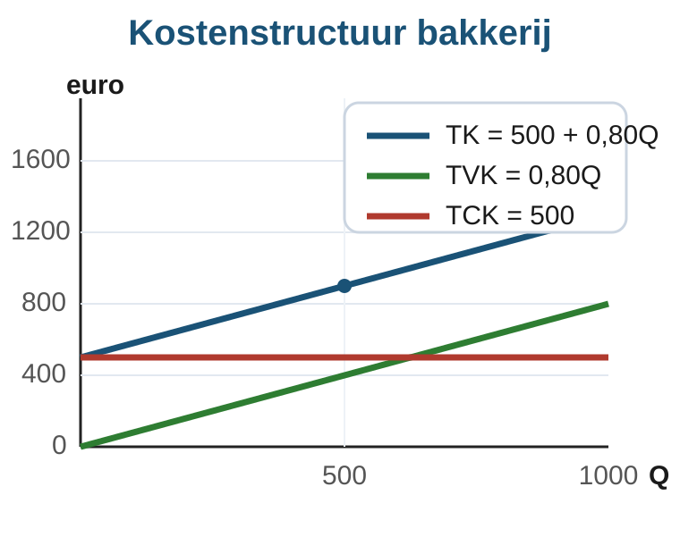

# 2.1.1 Kostenstructuren

## Waarom wordt een brood goedkoper als je er meer bakt?

Een bakker huurt een kleine bakkerij voor EUR 500 per maand. Die huur betaalt
hij ook als hij bijna niets verkoopt. Voor elk brood heeft hij meel, gist,
energie en een zakje nodig. Dat kost EUR 0,80 per brood.

De bakker vraagt zich af: als ik twee keer zoveel broden bak, worden mijn
kosten dan ook precies twee keer zo hoog?

Het antwoord is nee. Een deel van de kosten blijft gelijk. Een ander deel groeit
mee met het aantal broden. In deze paragraaf leer je die twee soorten kosten
uit elkaar houden en berekenen wat de kosten per brood zijn.

In deze paragraaf gebruik je `Q` voor de productieomvang: het aantal producten.

---

## Theorie

### Totale constante kosten

Kosten die niet veranderen als `Q` verandert, heten **constante kosten**. Denk
aan huur, verzekeringen of een vast abonnement.

> **Definitie: TCK**
> `TCK` zijn de totale constante kosten. Deze kosten blijven gelijk als de
> productie verandert.

Voor de bakkerij geldt:

`TCK = 500`

Ook als de bakker 0 broden bakt, betaalt hij nog steeds EUR 500 huur.

### Totale variabele kosten

Kosten die wel veranderen als `Q` verandert, heten **variabele kosten**. Denk
aan grondstoffen, verpakking en energie per product.

> **Definitie: TVK**
> `TVK` zijn de totale variabele kosten. Deze kosten veranderen mee met `Q`.

De bakker heeft EUR 0,80 variabele kosten per brood. Bij `Q` broden is:

`TVK = 0,80Q`

Bij 500 broden:

`TVK = 0,80 x 500 = 400`

Bij 1000 broden:

`TVK = 0,80 x 1000 = 800`

### Totale kosten

De **totale kosten** zijn de constante kosten plus de variabele kosten.

> **Formulebox: totale kosten**
>
> `TK = TCK + TVK`

Voor de bakkerij:

`TK = 500 + 0,80Q`

| Q | TCK | TVK | TK |
|---:|---:|---:|---:|
| 0 | 500 | 0 | 500 |
| 500 | 500 | 400 | 900 |
| 1000 | 500 | 800 | 1300 |

De totale kosten stijgen als de bakker meer broden maakt, maar ze starten niet
bij nul. Dat komt door de constante kosten.

### Gemiddelde kosten

Een ondernemer wil vaak niet alleen weten wat alle producten samen kosten, maar
ook wat een product gemiddeld kost. Daarvoor deel je door `Q`.

> **Formulebox: gemiddelde kosten**
>
> `GTK = TK / Q`
>
> `GCK = TCK / Q`
>
> `GVK = TVK / Q`

Voor de bakkerij:

| Q | TCK | TVK | TK | GCK | GVK | GTK |
|---:|---:|---:|---:|---:|---:|---:|
| 500 | 500 | 400 | 900 | 1,00 | 0,80 | 1,80 |
| 1000 | 500 | 800 | 1300 | 0,50 | 0,80 | 1,30 |

`GCK` daalt als `Q` stijgt. Dezelfde EUR 500 huur wordt dan verdeeld over meer
broden. `GVK` blijft in dit voorbeeld gelijk, omdat elk extra brood steeds EUR
0,80 kost. Daardoor daalt ook `GTK`.

> **Veelgemaakte vergissing**
>
> `TCK` blijft gelijk als `Q` verandert. `GCK` blijft niet gelijk. Je deelt
> dezelfde constante kosten door een ander aantal producten.

---

## Uitgewerkt voorbeeld

Een foodtruck betaalt per dag EUR 300 voor standplaats en vergunningen. Per
broodje zijn de ingredienten en verpakking EUR 1,20.

**Vraag:** bereken `TCK`, `TVK`, `TK`, `GCK`, `GVK` en `GTK` bij 100 en 300
broodjes.

**Stap 1: Schrijf de kostenformules op.**

- `TCK = 300`
- `TVK = 1,20Q`
- `TK = 300 + 1,20Q`

**Stap 2: Bereken de totale kosten.**

| Q | TCK | TVK | TK |
|---:|---:|---:|---:|
| 100 | 300 | 120 | 420 |
| 300 | 300 | 360 | 660 |

**Stap 3: Deel door Q voor gemiddelde kosten.**

| Q | GCK | GVK | GTK |
|---:|---:|---:|---:|
| 100 | 3,00 | 1,20 | 4,20 |
| 300 | 1,00 | 1,20 | 2,20 |

**Stap 4: Trek de economische conclusie.**

Bij meer broodjes daalt `GCK` van EUR 3,00 naar EUR 1,00. De vaste kosten
worden uitgesmeerd over meer producten. `GVK` blijft EUR 1,20, omdat elk
broodje dezelfde variabele kosten heeft.

---

## Samenvatting

> **Onthouden**
>
> - `TCK`: totale constante kosten. Blijven gelijk als `Q` verandert.
> - `TVK`: totale variabele kosten. Veranderen mee met `Q`.
> - `TK = TCK + TVK`.
> - `GTK = TK / Q`, `GCK = TCK / Q`, `GVK = TVK / Q`.
> - Als `TCK` gelijk blijft, daalt `GCK` wanneer `Q` stijgt.
> - Verwissel nooit totale kosten met gemiddelde kosten: `TCK` is niet hetzelfde als `GCK`.

In de volgende paragraaf voeg je opbrengsten toe. Dan kun je bepalen of een
onderneming winst of verlies maakt.

## Vastgelopen op een opgave?

Gebruik steeds dezelfde route:

1. Schrijf eerst `TCK` en `TVK` op.
2. Bereken daarna `TK = TCK + TVK`.
3. Deel pas daarna door `Q` voor `GTK`, `GCK` en `GVK`.
4. Controleer je uitleg: zeg of het om totale kosten of gemiddelde kosten gaat.

---

## Opgaven

### Startoefeningen

**Opgave 1** *(lees de grafiek)*

Gebruik figuur 1 van de bakkerij.

**A.** Welke lijn laat `TCK` zien? Leg uit waaraan je dat ziet.

**B.** Lees uit de grafiek af: wat zijn `TVK` en `TK` bij `Q = 500`?

**C.** Lees uit de grafiek af: wat zijn `TVK` en `TK` bij `Q = 1000`?

**D.** De afstand tussen de `TK`-lijn en de `TVK`-lijn blijft overal even groot.
Welk bedrag stelt die afstand voor?

---

**Opgave 2** *(herken constante en variabele kosten)*

Een kleine drukkerij maakt posters. De drukkerij betaalt per maand EUR 900 huur
en EUR 175 voor een vast softwareabonnement. Papier en inkt kosten EUR 2 per
poster.

**A.** Welke kosten zijn constante kosten?

**B.** Welke kosten zijn variabele kosten?

**C.** Schrijf de formules voor `TCK`, `TVK` en `TK`.

**D.** Bereken `TK` bij `Q = 200` posters.

---

**Opgave 3** *(tabel met begeleiding)*

Een bedrijf heeft `TCK = 600` en `TVK = 3Q`.

**A.** Vul eerst `TCK`, `TVK` en `TK` in.

| Q | TCK | TVK | TK |
|---:|---:|---:|---:|
| 100 |  |  |  |
| 300 |  |  |  |
| 600 |  |  |  |

**B.** Bereken daarna `GCK`, `GVK` en `GTK`.

| Q | GCK | GVK | GTK |
|---:|---:|---:|---:|
| 100 |  |  |  |
| 300 |  |  |  |
| 600 |  |  |  |

**C.** Welke gemiddelde kosten blijven gelijk? Welke gemiddelde kosten dalen?

### Zelfstandige oefening

**Opgave 4**

Een fietsenmaker huurt een werkplaats voor EUR 1200 per maand. Voor iedere
fietsreparatie gebruikt hij gemiddeld EUR 18 aan onderdelen.

**A.** Schrijf de formules voor `TCK`, `TVK` en `TK`.

**B.** Bereken `TK` bij 40 reparaties en bij 80 reparaties.

**C.** Bereken `GCK`, `GVK` en `GTK` bij 40 reparaties en bij 80 reparaties.

**D.** Leg uit waarom `GTK` daalt als het aantal reparaties stijgt.

---

**Opgave 5**

Een maker van sportshirts heeft `TCK = 1500` en `TVK = 6Q`.

**A.** Bereken `TK`, `GCK`, `GVK` en `GTK` bij `Q = 250`.

**B.** Bereken `TK`, `GCK`, `GVK` en `GTK` bij `Q = 500`.

**C.** De ondernemer zegt: "Bij 500 shirts zijn mijn totale kosten lager dan bij
250 shirts." Leg uit waarom deze uitspraak fout is.

**D.** Welke kosten zijn wel lager bij 500 shirts dan bij 250 shirts?

### Herhaling

**Opgave 6** *(procenten en kosten samen)*

Een bedrijf maakt eerst 400 producten en daarna 500 producten. De constante
kosten zijn EUR 1000. De variabele kosten zijn EUR 4 per product.

**A.** Met hoeveel procent stijgt `Q`?

**B.** Bereken `GCK` bij 400 producten en bij 500 producten.

**C.** Met hoeveel procent daalt `GCK`?

**D.** Leg uit waarom `TVK` stijgt, terwijl `GCK` daalt.

### Doeloefening

**Opgave 7**

Een bakkerij heeft per maand EUR 500 constante kosten. Elk brood kost EUR 0,80
aan meel, gist en energie. Gebruik `Q` voor het aantal broden per maand.

**A.** Schrijf de formules voor `TCK`, `TVK` en `TK`.

**B.** Bereken `TCK`, `TVK` en `TK` bij `Q = 500` en bij `Q = 1000`.

**C.** Bereken `GTK`, `GVK` en `GCK` bij `Q = 500` en bij `Q = 1000`.

**D.** Wat gebeurt er met `GTK` als `Q` stijgt van 500 naar 1000? Leg uit waarom
dit logisch is.

**E.** Een leerling zegt: "`GCK` is altijd hetzelfde, want constante kosten
veranderen niet." Is dit juist? Leg uit.

### Denkertje

**Opgave 8**

Een bedrijf heeft `TCK = 500`. Bij 100 producten zijn de variabele kosten EUR 4
per product. Bij 200 producten stijgen de variabele kosten naar EUR 7 per
product, omdat er duur overwerk nodig is.

**A.** Bereken `GTK` bij 100 producten.

**B.** Bereken `GTK` bij 200 producten.

**C.** Daalt `GTK` hier als `Q` stijgt? Leg uit waarom dit voorbeeld anders is dan
de bakkerij.
