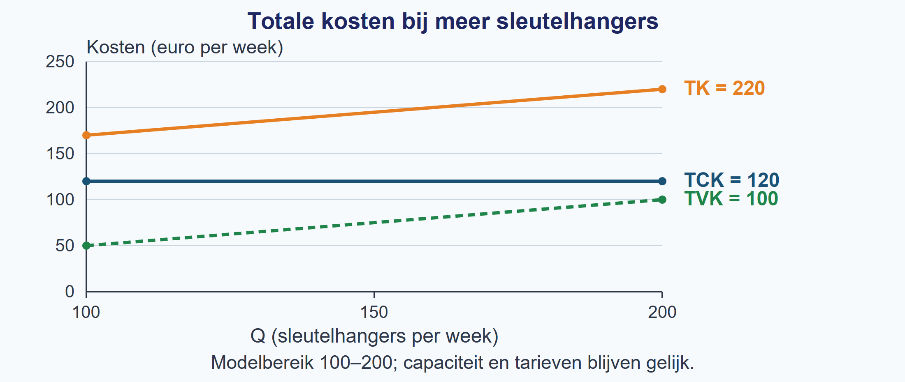
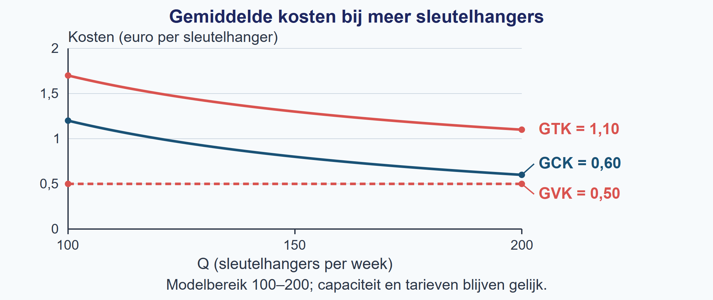

# Opgaven §2.1.1 — Kostenstructuren

> **Na deze paragraaf kun je:**
>
> - kostencomponenten als constant of variabel classificeren op basis van hun gedrag binnen een genoemde periode en bij gelijkblijvende productiecapaciteit.
> - uit een context de functies voor TCK, TVK en TK opstellen.
> - gemiddelde kosten berekenen en met de juiste eenheid interpreteren.
> - verklaren hoe totale en gemiddelde kosten veranderen als Q verandert, binnen de aannames van het model.

## Uitgewerkt voorbeeld

**Het sleutelhangeratelier.** Het atelier maakt 100–200 sleutelhangers per week met dezelfde machines. De ruimte kost € 100 en het softwareabonnement € 20 per week. Kunststof kost € 0,40 en verpakking € 0,10 per sleutelhanger. Deze tarieven blijven gelijk. We vergelijken Q = 100 met Q = 200.

::: figure-context

**Stap 1 — Classificeer en verklaar het totale bedrag.**

| Kostencomponent | Soort kosten | Reactie van het totale weekbedrag op meer sleutelhangers |
|---|---|---|
| Ruimte | Constant | Blijft € 100 per week. |
| Softwareabonnement | Constant | Blijft € 20 per week. |
| Kunststof | Variabel | Stijgt met € 0,40 per extra sleutelhanger. |
| Verpakking | Variabel | Stijgt met € 0,10 per extra sleutelhanger. |

:::

::: figure-context

**Stap 2 — Stel de functies op.**

TCK = 100 + 20 = 120. TVK = (0,40 + 0,10)Q = 0,50Q. Dus TK = 120 + 0,50Q. De totale bedragen zijn in euro per week; Q is in sleutelhangers per week.

:::

::: figure-context

**Stap 3 — Vul Q in en deel elk totaal door Q.**

Bij Q = 100: TCK = € 120, TVK = 0,50 × 100 = € 50 en TK = 120 + 50 = € 170 per week.

:::

- GCK = TCK / Q = 120 / 100 = **€ 1,20 per sleutelhanger**.
- GVK = TVK / Q = 50 / 100 = **€ 0,50 per sleutelhanger**.
- GTK = TK / Q = 170 / 100 = **€ 1,70 per sleutelhanger**.

Bij Q = 200: TCK = € 120, TVK = 0,50 × 200 = € 100 en TK = 120 + 100 = € 220 per week.

- GCK = TCK / Q = 120 / 200 = **€ 0,60 per sleutelhanger**.
- GVK = TVK / Q = 100 / 200 = **€ 0,50 per sleutelhanger**.
- GTK = TK / Q = 220 / 200 = **€ 1,10 per sleutelhanger**.

In deze tabellen is één stuk één sleutelhanger. De eerste tabel toont de weektotalen; de tweede toont kosten per sleutelhanger.

| Q (stuks/week) | TCK (€/week) | TVK (€/week) | TK (€/week) |
|---:|---:|---:|---:|
| 100 | 120 | 50 | 170 |
| 200 | 120 | 100 | 220 |

| Q (stuks/week) | GCK (€/stuk) | GVK (€/stuk) | GTK (€/stuk) |
|---:|---:|---:|---:|
| 100 | 1,20 | 0,50 | 1,70 |
| 200 | 0,60 | 0,50 | 1,10 |

::: figure-context

**Stap 4 — Vergelijk eerst totalen, dan gemiddelden.**

TCK blijft € 120 per week. TVK verdubbelt van € 50 naar € 100 per week. TK stijgt van € 170 naar € 220 per week en verdubbelt dus niet. De constante kosten hoef je niet tweemaal te betalen.

:::

GCK halveert doordat dezelfde € 120 over tweemaal zoveel sleutelhangers wordt verdeeld. GVK blijft € 0,50 per sleutelhanger doordat de variabele kosten per sleutelhanger gelijk blijven. GTK daalt van € 1,70 naar € 1,10 per sleutelhanger. Dat is geen halvering: alleen het GCK-deel halveert. Dit geldt binnen deze week, 100–200 sleutelhangers en dezelfde capaciteit en tarieven.

> **Terugblik op §1.1.3**
> Lees eerst de assen en hun eenheden. Zoek vervolgens Q op de horizontale as en lees de kosten op de verticale as. Een kostengrafiek heeft een kostenbedrag, geen verkoopprijs, op de verticale as.

Figuur 2 laat dezelfde totalen zien, terwijl capaciteit en tarieven gelijk blijven (ceteris paribus). Lees bij Q = 100 en Q = 200 de drie lijnen. De horizontale TCK-lijn blijft op 120. TVK en TK stijgen evenveel: het verticale verschil tussen deze twee lijnen is steeds TCK = 120 euro per week.



Figuur 3 toont bij dezelfde omstandigheden de gemiddelden. De GCK-curve daalt; dezelfde vaste kosten worden verdeeld over meer sleutelhangers. De GVK-lijn blijft op 0,50. GTK ligt telkens GCK boven GVK. De twee GTK-punten horen bij de laatste kolom van de tabel.



::: figure-context

> **Samenvatting §2.1.1**
>
> - Classificeer kosten op hun reactie op Q, binnen één periode en dezelfde capaciteit.
> - TK = TCK + TVK; totale kosten zijn bedragen per periode.
> - Bij Q > 0: GCK = TCK/Q, GVK = TVK/Q en GTK = TK/Q = GCK + GVK.
> - Dezelfde TCK over meer producten verlaagt GCK; GVK blijft alleen gelijk bij constante variabele kosten per product.
> - Benoem altijd totaal of gemiddeld en de eenheid. Deze kostenrelaties gebruik je verder in §2.1.2.

:::

## Startopgaven

::: figure-context

**Opgave 1 — Ophalen**

Een klimhal noteert haar bezoekers. Gebruik de tabel; er is geen berekening van kosten nodig.

:::

| Week | Bezoeken (aantal per week) |
|---|---:|
| A | 120 |
| B | 240 |

a. Wat meet de tweede kolom? Noem de eenheid.
b. Hoeveel bezoeken zijn er in week B? Hoeveel maal het aantal van week A is dat?
c. Een bericht zegt: “Het aantal bezoeken is gehalveerd.” Beoordeel dit met beide tabelwaarden.

::: figure-context

**Opgave 2 — Begripscheck**

Een mobiele podcaststudio betaalt € 60 huur per dag en € 2 verbruiksmateriaal per opname. Ze maakt 10–20 opnamen per dag met dezelfde apparatuur en tarieven. Q is in opnamen per dag.

:::

a. Zijn de huurkosten constant of variabel? Leg uit met het totale dagbedrag.
b. Zijn de verbruikskosten constant of variabel? Leg uit met het totale dagbedrag.
c. Stel TK op.
d. Bereken GTK bij Q = 10. Noteer de eenheid.
e. Iemand noemt € 60 “de constante kosten per opname”. Leg de fout uit.

Korte route: Startopgaven → Zelfstandige oefening → Doeloefening. Extra hulp nodig? Maak eerst Begeleide inoefening.

## Begeleide inoefening

*Heb je deze hulp niet nodig? Ga dan verder met Zelfstandige oefening.*

::: figure-context

**Opgave 3 — Honden wassen**

Een hondensalon voert 50–100 gelijke wasbeurten per maand uit. De werkplaats kost € 180 per maand en de reserveringssoftware € 20 per maand. Shampoo kost € 3 en water € 1 per beurt. Capaciteit en tarieven blijven gelijk; Q is het aantal beurten per maand.

:::

a. Vul de tabel aan. Vraag bij elke rij: verandert het **totale maandbedrag** als Q stijgt?

```{=html}
<table style="table-layout:fixed;width:100%"><colgroup><col style="width:38%"><col style="width:20%"><col style="width:42%"></colgroup><thead><tr><th scope="col">Kostencomponent</th><th scope="col">Soort kosten</th><th scope="col">Reactie van het totale maandbedrag op hoger Q</th></tr></thead><tbody><tr><td style="vertical-align:top">Werkplaats</td><td style="vertical-align:top">Constant</td><td style="vertical-align:top">Blijft € 180 per maand.</td></tr><tr><td style="vertical-align:top">Reserveringssoftware</td><td style="vertical-align:top"><span style="display:block;min-height:12mm">…</span></td><td style="vertical-align:top"><span style="display:block;min-height:12mm">…</span></td></tr><tr><td style="vertical-align:top">Shampoo</td><td style="vertical-align:top"><span style="display:block;min-height:12mm">…</span></td><td style="vertical-align:top"><span style="display:block;min-height:12mm">…</span></td></tr><tr><td style="vertical-align:top">Water</td><td style="vertical-align:top"><span style="display:block;min-height:12mm">…</span></td><td style="vertical-align:top"><span style="display:block;min-height:12mm">…</span></td></tr></tbody></table>
```

b. Vul in: TCK = 180 + … = …; TVK = (3 + …)Q = …; TK = TCK + TVK = …. Alle totalen zijn in euro per maand.
c. Bereken bij Q = 50 en Q = 100 de GCK, GVK en GTK. Gebruik eerst de totale bedragen uit b. Maak twee rijen en zet boven elke kolom de volledige eenheid. Alleen voor de eerste cel krijg je het begin: GCK = TCK/Q = 200/50 = ….
d. Vergelijk de drie totalen. Leg vervolgens uit waarom GCK halveert, GVK gelijk blijft en GTK niet halveert. Noem de grenzen van je conclusie.

## Zelfstandige oefening

::: figure-context

**Opgave 4 — Twee veranderingen in het keramiekatelier**

Een atelier maakt 80–160 bekers per week met dezelfde oven. Eerst bedraagt de ruimtehuur € 240 per week. Klei kost € 2,50 en verpakking € 0,50 per beker. In een nieuwe week wordt de huur € 210 per week én stijgt de kleiprijs naar € 3 per beker. Verpakking blijft even duur. In beide situaties zijn de bedragen per beker constant binnen het productiegebied. Q is in bekers per week.

:::

a. Classificeer de huur, klei en verpakking als constant of variabel. Licht elk antwoord toe.
b. Stel TK op voor de oude en voor de nieuwe situatie.
c. Bij Q = 80: bereken eerst het effect van alleen de lagere huur op TK. Bereken daarna het effect van alleen de hogere kleiprijs. Combineer de effecten en bereken de nieuwe TK.
d. Een leerling zegt: “De vaste rekening wordt lager, dus alle kosten dalen.” Beoordeel deze uitspraak voor de totale kosten én de gemiddelde totale kosten bij Q = 80. Noem beide uitkomsten en hun eenheden.

::: figure-context

**Opgave 5 — Vogelhuisjes**

Een atelier produceert in een maand 100–200 vogelhuisjes met dezelfde machines. De ruimte kost € 240 en de machinehuur € 60 per maand. Hout kost € 1,50 en schroeven € 0,50 per vogelhuisje, bij ieder aantal binnen dit bereik. Q is in vogelhuisjes per maand.

:::

a. Classificeer alle kostenonderdelen. Noteer per onderdeel hoe het totale bedrag reageert op meer vogelhuisjes.

```{=html}
<table style="table-layout:fixed;width:100%"><colgroup><col style="width:38%"><col style="width:20%"><col style="width:42%"></colgroup><thead><tr><th scope="col">Kostencomponent</th><th scope="col">Soort kosten</th><th scope="col">Reden</th></tr></thead><tbody><tr><td style="vertical-align:top">Ruimte</td><td style="vertical-align:top"><span style="display:block;min-height:12mm"></span></td><td style="vertical-align:top"><span style="display:block;min-height:12mm"></span></td></tr><tr><td style="vertical-align:top">Machinehuur</td><td style="vertical-align:top"><span style="display:block;min-height:12mm"></span></td><td style="vertical-align:top"><span style="display:block;min-height:12mm"></span></td></tr><tr><td style="vertical-align:top">Hout</td><td style="vertical-align:top"><span style="display:block;min-height:12mm"></span></td><td style="vertical-align:top"><span style="display:block;min-height:12mm"></span></td></tr><tr><td style="vertical-align:top">Schroeven</td><td style="vertical-align:top"><span style="display:block;min-height:12mm"></span></td><td style="vertical-align:top"><span style="display:block;min-height:12mm"></span></td></tr></tbody></table>
```

b. Stel TCK, TVK en TK op.
c. Bereken GCK, GVK en GTK bij Q = 100 en Q = 200. Noteer volledige eenheden.
d. Vergelijk eerst alle totale kosten. Verklaar daarna de verandering van elk gemiddelde. Beoordeel de uitspraak: “Bij tweemaal zoveel vogelhuisjes halveert GTK.” Begrens je conclusie tot het model.

:::: figure-context

## Doeloefening

::: figure-context

**Opgave 6 — Bakkerij De Korenaar**

Bakkerij De Korenaar produceert in één maand tussen 500 en 1.000 broden. Zolang de productiecapaciteit gelijk blijft, gebruikt de bakkerij dezelfde ruimte en ovens. Huur en verzekering kosten samen € 440 per maand. De netaansluiting en het energieabonnement kosten € 60 per maand. Meel en verpakking kosten samen € 0,70 per brood. Het elektriciteitsverbruik van de ovens kost binnen deze grenzen € 0,10 per brood. Q is het aantal broden per maand.

:::

```{=html}
<table style="table-layout:fixed;width:100%"><colgroup><col style="width:38%"><col style="width:20%"><col style="width:42%"></colgroup><thead><tr><th scope="col">kostencomponent</th><th scope="col">soort kosten</th><th scope="col">reden</th></tr></thead><tbody><tr><td style="vertical-align:top">huur en verzekering</td><td style="vertical-align:top"><span style="display:block;min-height:12mm"></span></td><td style="vertical-align:top"><span style="display:block;min-height:12mm"></span></td></tr><tr><td style="vertical-align:top">netaansluiting en energieabonnement</td><td style="vertical-align:top"><span style="display:block;min-height:12mm"></span></td><td style="vertical-align:top"><span style="display:block;min-height:12mm"></span></td></tr><tr><td style="vertical-align:top">meel en verpakking</td><td style="vertical-align:top"><span style="display:block;min-height:12mm"></span></td><td style="vertical-align:top"><span style="display:block;min-height:12mm"></span></td></tr><tr><td style="vertical-align:top">elektriciteitsverbruik ovens</td><td style="vertical-align:top"><span style="display:block;min-height:12mm"></span></td><td style="vertical-align:top"><span style="display:block;min-height:12mm"></span></td></tr></tbody></table>
```

Vul de lege cellen in.

**a. (4 punten)** Vul de classificatietabel in: classificeer elk onderdeel als constante of variabele kosten en noteer per onderdeel kort hoe het totale bedrag reageert op een verandering van Q.

**b. (3 punten)** Stel de functies voor TCK, TVK en TK op.

**c. (3 punten)** Bereken bij Q = 500 de GCK, GVK en GTK. Noteer de volledige eenheden.

**d. (3 punten)** Bereken bij Q = 1.000 de GCK, GVK en GTK. Noteer de volledige eenheden.

**e. (4 punten)** Vergelijk eerst TCK, TVK en TK bij Q = 500 en Q = 1.000. Leg daarna met de uitkomsten uit waarom GCK halveert, GVK gelijk blijft en GTK niet halveert als Q verdubbelt. Begrens je uitleg tot één maand, Q = 500–1.000 en gelijkblijvende productiecapaciteit.

::::

:::: figure-context

## Denkertje / Bonusopgave

::: figure-context

**Opgave 7 — Een tabel vertelt niet alles**

Een theateratelier maakt maskers. Een leerling krijgt alleen deze gegevens:

:::

| Q (maskers per week) | TK (euro per week) |
|---:|---:|
| 20 | 180 |
| 40 | 260 |

::::

De leerling concludeert: “GVK is zeker € 4 per masker en TCK is zeker € 100 per week.”

Beoordeel hoe zeker die uitspraak is. Geef een kostenmodel waarbij de uitspraak klopt. Geef daarna één andere mogelijke verdeling van TCK en TVK die ook bij de twee tabelrijen past. Geef aan welke extra informatie nodig is. Je hoeft geen nieuw soort kostenfunctie te leren.

## Herhaling / Herhaling en interleaving

::: figure-context

**Opgave 8 — Zwembadbezoek** *(herhaling §1.1.3: tabellen lezen en beweringen toetsen)*

| Dag | Bezoekers (aantal per dag) |
|---|---:|
| Vrijdag | 90 |
| Zaterdag | 180 |
| Zondag | 120 |

:::

a. Vergelijk zaterdag met vrijdag en zondag met zaterdag. Gebruik per vergelijking beide waarden en de juiste eenheid.
b. Het zwembad meldt: “In het weekend komen iedere dag tweemaal zoveel bezoekers als op vrijdag.” Beoordeel de uitspraak met de tabel.
