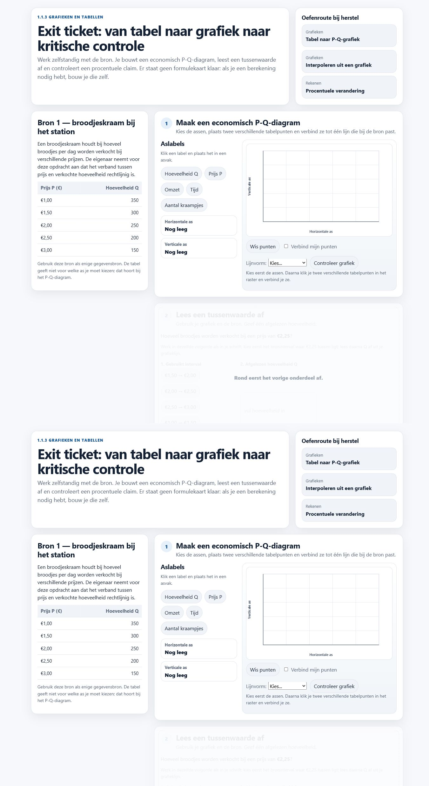
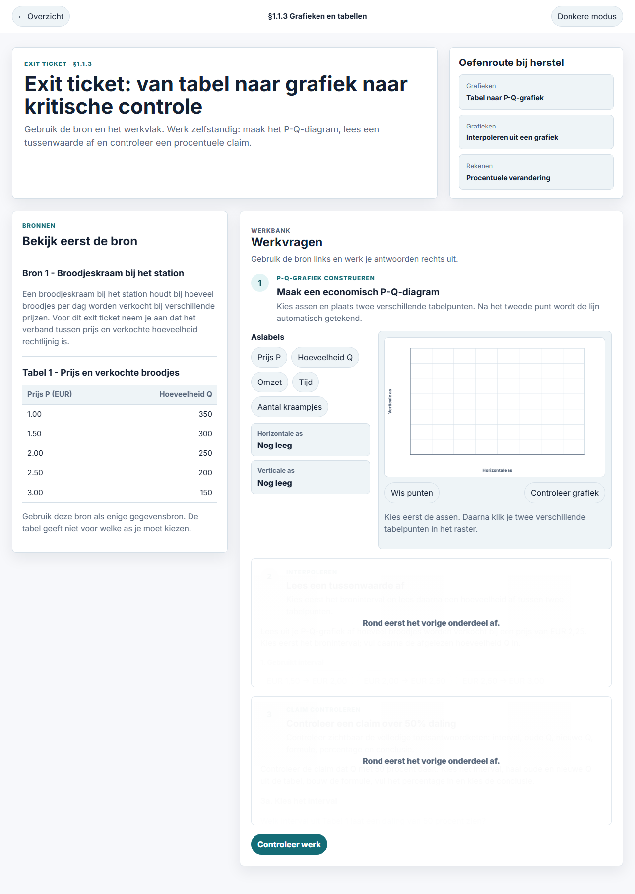
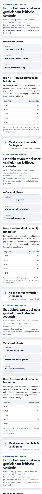
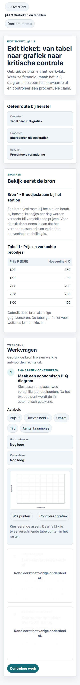
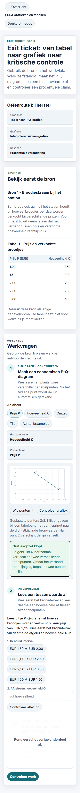
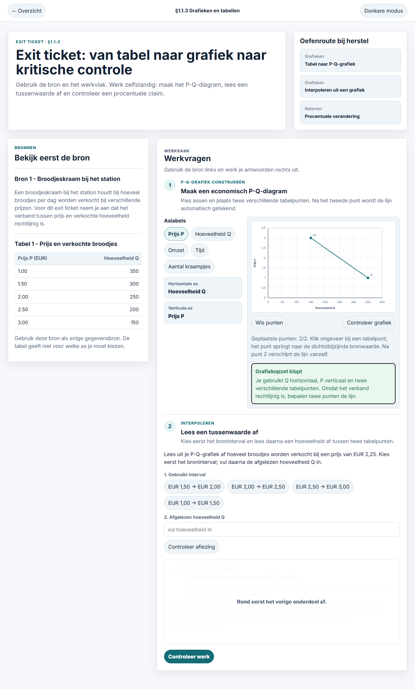
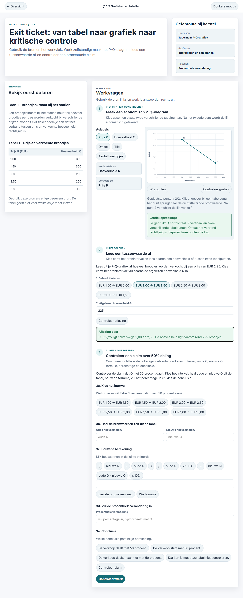
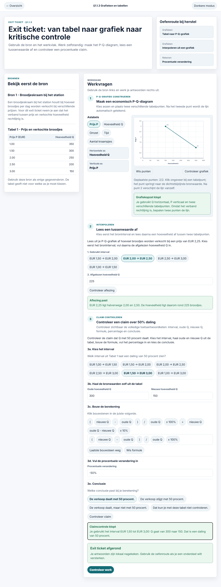
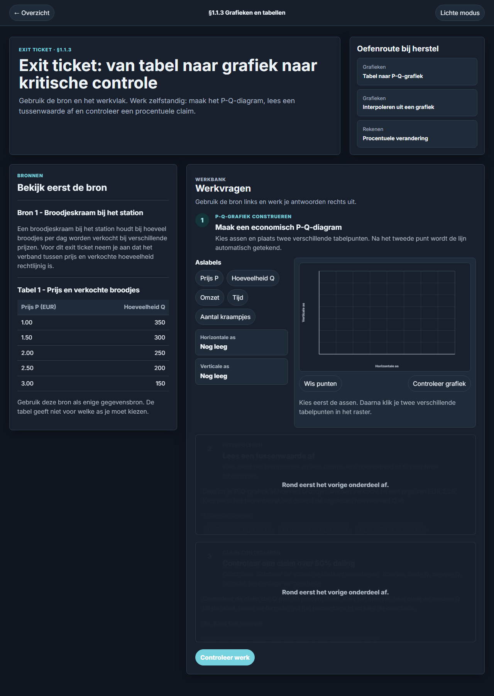
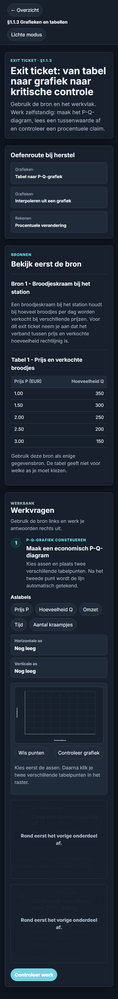

# GOLDEN-TICKET-LAYOUT-RESET-1 Side-by-Side Proof

Date: 2026-06-08

## Desktop Light

| Golden reference | Implemented initial |
| --- | --- |
|  |  |

## Mobile Light

| Golden reference | Implemented initial |
| --- | --- |
|  |  |

| Implemented mobile after graph |
| --- |
|  |

## Interaction States

| After correct graph | Retry feedback | Completed |
| --- | --- | --- |
|  |  |  |

## Dark Mode

| Desktop dark initial | Mobile dark initial |
| --- | --- |
|  |  |

## Routing After Reload

| Implemented routing after reload |
| --- |
|  |

## DOM Verdict

The implemented route uses the golden route root directly:

- `header.ge-topbar`
- `main.ge-page[data-golden-ticket-root]`
- `.ge-hero`
- `.ge-workbench`
- `.ge-source-card`
- `.ge-task-card`
- `svg.ge-graph[data-graph-id="golden-ticket-113"]`

The implemented route does not load:

- `skill-map-route.css`
- `task-shell.css`
- `exit-ticket.css`
- `task-shell-ui.js`
- `exit-ticket-ui.js`

The route also omits `#exit-ticket-app` and has no mixed `ge-*` plus `et-*` class attributes.
